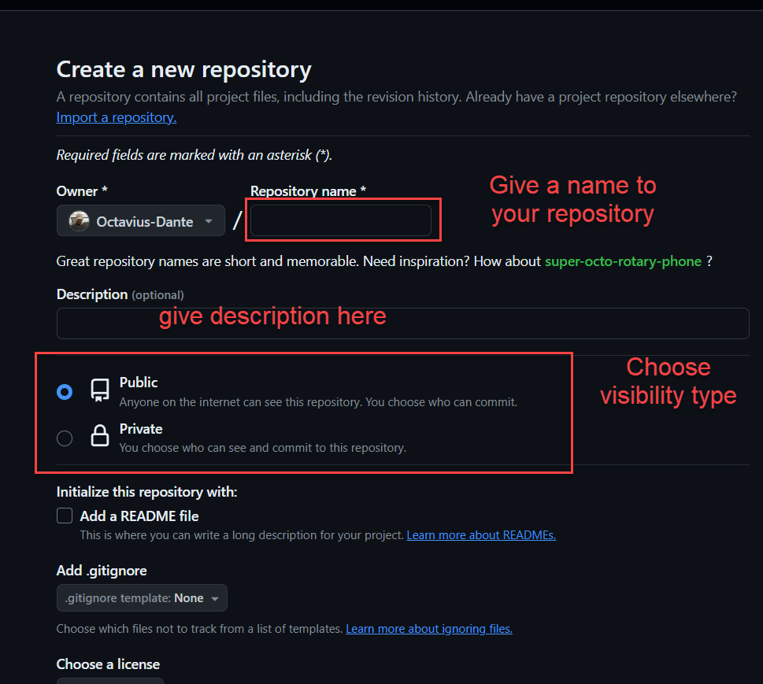

## How to Connect BAS with GITHUB

### This Github integration is essention for CI - CD Pipeline in SAP BTP cloud 

</br>
</br>
</br>

## How to Initialize GITHUB for BAS 
</br>
</br>

- [x] Create a Private repository in GITHUB and copy the link of that git hub.
- [x] Initiate git in bas using command (git init)
- [x] Add all the files to git staging area using command (git add)
- [x] Commit the changes using command (git commit -m "description" )
- [x] No we do GIT push

```md
git init
git add README.md
git commit -m "first commit"
git branch -M main
git remote add origin https://github.com/Octavius-Dante/CAP_TEST.git
git push -u origin main
```
</br>
</br>

<details>
<summary> <b> Creating a Private repository in GITHUB </b> </summary>
</br>
</br>
Login to github account

</br>
</br>

</br>
</br>

</br>
</br>

</br>
</br>

</details>


<!--

</br>
</br>

``` cds 
	


``` 

</br>
</br>

</br>
</br>

## MyService.js 
</br>
</br>

```js


```
</br>

</br>
</br>


<details>
<summary> <b> ALL CODE CHANGES - TODAY SESSION </b> </summary>
</br>
</br>

</br>
</br>

</br>
</br>
</details>


-->


</br>
</br>
</br>
</br>
</br>
</br>
</br>
</br>

# --------- End of Github integration ---------

<p align="center"> 
	
</br>
</br>

#### All Sessions
</br>

- [x] <a href="https://github.com/Octavius-Dante/Tetra_Proxima/tree/main/CAPM-DAY-12"> CAPM Day 12 - Extension CI CD</a>
- [x] <a href="https://github.com/Octavius-Dante/Tetra_Proxima/tree/main/CAPM-DAY-11"> CAPM Day 11 - S4HANA Side by Side</a>
- [x] <a href="https://github.com/Octavius-Dante/Tetra_Proxima/tree/main/CAPM-DAY-10"> CAPM Day 10 - Side by Side extension</a>
- [x] <a href="https://github.com/Octavius-Dante/Tetra_Proxima/tree/main/CAPM-DAY-9"> CAPM Day 9 - Serverless Fiori App</a>
- [x] <a href="https://github.com/Octavius-Dante/Tetra_Proxima/tree/main/CAPM-DAY-8"> CAPM Day 8 - CAPM Security XSUAA</a>
- [x] <a href="https://github.com/Octavius-Dante/Tetra_Proxima/tree/main/CAPM-DAY-7"> CAPM Day 7 - HANA and Deployment</a>
- [x] <a href="https://github.com/Octavius-Dante/Tetra_Proxima/tree/main/CAPM-DAY-6"> CAPM Day 6 - Fiori App Draft</a>
- [x] <a href="https://github.com/Octavius-Dante/Tetra_Proxima/tree/main/CAPM-DAY-5"> CAPM Day 5 - Fiori Elements</a>
- [x] <a href="https://github.com/Octavius-Dante/Tetra_Proxima/tree/main/CAPM-DAY-4"> CAPM Day 4 - Generic Handlers</a>
- [x] <a href="https://github.com/Octavius-Dante/Tetra_Proxima/tree/main/CAPM-DAY-3"> CAPM Day 3 - EPM DB and CDS Views</a>
- [x] <a href="https://github.com/Octavius-Dante/Tetra_Proxima/tree/main/CAPM-DAY-2"> CAPM Day 2 - Aspects and Reuse Tables</a>
- [x] <a href="https://github.com/Octavius-Dante/Tetra_Proxima/tree/main/CAPM-DAY-1"> CAPM Day 1 - First CAP App </a>

</br>
</br>

</p>
