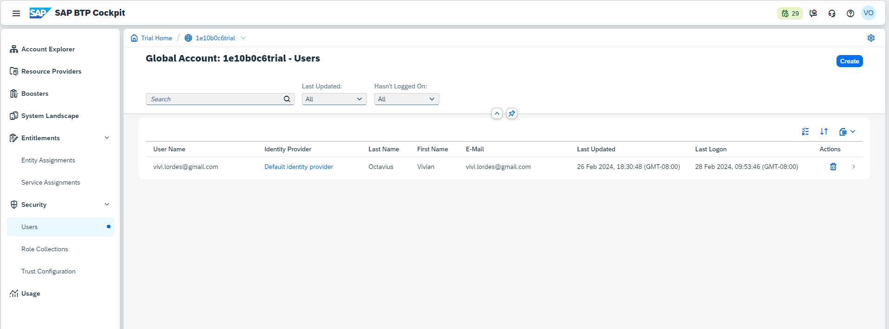
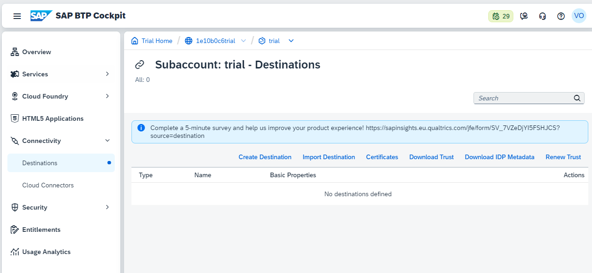

## Global account level in left navigation menu - details & descriptions 

### Account Explorer : 
 
List of sub accounts available for Global accounts listed here 
 
 
    
 
 
	
### Resource providers : 
 
AWS / AZURE cloud platform services from other providers their technical details to establish connection to leverage their support for BTP
 
 
AWS
 
 
    
 
 
AZURE
 
 
    
 
 

### Boosters : 
 
Help you to getto certain predefined template set of activity for quick app development
 
 
    
 
 

### System landscapes :
 
Connected SAP Systems to the global account (could be on prem or cloud) 
 
 
    
 
 

### Entitlements : 
 
- Entity assignment (List of services avaialble for sub account can be viewed by selecting sub account based on region)
- Service assignments (List of services available in global account and assignments)
 
 
Entity Assignments : https://github.com/Octavius-Dante/Nova-Proxima-/issues/1
 
 
Service Assignments : 
 
 

 
 

### Security : 
 
- Users (list of users active in this global / sub account)
- Role collection (What roles assigned in this global account)
- Trust Configuration (added keys cloud foundry, BTP cockpit and BTP CLI config)
 
 
Users
 
 

 

Roll collections
 
 

 

Trust Config
 
 

 
 

### Usage : 
 
Usauge metrics of the service utillised in BTP account 
 
 
    
 
 
 
 

## Sub account level in left navigation menu - details & descriptions 

### Sub Account overview :
 
Select the sub account here
 
 

 
 
Sub account overview appears in the left side navigation menu changes completely 
 
 

 
 

### Services :

 
Service market place : place for choosing the services for business, create applciation 
 
 

 

 
 

Subscriptions and instances : in this section active subscripion and instances can be found which environment is active and in use are listed 
 
 

 
 

### Cloud foundry :

This contains details about spaces in use and services in use, space quota and organization memebers
     
Spaces 
 
 

 
 
Space quota
 
 

 
 
Org members 
 
 

 
 

### HTML 5 applciationS :

     
Details about the HTML applciation editions available in the BTP 
 
 

 
 

### Connectivity :

     
Destination : details about the systems connected to BTP account 
 
 

 
     
Cloud connectors : cloud systems connected to BTP account 
 
 

 
 

### Security :

     
Contains sub categories assocaited with users, roles, role collections, trust configurations and settings assocaited with token and validity setup for access and use
 
 
Users : 
 
 

 
 
Roles :
 
 

 
 
Role collections
 
 

 
 
Trust configurations : 
 
 

 
 
Settings : 
 
 

 
 
 
 

### Entitlements :
 
The services and subscriptions which are available and active in sub accounts are called as entitlements which as details of quota, plans, assignment details and remainign quotas
 
 

 
 
 
 

### Usage analytics :
 
The usage data analytics of sub account services 
 
 

 
 
