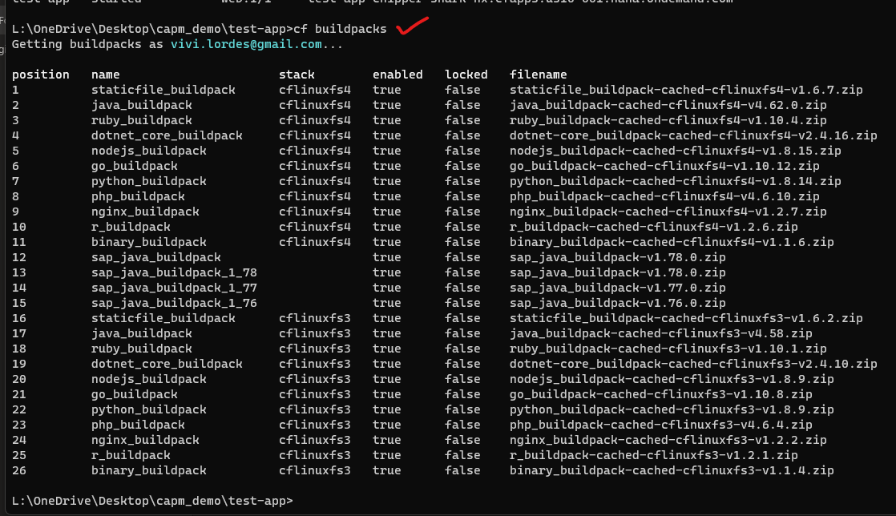
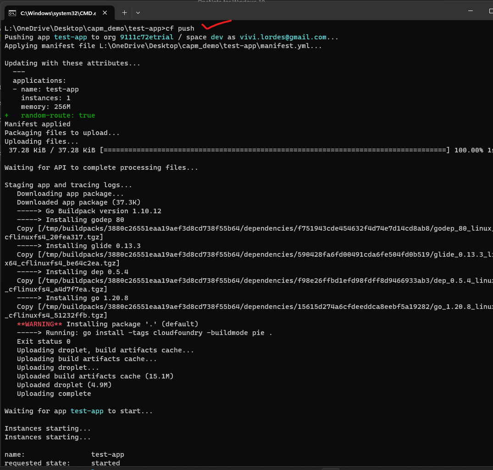

## BTP - DAY 1 (1.0)

### Starter guide for BTP Basic commands on local command prompt

</br>
</br>

**Local machine needs following 2 things to be installed**

- [x] Git hub SCM https://git-scm.com/download/win
- [x] Cloud foundry CLI (Command line interface) https://github.com/cloudfoundry/cli#downloads

</br>

**Pre-requisities before app deployment**

- [x] App should have manifest.yml file 
- [x] App should have main file 
- [x] then app file respective language *.go , *.js *. etc 

</br>

**Manifest file should have - following components :**

- [x] App name 
- [x] App memeory size 
- [x] Instance number 
- [x] Then URL to be involved in the app execution
> (custom -defined url  or default cloud based url) // recommended -let cloud application to decide the url.

</br>
</br>

## Commands involved in general & app deployment activities : 


1.(A) Logging In
   </br>
   </br>
   
   ```bat
   cf login
   ```
   </br>
   </br>
    
   </br>
   </br>

1.(B) Logging In using SSO
   </br>
   </br>
   
   ```bat
   cf login --sso
   ```
   </br>
   </br>
    
   </br>
   </br>

1.(C) API endpoint requested in terminal
   </br>
   </br>
    
   </br>
   </br>
   
2. Checking the available buildpacks in the cloud environment
   </br>
   </br>
   
   ```bat
   cf buildpacks
   ```
   </br>
   </br>
    
   </br>
   </br>
   
3. Cloning Git hub repositiory link to local directory
   </br>
   </br>
   
   ```bat
   git clone <Repository link from github>
   ```
   </br>
   </br>
    
   </br>
   </br>
   
4. Deploying app to cloud
   </br>
   </br>
   
   ```bat
   cf push
   ```
   </br>
   </br>
    
   </br>
   </br>  
   
5. Checking list of available apps in cloud (deployed)
   </br>
   </br>
   
   ```bat
   cf apps 
   ```
   </br>
   </br>
    
   </br>
   </br>
   
6. Checking log status for a specific app
   </br>
   </br>
   
   ```bat
   cf logs <appname> --recent
   ```
   </br>
   </br>
    
   </br>
   </br>
   
7. Increasing RAM memory allocation for app
   </br>
   </br>
   
   ```bat
   cf scale <app name> -m 512M
   ```
   </br>
   </br>
    
   </br>
   </br>
   
8. Delete app
   </br>
   </br>
   
   ```bat
   cf delete <app name>
   ```
   </br>
   </br>
    
   </br>
   </br>

9. Increase the instance for improving performance depends on (data volume)
   </br>
   </br>
   
   ```bat
   cf scale <app name> -i <mention the number of instance need to be increased>
   ```
   </br>
   </br>
    
   </br>
   </br>

10. To check the environment details of an APP 
   </br>
   </br>
   VCAP_SERVICES is an environment variable which holds credential details 
   </br>
   </br>
   
   ```bat
   cf env <app name> 
   ```
   </br>
   </br>
    
   </br>
   </br>
    
   </br>
   </br>
    
   </br>
   </br>
