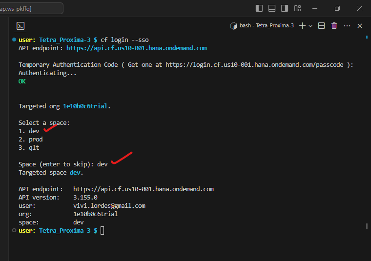
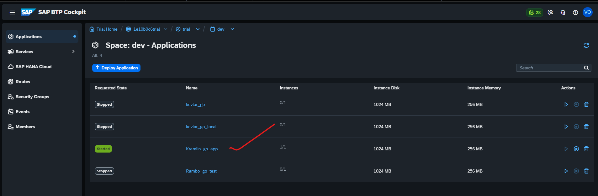

## BTP - DAY 1 (2.0)

### BTP account activities before app deployment
</br>
</br>

**Create Spaces**
</br>
</br>
    
</br>
</br>
</br>

**Create Quota plans**
</br>
</br>
    
</br>
</br>
</br>

**Assign Quota plans to spaces**
</br>
</br>
    
</br>
</br>
	
</br>
</br>
</br>


### Sample App deployment files from github repository

</br>
</br>

**Go language file [go.mod]**
</br>
</br>
   ```go 
   module github.com/swisscom/cf-sample-app-go

   go 1.12   
   ```
</br>
</br>
</br>

**Application file [main.go]**
</br>
</br>
   ```go 
package main

import (
	"fmt"
	"log"
	"net/http"
	"os"
)

// IndexHandler returns a simple message
func IndexHandler(w http.ResponseWriter, r *http.Request) {
	fmt.Fprintf(w, "Sample BTP app")
}

func main() {
	http.HandleFunc("/", IndexHandler)

	var port string
	if port = os.Getenv("PORT"); len(port) == 0 {
	   port = "8080"
	}
	log.Fatal(http.ListenAndServe(":"+port, nil))
	
}
   ```
</br>
</br>
</br>

**Manifest file (manifest.yml)**
</br>
</br>
   ```yml
   
   applications:
   - name: kevlar_go
   memory: 256M
   random-route: true
   
   ```   
</br>
</br>
</br>

### CAPM - BTP account activities for VSCode (Visual Studio Code)

</br>
</br>

**BAS extension installation in VSCode**
</br>
</br>
    
</br>
</br>
</br>
</br>
	
**BTP, BAS account linking with VSCode**
</br>
</br>
    
</br>
</br>
    
</br>
</br>
    
</br>
</br>
    
</br>
</br>
    
</br>
</br>
    
</br>
</br>
    
</br>
</br>
    
</br>
</br>
</br>
</br>

**Cloning Github repository to VSCode**
</br>
</br>
 During this activity make sure you select the explorer tab (first one in the left) then proceed for clone repository option (else you wont get folder select options) this enables SSH connection of repository cloning else it will be a normal local cloning that wont work well for furhter activities (look below left side of the window with BLUE hightlight to confirm SSH connection)
</br>
</br>
    
</br>
</br>
    
</br>
</br>
    
</br>
</br>
    
</br>
</br>
</br>
</br>

**App deployment to cloud BTP with VSCode**
</br>
</br>
    
</br>
</br>
    
</br>
</br>
    
</br>
</br>
    
</br>
</br>
    
</br>
</br>
    
</br>
</br>
    
</br>
</br>
    
</br>
</br>
    
</br>
</br>
    
</br>
</br>
    
</br>
</br>
    
</br>
</br>
    
</br>
</br>
</br>
</br>

**Testing the deployed app in BTP cloud**
</br>
</br>
    
</br>
</br>
    
</br>
</br>
    
</br>
</br>
    
</br>
</br>
if the app is not running and the link is accessed will get error message like below
</br>
</br>
    
</br>
</br>
</br>


**Additional command for generating sample application automatically**
   </br>
   </br>
   In Vscode / BAS after proper cloning of github repositiory with (select folder options) projects folder this command is possible refer section github repository cloning (explorer tab)
   </br>
   </br>
   
   ```bat
   cds init 
   ```
   </br>
   </br>
    
   </br>
   </br>
    
   </br>
   </br>
   </br>
   </br>

  to deploy the data set to local temp server for testing the cds app - this gets created under SRV folder 
   </br>
   </br>
   
   ```bat
   cds deploy --to sqlite:<data set name>
   ```
   </br>
   </br>
   </br>
  
  To run the CDS app
   </br>
   </br>
   
   ```bat
   cds run
   ```
   </br>
   </br>
   </br>


**Pre-requisities before app deployment**

- [x] App should have manifest.yml file 
- [x] App should have main file 
- [x] then app file for respective language *.go , *.js *. etc (contains version details)

</br>

**Manifest file should have - following components :**

- [x] App name 
- [x] App memeory size 
- [x] Instance number 
- [x] Then URL to be involved in the app execution (random-route: true)

</br>
</br>
 
