# Maven & Spring Tool Suite - Starter guide

 
 
Maven is essential for managing the project with needed artifacts 
 
 

**Installation of MAVEN to system**

- [X] Prerequisite java installation Legacy sJava 8 (v1.8) is sufficient for Maven as on Q4-2023 
- [X] Download the MAVEN file (extract in the needed Directory) https://maven.apache.org/download.cgi

 

**Installation of Spring tools suite to system**

- [X] Prerequisite java installation version 17 or greater needed for Spring tool suite as on Q4-2023 
- [X] Spring Tools Suite (STS) https://spring.io/tools

 

**(1) Maven download**
    
    
    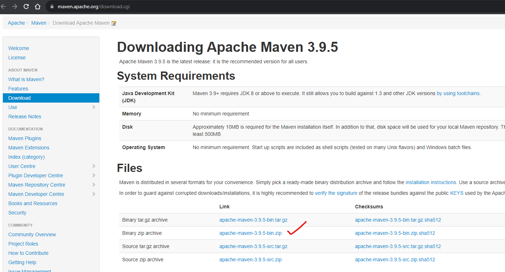
    
    
   
**(2) Spring Tools suite for windows download - this is a modified version of eclipse IDE**
    
    
    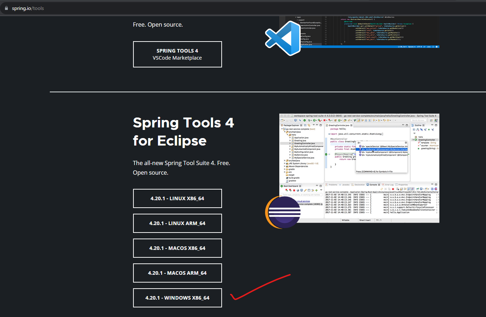
    
    
   
**(3) Post Spring STS extraction, increase the RAM allocation for STS by making changes to '*.ini file in STS directory**

- Change the values as mentioned in screenshot initial it will be 512m or 256m , change it to 1G and 6G accordingly MB to GB allocation of RAM for this spring software.
    
    
    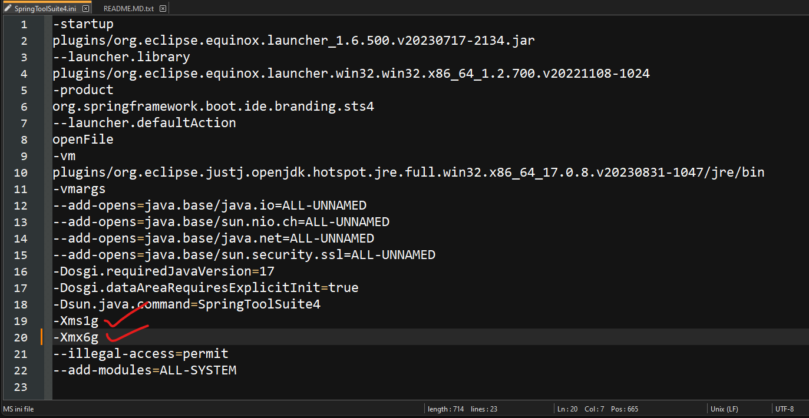
    
    

**(4) Extract Maven Apache server file to a directory and set environment variables**
    
    
   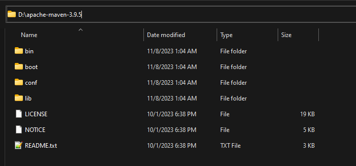
    
    
   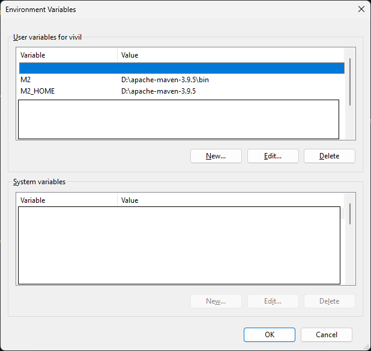
    
    

   
# Starting spring tool suite : Troubleshooting issues

 

- [x] **LSP (Spring boot language server) error when you launch Spring STS.**
  
    
   
*Problem :*
    
    
    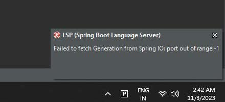
    
    
    
      
*Solution : Change the active provider from (Native) to (Direct)*
    
    
    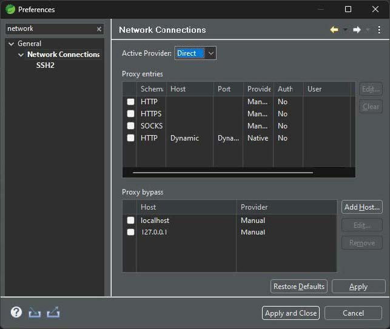
    
    

# Creating a spring starter project

- Step 1 - select the starter project 
    
    
    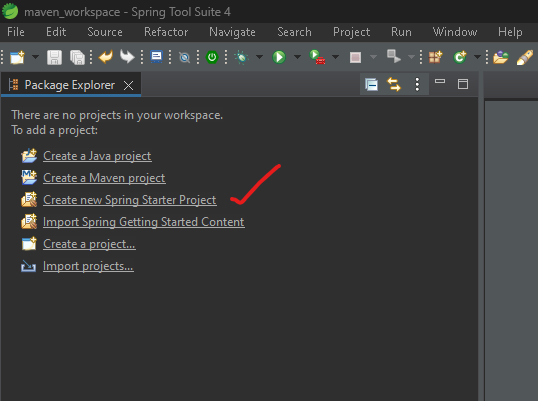
    
    
    
- Step 2 - Fill all necessary data
    
    
    
    
    
    
- Step 3 - Click finish
    
    
    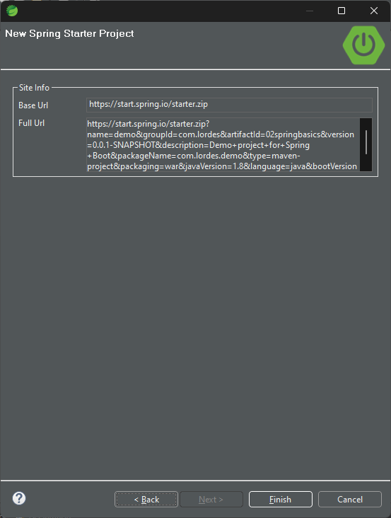
    
    
    
  
- Step 4 - files will be generated - select pom file

 

   > [!NOTE]   
   > What is POM file ?  >Project Object Model is a file which is required by maven to manage all dependencies required for the project.
   
    
    
   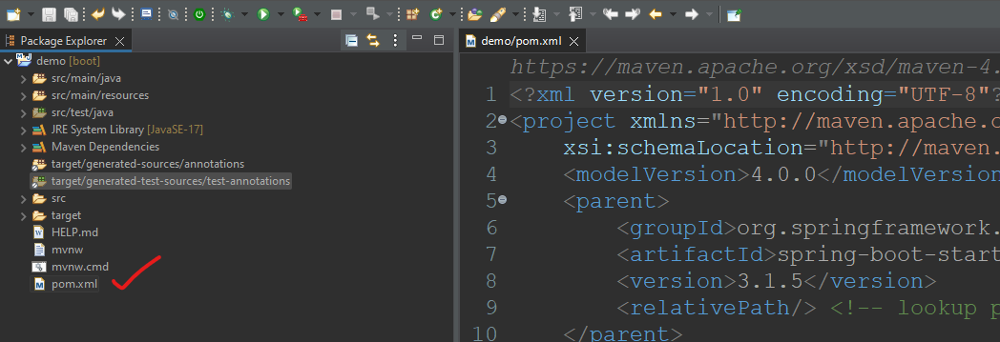
    
    
    

- Step 5 - After creating POM file if there is any error in the file in the mentioned location, it can be fixed.

   *Problem :*
    
    
    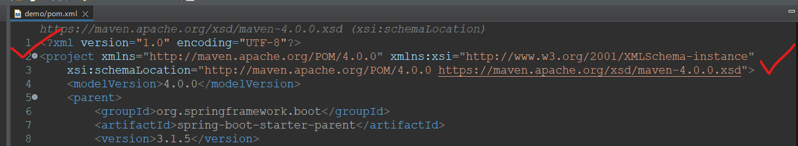
    
    
    

   *Solution :*
    
    
    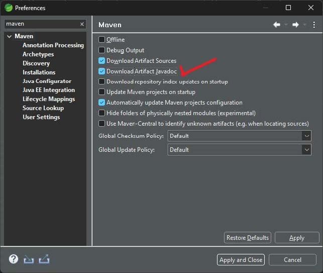
    
    
    
