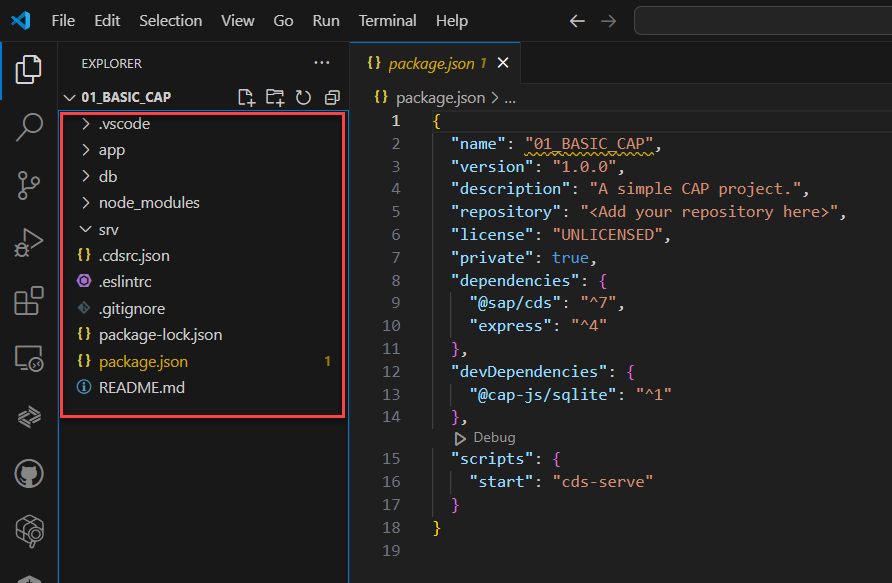

## CAPM - Day 1 

### Cloud application programming model - framework 

</br>
</br>

**Overview**
</br>
</br>
<p>
CAPM is a framework of SAP BTP, supported with languages JAVA and Node JS, it is supported with libraries and CDS node modules, it can be developed using BAS or VSCode,
the CAP framework is used of building enterprise grade applications and extension which ar cloud native in SAP BTP.
</p>
</br>
</br>

### CDS - Core Data and services  

</br>
</br>

**Overview**
</br>
</br>
<p>
Conceptually CDS is same concept in ABAP but with different flavour in CAPM, The concept says that , we have a design time object which is a cds file, we will create a *.cds file for almost everything eg. databse tables, view, model, services, Ui/UX
</br>
</br>

  - [x] This design time object file is complires by CAPM framework (inside CAP we have node module called <b>@sap/cds</b>)
  - [x] Once the compilation is successeful a <b>runtime</b> object gets created
  - [x] Cloud Documentation CAPM - https://cap.cloud.sap/docs/about
  - [x] SAP CAP official release notes https://cap.cloud.sap/docs/releases/
</p>
</br>
</br>

### Modules for using CAP

</br>
</br>

  - [x] We need to install </br>sap cds-dk</br> (development kit), This kit includes required framework libraries and source code to build, test deploy, run applications.
  - [x] It comes along with cds CLI which will be used by developers to quickly generate the CAP project skeleton.
  - [x] This module needs to be installed globally in our system if we are using VS code, in case we use BAS, this module is pre-installed.
</br>
</br>

- [x] install cds developer kit in your computer using command prompt  
</br>

```bat
npm install -g @sap/cds-dk
```
</br>
</br>

- [x] Post install verify installation of cds kit by using following commands 
</br>
</br>

```bat
cds --help  
```
</br>
or
</br>

```bat
cds help  
```
</br>
</br>

- [x] Node version should be 14 or higher , use following commands to check 
</br>

```bat
node -v 
```
</br>
or 
</br>

```bat
node v 
```
</br>
</br>

- [x] Check your cds version to get a valid response so that supported node version is checked by cds package
</br>
</br>
   
</br>
</br>

- [x] if version is not supported following response will be given 
</br>
</br>
  
</br>
</br>

- [x] create a folder in your computer and run <b>cds init</b> command. This will create a project skeleton automatically which includes <b>db, srv, ui</b> folders. 
</br>
</br>

```bat
cds init
```
</br>
</br>
  
</br>
</br>

- [x] install node version manager nvm to manage node verison in system https://github.com/coreybutler/nvm-windows/releases/tag/1.1.12
</br>
if there is multiple node projects which is assocaited with different version user will be faced with a challenge of switching
</br> different node version to work with different projects
</br>
</br>
  
</br>
</br>

- [x] When CDS initialization in Vs code or BAS is successfull you may see following objects generted in your development folder 
</br>
</br>
  
</br>
</br>

- [x] Go to VS code or BAS extension and install SAP cds language support for cds file code completion support
</br>
</br>
  
</br>
</br>

- [x] create 2 files with same name with differnt format (the file names should be identical  it is mandatory for CAP functionality to work)
- - - - [x] A CDS file by name 'mydemoservice.cds' in <b>SRV</b> 
- - - - [x] A JS file by name 'mydemoservice.js'  in <b>SRV</b> 
</br>
</br>

#### CDS file content - mydemoservice.cds
</br>

```cds
service MyService {

    function helloCAP(name:String) returns String;

}
```
  
</br>
</br>


#### JS file content - mydemoservice.js
</br>

```js
const Myservice = function(srv){
    // this code bloc is like DPC extension class in SAP ODATA services  
    srv.on('helloCAP', (req,res) => {
        return "Hello CAP clodu developers, Welcome" + req.body.name;
    });
}
```
</br>
</br>
Execuet the CDS file in terminal 

</br>

```bat
cds run
```
</br>

output of the execution will look like this (hold ctrl + click) this link to access the result 
</br>
</br>


</br>
</br>

the result will looke like this (to change the version mentioned in highlighted section)  check the <b>pacakage.json</b> file 
</br>
</br>


</br>
</br>

<p>
