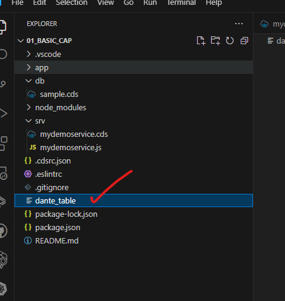

## CAPM - Day 1 

### Cloud application programming model - framework 

</br>
</br>

**Overview**
</br>
</br>
<p>
CAPM is a framework of SAP BTP, supported with languages JAVA and Node JS, it is supported with libraries and CDS node modules, it can be developed using BAS or VSCode,
the CAP framework is used of building enterprise grade applications and extension which ar cloud native in SAP BTP.
</p>
</br>
</br>

### CDS - Core Data and services  

</br>
</br>

**Overview**
</br>
</br>
<p>
Conceptually CDS is same concept in ABAP but with different flavour in CAPM, The concept says that , we have a design time object which is a cds file, we will create a *.cds file for almost everything eg. databse tables, view, model, services, Ui/UX
</br>
</br>

  - [x] This design time object file is complires by CAPM framework (inside CAP we have node module called <b>@sap/cds</b>)
  - [x] Once the compilation is successeful a <b>runtime</b> object gets created
  - [x] Cloud Documentation CAPM - https://cap.cloud.sap/docs/about
  - [x] SAP CAP official release notes https://cap.cloud.sap/docs/releases/
</p>
</br>
</br>

### Modules for using CAP

</br>
</br>

  - [x] We need to install </br>sap cds-dk</br> (development kit), This kit includes required framework libraries and source code to build, test deploy, run applications.
  - [x] It comes along with cds CLI which will be used by developers to quickly generate the CAP project skeleton.
  - [x] This module needs to be installed globally in our system if we are using VS code, in case we use BAS, this module is pre-installed.
</br>
</br>

- [x] install cds developer kit in your computer using command prompt  
</br>

```bat
npm install -g @sap/cds-dk
```
</br>
</br>

- [x] Post install verify installation of cds kit by using following commands 
</br>
</br>

```bat
cds --help  
```
</br>
or
</br>

```bat
cds help  
```
</br>
</br>

- [x] Node version should be 14 or higher , use following commands to check 
</br>

```bat
node -v 
```
</br>
or 
</br>

```bat
node v 
```
</br>
</br>

- [x] Check your cds version to get a valid response so that supported node version is checked by cds package
</br>
</br>
   
</br>
</br>

- [x] if version is not supported following response will be given 
</br>
</br>
  
</br>
</br>

- [x] create a folder in your computer and run <b>cds init</b> command. This will create a project skeleton automatically which includes <b>db, srv, ui</b> folders. 
</br>
</br>

```bat
cds init
```
</br>
</br>
  
</br>
</br>

- [x] install node version manager nvm to manage node verison in system https://github.com/coreybutler/nvm-windows/releases/tag/1.1.12
</br>
if there is multiple node projects which is assocaited with different version user will be faced with a challenge of switching
</br> different node version to work with different projects
</br>
</br>
  
</br>
</br>

- [x] When CDS initialization in Vs code or BAS is successfull you may see following objects generted in your development folder 
</br>
</br>
  
</br>
</br>

- [x] Go to VS code or BAS extension and install SAP cds language support for cds file code completion support
</br>
</br>
  
</br>
</br>

- [x] create 2 files with same name with differnt format (the file names should be identical  it is mandatory for CAP functionality to work)
- - - - [x] A CDS file by name 'mydemoservice.cds' in <b>SRV</b> 
- - - - [x] A JS file by name 'mydemoservice.js'  in <b>SRV</b> 
</br>
</br>

#### CDS file content - mydemoservice.cds
</br>

```cds
service MyService {

    function helloCAP(name:String) returns String;

}
```
  
</br>
</br>


#### JS file content - mydemoservice.js
</br>

```js
const Myservice = function(srv){
    // this code bloc is like DPC extension class in SAP ODATA services  
    srv.on('helloCAP', (req,res) => {
        return "Hello CAP clodu developers, Welcome" + req.body.name;
    });
}

return Myservice;
```
</br>
</br>
Execuet the CDS file in terminal 

</br>

```bat
cds run
```
</br>

output of the execution will look like this (hold ctrl + click) this link to access the result 
</br>
</br>


</br>
</br>

the result will looke like this (to change the version mentioned in highlighted section)  check the <b>pacakage.json</b> file 
</br>
</br>


</br>
Metadata of the app 
</br>


</br>
Output result of the app
</br>


</br>
</br>

- [x] As a developer you may have to make frequent changes to the app every time after you made the changes instead of typing 'cds run' every time use 'cds watch' to automate restarting the app by framework when there are code changes to the cds or js script files or any files in the app folder.
</br>
</br>

```bat
cds watch
```
</br>
</br>

</br>
</br>

### What is namespace in CDS 
</br>
</br>

<p>
  A namespace define a unique name for our group. It alsos give uniqueness to the project.
  for Example : in my compayn we haev 2 cap project, one for finance and other for HR.
  both project coincidently need to have employee table.. At runtime, each artifact which is generated has concatenate namespace.
  </br>
  </br>
  Finance team : Entity employee - Finance_employee
  </br>
   HR team : Entity employee - HR_employee
  </br>
</p> 

</br>
</br>

While creating DB object we also have context. it is used to describe additional category of data, 
</br>
transactional data, master, config, org.
</br>
</br>

```cds 
Context transaction{
Entity Orders
}
transcation_orders
```
</br>
</br>

Create a cds file name sample.cds in 'Db' folder and type down the the following code 
</br>
</br>


</br>
</br>

```cds 
namespace com.dante.finance;

context trans {
    entity order {
        key id            : Int16;
            customer_name : String;
            location      : String;
            total         : Decimal(10, 2);
            currency      : String;
            created_on    : Date;
            created_by    : String;
    }
}
```
</br>
</br>
Compile this CDS file code as SQL for local db creation for testing 
</br>
(SQlite a lite weight db used in cap development its a open source file system based DB) 
</br>
</br>


</br>
</br>

The compilation of SQL using following command <b> 'cds compile db/sample.cds --to sql' </b>
</br>

```bat
cds compile db/<cds file name>.cds --to sql
```
</br>


</br>
</br>
create the physical table in your project by executing the deploy command as below 
</br>

```bat
cds deploy --to sqlite:<table_name>
```
</br>
</br>

</br>
</br>

The database table which get generated internally will be
</br>
</br>

</br>
</br>

The physical table file got created in the project directory when 'deploy' command was executed 
</br>
</br>

</br>
</br>


Install following SQL tools and drivers from extensions 
</br>
</br>

</br>
</br>

</br>
</br>


Establish database connection to the created table file in our project
</br>
</br>

</br>
</br>


select the table file from the project folder directory where the file got created
</br>
</br>

</br>
</br>

</br>
</br>

Vs code may automatically suggest appropriate tool when you try to access the DB connection (it could be sqlite 3 for node) and also prompts to reload the window
</br>
</br>

</br>
</br>

SQL INSERT STATEMENT 
</br>
</br>

```sql
INSERT INTO com_dante_finance_trans_order VALUES
(1, 'sap', 'in', 125.20, 'eur', '2023-03-30', 'dante');
```

</br>
</br>

</br>
</br>

SQL SELECT STATEMENT 
</br>
</br>

```sql
SELECT * FROM com_dante_finance_trans_order;
```

</br>
</br>

</br>
</br>
</br>
</br>

### How to insert multiple records to sqlite table for testing purpose 
</br>
</br>

- [x] create a CSV folder inside DB folder as mentioned below
- [x] create a CSV file in the name of the database table with differnt naming convention (internal DB table name : <b>com.dante.finance.trans-order.csv</b>)
</br>
</br>

</br>
</br>
SAP will install the records to the DB table automatically when this file contains records\
</br>
Need to fill mock data to csv file using website (https://www.mockaroo.com/) 
</br>
</br>

<p>

