## CAPM - Day 10 - Side by Side extension

# WORK IN PROGRESS - 

</br>

[Side by side extension SAP official reading](https://learning.sap.com/learning-journeys/develop-advanced-extensions-with-sap-cloud-sdk/exploring-side-by-side-extensibility_f2f6f71d-d50c-4a48-b0f9-f5a87f717aa1)

</br>
</br>

### Extension Use case
</br>
</br>

SAP BTP is the main technology platform for doing extension of existing ERP application in any org, 
A main pillar of intelligent enterprise
</br>

1. Intelligent suite - solution like S/4 HANA
2. Intelligent platform - SAP BTP 
3. Intelligent technologies - SAC, RAP, CAP, SAP Build code, SAP Build App, SAP Build Automation, SAP Build Work zone..etc
</br>
</br>

If we want to entend our standard ERP software, What are all the disadvantage of the approach we take
</br>

1. The Extensions have potential to break your standard software
2. Extensions also take longer time to deliver change request
3. Risks for upgrade
4. Contamination of SAP Code 
</br>
</br>

SAP Recommends to build extensions on top of BTP outside the stable core ERP
</br>

1. ERP core software is stable 
2. We can deliver innovation at much faster phase
3. Never cause any problem to sap upgrades becasue The extension is built outside the environment

</br>
</br>

**In-App or Key-User extensibility** are means provided by the SAP product that enables you to extend the apps. For example one may add a new custom field to the UI which is then saved together with the business object instance. It can even be forwarded to follow-up documents in case of process extensibility. Further options of key-user extensibility are own business objects or business logic modifications in pre-defined extension points. This concept applies for cloud software. OnPremise customers have other options to get such kind of enhancements because they have direct access to the code.
</br>
</br>

**Side-by-Side extensibility** refers to enhancements that you create on a different platform (e.g. SAP Cloud Platform) but integrate with your SAP product. As an example, you might react on a certain event in your SAP product, notify your own SCP implementation to handle accordingly. Or you have an own app on SCP that writes data back into the SAP product. The communication works via public APIs in such cases.
</br>
</br>


</br>
</br>


</br>
</br>

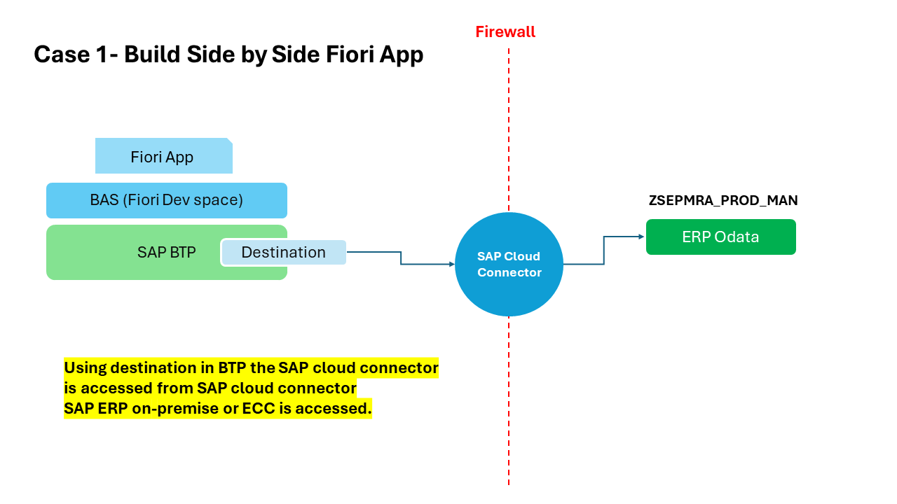
</br>
</br>

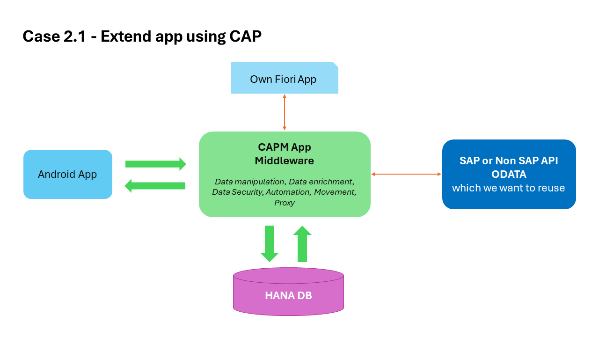
</br>
</br>


Before we proceed the cloud connection to ERP system is important it is a pre-requisite for this session 
</br> If cloud connection to On-Premise or ERP is not performed kindly refer this link and establish connection 
</br> [SAP Cloud connection](https://github.com/Octavius-Dante/Tetra_Proxima/tree/main/SAP_Cloud_Connector)
</br> 

</br>
</br>

## Case 1.0
</br>
</br>

<details>
<summary> <b>1. Checking the BTP destination details for connected system</b> </summary>
</br>
</br>
Before start building app in BAS btp side we should confirm wheher 
</br>systems are available for connection in destiantion section as shown below
</br>
</br>

</br>
</br>

</br>
</br>

</br>
</br>
</details>


<details>
<summary> <b>2. Accessing on-prem system and checking the ODATA service </b> </summary>
</br>
</br>
Go to tcode /n/iwfnd/maint_services
</br>
</br>

</br>
</br>

Selecting a service which we are going to use for our fiori app 
</br>
</br>

</br>
</br>

Testing the service whether it is supplying data to web
</br>
</br>

</br>
</br>

The data is dipslayed in the web in XML format (Odata service is accessible in web)
</br>
</br>

</br>
</br>

identifying the implemented class in case if we want to make chanegs in ABAP for this exisitng ODATA services
</br> this is a standard demo purpose odata class used in Zservice this SEPMRA_PROD_MAN is available in all S/4 HANA on-premise system
</br> Standard External service : SEPMRA_PROD_MAN - (in case of a Zclass used in service which can be modified as per user convenience)
</br>
</br>

</br>
</br>

</br>
</br>

in the web browser (SEPMRA_PROD_MAN/SEPMRA_C_PD_Product/?$format=json) add this block to the existing link and check the sub category of an odata service
</br>
</br>

</br>
</br>

</br>
</br>

Press F12 in chrome browser and navigate to network section and relaod the page to see the type of odata service (product page is v2)
</br>
</br>

</br>
</br>
</details>


<details>
<summary> <b>3. Registering ERP system in BAS - linking erp to subaccount  </b> </summary>
</br>
</br>

</br>
</br>

</br>
</br>

Some times the available catalog services wont be displayed but since destination connection is shown no connection issue we can proceed 
</br>
</br>

</br>
</br>
</details>


<details>
<summary> <b>4. Build Fiori applicaiton in BAS using Fiori elements template - CASE 1.0 </b> </summary>
</br>
</br>

<!--Leveraging the power of S/4 HANA in BTP in side by side extension -->
Go to SAP Fiori template (Fiori Open application generator via command palatte) 
</br> menu --> help --> get started  (or)  menu --> view --> command palette    
</br> 
</br>

</br>
</br>


</br>
</br>


</br>
</br>


</br>
</br>


</br>
</br>


</br>
</br>


</br>
</br>


</br>
</br>


</br>
</br>


</br>
</br>


</br>
</br>


</br>
</br>


</br>
</br>


</br>
</br>


</br>
</br>


</br>
</br>


</br>
</br>


</br>
</br>


</br>
</br>
</details>


<details>
<summary> <b>5. making changes to the template built fiori app (annotations.xml) </b> </summary>
</br>
</br>


</br>
</br>

</br>
</br>

</br>
</br>

</br>
</br>

</br>
</br>

</br>
</br>

</br>
</br>

</br>
</br>

</br> </br>
</br> </br>
</br> </br>
</br> </br>
</br> </br>
</br> </br>
</br> </br>
</br> </br>
</br> </br>
</br> </br>
</br> </br>
</br> </br>
</br> </br>
</br> </br>
</br> </br>
</br> </br>
</br> </br>
</br> </br>
</br> </br>
</br> </br>
</br> </br>
</br> </br>
</br> </br>
</br> </br>
</br> </br>
</br> </br>
</br> </br>
</br> </br>
</br> </br>
</br> </br>
</br> </br>
</br> </br>
</br> </br>
</br> </br>
</br> </br>
</br> </br>
</br> </br>
</br> </br>
</br> </br>
</br> </br>
</br> </br>
</br> </br>
</br> </br>
</br> </br>
</br> </br>
</br>
</br>
</details>


<details>
<summary> <b>6. Deploying the fiori app to BTP cloud</b> </summary>
</br>
</br>

The deployment process is same only new thing is the MTA yaml contents will be different 
</br>
</br>

1. DO cf login
2. Perform building MTA archive 
3. Deploy MTA archive
4. Go to SAP build work zone and assign the deployed app to fiori page from HTML 5 repository 

</br>
</br>

CF login  </br></br>
</br> </br>
</br></br>

Create MTA archive build </br></br>
</br> </br>
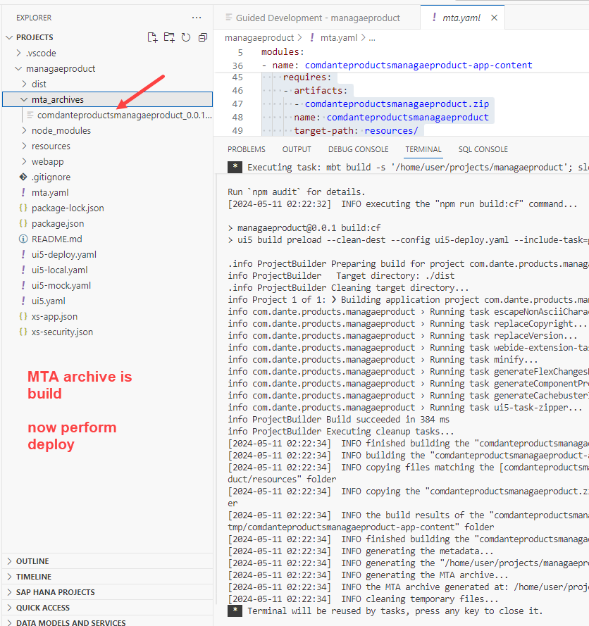</br> </br>
</br></br>

Deploy the app</br></br>
</br> </br>
</br> </br>
</br> </br>
</br></br>

</br>
</br>
</details>


<details>
<summary> <b>7. Assigning the deployed app to fiori tile in SAP build work zone </b> </summary>
</br>
</br>
</br>
</br> </br>
</br> </br>
</br> </br>
</br> </br>
</br> </br>
</br> </br>
</br> </br>
</br> </br>
</br> </br>
</br> </br>
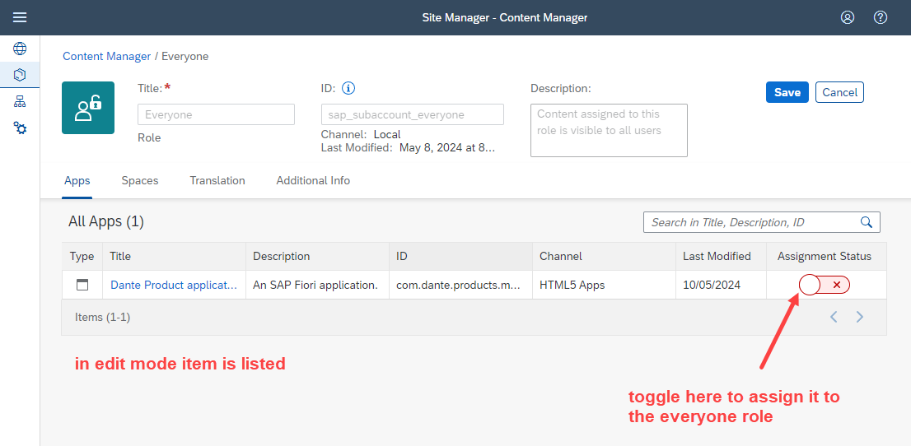</br> </br>
</br> </br>
</br> </br>
</br> </br>
</br> </br>
</br> </br>
</br>
</br>
</br>
</details>

</br>
</br>


## Case 2.1
</br>
</br>

**Free Api provided by Microsoft for testing purpose**
</br>

</br> https://services.odata.org/
</br> https://services.odata.org/V3/Northwind/Northwind.svc/
</br>
</br>


<details>
<summary> <b>1. Access the 3rd party API and retrieve data structure </b> </summary>
</br>
</br>

Access the following link (which has $metadata added to it)
</br>[https://services.odata.org/V3/Northwind/Northwind.svc/$metadata](https://services.odata.org/V3/Northwind/Northwind.svc/$metadata)
</br>
</br> and save the page as NorthWind.edmx file </br> </br> 
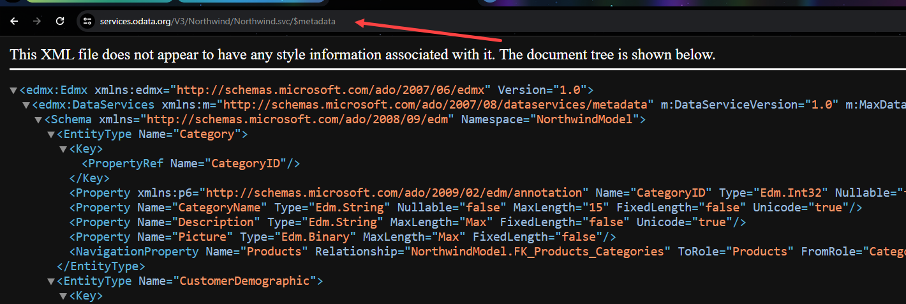</br> </br>
</br> </br>
</br> </br>
</br> </br>

</br>
</br>
</details>


<details>
<summary> <b>2. Use the data structure file in app for defining a structure</b> </summary>
</br>
</br>

1. Go to Vs code and create a new project and perform cds init </br></br>
</br> </br>

2. do a cds watch </br> </br>
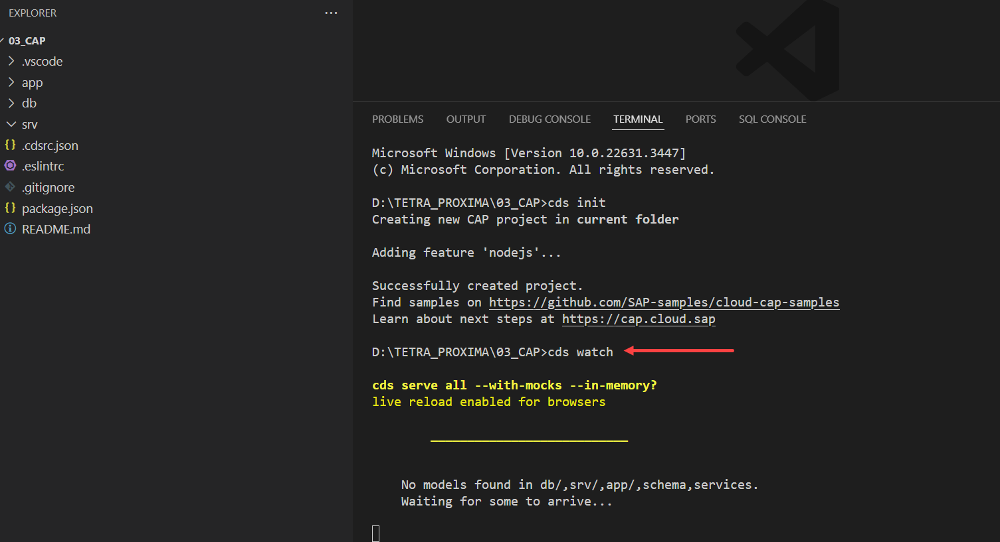</br> </br>

3. drag and drop the *.edmx file to SRV folder make sure the naming should be in proper case (NorthWind.edmx)</br></br>
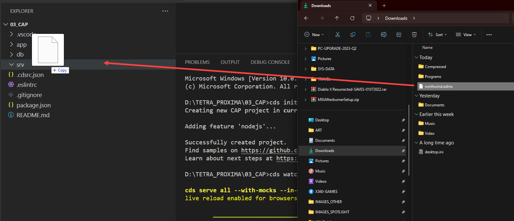</br> </br>
</br> </br>

</br> </br>

> [!NOTE]
> In case the file drag and drop is perfromed with wrong file name (northwind.edmx) please repeat the process (create new project folder, perform cds init , then perform Northwind.edmx with correct file name)

</br> </br>

4. in command prompt we can see some actions performed </br></br>
</br> </br>

5. Access the link here and it takes to a SRV skeleton page as shown below</br></br>
</br> </br>
</br> </br>
</br> </br>

6. A CSN file gets created (CDS schema notation)</br></br>
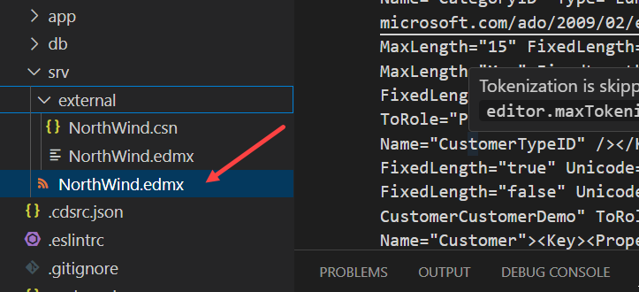</br> </br>

7. A rough preview into the CSN file</br></br>
</br> </br>

7. Install an extension in VSCode to view the EDMX file</br></br>
</br> </br>

8. View the file</br></br>
</br> </br>
</br> </br>
</br> </br>

</br>
</br>
</details>

<details>
<summary> <b>3. Use the file in app for defining table structure</b> </summary>
</br>
</br>

**The goal is to display only one catalog services exposed with data to web out of many listed**
</br>
</br>

</br> </br>
</br> </br>

</br>
</br>
Creating a datamodel.cds and datamodel.js inside SRV folder</br> </br>
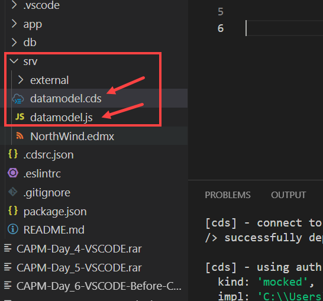</br> </br>
</br> </br>
</br> </br>
</br> </br>
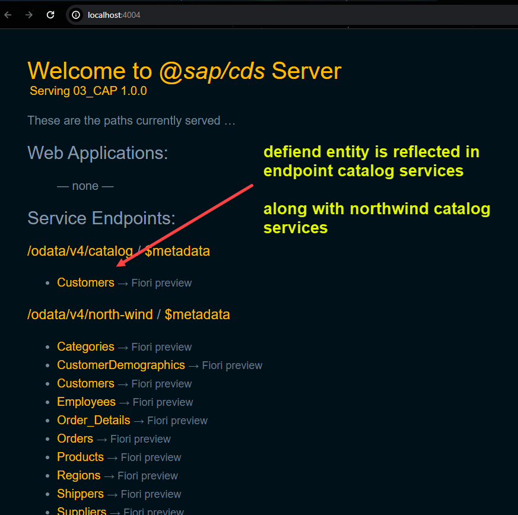</br> </br>
</br> </br>
</br> </br>


open $metadata page of the NorthWind from this link ([https://services.odata.org/V3/Northwind/Northwind.svc/$metadata](https://services.odata.org/V3/Northwind/Northwind.svc/$metadata)) and look for Customers entity structure and check the details 
</br> </br>
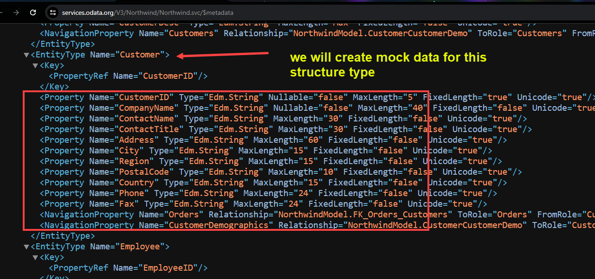</br> </br>

Following structure is picked from NorthWind.edmx file (now we generate some test data for this structure in [mockaroo.com](https://www.mockaroo.com/))
</br> </br>

```xml

<Property Name="CustomerID" Type="Edm.String" Nullable="false" MaxLength="5" FixedLength="true" Unicode="true"/>
<Property Name="CompanyName" Type="Edm.String" Nullable="false" MaxLength="40" FixedLength="false" Unicode="true"/>
<Property Name="ContactName" Type="Edm.String" MaxLength="30" FixedLength="false" Unicode="true"/>
<Property Name="ContactTitle" Type="Edm.String" MaxLength="30" FixedLength="false" Unicode="true"/>
<Property Name="Address" Type="Edm.String" MaxLength="60" FixedLength="false" Unicode="true"/>
<Property Name="City" Type="Edm.String" MaxLength="15" FixedLength="false" Unicode="true"/>
<Property Name="Region" Type="Edm.String" MaxLength="15" FixedLength="false" Unicode="true"/>
<Property Name="PostalCode" Type="Edm.String" MaxLength="10" FixedLength="false" Unicode="true"/>
<Property Name="Country" Type="Edm.String" MaxLength="15" FixedLength="false" Unicode="true"/>
<Property Name="Phone" Type="Edm.String" MaxLength="24" FixedLength="false" Unicode="true"/>
<Property Name="Fax" Type="Edm.String" MaxLength="24" FixedLength="false" Unicode="true"/>

CustomerID
CompanyName
ContactName
ContactTitle
Address
City
Region
PostalCode
Country
Phone
Fax

```
</br> </br>

Test data generation, I manipulated the file for cusotmer id in excel (becasue the customerID lenght is 5)
</br> </br>
</br> </br>

Add the test data to the csv file (copy pasted)
</br> </br>
</br> </br>
</br> </br>
</br> </br>

We have filled data from our local csv file ,Now we make changes to get data from api itself
</br> </br>
</br> </br>
</br> </br>
</br> </br>

The catalog service will display error when accessed 
</br> </br>
</br> </br>

Following link is accessed in Postman as well as in browseer to see the data coming from API
</br> </br>
</br> </br>
</br> </br>
</br> </br>

We have to instruct CAP framewrok to retrieve the data and map to our struture so we need to write code in datamodel.js for catalog service
</br> </br>
</br> </br>

Code sample used in datamodel.js 
</br> </br>

```js

## CAPM - Day 10 - Side by Side extension

# WORK IN PROGRESS - 

</br>

[Side by side extension SAP official reading](https://learning.sap.com/learning-journeys/develop-advanced-extensions-with-sap-cloud-sdk/exploring-side-by-side-extensibility_f2f6f71d-d50c-4a48-b0f9-f5a87f717aa1)

</br>
</br>

### Extension Use case
</br>
</br>

SAP BTP is the main technology platform for doing extension of existing ERP application in any org, 
A main pillar of intelligent enterprise
</br>

1. Intelligent suite - solution like S/4 HANA
2. Intelligent platform - SAP BTP 
3. Intelligent technologies - SAC, RAP, CAP, SAP Build code, SAP Build App, SAP Build Automation, SAP Build Work zone..etc
</br>
</br>

If we want to entend our standard ERP software, What are all the disadvantage of the approach we take
</br>

1. The Extensions have potential to break your standard software
2. Extensions also take longer time to deliver change request
3. Risks for upgrade
4. Contamination of SAP Code 
</br>
</br>

SAP Recommends to build extensions on top of BTP outside the stable core ERP
</br>

1. ERP core software is stable 
2. We can deliver innovation at much faster phase
3. Never cause any problem to sap upgrades becasue The extension is built outside the environment

</br>
</br>

**In-App or Key-User extensibility** are means provided by the SAP product that enables you to extend the apps. For example one may add a new custom field to the UI which is then saved together with the business object instance. It can even be forwarded to follow-up documents in case of process extensibility. Further options of key-user extensibility are own business objects or business logic modifications in pre-defined extension points. This concept applies for cloud software. OnPremise customers have other options to get such kind of enhancements because they have direct access to the code.
</br>
</br>

**Side-by-Side extensibility** refers to enhancements that you create on a different platform (e.g. SAP Cloud Platform) but integrate with your SAP product. As an example, you might react on a certain event in your SAP product, notify your own SCP implementation to handle accordingly. Or you have an own app on SCP that writes data back into the SAP product. The communication works via public APIs in such cases.
</br>
</br>


</br>
</br>


</br>
</br>


</br>
</br>


</br>
</br>


Before we proceed the cloud connection to ERP system is important it is a pre-requisite for this session 
</br> If cloud connection to On-Premise or ERP is not performed kindly refer this link and establish connection 
</br> [SAP Cloud connection](https://github.com/Octavius-Dante/Tetra_Proxima/tree/main/SAP_Cloud_Connector)
</br> 

</br>
</br>

## Case 1.0
</br>
</br>

<details>
<summary> <b>1. Checking the BTP destination details for connected system</b> </summary>
</br>
</br>
Before start building app in BAS btp side we should confirm wheher 
</br>systems are available for connection in destiantion section as shown below
</br>
</br>

</br>
</br>

</br>
</br>

</br>
</br>
</details>


<details>
<summary> <b>2. Accessing on-prem system and checking the ODATA service </b> </summary>
</br>
</br>
Go to tcode /n/iwfnd/maint_services
</br>
</br>

</br>
</br>

Selecting a service which we are going to use for our fiori app 
</br>
</br>

</br>
</br>

Testing the service whether it is supplying data to web
</br>
</br>

</br>
</br>

The data is dipslayed in the web in XML format (Odata service is accessible in web)
</br>
</br>

</br>
</br>

identifying the implemented class in case if we want to make chanegs in ABAP for this exisitng ODATA services
</br> this is a standard demo purpose odata class used in Zservice this SEPMRA_PROD_MAN is available in all S/4 HANA on-premise system
</br> Standard External service : SEPMRA_PROD_MAN - (in case of a Zclass used in service which can be modified as per user convenience)
</br>
</br>

</br>
</br>

</br>
</br>

in the web browser (SEPMRA_PROD_MAN/SEPMRA_C_PD_Product/?$format=json) add this block to the existing link and check the sub category of an odata service
</br>
</br>

</br>
</br>

</br>
</br>

Press F12 in chrome browser and navigate to network section and relaod the page to see the type of odata service (product page is v2)
</br>
</br>

</br>
</br>
</details>


<details>
<summary> <b>3. Registering ERP system in BAS - linking erp to subaccount  </b> </summary>
</br>
</br>

</br>
</br>

</br>
</br>

Some times the available catalog services wont be displayed but since destination connection is shown no connection issue we can proceed 
</br>
</br>

</br>
</br>
</details>


<details>
<summary> <b>4. Build Fiori applicaiton in BAS using Fiori elements template - CASE 1.0 </b> </summary>
</br>
</br>

<!--Leveraging the power of S/4 HANA in BTP in side by side extension -->
Go to SAP Fiori template (Fiori Open application generator via command palatte) 
</br> menu --> help --> get started  (or)  menu --> view --> command palette    
</br> 
</br>

</br>
</br>


</br>
</br>


</br>
</br>


</br>
</br>


</br>
</br>


</br>
</br>


</br>
</br>


</br>
</br>


</br>
</br>


</br>
</br>


</br>
</br>


</br>
</br>


</br>
</br>


</br>
</br>


</br>
</br>


</br>
</br>


</br>
</br>


</br>
</br>


</br>
</br>
</details>


<details>
<summary> <b>5. making changes to the template built fiori app (annotations.xml) </b> </summary>
</br>
</br>


</br>
</br>

</br>
</br>

</br>
</br>

</br>
</br>

</br>
</br>

</br>
</br>

</br>
</br>

</br>
</br>

</br> </br>
</br> </br>
</br> </br>
</br> </br>
</br> </br>
</br> </br>
</br> </br>
</br> </br>
</br> </br>
</br> </br>
</br> </br>
</br> </br>
</br> </br>
</br> </br>
</br> </br>
</br> </br>
</br> </br>
</br> </br>
</br> </br>
</br> </br>
</br> </br>
</br> </br>
</br> </br>
</br> </br>
</br> </br>
</br> </br>
</br> </br>
</br> </br>
</br> </br>
</br> </br>
</br> </br>
</br> </br>
</br> </br>
</br> </br>
</br> </br>
</br> </br>
</br> </br>
</br> </br>
</br> </br>
</br> </br>
</br> </br>
</br> </br>
</br> </br>
</br> </br>
</br> </br>
</br>
</br>
</details>


<details>
<summary> <b>6. Deploying the fiori app to BTP cloud</b> </summary>
</br>
</br>

The deployment process is same only new thing is the MTA yaml contents will be different 
</br>
</br>

1. DO cf login
2. Perform building MTA archive 
3. Deploy MTA archive
4. Go to SAP build work zone and assign the deployed app to fiori page from HTML 5 repository 

</br>
</br>

CF login  </br></br>
</br> </br>
</br></br>

Create MTA archive build </br></br>
</br> </br>
</br> </br>
</br></br>

Deploy the app</br></br>
</br> </br>
</br> </br>
</br> </br>
</br></br>

</br>
</br>
</details>


<details>
<summary> <b>7. Assigning the deployed app to fiori tile in SAP build work zone </b> </summary>
</br>
</br>
</br>
</br> </br>
</br> </br>
</br> </br>
</br> </br>
</br> </br>
</br> </br>
</br> </br>
</br> </br>
</br> </br>
</br> </br>
</br> </br>
</br> </br>
</br> </br>
</br> </br>
</br> </br>
</br> </br>
</br>
</br>
</br>
</details>

</br>
</br>


## Case 2.1
</br>
</br>

**Free Api provided by Microsoft for testing purpose**
</br>

</br> https://services.odata.org/
</br> https://services.odata.org/V3/Northwind/Northwind.svc/
</br>
</br>


<details>
<summary> <b>1. Access the 3rd party API and retrieve data structure </b> </summary>
</br>
</br>

Access the following link (which has $metadata added to it)
</br>[https://services.odata.org/V3/Northwind/Northwind.svc/$metadata](https://services.odata.org/V3/Northwind/Northwind.svc/$metadata)
</br>
</br> and save the page as NorthWind.edmx file </br> </br> 
</br> </br>
</br> </br>
</br> </br>
</br> </br>

</br>
</br>
</details>


<details>
<summary> <b>2. Use the data structure file in app for defining a structure</b> </summary>
</br>
</br>

1. Go to Vs code and create a new project and perform cds init </br></br>
</br> </br>

2. do a cds watch </br> </br>
</br> </br>

3. drag and drop the *.edmx file to SRV folder make sure the naming should be in proper case (NorthWind.edmx)</br></br>
</br> </br>
</br> </br>

</br> </br>

> [!NOTE]
> In case the file drag and drop is perfromed with wrong file name (northwind.edmx) please repeat the process (create new project folder, perform cds init , then perform Northwind.edmx with correct file name)

</br> </br>

4. in command prompt we can see some actions performed </br></br>
</br> </br>

5. Access the link here and it takes to a SRV skeleton page as shown below</br></br>
</br> </br>
</br> </br>
</br> </br>

6. A CSN file gets created (CDS schema notation)</br></br>
</br> </br>

7. A rough preview into the CSN file</br></br>
</br> </br>

7. Install an extension in VSCode to view the EDMX file</br></br>
</br> </br>

8. View the file</br></br>
</br> </br>
</br> </br>
</br> </br>

</br>
</br>
</details>

<details>
<summary> <b>3. Use the file in app for defining table structure</b> </summary>
</br>
</br>

**The goal is to display only one catalog services exposed with data to web out of many listed**
</br>
</br>

</br> </br>
</br> </br>

</br>
</br>
Creating a datamodel.cds and datamodel.js inside SRV folder</br> </br>
</br> </br>
</br> </br>
</br> </br>
</br> </br>
</br> </br>
</br> </br>
</br> </br>


open $metadata page of the NorthWind from this link ([https://services.odata.org/V3/Northwind/Northwind.svc/$metadata](https://services.odata.org/V3/Northwind/Northwind.svc/$metadata)) and look for Customers entity structure and check the details 
</br> </br>
</br> </br>

Following structure is picked from NorthWind.edmx file (now we generate some test data for this structure in [mockaroo.com](https://www.mockaroo.com/))
</br> </br>

```xml

<Property Name="CustomerID" Type="Edm.String" Nullable="false" MaxLength="5" FixedLength="true" Unicode="true"/>
<Property Name="CompanyName" Type="Edm.String" Nullable="false" MaxLength="40" FixedLength="false" Unicode="true"/>
<Property Name="ContactName" Type="Edm.String" MaxLength="30" FixedLength="false" Unicode="true"/>
<Property Name="ContactTitle" Type="Edm.String" MaxLength="30" FixedLength="false" Unicode="true"/>
<Property Name="Address" Type="Edm.String" MaxLength="60" FixedLength="false" Unicode="true"/>
<Property Name="City" Type="Edm.String" MaxLength="15" FixedLength="false" Unicode="true"/>
<Property Name="Region" Type="Edm.String" MaxLength="15" FixedLength="false" Unicode="true"/>
<Property Name="PostalCode" Type="Edm.String" MaxLength="10" FixedLength="false" Unicode="true"/>
<Property Name="Country" Type="Edm.String" MaxLength="15" FixedLength="false" Unicode="true"/>
<Property Name="Phone" Type="Edm.String" MaxLength="24" FixedLength="false" Unicode="true"/>
<Property Name="Fax" Type="Edm.String" MaxLength="24" FixedLength="false" Unicode="true"/>

CustomerID
CompanyName
ContactName
ContactTitle
Address
City
Region
PostalCode
Country
Phone
Fax

```
</br> </br>

Test data generation, I manipulated the file for cusotmer id in excel (becasue the customerID lenght is 5)
</br> </br>
</br> </br>

Add the test data to the csv file (copy pasted)
</br> </br>
</br> </br>
</br> </br>
</br> </br>

We have filled data from our local csv file ,Now we make changes to get data from api itself
</br> </br>
</br> </br>
</br> </br>
</br> </br>

The catalog service will display error when accessed 
</br> </br>
</br> </br>

Following link is accessed in Postman as well as in browseer to see the data coming from API
</br> </br>
</br> </br>
</br> </br>
</br> </br>

We have to instruct CAP framewrok to retrieve the data and map to our struture so we need to write code in datamodel.js for catalog service
</br> </br>
</br> </br>

Code sample used in datamodel.js 
</br> </br>

```js

const cds = require('@sap/cds');

module.exports = cds.service.impl(async function(){

    const { Customers } = this.entities;

    const service = await cds.connect.to('NorthWind')

this.on('READ', Customers, async (request)=>{
    
    // check, pre-checks, make filters, authorization, security
    var data = await service.tx(request).run(request.query);
    console.log(data);

    // data enrichment - adding our hardcoded data
    data.push({

        "CustomerID": "Cleon",
        "CompanyName": "DANTE Cloud development",
        "ContactName": "Arthelais",
        "ContactTitle": "Chief Developer",
        "Address": "kremlin rue",
        "City": "Alaska",
        "Region": "Northern region",
        "PostalCode": "12SST",
        "Country": "United States",
        "Phone": "030-0074321",
        "Fax": "030-0076545"
        
    });

    return data;
});

});
```
</br>
</br>


need to install a component to run things successfully  cloud sdk http client

```bat
npm install @sap-cloud-sdk/http-client
npm install -g @sap/cds-dk
```


</br>
</br>
</details>


</br>
</br>
</br>
</br>

<!-- 

</br> </br>
</br> </br>
</br> </br>
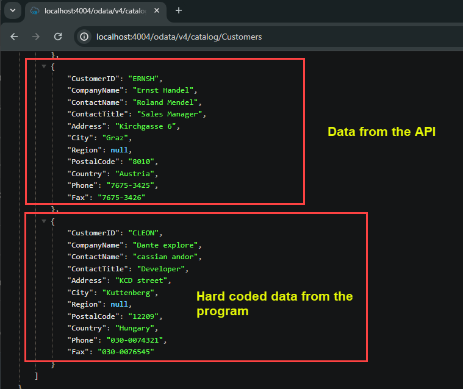</br> </br>
</br> </br>
</br> </br>
</br> </br>
</br> </br>
</br> </br>
</br> </br>
</br> </br>
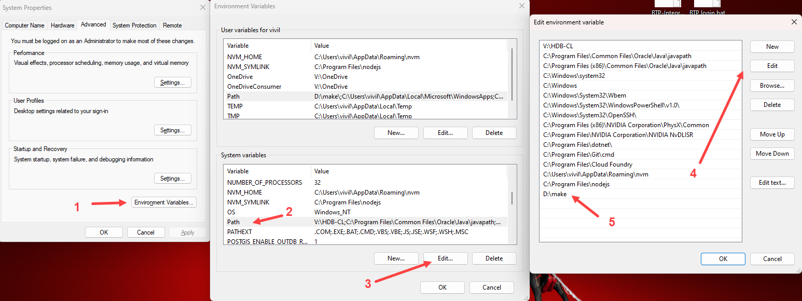</br> </br>
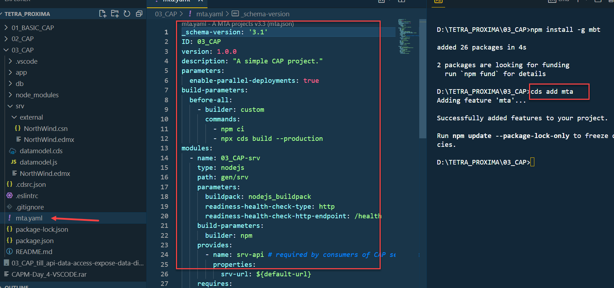</br> </br>
</br> </br>
</br> </br>
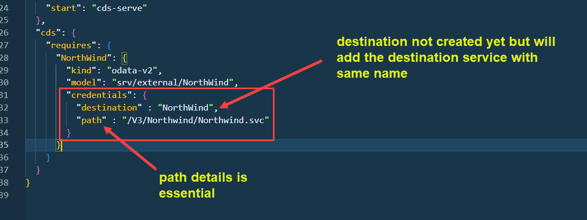</br> </br>
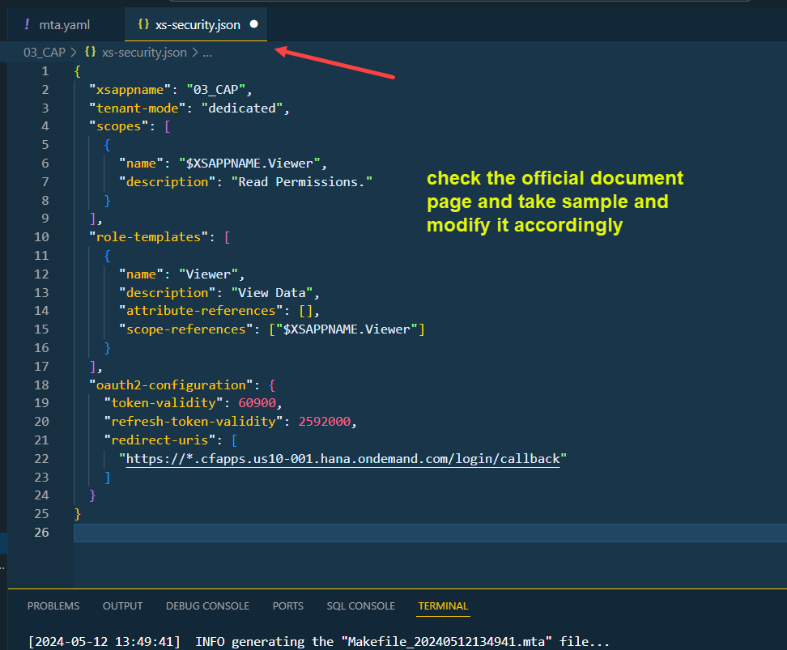</br> </br>
</br> </br>
</br> </br>
</br> </br>
</br> </br>
</br> </br>
</br> </br>
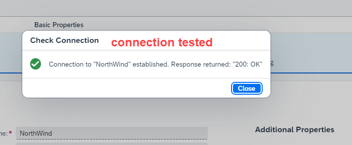</br> </br>
</br> </br>
</br> </br>
</br> </br>
</br> </br>
</br> </br>
</br> </br>
</br> </br>
</br> </br>
</br> </br>
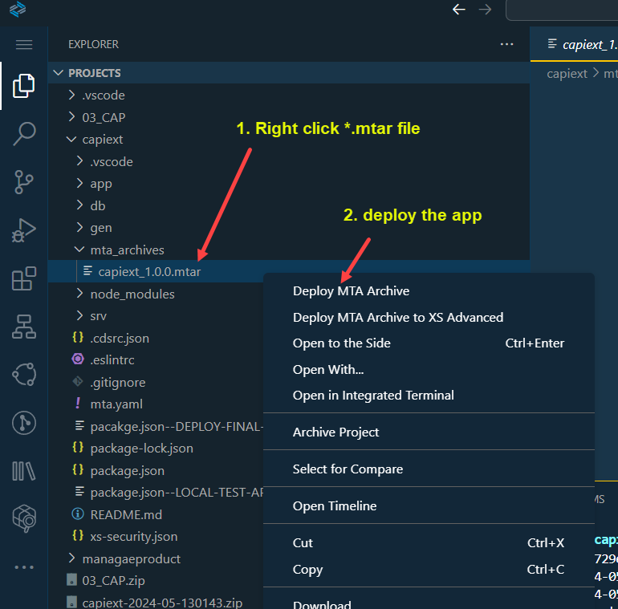</br> </br>
</br> </br>
</br> </br>
</br> </br>
</br> </br> 

-->


## Case 1.0 (files for reference)
</br>

**annotation.xml before changes**

<details>
<summary> annotation.xml file sample </b> </summary>
</br>
</br>

```xml

<edmx:Edmx xmlns:edmx="http://docs.oasis-open.org/odata/ns/edmx" Version="4.0">
    <edmx:Reference Uri="https://sap.github.io/odata-vocabularies/vocabularies/Common.xml">
        <edmx:Include Namespace="com.sap.vocabularies.Common.v1" Alias="Common"/>
    </edmx:Reference>
    <edmx:Reference Uri="https://sap.github.io/odata-vocabularies/vocabularies/UI.xml">
        <edmx:Include Namespace="com.sap.vocabularies.UI.v1" Alias="UI"/>
    </edmx:Reference>
    <edmx:Reference Uri="https://sap.github.io/odata-vocabularies/vocabularies/Communication.xml">
        <edmx:Include Namespace="com.sap.vocabularies.Communication.v1" Alias="Communication"/>
    </edmx:Reference>
    <edmx:Reference Uri="/sap/opu/odata/sap/SEPMRA_PROD_MAN/$metadata">
        <edmx:Include Namespace="SEPMRA_PROD_MAN" Alias="SAP"/>
    </edmx:Reference>
    <edmx:DataServices>
        <Schema xmlns="http://docs.oasis-open.org/odata/ns/edm" Namespace="local">
        </Schema>
    </edmx:DataServices>
</edmx:Edmx>

```
</br>
</br>
</details>

</br>

**annotation.xml after changes**

<details>
<summary> annotation.xml file sample - modified</b> </summary>
</br>
</br>

```xml

<edmx:Edmx xmlns:edmx="http://docs.oasis-open.org/odata/ns/edmx" Version="4.0">
    <edmx:Reference Uri="https://sap.github.io/odata-vocabularies/vocabularies/Common.xml">
        <edmx:Include Namespace="com.sap.vocabularies.Common.v1" Alias="Common"/>
    </edmx:Reference>
    <edmx:Reference Uri="https://sap.github.io/odata-vocabularies/vocabularies/UI.xml">
        <edmx:Include Namespace="com.sap.vocabularies.UI.v1" Alias="UI"/>
    </edmx:Reference>
    <edmx:Reference Uri="https://sap.github.io/odata-vocabularies/vocabularies/Communication.xml">
        <edmx:Include Namespace="com.sap.vocabularies.Communication.v1" Alias="Communication"/>
    </edmx:Reference>
    <edmx:Reference Uri="/sap/opu/odata/sap/SEPMRA_PROD_MAN/$metadata">
        <edmx:Include Namespace="SEPMRA_PROD_MAN" Alias="SAP"/>
    </edmx:Reference>
    <edmx:DataServices>
        <Schema xmlns="http://docs.oasis-open.org/odata/ns/edm" Namespace="local">

            <Annotations Target="SAP.SEPMRA_C_PD_ProductType">
                <Annotation Term="UI.Facets" >
                    <Collection>
                        <Record Type="UI.ReferenceFacet">
                            <PropertyValue Property="Target" AnnotationPath="@UI.FieldGroup#Dreamland"/>
                            <PropertyValue Property="Label" String="More info"/>
                        </Record>
                        <Record Type="UI.ReferenceFacet">
                            <PropertyValue Property="Target" AnnotationPath="to_ProductSalesData/@UI.LineItem#Wonderland"/>
                            <PropertyValue Property="Label" String="Sales related to product"/>
                        </Record>        
                        <Record Type="UI.ReferenceFacet">
                            <PropertyValue Property="Target" AnnotationPath="to_ProductSalesData/@UI.Chart#RevenueByCountry"/>
                            <PropertyValue Property="Label" String="Insights"/>
                        </Record>                                                
                    </Collection>
                </Annotation>
               <Annotation Term="UI.FieldGroup" Qualifier="Dreamland">
                   <Record Type="UI.FieldGroupType">
                       <PropertyValue Property="Data">
                           <Collection>
                               <Record Type="UI.DataField">
                                   <PropertyValue Property="Value" Path="Name"/>
                                   <PropertyValue Property="Label" String="Name"/>
                               </Record>
                               <Record Type="UI.DataField">
                                   <PropertyValue Property="Value" Path="Description"/>
                                   <PropertyValue Property="Label" String="Description"/>
                               </Record>
                               <Record Type="UI.DataField">
                                   <PropertyValue Property="Value" Path="Price"/>
                                   <PropertyValue Property="Label" String="Price"/>
                               </Record>
                               <Record Type="UI.DataField">
                                   <PropertyValue Property="Value" Path="Currency"/>
                                   <PropertyValue Property="Label" String="Currency"/>
                               </Record>
                               <Record Type="UI.DataField">
                                   <PropertyValue Property="Value" Path="DimensionUnit"/>
                                   <PropertyValue Property="Label" String="DimensionUnit"/>
                               </Record>
                               <Record Type="UI.DataField">
                                   <PropertyValue Property="Value" Path="Product"/>
                                   <PropertyValue Property="Label" String="Id"/>
                               </Record>                                                                                                                                                           
                           </Collection>
                       </PropertyValue>
                   </Record>
               </Annotation> 
            </Annotations>
            <Annotations Target="SAP.SEPMRA_C_PD_ProductSalesDataType">
                <Annotation Term="UI.LineItem" Qualifier="Wonderland" >
                    <Collection>
                        <Record Type="UI.DataField">
                            <PropertyValue Property="Value" Path="SalesOrder"/>
                        </Record>
                        <Record Type="UI.DataField">
                            <PropertyValue Property="Value" Path="SoldToParty"/>
                        </Record>
                        <Record Type="UI.DataField">
                            <PropertyValue Property="Value" Path="NetAmount"/>
                        </Record>
                        <Record Type="UI.DataField">
                            <PropertyValue Property="Value" Path="SoldToPartyCountry"/>
                        </Record>                                                                        
                    </Collection>
                </Annotation>
            </Annotations>
        </Schema>
    </edmx:DataServices>
</edmx:Edmx>

```
</br>
</br>
</details>

</br>

**mta.yaml default - before changes** 

<details>
<summary> <b> mta.yaml file sample before changes </b> </summary>
</br>
</br>

```yaml

_schema-version: "3.2"
ID: comdanteproductsmanagaeproduct
description: Generated by Fiori Tools
version: 0.0.1
modules:
- name: comdanteproductsmanagaeproduct-destination-content
  type: com.sap.application.content
  requires:
  - name: comdanteproductsmanagaeproduct-destination-service
    parameters:
      content-target: true
  - name: comdanteproductsmanagaeproduct-repo-host
    parameters:
      service-key:
        name: comdanteproductsmanagaeproduct-repo-host-key
  - name: comdanteproductsmanagaeproduct-uaa
    parameters:
      service-key:
        name: comdanteproductsmanagaeproduct-uaa-key
  parameters:
    content:
      instance:
        destinations:
        - Name: comdanteproductsmanagaeproduct_html_repo_host
          ServiceInstanceName: comdanteproductsmanagaeproduct-html5-srv
          ServiceKeyName: comdanteproductsmanagaeproduct-repo-host-key
          sap.cloud.service: comdanteproductsmanagaeproduct
        - Authentication: OAuth2UserTokenExchange
          Name: comdanteproductsmanagaeproduct_uaa
          ServiceInstanceName: comdanteproductsmanagaeproduct-xsuaa-srv
          ServiceKeyName: comdanteproductsmanagaeproduct-uaa-key
          sap.cloud.service: comdanteproductsmanagaeproduct
        existing_destinations_policy: ignore
  build-parameters:
    no-source: true
- name: comdanteproductsmanagaeproduct-app-content
  type: com.sap.application.content
  path: .
  requires:
  - name: comdanteproductsmanagaeproduct-repo-host
    parameters:
      content-target: true
  build-parameters:
    build-result: resources
    requires:
    - artifacts:
      - comdanteproductsmanagaeproduct.zip
      name: comdanteproductsmanagaeproduct
      target-path: resources/
- name: comdanteproductsmanagaeproduct
  type: html5
  path: .
  build-parameters:
    build-result: dist
    builder: custom
    commands:
    - npm install
    - npm run build:cf
    supported-platforms: []
resources:
- name: comdanteproductsmanagaeproduct-destination-service
  type: org.cloudfoundry.managed-service
  parameters:
    config:
      HTML5Runtime_enabled: true
      init_data:
        instance:
          destinations:
          - Authentication: NoAuthentication
            Name: ui5
            ProxyType: Internet
            Type: HTTP
            URL: https://ui5.sap.com
          existing_destinations_policy: update
      version: 1.0.0
    service: destination
    service-name: comdanteproductsmanagaeproduct-destination-service
    service-plan: lite
- name: comdanteproductsmanagaeproduct-uaa
  type: org.cloudfoundry.managed-service
  parameters:
    path: ./xs-security.json
    service: xsuaa
    service-name: comdanteproductsmanagaeproduct-xsuaa-srv
    service-plan: application
- name: comdanteproductsmanagaeproduct-repo-host
  type: org.cloudfoundry.managed-service
  parameters:
    service: html5-apps-repo
    service-name: comdanteproductsmanagaeproduct-html5-srv
    service-plan: app-host
parameters:
  deploy_mode: html5-repo
  enable-parallel-deployments: true


```

</br>
</br>
</details>

</br>

**mta.yaml default - after changes** 

<details>
<summary> <b> mta.yaml file sample after changes </b> </summary>
</br>
</br>

```yaml

_schema-version: "3.2"
ID: comdanteproductsmanagaeproduct
description: Generated by Fiori Tools
version: 0.0.1
modules:
- name: comdanteproductsmanagaeproduct-destination-content
  type: com.sap.application.content
  requires:
  - name: comdanteproductsmanagaeproduct-destination-service
    parameters:
      content-target: true
  - name: comdanteproductsmanagaeproduct-repo-host
    parameters:
      service-key:
        name: comdanteproductsmanagaeproduct-repo-host-key
  - name: comdanteproductsmanagaeproduct-uaa
    parameters:
      service-key:
        name: comdanteproductsmanagaeproduct-uaa-key
  parameters:
    content:
      instance:
        destinations:
        - Name: comdanteproductsmanagaeproduct_html_repo_host
          ServiceInstanceName: comdanteproductsmanagaeproduct-html5-srv
          ServiceKeyName: comdanteproductsmanagaeproduct-repo-host-key
          sap.cloud.service: comdanteproductsmanagaeproduct
        - Authentication: OAuth2UserTokenExchange
          Name: comdanteproductsmanagaeproduct_uaa
          ServiceInstanceName: comdanteproductsmanagaeproduct-xsuaa-srv
          ServiceKeyName: comdanteproductsmanagaeproduct-uaa-key
          sap.cloud.service: comdanteproductsmanagaeproduct
        existing_destinations_policy: ignore
  build-parameters:
    no-source: true
- name: comdanteproductsmanagaeproduct-app-content
  type: com.sap.application.content
  path: .
  requires:
  - name: comdanteproductsmanagaeproduct-repo-host
    parameters:
      content-target: true
  build-parameters:
    build-result: resources
    requires:
    - artifacts:
      - comdanteproductsmanagaeproduct.zip
      name: comdanteproductsmanagaeproduct
      target-path: resources/
- name: comdanteproductsmanagaeproduct
  type: html5
  path: .
  build-parameters:
    build-result: dist
    builder: custom
    commands:
    - npm install
    - npm run build:cf
    supported-platforms: []
resources:
- name: comdanteproductsmanagaeproduct-destination-service
  type: org.cloudfoundry.managed-service
  parameters:
    config:
      HTML5Runtime_enabled: true
      init_data:
        instance:
          destinations:
          - Authentication: NoAuthentication
            Name: ui5
            ProxyType: Internet
            Type: HTTP
            URL: https://ui5.sap.com
          existing_destinations_policy: update
      version: 1.0.0
    service: destination
    service-name: comdanteproductsmanagaeproduct-destination-service
    service-plan: lite
- name: comdanteproductsmanagaeproduct-uaa
  type: org.cloudfoundry.managed-service
  parameters:
    path: ./xs-security.json
    service: xsuaa
    service-name: comdanteproductsmanagaeproduct-xsuaa-srv
    service-plan: application
- name: comdanteproductsmanagaeproduct-repo-host
  type: org.cloudfoundry.managed-service
  parameters:
    service: html5-apps-repo
    service-name: comdanteproductsmanagaeproduct-html5-srv
    service-plan: app-host
parameters:
  deploy_mode: html5-repo
  enable-parallel-deployments: true


```

</br>
</br>
</details>

</br>
</br>
</br>

<details>
<summary> Access this section of the BAS to get help for developing fiori app </summary>
</br>
</br>
</br> </br>
</br> </br>
</br> </br>
</br> </br>
</br> </br>
</br>
</br>
</details>

<!--

</br>
</br>

``` cds 
	


``` 

</br>
</br>

</br>
</br>

## MyService.js 
</br>
</br>

```js


```
</br>

</br>
</br>


<details>
<summary> <b> ALL CODE CHANGES - TODAY SESSION </b> </summary>
</br>
</br>

</br>
</br>

</br>
</br>
</details>


-->

</br>
</br>
</br>
</br>
</br>
</br>
</br>
</br>

# NEXT ------ CAPM - DAY 11 - Side by Side extension 2.0

<p align="center"> 
<a href="https://github.com/Octavius-Dante/Tetra_Proxima/tree/main/CAPM-DAY-11"> CAPM DAY 11 - Side by Side extension 2.0</a> 
	
</br>
</br>

#### Previous Sessions
</br>
<!--
- [x] <a href="https://github.com/Octavius-Dante/Tetra_Proxima/tree/main/CAPM-DAY-12"> CAPM Day 12 - Extension CI CD</a>
- [x] <a href="https://github.com/Octavius-Dante/Tetra_Proxima/tree/main/CAPM-DAY-11"> CAPM Day 11 - Side by Side extension 2.0</a>
- [x] <a href="https://github.com/Octavius-Dante/Tetra_Proxima/tree/main/CAPM-DAY-10"> CAPM Day 10 - Side by Side extension 1.0</a>
-->

- [x] <a href="https://github.com/Octavius-Dante/Tetra_Proxima/tree/main/CAPM-DAY-9"> CAPM Day 9 - Serverless Fiori App</a>
- [x] <a href="https://github.com/Octavius-Dante/Tetra_Proxima/tree/main/CAPM-DAY-8"> CAPM Day 8 - CAPM Security XSUAA</a>
- [x] <a href="https://github.com/Octavius-Dante/Tetra_Proxima/tree/main/CAPM-DAY-7"> CAPM Day 7 - HANA and Deployment</a>
- [x] <a href="https://github.com/Octavius-Dante/Tetra_Proxima/tree/main/CAPM-DAY-6"> CAPM Day 6 - Fiori App Draft</a>
- [x] <a href="https://github.com/Octavius-Dante/Tetra_Proxima/tree/main/CAPM-DAY-5"> CAPM Day 5 - Fiori Elements</a>
- [x] <a href="https://github.com/Octavius-Dante/Tetra_Proxima/tree/main/CAPM-DAY-4"> CAPM Day 4 - Generic Handlers</a>
- [x] <a href="https://github.com/Octavius-Dante/Tetra_Proxima/tree/main/CAPM-DAY-3"> CAPM Day 3 - EPM DB and CDS Views</a>
- [x] <a href="https://github.com/Octavius-Dante/Tetra_Proxima/tree/main/CAPM-DAY-2"> CAPM Day 2 - Aspects and Reuse Tables</a>
- [x] <a href="https://github.com/Octavius-Dante/Tetra_Proxima/tree/main/CAPM-DAY-1"> CAPM Day 1 - First CAP App </a>

</br>
</br>

</p>


```
</br>
</br>


</br>
</br>
</details>


</br>
</br>
</br>
</br>

<!-- 

</br> </br>
</br> </br>
</br> </br>
</br> </br>
</br> </br>
</br> </br>
</br> </br>
</br> </br>
</br> </br>
</br> </br>
</br> </br>
</br> </br>
</br> </br>
</br> </br>
</br> </br>
</br> </br>
</br> </br>
</br> </br>
</br> </br>
</br> </br>
</br> </br>
</br> </br>
</br> </br>
</br> </br>
</br> </br>
</br> </br>
</br> </br>
</br> </br>
</br> </br>
</br> </br>
</br> </br>
</br> </br>
</br> </br>
</br> </br>
</br> </br>
</br> </br>
</br> </br>
</br> </br> 

-->


## Case 1.0 (files for reference)
</br>

**annotation.xml before changes**

<details>
<summary> annotation.xml file sample </b> </summary>
</br>
</br>

```xml

<edmx:Edmx xmlns:edmx="http://docs.oasis-open.org/odata/ns/edmx" Version="4.0">
    <edmx:Reference Uri="https://sap.github.io/odata-vocabularies/vocabularies/Common.xml">
        <edmx:Include Namespace="com.sap.vocabularies.Common.v1" Alias="Common"/>
    </edmx:Reference>
    <edmx:Reference Uri="https://sap.github.io/odata-vocabularies/vocabularies/UI.xml">
        <edmx:Include Namespace="com.sap.vocabularies.UI.v1" Alias="UI"/>
    </edmx:Reference>
    <edmx:Reference Uri="https://sap.github.io/odata-vocabularies/vocabularies/Communication.xml">
        <edmx:Include Namespace="com.sap.vocabularies.Communication.v1" Alias="Communication"/>
    </edmx:Reference>
    <edmx:Reference Uri="/sap/opu/odata/sap/SEPMRA_PROD_MAN/$metadata">
        <edmx:Include Namespace="SEPMRA_PROD_MAN" Alias="SAP"/>
    </edmx:Reference>
    <edmx:DataServices>
        <Schema xmlns="http://docs.oasis-open.org/odata/ns/edm" Namespace="local">
        </Schema>
    </edmx:DataServices>
</edmx:Edmx>

```
</br>
</br>
</details>

</br>

**annotation.xml after changes**

<details>
<summary> annotation.xml file sample - modified</b> </summary>
</br>
</br>

```xml

<edmx:Edmx xmlns:edmx="http://docs.oasis-open.org/odata/ns/edmx" Version="4.0">
    <edmx:Reference Uri="https://sap.github.io/odata-vocabularies/vocabularies/Common.xml">
        <edmx:Include Namespace="com.sap.vocabularies.Common.v1" Alias="Common"/>
    </edmx:Reference>
    <edmx:Reference Uri="https://sap.github.io/odata-vocabularies/vocabularies/UI.xml">
        <edmx:Include Namespace="com.sap.vocabularies.UI.v1" Alias="UI"/>
    </edmx:Reference>
    <edmx:Reference Uri="https://sap.github.io/odata-vocabularies/vocabularies/Communication.xml">
        <edmx:Include Namespace="com.sap.vocabularies.Communication.v1" Alias="Communication"/>
    </edmx:Reference>
    <edmx:Reference Uri="/sap/opu/odata/sap/SEPMRA_PROD_MAN/$metadata">
        <edmx:Include Namespace="SEPMRA_PROD_MAN" Alias="SAP"/>
    </edmx:Reference>
    <edmx:DataServices>
        <Schema xmlns="http://docs.oasis-open.org/odata/ns/edm" Namespace="local">

            <Annotations Target="SAP.SEPMRA_C_PD_ProductType">
                <Annotation Term="UI.Facets" >
                    <Collection>
                        <Record Type="UI.ReferenceFacet">
                            <PropertyValue Property="Target" AnnotationPath="@UI.FieldGroup#Dreamland"/>
                            <PropertyValue Property="Label" String="More info"/>
                        </Record>
                        <Record Type="UI.ReferenceFacet">
                            <PropertyValue Property="Target" AnnotationPath="to_ProductSalesData/@UI.LineItem#Wonderland"/>
                            <PropertyValue Property="Label" String="Sales related to product"/>
                        </Record>        
                        <Record Type="UI.ReferenceFacet">
                            <PropertyValue Property="Target" AnnotationPath="to_ProductSalesData/@UI.Chart#RevenueByCountry"/>
                            <PropertyValue Property="Label" String="Insights"/>
                        </Record>                                                
                    </Collection>
                </Annotation>
               <Annotation Term="UI.FieldGroup" Qualifier="Dreamland">
                   <Record Type="UI.FieldGroupType">
                       <PropertyValue Property="Data">
                           <Collection>
                               <Record Type="UI.DataField">
                                   <PropertyValue Property="Value" Path="Name"/>
                                   <PropertyValue Property="Label" String="Name"/>
                               </Record>
                               <Record Type="UI.DataField">
                                   <PropertyValue Property="Value" Path="Description"/>
                                   <PropertyValue Property="Label" String="Description"/>
                               </Record>
                               <Record Type="UI.DataField">
                                   <PropertyValue Property="Value" Path="Price"/>
                                   <PropertyValue Property="Label" String="Price"/>
                               </Record>
                               <Record Type="UI.DataField">
                                   <PropertyValue Property="Value" Path="Currency"/>
                                   <PropertyValue Property="Label" String="Currency"/>
                               </Record>
                               <Record Type="UI.DataField">
                                   <PropertyValue Property="Value" Path="DimensionUnit"/>
                                   <PropertyValue Property="Label" String="DimensionUnit"/>
                               </Record>
                               <Record Type="UI.DataField">
                                   <PropertyValue Property="Value" Path="Product"/>
                                   <PropertyValue Property="Label" String="Id"/>
                               </Record>                                                                                                                                                           
                           </Collection>
                       </PropertyValue>
                   </Record>
               </Annotation> 
            </Annotations>
            <Annotations Target="SAP.SEPMRA_C_PD_ProductSalesDataType">
                <Annotation Term="UI.LineItem" Qualifier="Wonderland" >
                    <Collection>
                        <Record Type="UI.DataField">
                            <PropertyValue Property="Value" Path="SalesOrder"/>
                        </Record>
                        <Record Type="UI.DataField">
                            <PropertyValue Property="Value" Path="SoldToParty"/>
                        </Record>
                        <Record Type="UI.DataField">
                            <PropertyValue Property="Value" Path="NetAmount"/>
                        </Record>
                        <Record Type="UI.DataField">
                            <PropertyValue Property="Value" Path="SoldToPartyCountry"/>
                        </Record>                                                                        
                    </Collection>
                </Annotation>
            </Annotations>
        </Schema>
    </edmx:DataServices>
</edmx:Edmx>

```
</br>
</br>
</details>

</br>

**mta.yaml default - before changes** 

<details>
<summary> <b> mta.yaml file sample before changes </b> </summary>
</br>
</br>

```yaml

_schema-version: "3.2"
ID: comdanteproductsmanagaeproduct
description: Generated by Fiori Tools
version: 0.0.1
modules:
- name: comdanteproductsmanagaeproduct-destination-content
  type: com.sap.application.content
  requires:
  - name: comdanteproductsmanagaeproduct-destination-service
    parameters:
      content-target: true
  - name: comdanteproductsmanagaeproduct-repo-host
    parameters:
      service-key:
        name: comdanteproductsmanagaeproduct-repo-host-key
  - name: comdanteproductsmanagaeproduct-uaa
    parameters:
      service-key:
        name: comdanteproductsmanagaeproduct-uaa-key
  parameters:
    content:
      instance:
        destinations:
        - Name: comdanteproductsmanagaeproduct_html_repo_host
          ServiceInstanceName: comdanteproductsmanagaeproduct-html5-srv
          ServiceKeyName: comdanteproductsmanagaeproduct-repo-host-key
          sap.cloud.service: comdanteproductsmanagaeproduct
        - Authentication: OAuth2UserTokenExchange
          Name: comdanteproductsmanagaeproduct_uaa
          ServiceInstanceName: comdanteproductsmanagaeproduct-xsuaa-srv
          ServiceKeyName: comdanteproductsmanagaeproduct-uaa-key
          sap.cloud.service: comdanteproductsmanagaeproduct
        existing_destinations_policy: ignore
  build-parameters:
    no-source: true
- name: comdanteproductsmanagaeproduct-app-content
  type: com.sap.application.content
  path: .
  requires:
  - name: comdanteproductsmanagaeproduct-repo-host
    parameters:
      content-target: true
  build-parameters:
    build-result: resources
    requires:
    - artifacts:
      - comdanteproductsmanagaeproduct.zip
      name: comdanteproductsmanagaeproduct
      target-path: resources/
- name: comdanteproductsmanagaeproduct
  type: html5
  path: .
  build-parameters:
    build-result: dist
    builder: custom
    commands:
    - npm install
    - npm run build:cf
    supported-platforms: []
resources:
- name: comdanteproductsmanagaeproduct-destination-service
  type: org.cloudfoundry.managed-service
  parameters:
    config:
      HTML5Runtime_enabled: true
      init_data:
        instance:
          destinations:
          - Authentication: NoAuthentication
            Name: ui5
            ProxyType: Internet
            Type: HTTP
            URL: https://ui5.sap.com
          existing_destinations_policy: update
      version: 1.0.0
    service: destination
    service-name: comdanteproductsmanagaeproduct-destination-service
    service-plan: lite
- name: comdanteproductsmanagaeproduct-uaa
  type: org.cloudfoundry.managed-service
  parameters:
    path: ./xs-security.json
    service: xsuaa
    service-name: comdanteproductsmanagaeproduct-xsuaa-srv
    service-plan: application
- name: comdanteproductsmanagaeproduct-repo-host
  type: org.cloudfoundry.managed-service
  parameters:
    service: html5-apps-repo
    service-name: comdanteproductsmanagaeproduct-html5-srv
    service-plan: app-host
parameters:
  deploy_mode: html5-repo
  enable-parallel-deployments: true


```

</br>
</br>
</details>

</br>

**mta.yaml default - after changes** 

<details>
<summary> <b> mta.yaml file sample after changes </b> </summary>
</br>
</br>

```yaml

_schema-version: "3.2"
ID: comdanteproductsmanagaeproduct
description: Generated by Fiori Tools
version: 0.0.1
modules:
- name: comdanteproductsmanagaeproduct-destination-content
  type: com.sap.application.content
  requires:
  - name: comdanteproductsmanagaeproduct-destination-service
    parameters:
      content-target: true
  - name: comdanteproductsmanagaeproduct-repo-host
    parameters:
      service-key:
        name: comdanteproductsmanagaeproduct-repo-host-key
  - name: comdanteproductsmanagaeproduct-uaa
    parameters:
      service-key:
        name: comdanteproductsmanagaeproduct-uaa-key
  parameters:
    content:
      instance:
        destinations:
        - Name: comdanteproductsmanagaeproduct_html_repo_host
          ServiceInstanceName: comdanteproductsmanagaeproduct-html5-srv
          ServiceKeyName: comdanteproductsmanagaeproduct-repo-host-key
          sap.cloud.service: comdanteproductsmanagaeproduct
        - Authentication: OAuth2UserTokenExchange
          Name: comdanteproductsmanagaeproduct_uaa
          ServiceInstanceName: comdanteproductsmanagaeproduct-xsuaa-srv
          ServiceKeyName: comdanteproductsmanagaeproduct-uaa-key
          sap.cloud.service: comdanteproductsmanagaeproduct
        existing_destinations_policy: ignore
  build-parameters:
    no-source: true
- name: comdanteproductsmanagaeproduct-app-content
  type: com.sap.application.content
  path: .
  requires:
  - name: comdanteproductsmanagaeproduct-repo-host
    parameters:
      content-target: true
  build-parameters:
    build-result: resources
    requires:
    - artifacts:
      - comdanteproductsmanagaeproduct.zip
      name: comdanteproductsmanagaeproduct
      target-path: resources/
- name: comdanteproductsmanagaeproduct
  type: html5
  path: .
  build-parameters:
    build-result: dist
    builder: custom
    commands:
    - npm install
    - npm run build:cf
    supported-platforms: []
resources:
- name: comdanteproductsmanagaeproduct-destination-service
  type: org.cloudfoundry.managed-service
  parameters:
    config:
      HTML5Runtime_enabled: true
      init_data:
        instance:
          destinations:
          - Authentication: NoAuthentication
            Name: ui5
            ProxyType: Internet
            Type: HTTP
            URL: https://ui5.sap.com
          existing_destinations_policy: update
      version: 1.0.0
    service: destination
    service-name: comdanteproductsmanagaeproduct-destination-service
    service-plan: lite
- name: comdanteproductsmanagaeproduct-uaa
  type: org.cloudfoundry.managed-service
  parameters:
    path: ./xs-security.json
    service: xsuaa
    service-name: comdanteproductsmanagaeproduct-xsuaa-srv
    service-plan: application
- name: comdanteproductsmanagaeproduct-repo-host
  type: org.cloudfoundry.managed-service
  parameters:
    service: html5-apps-repo
    service-name: comdanteproductsmanagaeproduct-html5-srv
    service-plan: app-host
parameters:
  deploy_mode: html5-repo
  enable-parallel-deployments: true


```

</br>
</br>
</details>

</br>
</br>
</br>

<details>
<summary> Access this section of the BAS to get help for developing fiori app </summary>
</br>
</br>
</br> </br>
</br> </br>
</br> </br>
</br> </br>
</br> </br>
</br>
</br>
</details>

<!--

</br>
</br>

``` cds 
	


``` 

</br>
</br>

</br>
</br>

## MyService.js 
</br>
</br>

```js


```
</br>

</br>
</br>


<details>
<summary> <b> ALL CODE CHANGES - TODAY SESSION </b> </summary>
</br>
</br>

</br>
</br>

</br>
</br>
</details>


-->

</br>
</br>
</br>
</br>
</br>
</br>
</br>
</br>

# NEXT ------ CAPM - DAY 11 - Side by Side extension 2.0

<p align="center"> 
<a href="https://github.com/Octavius-Dante/Tetra_Proxima/tree/main/CAPM-DAY-11"> CAPM DAY 11 - Side by Side extension 2.0</a> 
	
</br>
</br>

#### Previous Sessions
</br>
<!--
- [x] <a href="https://github.com/Octavius-Dante/Tetra_Proxima/tree/main/CAPM-DAY-12"> CAPM Day 12 - Extension CI CD</a>
- [x] <a href="https://github.com/Octavius-Dante/Tetra_Proxima/tree/main/CAPM-DAY-11"> CAPM Day 11 - Side by Side extension 2.0</a>
- [x] <a href="https://github.com/Octavius-Dante/Tetra_Proxima/tree/main/CAPM-DAY-10"> CAPM Day 10 - Side by Side extension 1.0</a>
-->

- [x] <a href="https://github.com/Octavius-Dante/Tetra_Proxima/tree/main/CAPM-DAY-9"> CAPM Day 9 - Serverless Fiori App</a>
- [x] <a href="https://github.com/Octavius-Dante/Tetra_Proxima/tree/main/CAPM-DAY-8"> CAPM Day 8 - CAPM Security XSUAA</a>
- [x] <a href="https://github.com/Octavius-Dante/Tetra_Proxima/tree/main/CAPM-DAY-7"> CAPM Day 7 - HANA and Deployment</a>
- [x] <a href="https://github.com/Octavius-Dante/Tetra_Proxima/tree/main/CAPM-DAY-6"> CAPM Day 6 - Fiori App Draft</a>
- [x] <a href="https://github.com/Octavius-Dante/Tetra_Proxima/tree/main/CAPM-DAY-5"> CAPM Day 5 - Fiori Elements</a>
- [x] <a href="https://github.com/Octavius-Dante/Tetra_Proxima/tree/main/CAPM-DAY-4"> CAPM Day 4 - Generic Handlers</a>
- [x] <a href="https://github.com/Octavius-Dante/Tetra_Proxima/tree/main/CAPM-DAY-3"> CAPM Day 3 - EPM DB and CDS Views</a>
- [x] <a href="https://github.com/Octavius-Dante/Tetra_Proxima/tree/main/CAPM-DAY-2"> CAPM Day 2 - Aspects and Reuse Tables</a>
- [x] <a href="https://github.com/Octavius-Dante/Tetra_Proxima/tree/main/CAPM-DAY-1"> CAPM Day 1 - First CAP App </a>

</br>
</br>

</p>
