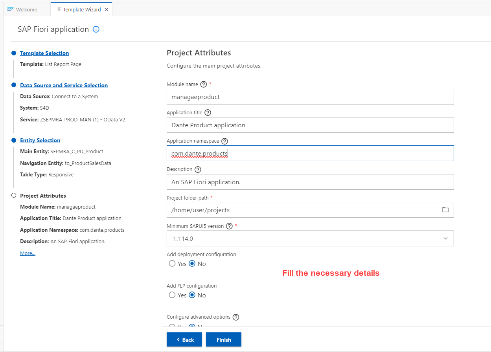

## CAPM - Day 10 - Side by Side extension

# WORK IN PROGRESS - 

</br>

[Side by side extension SAP official reading](https://learning.sap.com/learning-journeys/develop-advanced-extensions-with-sap-cloud-sdk/exploring-side-by-side-extensibility_f2f6f71d-d50c-4a48-b0f9-f5a87f717aa1)

</br>
</br>

### Extension Use case
</br>
</br>

SAP BTP is the main technology platform for doing extension of existing ERP application in any org, 
A main pillar of intelligent enterprise
</br>

1. Intelligent suite - solution like S/4 HANA
2. Intelligent platform - SAP BTP 
3. Intelligent technologies - SAC, RAP, CAP, SAP Build code, SAP Build App, SAP Build Automation, SAP Build Work zone..etc
</br>
</br>

If we want to entend our standard ERP software, What are all the disadvantage of the approach we take
</br>

1. The Extensions have potential to break your standard software
2. Extensions also take longer time to deliver change request
3. Risks for upgrade
4. Contamination of SAP Code 
</br>
</br>

SAP Recommends to build extensions on top of BTP outside the stable core ERP
</br>

1. ERP core software is stable 
2. We can deliver innovation at much faster phase
3. Never cause any problem to sap upgrades becasue The extension is built outside the environment

</br>
</br>

**In-App or Key-User extensibility** are means provided by the SAP product that enables you to extend the apps. For example one may add a new custom field to the UI which is then saved together with the business object instance. It can even be forwarded to follow-up documents in case of process extensibility. Further options of key-user extensibility are own business objects or business logic modifications in pre-defined extension points. This concept applies for cloud software. OnPremise customers have other options to get such kind of enhancements because they have direct access to the code.
</br>
</br>

**Side-by-Side extensibility** refers to enhancements that you create on a different platform (e.g. SAP Cloud Platform) but integrate with your SAP product. As an example, you might react on a certain event in your SAP product, notify your own SCP implementation to handle accordingly. Or you have an own app on SCP that writes data back into the SAP product. The communication works via public APIs in such cases.
</br>
</br>


</br>
</br>


</br>
</br>


</br>
</br>

Before we proceed the cloud connection to ERP system is important it is a pre-requisite for this session 
</br> If cloud connection to On-Premise or ERP is not performed kindly refer this link and establish connection 
</br> [SAP Cloud connection](https://github.com/Octavius-Dante/Tetra_Proxima/tree/main/SAP_Cloud_Connector)
</br> 

</br>
</br>

<details>
<summary> <b>1. Checking the BTP destination details for connected system</b> </summary>
</br>
</br>
Before start building app in BAS btp side we should confirm wheher 
</br>systems are available for connection in destiantion section as shown below
</br>
</br>

</br>
</br>

</br>
</br>

</br>
</br>
</details>


<details>
<summary> <b>2. Accessing on-prem system and checking the ODATA service </b> </summary>
</br>
</br>
Go to tcode /n/iwfnd/maint_services
</br>
</br>

</br>
</br>

Selecting a service which we are going to use for our fiori app 
</br>
</br>

</br>
</br>

Testing the service whether it is supplying data to web
</br>
</br>

</br>
</br>

The data is dipslayed in the web in XML format (Odata service is accessible in web)
</br>
</br>

</br>
</br>

identifying the implemented class in case if we want to make chanegs in ABAP for this exisitng ODATA services
</br> this is a standard demo purpose odata class used in Zservice this SEPMRA_PROD_MAN is available in all S/4 HANA on-premise system
</br> Standard External service : SEPMRA_PROD_MAN - (in case of a Zclass used in service which can be modified as per user convenience)
</br>
</br>

</br>
</br>

</br>
</br>

in the web browser (SEPMRA_PROD_MAN/SEPMRA_C_PD_Product/?$format=json) add this block to the existing link and check the sub category of an odata service
</br>
</br>

</br>
</br>

</br>
</br>

Press F12 in chrome browser and navigate to network section and relaod the page to see the type of odata service (product page is v2)
</br>
</br>

</br>
</br>
</details>


<details>
<summary> <b>3. Registering ERP system in BAS - linking erp to subaccount  </b> </summary>
</br>
</br>

</br>
</br>

</br>
</br>

Some times the available catalog services wont be displayed but since destination connection is shown no connection issue we can proceed 
</br>
</br>

</br>
</br>
</details>


<details>
<summary> <b>4. Build Fiori applicaiton in BAS using Fiori elements template - Scenario 1.0 </b> </summary>
</br>
</br>

<!--Leveraging the power of S/4 HANA in BTP in side by side extension -->
Go to SAP Fiori template (Fiori Open application generator via command palatte) 
</br> menu --> help --> get started  (or)  menu --> view --> command palette    
</br> 
</br>

</br>
</br>


</br>
</br>


</br>
</br>


</br>
</br>


</br>
</br>


</br>
</br>


</br>
</br>


</br>
</br>


</br>
</br>


</br>
</br>


</br>
</br>


</br>
</br>


</br>
</br>


</br>
</br>


</br>
</br>


</br>
</br>


</br>
</br>


</br>
</br>


</br>
</br>
</details>


<details>
<summary> <b>5. making changes to the template built fiori app (annotations.xml) </b> </summary>
</br>
</br>

</br>
</br>

</br>
</br>
</details>

</br>
</br>

</br>
</br>

</br>
</br>

</br>
</br>

</br>
</br>

</br>
</br>


<!--

</br>
</br>

``` cds 
	


``` 

</br>
</br>

</br>
</br>

## MyService.js 
</br>
</br>

```js


```
</br>

</br>
</br>


<details>
<summary> <b> ALL CODE CHANGES - TODAY SESSION </b> </summary>
</br>
</br>

</br>
</br>

</br>
</br>
</details>


-->

</br>
</br>
</br>
</br>
</br>
</br>
</br>
</br>
</br>
</br>


</br>
</br>
</br>
</br>
</br>
</br>
</br>
</br>

# NEXT ------ CAPM - DAY 11 - S4HANA Side by Side

<p align="center"> 
<a href="https://github.com/Octavius-Dante/Tetra_Proxima/tree/main/CAPM-DAY-11"> CAPM DAY 11 - Side by Side extension 2.0</a> 
	
</br>
</br>

#### Previous Sessions
</br>
<!--
- [x] <a href="https://github.com/Octavius-Dante/Tetra_Proxima/tree/main/CAPM-DAY-12"> CAPM Day 12 - Extension CI CD</a>
- [x] <a href="https://github.com/Octavius-Dante/Tetra_Proxima/tree/main/CAPM-DAY-11"> CAPM Day 11 - Side by Side extension 2.0</a>
- [x] <a href="https://github.com/Octavius-Dante/Tetra_Proxima/tree/main/CAPM-DAY-10"> CAPM Day 10 - Side by Side extension 1.0</a>
-->

- [x] <a href="https://github.com/Octavius-Dante/Tetra_Proxima/tree/main/CAPM-DAY-9"> CAPM Day 9 - Serverless Fiori App</a>
- [x] <a href="https://github.com/Octavius-Dante/Tetra_Proxima/tree/main/CAPM-DAY-8"> CAPM Day 8 - CAPM Security XSUAA</a>
- [x] <a href="https://github.com/Octavius-Dante/Tetra_Proxima/tree/main/CAPM-DAY-7"> CAPM Day 7 - HANA and Deployment</a>
- [x] <a href="https://github.com/Octavius-Dante/Tetra_Proxima/tree/main/CAPM-DAY-6"> CAPM Day 6 - Fiori App Draft</a>
- [x] <a href="https://github.com/Octavius-Dante/Tetra_Proxima/tree/main/CAPM-DAY-5"> CAPM Day 5 - Fiori Elements</a>
- [x] <a href="https://github.com/Octavius-Dante/Tetra_Proxima/tree/main/CAPM-DAY-4"> CAPM Day 4 - Generic Handlers</a>
- [x] <a href="https://github.com/Octavius-Dante/Tetra_Proxima/tree/main/CAPM-DAY-3"> CAPM Day 3 - EPM DB and CDS Views</a>
- [x] <a href="https://github.com/Octavius-Dante/Tetra_Proxima/tree/main/CAPM-DAY-2"> CAPM Day 2 - Aspects and Reuse Tables</a>
- [x] <a href="https://github.com/Octavius-Dante/Tetra_Proxima/tree/main/CAPM-DAY-1"> CAPM Day 1 - First CAP App </a>

</br>
</br>

</p>
