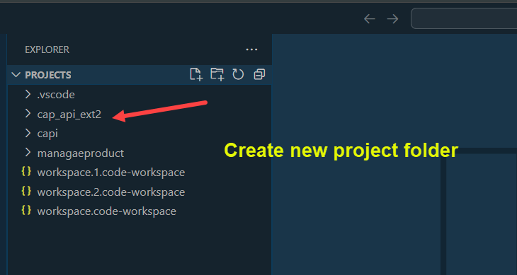
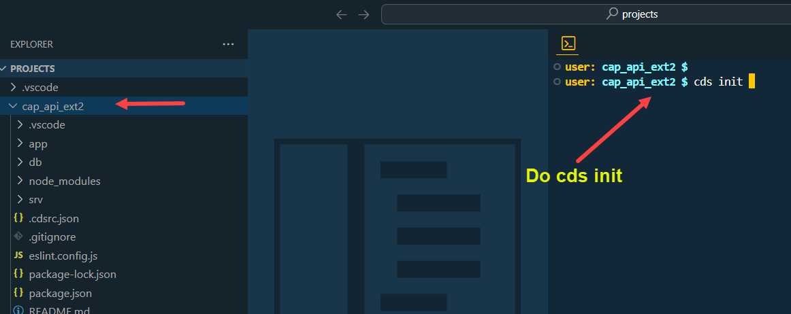
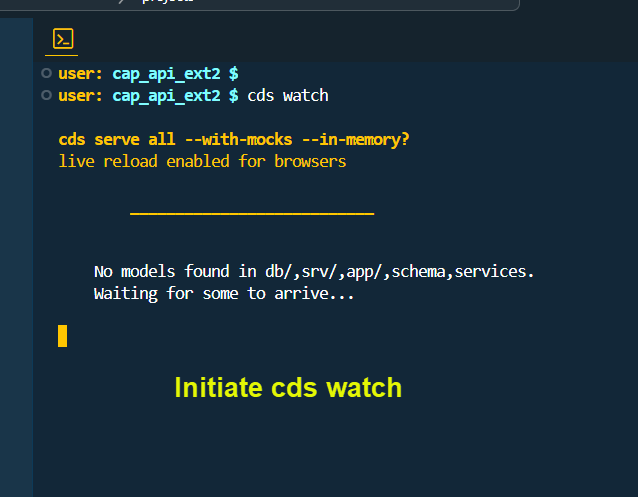
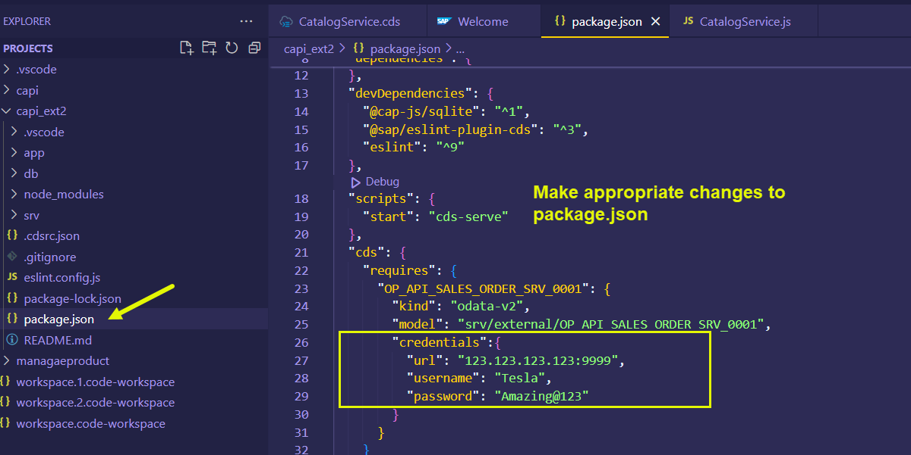
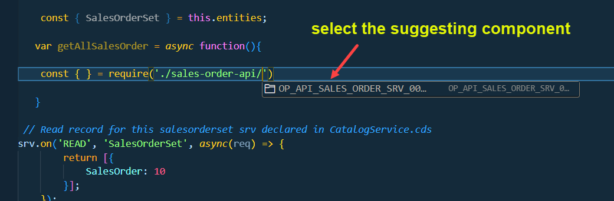

## CAPM - Day 11 - S/4 HANA Side by Side Extension 2.0

# WORK IN PROGRESS -  

</br>
</br>
</br>

### The development in this session is regarding side by side extension using SAP standard API
</br>
</br>


</br>
</br>
The place where we can look for SAP standard API is their official website SAP API Hub : </br>

[SAP API website](https://api.sap.com/) </br></br>


**SAP Business API hub** </br>

SAP Business API hub provides teh docuemntation for all teh publically available APIs for integration with SAP Business solutions e.g.S/4 HANA
</br>We can search APIs for different kinds, view their documentation, attributes and system details and integrate.
</br> example this link shows sales order api : https://api.sap.com/api/OP_API_SALES_ORDER_SRV_0001/resource/Sales_Order_Header </br>
</br>

Pre-requisites</br>

1. Go to the https://api.sap.com and check the avilable APIs
2. Go to the technical specification of the API and download the edmx file
3. Cross check if the same API is acticvated in S/4 HANA usign tcode /n/iwfnd/maint_service
4. Test the service in the browser (or in postman)

</br>
</br>

<details>
<summary> <b> How to Navigate in SAP API Hub website </b> </summary>
</br>
</br>

SAP API business hub is a place for documentaion of the API and details of the entity type and entity sets
</br> and what types of API available in the SAP products ODATA v2, v2, SOAP and release version details 
</br>
</br>
</br></br>
</br> </br>
</br> </br>
</br> </br>

[SAP On premise link](https://api.sap.com/products/SAPS4HANA/overview)</br> </br>

</br> </br>
</br> </br>
</br> </br>
</br> </br>
</br> </br>
</br> </br>
</br> </br>
</br> </br>
</br> </br>
</br> </br>

</br>
</br>
</details>

<!-- </br> </br> </br> </br> -->

</br> </br> 

## Steps for implementing side by side extension using SAP standard API 

</br> </br> 

<details>
<summary> <b> All the steps for developing standard API Extension </b> </summary>
</br>
</br>

1. Create a new capproject and do **cds init**

2. Install Components : </br>
</br>         2.1 Cloud Focundry security - **@sap/xssec, @sap/xsenv, passport**
</br>         2.2 OData V2 adapter - **@sap/cds-odata-v2-adapter-proxy**
</br>         2.3 Serving Odata V2 over Cloud SDK - **@sap-cloud-sdk/odata-v2**
</br>         2.4 To generate service code in node JS, Install Cloud SDK generator module using **@sap-cloud-sdk/generator**

3. Create folder **sales-order-api** in **srv**, Create **service-spec** folder in **srv**

4. Run **cds watch** and drag drop the edmx file to **service-spec** folder it creates an External folder with *.csn file. 

5. Generate the JS code for api calls using sdk generator to our sales-order-api folder using this command
   </br> 
   **npx generate-odata-client --input /home/user/projects/cap_api_ext2/srv/external --outputDir /home/user/projects/cap_api_ext2/srv/sales-order-api** </br> 

   (in VSCode need to give edmx file folder path in input instead of file path)</br> </br> 

6. Add a new **CatalogService.cds** and **CatalogService.js**

7. In **CatalogService.cds** define the service definition by referncing the *.csn file generated based on SAP OData

</br>
</br>
</details>

</br> </br> 

<details>
<summary> <b>1. Access the SAP On-premise system and locate the API  </b> </summary>
</br>
</br>
</br> </br>
</br> </br>

Get the technical name of the API from the SAP API hub page </br> </br>
</br> </br>
</br> </br>


<details>
<summary> API search Method - Filter (Search only implemented API) </summary>
</br>
</br>
</br> </br>
</br> </br>
</br> </br>
</br>
</br>
</details>

<details>
<summary> API search Method - Add service (Search all available API's for implementation) </summary>
</br>
</br>
</br> </br>
</br> </br>
</br> </br>
</br>
</br>
</details>

Now filtering the API based on the business documentation</br> </br>
</br> </br>
</br> </br>
</br> </br>
</br> </br>
</br> </br>
</br> </br>
</br> </br>
</br> </br>
</br>
</br>
</details>

<details>
<summary> <b>2. Developing extension -- Part # 1 -- Edmx import and npm components installation </b> </summary>
</br>
</br>
</br> </br>
</br> </br>
</br> </br>
</br> </br>
</br> </br>
</br> </br>
</br> </br>

Install essential components for the project</br> </br>


```bat
npm install @sap/xssec
npm install @sap/xsenv
npm install passport
npm install @sap/cds-odata-v2-adapter-proxy
npm install @sap-cloud-sdk/odata-v2

```
</br> 

</br> </br>

</br>
</br>
</details>


<details>
<summary> <b>3. Developing extension -- Part # 2 -- Cloud Sdk installation, package.json, CatalogService.js, CatalogService.cds </b> </summary>
</br>
</br>

In last development we fetched data for open service now we are going to fetch data from SAP specifc service 
</bR> SAP has provided something called sap S/4 HANA Cloud sdk 
</br> </br>

<details>
<summary> <b> Method #1 -- implementing Cloud SDK </b> </summary>
</br> </br>
Go to API consumption section of API and follow the instrcutions provided there 
</br> </br>

1. Install Node and npm. We recommend the use of the LTS version.
2. Download the API specification from the Overview -> API Specification section. Choose EDMX format.
3. Store the specification file in your project in the folder resources/service-specs
4. Install the generator by running: npm install @sap-cloud-sdk/generator
5. Generate a typed client by running the generator: npx generate-odata-client --input resources/service-specs --outputDir src/generated
</br> </br>
</br> </br>
</br> </br>
</details>

<details>
<summary> <b> Method #2 -- implementing Cloud SDK </b> </summary>
</br> </br>
Go to this link https://sap.github.io/cloud-sdk/docs/js/getting-started and refer the guides provided there
</br> </br>
</br> </br>
</br> </br>
</br> </br>
</details>
</br> </br>


Make changes to package.json file for local testing purpose add credentials of S/4 HANA On-Premise system (ABAP instance port)</br> </br>

**SAP logon on pad - to get IP address**
</br> </br>
</br> </br>

**Go to Tcode SMICM - (goto->service) to get Port Number**
</br> </br>
</br> </br>
</br> </br>

</br> </br>

**package.json** # 1
</br> 

```json

{
  "name": "capi_ext2",
  "version": "1.0.0",
  "description": "A simple CAP project.",
  "repository": "<Add your repository here>",
  "license": "UNLICENSED",
  "private": true,
  "dependencies": {
    "@sap-cloud-sdk/generator": "^3.15.0",
    "@sap-cloud-sdk/odata-v2": "^3.15.0",
    "@sap/cds": "^7.9.1",
    "@sap/cds-dk": "^7.9.1",
    "@sap/cds-odata-v2-adapter-proxy": "^1.9.21",
    "@sap/xsenv": "^5.1.0",
    "@sap/xssec": "^3.6.1",
    "express": "^4",
    "passport": "^0.7.0"
  },
  "devDependencies": {
    "@cap-js/sqlite": "^1",
    "@sap/eslint-plugin-cds": "^3",
    "eslint": "^9"
  },
  "scripts": {
    "start": "cds-serve"
  },
  "cds": {
    "requires": {
      "OP_API_SALES_ORDER_SRV_0001": {
        "kind": "odata-v2",
        "model": "srv/external/OP_API_SALES_ORDER_SRV_0001"
      }
    }
  }
}

```


As mentioned in official API website we perform the steps [API link](https://api.sap.com/api/OP_API_SALES_ORDER_SRV_0001/resource/) </br> </br>
</br> </br>


The recommended steps from the website suggest to use the following component 
</br> </br>

**item -1 : Install Cloud generator component of Cloud SDK** </br></br>

```bat
npm install @sap-cloud-sdk/generator

```

**item -2 : Generate a Client Using the Command Line Interface** </br></br>

```bat
// Command with Syntax

npx generate-odata-client --input path/to/your/service-specifications --outputDir path/to/store/generated/modulesnpm install @sap-cloud-sdk/generator

// Command with actual values 
// -- input - EDMX folder path from (\srv\external) folder | -- Output - sales-order-api folder (\srv\sales-order-api)

npx generate-odata-client --input /home/user/projects/cap_api_ext2/srv/external --outputDir /home/user/projects/cap_api_ext2/srv/sales-order-api 

```
</br> </br>
</br> </br>
</br> </br>

As suggested in API documentation page make code changes</br> </br>
</br> </br>


**CatalogService.cds** sample code # 1
</br>

```cds

namespace salesorderext.srv;

using { OP_API_SALES_ORDER_SRV_0001 as external} from './external/OP_API_SALES_ORDER_SRV_0001';

service CatalogService @(path:'CatalogService') {

    entity SalesOrderSet as projection on external.A_SalesOrder;
    
}

```

</br>

**CatalogService.js** sample code # 1 </br> 

```js

const cds = require('@sap/cds');

module.exports = cds.service.impl(async function(srv){

    const { SalesOrderSet } = this.entities;

 // Read record for this salesorderset srv declared in CatalogService.cds
srv.on('READ', 'SalesOrderSet', async(req) => {
        return [{
            SalesOrder: 10
        }]; 
    });
});


```

</br> </br> 

Execute the program using cds watch and test </br> </br>
</br> </br>
</br> </br>

</br>
</br>
</details>

<details>
<summary> <b>3. Developing extension -- Part # 3 -- defining further logic in CatalogService.js & CatalogService.cds </b> </summary>
</br>
</br>

Make code changes in **CatalogService.js**  # 2 </br> </br>

```js

const cds = require('@sap/cds');

module.exports = cds.service.impl(async function(srv){

    const { SalesOrderSet } = this.entities;

   var getAllSalesOrder = async function(){
// the const defining here requires to be picked fromt the component OP_API_SALES_ORDER_SRV_0001
    const { opApiSalesOrderSrv0001 } = require ('./sales-order-api/OP_API_SALES_ORDER_SRV_0001')

   }

 // Read record for this salesorderset srv declared in CatalogService.cds
srv.on('READ', 'SalesOrderSet', async(req) => {
        return [{
            SalesOrder: 10
        }]; 
    });
});

```

</br> </br> 
</br> </br>
</br> </br>
</br> </br>
</br> </br>

Perform ctrl + click on the Sales api constant it will take you to the next window
</br> </br>
</br> </br>

The above mentioned process remains the same for any SAP API implementation in CAP 
</br> </br>
</br> 

lets make further code changes to **CatalogService.js**
</br> </br>

Make code changes in **CatalogService.js**  # 3 </br> </br>

Addedd system details to connect to S/4 HANA On-premise
</br>

```js

const cds = require('@sap/cds');

module.exports = cds.service.impl(async function(srv){

    const { SalesOrderSet } = this.entities;

   var getAllSalesOrders = async function(){

    const { opApiSalesOrderSrv0001 } = require('./sales-order-api/OP_API_SALES_ORDER_SRV_0001');
    const { salesOrderApi } = opApiSalesOrderSrv0001();
    const dataSalesData = await salesOrderApi.requestBuilder().getAll().top(5)
    .execute({
        // For BTP deployment prod
        //destinationName: "S4HANA"  

        // for local testing 
        "url": "123.456.789.123:9999",
        "username": "Tesla",
        "password": "Amazing@111"        

});
    return dataSalesData;

   };

 // Read record for this salesorderset srv declared in CatalogService.cds
srv.on('READ', 'SalesOrderSet', async(req) => {
        return await getAllSalesOrders().then(
            salesOrderTable => {
                var aRecord = [];
                salesOrderTable.forEach(element => {
                    var item = {};
                    item.SalesOrder = element.salesOrder;
                    item.SalesOrganization = element.SalesOrganization;
                    item.SalesOrderType = element.SalesOrderType;
                    item.SalesOrderDate = element.SalesOrderDate;
                    item.SoldToParty = element.SoldToParty;
                    item.OverallDeliveryStatus = element.OverallDeliveryStatus;
                    item.Material = element.toItem.Material;
                    item.OrderQuantityUnit = element.toItem.OrderQuantityUnit;
                    item.RequestedQuantity = element.toItem.RequestedQuantity;
                    item.NetAmount = element.toItem.NetAmount;
                    aRecord.push(item);
                });
                return aRecord;
            }
        );
    });
});
```
</br> </br>


<details>
<summary> Navigate the API for locating <b>Request builder fucntion</b> // For understanding </summary>
</br>
</br>

</br> </br>
</br> </br>
</br> </br>
</br> </br>

This request builder communicates to SAP system and we will be able to call functions from SAP odata service

</br>
</br>
</details>

</br> </br>

Make code changes in **CatalogService.js**  # 4 -- Final code </br> </br>

```js

const cds = require("@sap/cds");

// import { opApiSalesOrderSrv0001 } from './sales-order-api/OP_API_SALES_ORDER_SRV_0001';

module.exports = cds.service.impl(async function(srv){

    const { MySalesOrder } = this.entities;

   var getAllSalesOrders = async function(){

    const { opApiSalesOrderSrv0001 } = require('./sales-order-api/OP_API_SALES_ORDER_SRV_0001');
    const { salesOrderApi } = opApiSalesOrderSrv0001();
    // const dataSalesData = await salesOrderApi.requestBuilder().getAll().top(5)
    const dataSalesData = await salesOrderApi.requestBuilder().getAll().top(100)
        .select(
            salesOrderApi.schema.SALES_ORDER,
            salesOrderApi.schema.SALES_ORDER_TYPE,
            salesOrderApi.schema.SALES_ORGANIZATION,
            salesOrderApi.schema.SOLD_TO_PARTY,
            salesOrderApi.schema.PAYMENT_METHOD,
            salesOrderApi.schema.TO_ITEM
        )
    .execute({
        // For BTP deployment prod
        //destinationName: "S4HANA"  

        // for local testing 
        "url": "123.456.789.123:9999",
        "username": "Tesla",
        "password": "Amazing@111"        
    });
    return dataSalesData;

   };

 // Read record for this salesorderset srv declared in CatalogService.cds
srv.on('READ', MySalesOrder, async (request) => {
        return await getAllSalesOrders().then(
            salesOrderTable => {
                var aRecord = [];
// what data we are getting from system we can print it here to diagnose the issues                
                console.log(salesOrderTable);
                salesOrderTable.forEach(element => {
                    var item = {};
                    item.SalesOrder = element.salesOrder;
                    item.SalesOrganization = element.salesOrganization;
                    item.SalesOrderType = element.salesOrderType;
                    item.SalesOrderDate = element.salesOrderDate;
                    item.SoldToParty = element.soldToParty;
                    item.OverallDeliveryStatus = element.overallDeliveryStatus;
// if item table contain values assign it                    
                    if(element.toItem[0]){
                        item.Material = element.toItem[0].material;
                        item.OrderQuantityUnit = element.toItem[0].orderQuantityUnit;
                        item.RequestedQuantity = element.toItem[0].requestedQuantity;
                        item.NetAmount = element.toItem[0].netAmount;
// if item table doesnt contain values show empty
                    }else{
                        item.Material = "";
                        item.OrderQuantityUnit = "";
                        item.RequestedQuantity = "";
                        item.NetAmount = "";
                    }
                    aRecord.push(item);
                });
                return aRecord;
            }
        );
    });
});

```

</br> </br>
</br> </br>

The next step is building a Fiori app using Fiori open application generatoer, that is same as all the other previous sections can refer it for understanding, once odata service is exposed, it is used for building Fiori app  

<!-- 
</br> </br>
</br> </br>
</br> </br>
</br> </br>
</br> </br>
</br> </br>
</br> </br>
</br> </br>
</br> </br>
</br> </br>
</br> </br>
</br> </br>
</br> </br>
</br> </br>
</br> </br>
</br> </br>
</br> </br>
</br> </br>
</br> </br>
</br> </br>
</br> </br>
</br> </br>
</br> </br>
</br> </br>
</br> </br>
</br> </br>
</br> </br>
</br> </br>
</br> </br>
</br> </br>
</br> </br>
</br> </br>
</br> </br>
</br> </br>
</br> </br>
</br> </br>
</br> </br>
</br> </br>
</br> </br>
</br> </br>
</br> </br>
</br> </br> -->

</br> </br>

</br>
</br>
</details>


</br> </br>


<!-- 

<details>
<summary> <b> ALL CODE CHANGES - TODAY SESSION </b> </summary>
</br>
</br>
</br></br>

</br></br>
</br>
</br>
</details>
-->

</br>
</br>
</br>
</br>
</br>
</br>
</br>
</br>
</br>
</br>


</br>
</br>
</br>
</br>
</br>
</br>
</br>
</br>

# NEXT ------ CAPM - DAY 12 - CI/CD Pipeline

<p align="center"> 
<a href="https://github.com/Octavius-Dante/Tetra_Proxima/tree/main/CAPM-DAY-12"> CAPM DAY 12 - CI/CD Pipeline</a> 
	
</br>
</br>

#### Previous Sessions
</br>
<!--
- [x] <a href="https://github.com/Octavius-Dante/Tetra_Proxima/tree/main/CAPM-DAY-12"> CAPM Day 12 - Extension CI CD</a>
- [x] <a href="https://github.com/Octavius-Dante/Tetra_Proxima/tree/main/CAPM-DAY-11"> CAPM Day 11 - Side by Side extension 2.0</a>
-->


- [x] <a href="https://github.com/Octavius-Dante/Tetra_Proxima/tree/main/CAPM-DAY-10"> CAPM Day 10 - S/4 HANA Side by Side Extension 1.0</a>
- [x] <a href="https://github.com/Octavius-Dante/Tetra_Proxima/tree/main/CAPM-DAY-9"> CAPM Day 9 - Serverless Fiori App</a>
- [x] <a href="https://github.com/Octavius-Dante/Tetra_Proxima/tree/main/CAPM-DAY-8"> CAPM Day 8 - CAPM Security XSUAA</a>
- [x] <a href="https://github.com/Octavius-Dante/Tetra_Proxima/tree/main/CAPM-DAY-7"> CAPM Day 7 - HANA and Deployment</a>
- [x] <a href="https://github.com/Octavius-Dante/Tetra_Proxima/tree/main/CAPM-DAY-6"> CAPM Day 6 - Fiori App Draft</a>
- [x] <a href="https://github.com/Octavius-Dante/Tetra_Proxima/tree/main/CAPM-DAY-5"> CAPM Day 5 - Fiori Elements</a>
- [x] <a href="https://github.com/Octavius-Dante/Tetra_Proxima/tree/main/CAPM-DAY-4"> CAPM Day 4 - Generic Handlers</a>
- [x] <a href="https://github.com/Octavius-Dante/Tetra_Proxima/tree/main/CAPM-DAY-3"> CAPM Day 3 - EPM DB and CDS Views</a>
- [x] <a href="https://github.com/Octavius-Dante/Tetra_Proxima/tree/main/CAPM-DAY-2"> CAPM Day 2 - Aspects and Reuse Tables</a>
- [x] <a href="https://github.com/Octavius-Dante/Tetra_Proxima/tree/main/CAPM-DAY-1"> CAPM Day 1 - First CAP App </a>

</br>
</br>

</p>
