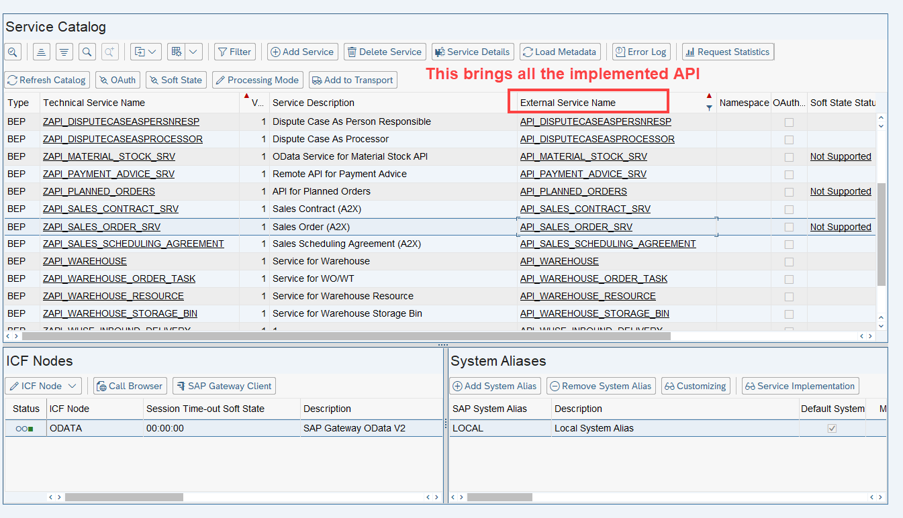
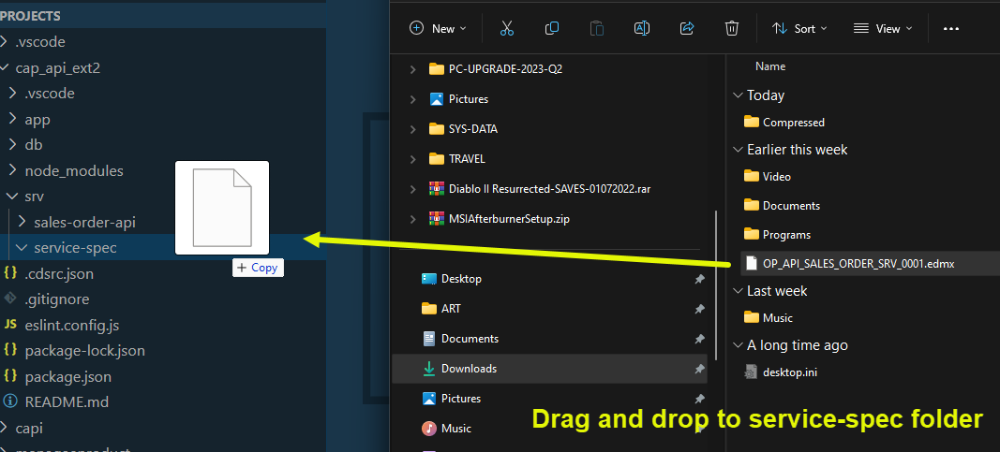
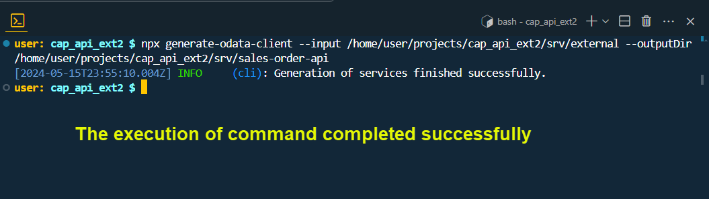

## CAPM - Day 11 - S4HANA Side by Side

# WORK IN PROGRESS -  

</br>
</br>
</br>

### The development in this session is regarding side by side extension using SAP standard API
</br>
</br>


</br>
</br>
The place where we can look for SAP standard API is their official website SAP API Hub : </br>

[SAP API website](https://api.sap.com/) </br></br>


**SAP Business API hub** </br>

SAP Business API hub provides teh docuemntation for all teh publically available APIs for integration with SAP Business solutions e.g.S/4 HANA
</br>We can search APIs for different kinds, view their documentation, attributes and system details and integrate.
</br> example this link shows sales order api : https://api.sap.com/api/OP_API_SALES_ORDER_SRV_0001/resource/Sales_Order_Header </br>
</br>

Pre-requisites</br>

1. Go to the https://api.sap.com and check the avilable APIs
2. Go to the technical specification of the API and download the edmx file
3. Cross check if the same API is acticvated in S/4 HANA usign tcode /n/iwfnd/maint_service
4. Test the service in the browser (or in postman)

</br>
</br>

<details>
<summary> <b> How to Navigate in SAP API Hub website </b> </summary>
</br>
</br>

SAP API business hub is a place for documentaion of the API and details of the entity type and entity sets
</br> and what types of API available in the SAP products ODATA v2, v2, SOAP and release version details 
</br>
</br>
</br></br>
</br> </br>
</br> </br>
</br> </br>

[SAP On premise link](https://api.sap.com/products/SAPS4HANA/overview)</br> </br>

</br> </br>
</br> </br>
</br> </br>
</br> </br>
</br> </br>
</br> </br>
</br> </br>
</br> </br>
</br> </br>

</br>
</br>
</details>

<!-- </br> </br> </br> </br> -->

</br> </br> 

## Steps for implementing side by side extension using SAP standard API 

</br> </br> 

<details>
<summary> <b> All the steps for developing standard API Extension </b> </summary>
</br>
</br>

1. Create a new capproject and do **cds init**
2. Run **cds watch** and import the edmx file to the **srv** folder
3. Add a new **CatalogService.cds** and **CatalogService.js**

</br>
</br>
</details>

</br> </br> 

<details>
<summary> <b>1. Access the SAP On-premise system and locate the API  </b> </summary>
</br>
</br>
</br> </br>
</br> </br>

Get the technical name of the API from the SAP API hub page </br> </br>
</br> </br>
</br> </br>


<details>
<summary> API search Method - Filter (Search only implemented API) </summary>
</br>
</br>
</br> </br>
</br> </br>
</br> </br>
</br>
</br>
</details>

<details>
<summary> API search Method - Add service (Search all available API's for implementation) </summary>
</br>
</br>
</br> </br>
</br> </br>
</br> </br>
</br>
</br>
</details>

Now filtering the API based on the business documentation</br> </br>
</br> </br>
</br> </br>
</br> </br>
</br> </br>
</br> </br>
</br> </br>
</br> </br>
</br> </br>
</br>
</br>
</details>

<details>
<summary> <b>2. Developing the extension app - PART # 1</b> </summary>
</br>
</br>
</br> </br>
</br> </br>
</br> </br>
</br> </br>
</br> </br>
</br> </br>
</br>
</br>
</details>

<!-- 

<details>
<summary> <b> ALL CODE CHANGES - TODAY SESSION </b> </summary>
</br>
</br>
</br>
</br>
</br>
</br>
</details>


</br> </br>
</br> </br>
</br> </br>
</br> </br>
</br> </br>
</br> </br>
</br> </br>
</br> </br>
</br> </br>
</br> </br>
</br> </br>
</br> </br>
</br> </br>
</br> </br>
</br> </br>
</br> </br>
</br> </br>
</br> </br>
</br> </br>
</br> </br>
</br> </br>
</br> </br>
</br> </br>
</br> </br>
</br> </br>
</br> </br>
</br> </br>
</br> </br>
</br> </br>
</br> </br>
</br> </br>
</br> </br>
</br> </br>
</br> </br>
</br> </br>
</br> </br>
</br> </br>
</br> </br>
</br> </br>
</br> </br>
</br> </br>
</br> </br>
</br> </br>
</br> </br>
</br> </br>
</br> </br>
</br> </br>
</br> </br>
</br> </br>
</br> </br>
</br> </br>
</br> </br>
</br> </br>
</br> </br>
</br> </br>
</br> </br>
</br> </br>
</br> </br>
</br> </br>
</br> </br>
</br> </br>
</br> </br>
</br> </br>
</br> </br>
</br> </br>
</br> </br>
</br> </br>
</br> </br>
</br> </br>
</br> </br>
</br> </br>
</br> </br>
</br> </br>
</br> </br>
</br> </br>
</br> </br>
</br> </br>
</br> </br>
</br> </br>
</br> </br>
</br> </br>
</br> </br>
</br> </br>
</br> </br>
</br> </br>
</br> </br>
</br> </br>
</br> </br>
</br> </br>
</br> </br>
</br> </br>
</br> </br>
</br> </br>
</br> </br>
</br> </br>
</br> </br>
</br> </br>
</br> </br>
</br> </br>
</br> </br>
</br> </br>
</br> </br>
</br> </br>
</br> </br>
</br> </br>
</br> </br>
</br> </br>
</br> </br>
</br> </br>
</br> </br>
</br> </br>
</br> </br>
</br> </br>
</br> </br>
</br> </br>
</br> </br>
</br> </br>
</br> </br>
</br> </br>
</br> </br>
</br> </br>
</br> </br>
</br> </br>
</br> </br>
</br> </br>
</br> </br>
</br> </br>
</br> </br>
</br> </br>
</br> </br>
</br> </br>
</br> </br>
</br> </br>
</br> </br>
</br> </br>
</br> </br>
</br> </br>
</br> </br>
</br> </br>
</br> </br>
</br> </br>
</br> </br>
</br> </br>
</br> </br>
</br> </br>
</br> </br>
</br> </br>
</br> </br>
</br> </br>
</br> </br>
</br> </br>
</br> </br>
</br> </br>
</br> </br>
</br> </br>
</br> </br>
</br> </br>
</br> </br>
</br> </br>
</br> </br>
</br> </br>
</br> </br>
</br> </br>
</br> </br>
</br> </br>
</br> </br>
</br> </br>
</br> </br>
</br> </br>
</br> </br> -->


<!--

</br>
</br>

``` cds 
	


``` 

</br>
</br>

</br>
</br>

## MyService.js 
</br>
</br>

```js


```
</br>

</br>
</br>


<details>
<summary> <b> ALL CODE CHANGES - TODAY SESSION </b> </summary>
</br>
</br>

</br>
</br>

</br>
</br>
</details>


-->

</br>
</br>
</br>
</br>
</br>
</br>
</br>
</br>
</br>
</br>


</br>
</br>
</br>
</br>
</br>
</br>
</br>
</br>

# NEXT ------ CAPM - DAY 12 - Extension CI/CD

<p align="center"> 
<a href="https://github.com/Octavius-Dante/Tetra_Proxima/tree/main/CAPM-DAY-12"> CAPM DAY 12 - Extension CI/CD</a> 
	
</br>
</br>

#### Previous Sessions
</br>
<!--
- [x] <a href="https://github.com/Octavius-Dante/Tetra_Proxima/tree/main/CAPM-DAY-12"> CAPM Day 12 - Extension CI CD</a>
- [x] <a href="https://github.com/Octavius-Dante/Tetra_Proxima/tree/main/CAPM-DAY-11"> CAPM Day 11 - Side by Side extension 2.0</a>
-->


- [x] <a href="https://github.com/Octavius-Dante/Tetra_Proxima/tree/main/CAPM-DAY-10"> CAPM Day 10 - Side by Side extension 1.0</a>
- [x] <a href="https://github.com/Octavius-Dante/Tetra_Proxima/tree/main/CAPM-DAY-9"> CAPM Day 9 - Serverless Fiori App</a>
- [x] <a href="https://github.com/Octavius-Dante/Tetra_Proxima/tree/main/CAPM-DAY-8"> CAPM Day 8 - CAPM Security XSUAA</a>
- [x] <a href="https://github.com/Octavius-Dante/Tetra_Proxima/tree/main/CAPM-DAY-7"> CAPM Day 7 - HANA and Deployment</a>
- [x] <a href="https://github.com/Octavius-Dante/Tetra_Proxima/tree/main/CAPM-DAY-6"> CAPM Day 6 - Fiori App Draft</a>
- [x] <a href="https://github.com/Octavius-Dante/Tetra_Proxima/tree/main/CAPM-DAY-5"> CAPM Day 5 - Fiori Elements</a>
- [x] <a href="https://github.com/Octavius-Dante/Tetra_Proxima/tree/main/CAPM-DAY-4"> CAPM Day 4 - Generic Handlers</a>
- [x] <a href="https://github.com/Octavius-Dante/Tetra_Proxima/tree/main/CAPM-DAY-3"> CAPM Day 3 - EPM DB and CDS Views</a>
- [x] <a href="https://github.com/Octavius-Dante/Tetra_Proxima/tree/main/CAPM-DAY-2"> CAPM Day 2 - Aspects and Reuse Tables</a>
- [x] <a href="https://github.com/Octavius-Dante/Tetra_Proxima/tree/main/CAPM-DAY-1"> CAPM Day 1 - First CAP App </a>

</br>
</br>

</p>
