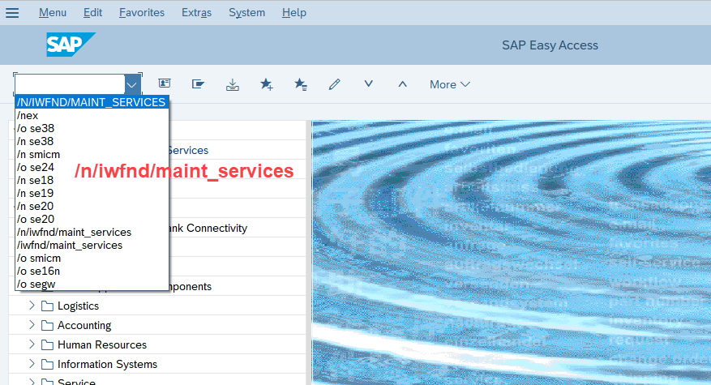
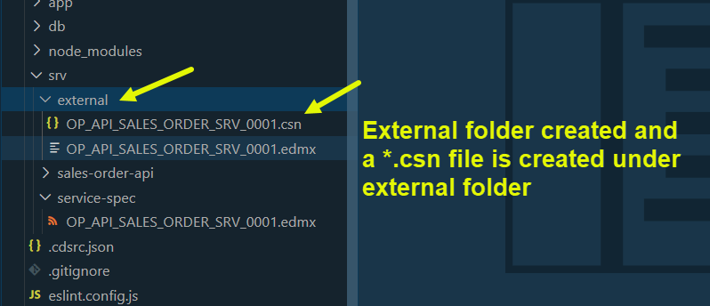
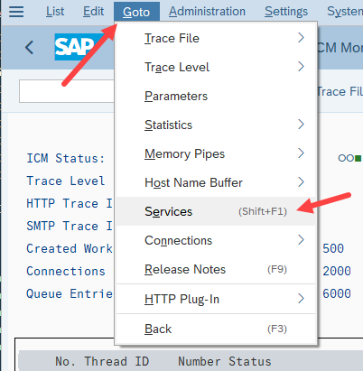

## CAPM - Day 11 - S/4 HANA Side by Side Extension 2.0

# WORK IN PROGRESS -  

</br>
</br>
</br>

### The development in this session is regarding side by side extension using SAP standard API
</br>
</br>


</br>
</br>
The place where we can look for SAP standard API is their official website SAP API Hub : </br>

[SAP API website](https://api.sap.com/) </br></br>


**SAP Business API hub** </br>

SAP Business API hub provides teh docuemntation for all teh publically available APIs for integration with SAP Business solutions e.g.S/4 HANA
</br>We can search APIs for different kinds, view their documentation, attributes and system details and integrate.
</br> example this link shows sales order api : https://api.sap.com/api/OP_API_SALES_ORDER_SRV_0001/resource/Sales_Order_Header </br>
</br>

Pre-requisites</br>

1. Go to the https://api.sap.com and check the avilable APIs
2. Go to the technical specification of the API and download the edmx file
3. Cross check if the same API is acticvated in S/4 HANA usign tcode /n/iwfnd/maint_service
4. Test the service in the browser (or in postman)

</br>
</br>

<details>
<summary> <b> How to Navigate in SAP API Hub website </b> </summary>
</br>
</br>

SAP API business hub is a place for documentaion of the API and details of the entity type and entity sets
</br> and what types of API available in the SAP products ODATA v2, v2, SOAP and release version details 
</br>
</br>
</br></br>
</br> </br>
</br> </br>
</br> </br>

[SAP On premise link](https://api.sap.com/products/SAPS4HANA/overview)</br> </br>

</br> </br>
</br> </br>
</br> </br>
</br> </br>
</br> </br>
</br> </br>
</br> </br>
</br> </br>
</br> </br>
</br> </br>

</br>
</br>
</details>

<!-- </br> </br> </br> </br> -->

</br> </br> 

## Steps for implementing side by side extension using SAP standard API 

</br> </br> 

<details>
<summary> <b> All the steps for developing standard API Extension </b> </summary>
</br>
</br>

1. Create a new capproject and do **cds init**
2. Run **cds watch** and drag drop the edmx file to the **srv** folder. 
</br> Alternative way without cds watch -- just drag and drop and then use command <b>cds import</b> PATH_OF_EDMX

3. Add a new **CatalogService.cds** and **CatalogService.js**
4. S/4 HANA Clous sdk is SAP's portfolio of all the type safe API's (Node modules) to communicate to SAP APIS's in specific api page look for **(Cloud SDK) or (API consumption)** and follow the steps  (OR)

5. Install this **@sap/cloud-sdk-vdm-sales-order-service** node module to the project .
6. Add the configuration to test our api locally in **package.json**

</br>
</br>
</details>

</br> </br> 

<details>
<summary> <b>1. Access the SAP On-premise system and locate the API  </b> </summary>
</br>
</br>
</br> </br>
</br> </br>

Get the technical name of the API from the SAP API hub page </br> </br>
</br> </br>
</br> </br>


<details>
<summary> API search Method - Filter (Search only implemented API) </summary>
</br>
</br>
</br> </br>
</br> </br>
</br> </br>
</br>
</br>
</details>

<details>
<summary> API search Method - Add service (Search all available API's for implementation) </summary>
</br>
</br>
</br> </br>
</br> </br>
</br> </br>
</br>
</br>
</details>

Now filtering the API based on the business documentation</br> </br>
</br> </br>
</br> </br>
</br> </br>
</br> </br>
</br> </br>
</br> </br>
</br> </br>
</br> </br>
</br>
</br>
</details>

<details>
<summary> <b>2. Developing extension -- Part # 1 -- Edmx import and defining catalog service</b> </summary>
</br>
</br>
</br> </br>
</br> </br>
</br> </br>
</br> </br>
</br> </br>
</br> </br>
</br> </br>
</br> </br>
</br> </br>
</br> </br>

**ServiceCatalog.cds** sample code # 1
 </br>

```cds

namespace salesorderext.srv;

using { OP_API_SALES_ORDER_SRV_0001 as external} from './external/OP_API_SALES_ORDER_SRV_0001';

service CatalogService @(path:'CatalogService') {

    entity SalesOrderSet as projection on external.A_SalesOrder{

        key SalesOrder,
        SalesOrganization,
        SalesOrderType,
        SalesOrderDate,
        SoldToParty,
        OverallDeliveryStatus,
        to_Item.Material as Material,
        to_Item.OrderQuantityUnit as OrderQuantityUnit,
        to_Item.NetAmount as NetAmount
    };
    
}


```
</br> </br>

</br>
</br>
</details>


<details>
<summary> <b>3. Developing extension -- Part # 2 -- Cloud Sdk installation and package.json + service.js</b> </summary>
</br>
</br>

In last development we fetched data for open service now we are going to fetch data from SAP specifc service 
</bR> SAP has provided something called sap S/4 HANA Cloud sdk 
</br> </br>

<details>
<summary> <b> Method #1 -- implementing Cloud SDK </b> </summary>
</br> </br>
Go to API consumption section of API and follow the instrcutions provided there 
</br> </br>

1. Install Node and npm. We recommend the use of the LTS version.
2. Download the API specification from the Overview -> API Specification section. Choose EDMX format.
3. Store the specification file in your project in the folder resources/service-specs
4. Install the generator by running: npm install @sap-cloud-sdk/generator
5. Generate a typed client by running the generator: npx generate-odata-client --input resources/service-specs --outputDir src/generated
</br> </br>
</br> </br>
</br> </br>
</details>

<details>
<summary> <b> Method #2 -- implementing Cloud SDK </b> </summary>
</br> </br>
Go to this link https://sap.github.io/cloud-sdk/docs/js/getting-started and refer the guides provided there
</br> </br>
</br> </br>
</br> </br>
</br> </br>
</details>
</br> </br>

Go to **npmjs.com** and search for **@sap/cloud-sdk-vdm-sales** the page will suggest many choose the appropriate one.</br> </br>
</br> </br>
</br> </br>
</br> </br>

```bat
npm install @sap/cloud-sdk-vdm-sales-order-service
npm install @sap-cloud-sdk/core
npm install @sap-cloud-sdk/odata-v2
npm install @sap-cloud-sdk/generator
```
</br> 

Make changes to package.json file for local testing purpose add credentials</br> </br>
</br> </br>

```json

{
  "name": "capi_ext2",
  "version": "1.0.0",
  "description": "A simple CAP project.",
  "repository": "<Add your repository here>",
  "license": "UNLICENSED",
  "private": true,
  "dependencies": {
    "@sap-cloud-sdk/core": "^1.54.2",
    "@sap-cloud-sdk/odata-v2": "^3.15.0",
    "@sap/cds": "^7.9.1",
    "@sap/cds-dk": "^7.9.1",
    "@sap/cloud-sdk-vdm-sales-order-service": "^2.1.0",
    "express": "^4"
  },
  "devDependencies": {
    "@cap-js/sqlite": "^1",
    "@sap/eslint-plugin-cds": "^3",
    "eslint": "^9"
  },
  "scripts": {
    "start": "cds-serve"
  },
  "cds": {
    "requires": {
      "OP_API_SALES_ORDER_SRV_0001": {
        "kind": "odata-v2",
        "model": "srv/external/OP_API_SALES_ORDER_SRV_0001",
        "credentials": {
          "url": "123.123.123.123:9999",
          "username": "Tesla",
          "password": "Amazing@123"
        }
      }
    }
  }
}


```
</br> </br>

Make code changes in **CatalogService.js** 
</br> </br>

```js

const cds = require('@sap/cds');

module.exports = cds.service.impl(async function(){

    const { SalesOrderSet } = cds.entities;
    const { SalesOrder, SalesOrderItem } = require('@sap/cloud-sdk-vdm-sales-order-service');

})

```
</br> </br>

</br> </br>
</br> </br>
</br> </br>

Make aadditional code changes to **CatalogService.js** as shown below</br> </br>

```js

const cds = require('@sap/cds');

module.exports = cds.service.impl(async function(srv){

    const { SalesOrderSet } = cds.entities;
    const { SalesOrder, SalesOrderItem } = require('@sap/cloud-sdk-vdm-sales-order-service');

    // Requesting API to get all sales order from SAP S/4 HANA system

    function getAllSalesOrders() {
        return SalesOrder.requestBuilder().getAll().select(
            SalesOrder.SALES_ORDER,
            SalesOrder.SALES_ORGANIZATION,
            SalesOrder.SALES_ORDER_TYPE,
            SalesOrder.SALES_ORDER_DATE,
            SalesOrder.SOLD_TO_PARTY,
            SalesOrder.OVERALL_TOTAL_DELIVERY_STATUS,
            SalesOrder.TO_ITEM.select(
                SalesOrderItem.MATERIAL,
                SalesOrderItem.REQUESTED_QUANTITY_UNIT,
                SalesOrderItem.NET_AMOUNT)
        ).execute();
    } 
// // // Read record for this salesorderset srv declared in CatalogService.cds
    srv.on('READ', 'SalesOrderSet', async(req) => {
        var aRecords = [];
        return await getAllSalesOrders().then(SalesOrdersTable => {
// similar like loop at itab in abap
            SalesOrdersTable.forEach(element => {
                var line = {};
                line.SalesOrder = element.SalesOrder;
                line.SalesOrganization = element.SalesOrganization;
                line.SalesOrderType = element.SalesOrderType;
                line.SalesOrderDate = element.SalesOrderDate;
                line.SoldToParty = element.SoldToParty;
                line.OverallDeliveryStatus = element.OverallDeliveryStatus;
// picking record from deep entity and assignign it to our structure
// deep entity to flat entity 
// flat entity = assigned from deep entity                 
                line.Material = element.to_Item.Material;
                line.OrderQuantityUnit = element.to_Item.OrderQuantityUnit;
                line.NetAmount = element.to_Item.NetAmount;
// push it in the records                 
                aRecords.push(line);                
            }); 
            return aRecords;                       
        });
    });

})

```
</br> </br>

when executed this using **cds watch** encountered an error as shown below </br> </br>
</br> </br>

once in a while SAP makes chanegs to framewrok or node module components so it wont work, 
</br> so when stuck with issues like this need to follow steps as recommended
</br> in this page - follow the blog and go through the guided steps
</br> </br>


Go through this link https://sap.github.io/cloud-sdk/docs/js/features/odata/generate-client and refer the guide</br> </br>
</br> </br>


</br> </br>
</br> </br>
</br> </br>
</br> </br>
</br> </br>
</br> </br>
</br> </br>
</br> </br>
</br> </br>
</br> </br>
</br> </br>
</br> </br>
</br> </br>
</br> </br>
</br> </br>
</br> </br>
</br> </br>
</br> </br>
</br> </br>
</br> </br>
</br> </br>
</br> </br>
</br> </br>
</br> </br>
</br> </br>
</br> </br>
</br> </br>
</br> </br>
</br> </br>
</br> </br>
</br> </br>
</br> </br>
</br> </br>
</br> </br>
</br> </br>
</br> </br>
</br> </br>
</br> </br>
</br> </br>
</br> </br>
</br> </br>
</br> </br>
</br> </br>
</br> </br>
</br> </br>
</br> </br>
</br> </br>
</br> </br>
</br> </br>
</br> </br>
</br> </br>
</br> </br>
</br> </br>
</br> </br>


</br> </br>

</br>
</br>
</details>


</br> </br>


<!-- 

<details>
<summary> <b> ALL CODE CHANGES - TODAY SESSION </b> </summary>
</br>
</br>
</br></br>

</br></br>
</br>
</br>
</details>
-->

</br>
</br>
</br>
</br>
</br>
</br>
</br>
</br>
</br>
</br>


</br>
</br>
</br>
</br>
</br>
</br>
</br>
</br>

# NEXT ------ CAPM - DAY 12 - CI/CD Pipeline

<p align="center"> 
<a href="https://github.com/Octavius-Dante/Tetra_Proxima/tree/main/CAPM-DAY-12"> CAPM DAY 12 - CI/CD Pipeline</a> 
	
</br>
</br>

#### Previous Sessions
</br>
<!--
- [x] <a href="https://github.com/Octavius-Dante/Tetra_Proxima/tree/main/CAPM-DAY-12"> CAPM Day 12 - Extension CI CD</a>
- [x] <a href="https://github.com/Octavius-Dante/Tetra_Proxima/tree/main/CAPM-DAY-11"> CAPM Day 11 - Side by Side extension 2.0</a>
-->


- [x] <a href="https://github.com/Octavius-Dante/Tetra_Proxima/tree/main/CAPM-DAY-10"> CAPM Day 10 - S/4 HANA Side by Side Extension 1.0</a>
- [x] <a href="https://github.com/Octavius-Dante/Tetra_Proxima/tree/main/CAPM-DAY-9"> CAPM Day 9 - Serverless Fiori App</a>
- [x] <a href="https://github.com/Octavius-Dante/Tetra_Proxima/tree/main/CAPM-DAY-8"> CAPM Day 8 - CAPM Security XSUAA</a>
- [x] <a href="https://github.com/Octavius-Dante/Tetra_Proxima/tree/main/CAPM-DAY-7"> CAPM Day 7 - HANA and Deployment</a>
- [x] <a href="https://github.com/Octavius-Dante/Tetra_Proxima/tree/main/CAPM-DAY-6"> CAPM Day 6 - Fiori App Draft</a>
- [x] <a href="https://github.com/Octavius-Dante/Tetra_Proxima/tree/main/CAPM-DAY-5"> CAPM Day 5 - Fiori Elements</a>
- [x] <a href="https://github.com/Octavius-Dante/Tetra_Proxima/tree/main/CAPM-DAY-4"> CAPM Day 4 - Generic Handlers</a>
- [x] <a href="https://github.com/Octavius-Dante/Tetra_Proxima/tree/main/CAPM-DAY-3"> CAPM Day 3 - EPM DB and CDS Views</a>
- [x] <a href="https://github.com/Octavius-Dante/Tetra_Proxima/tree/main/CAPM-DAY-2"> CAPM Day 2 - Aspects and Reuse Tables</a>
- [x] <a href="https://github.com/Octavius-Dante/Tetra_Proxima/tree/main/CAPM-DAY-1"> CAPM Day 1 - First CAP App </a>

</br>
</br>

</p>
