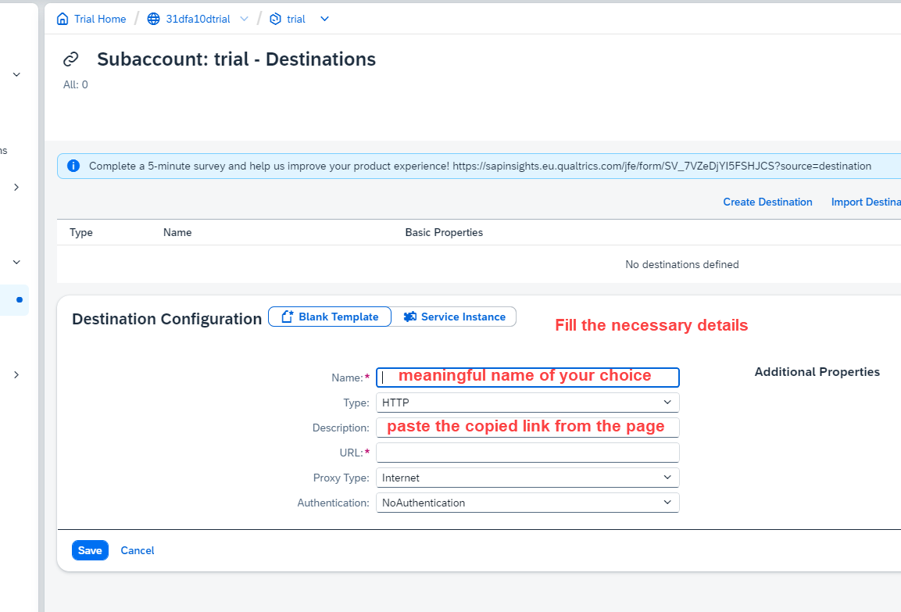

## CAPM - Day 12 - Extension CI/CD

### CI - CD Pipeline in SAP BTP cloud 

 
 
 

### Prerequisite your BAS account should have an active git repository to perfrom CI and CD 
  if github integration is not done earlier kindly perform this 
  [BAS Github integration](https://github.com/Octavius-Dante/Tetra_Proxima/tree/main/BAS_GIT_integration)
 
 
 

An overview of the process
 
 

 
 

 <b> 1. Subscribing CI and CD services in BTP </b> 

 
 

Create a subscription on Continuos Integration & Delivery in BTP account - Service 1
  
 

Create a subscription on Cloud Transport Mangement - Service 2 
  
 

 
 

 
 

 <b> 2. Granting Roles for CI / CD service</b> 

 
 

4 roles are needed for this service 
 

1. CICD Service Administrator
2. CICD Service Developer
3. TMS_LandscapeOperator_RC
4. TMS_Viewer_RC
 
 

Go to user sub-section in Security section on BTP account 
 
 

 
 

 
 

 
 

 
 

 
 

 <b> 3. Create another landscape </b> 

 
 

Create another sub account and space to simulate Quality and Production Landscape
 
 

 
 

Create spaces qlt and prd 
 
 

 
 

 
 

 
 

 
 

 
 

 
 

 <b> 4. Create Destinations for this System Landscapes </b> 

 
 

We need to create destination in this section 
  
 

 
 

we have to refere SAP's official documents for creating destination for (CICD ) and Cloud transport 
  refer the link for official document foudn through googel search : 
  [Cloud transport mgmt Oauth2 password authentication](https://help.sap.com/docs/cloud-transport-management/sap-cloud-transport-management/creating-destinations-using-sap-cloud-deployment-service-with-oauth2password-authentication)

  [Cloud transport mgmt Basic authentication](https://help.sap.com/docs/cloud-transport-management/sap-cloud-transport-management/creating-destinations-using-sap-cloud-deployment-service-with-basic-authentication) -- this is what we used 
 
 

 
 

Click create destination 
 
 

 
 

Enter the destination details 
 
 

 
 

Paste the link from the sap document page and modify it 

  the link value should be repalced as shown below 
  
https://deploy-service.cf.<domain>/slprot/<myorg>/<myspace>/slp

 
  <doamin> : This is the domain of your second sub account 
  <myorg> : This is the org name of your second sub account 
  <myspace> : This is the space name in your second sub account 
 
 

 
 

 
 

<!--

 <b> ALL CODE CHANGES - TODAY SESSION </b> 

 
 

 
 

 
 

-->

 
 
 
 
 
 
 
 

# --------- End of CAPM Development ---------

 
	
 
 

#### Previous Sessions
 
<!--
- [x] <a href="https://github.com/Octavius-Dante/Tetra_Proxima/tree/main/CAPM-DAY-12"> CAPM Day 12 - Extension CI CD</a>
-->

- [x] <a href="https://github.com/Octavius-Dante/Tetra_Proxima/tree/main/CAPM-DAY-11"> CAPM Day 11 - S4HANA Side by Side</a>
- [x] <a href="https://github.com/Octavius-Dante/Tetra_Proxima/tree/main/CAPM-DAY-10"> CAPM Day 10 - Side by Side extension</a>
- [x] <a href="https://github.com/Octavius-Dante/Tetra_Proxima/tree/main/CAPM-DAY-9"> CAPM Day 9 - Serverless Fiori App</a>
- [x] <a href="https://github.com/Octavius-Dante/Tetra_Proxima/tree/main/CAPM-DAY-8"> CAPM Day 8 - CAPM Security XSUAA</a>
- [x] <a href="https://github.com/Octavius-Dante/Tetra_Proxima/tree/main/CAPM-DAY-7"> CAPM Day 7 - HANA and Deployment</a>
- [x] <a href="https://github.com/Octavius-Dante/Tetra_Proxima/tree/main/CAPM-DAY-6"> CAPM Day 6 - Fiori App Draft</a>
- [x] <a href="https://github.com/Octavius-Dante/Tetra_Proxima/tree/main/CAPM-DAY-5"> CAPM Day 5 - Fiori Elements</a>
- [x] <a href="https://github.com/Octavius-Dante/Tetra_Proxima/tree/main/CAPM-DAY-4"> CAPM Day 4 - Generic Handlers</a>
- [x] <a href="https://github.com/Octavius-Dante/Tetra_Proxima/tree/main/CAPM-DAY-3"> CAPM Day 3 - EPM DB and CDS Views</a>
- [x] <a href="https://github.com/Octavius-Dante/Tetra_Proxima/tree/main/CAPM-DAY-2"> CAPM Day 2 - Aspects and Reuse Tables</a>
- [x] <a href="https://github.com/Octavius-Dante/Tetra_Proxima/tree/main/CAPM-DAY-1"> CAPM Day 1 - First CAP App </a>

 
 

