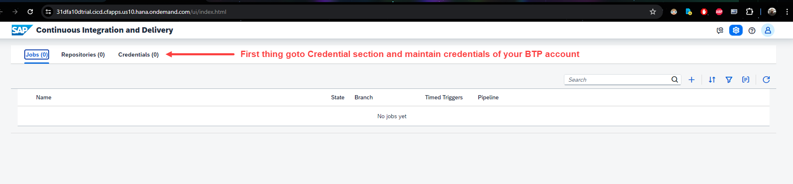
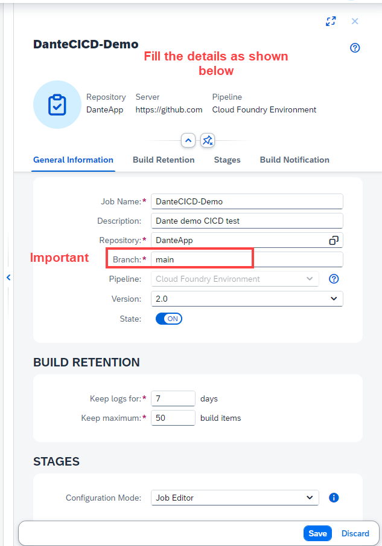
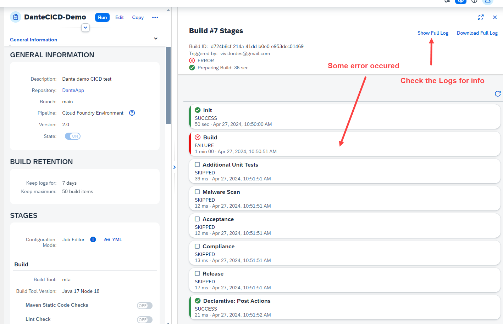

## CAPM - Day 12 - Extension CI/CD

### CI - CD Pipeline in SAP BTP cloud 

</br>
</br>
</br>

### Prerequisite your BAS account should have an active git repository to perfrom CI and CD 
</br> if github integration is not done earlier kindly perform this 
</br> [BAS Github integration](https://github.com/Octavius-Dante/Tetra_Proxima/tree/main/BAS_GIT_integration)
</br>
</br>
</br>

An overview of the process
</br>
</br>

</br>
</br>

<details>
<summary> <b> 1. Subscribing CI and CD services in BTP </b> </summary>
</br>
</br>

Create a subscription on Continuos Integration & Delivery in BTP account - Service 1
</br> 
</br>


Create a subscription on Cloud Transport Mangement - Service 2 
</br> 
</br>

</br>
</br>


</br>
</br>
</details>

<details>
<summary> <b> 2. Granting Roles for CI / CD service</b> </summary>
</br>
</br>

4 roles are needed for this service 
</br>

1. CICD Service Administrator
2. CICD Service Developer
3. TMS_LandscapeOperator_RC
4. TMS_Viewer_RC
</br>
</br>

Go to user sub-section in Security section on BTP account 
</br>
</br>

</br>
</br>

</br>
</br>

</br>
</br>

</br>
</br>

</br>
</br>
</details>


<details>
<summary> <b> 3. Create another landscape </b> </summary>
</br>
</br>

Create another sub account and space to simulate Quality and Production Landscape
</br>
</br>

</br>
</br>

Create spaces qlt and prd 
</br>
</br>

</br>
</br>

</br>
</br>

</br>
</br>

</br>
</br>

</br>
</br>

</br>
</br>
</details>


<details>
<summary> <b> 4. Create Destinations for this System Landscapes </b> </summary>
</br>
</br>

**Default Destination setting for this CICD**
</br>
</br> Type : HTTP
</br> Proxy Type : Internet
</br> Authentication : BasicAuthentication
</br>
</br>

We need to create destination in this section 
</br> 
</br>

</br>
</br>

we have to refer SAP's official documents for creating destination for (CICD ) and Cloud transport 
</br> refer the link for official document found through google search : 
</br>
</br> [Cloud transport mgmt Oauth2 password authentication](https://help.sap.com/docs/cloud-transport-management/sap-cloud-transport-management/creating-destinations-using-sap-cloud-deployment-service-with-oauth2password-authentication)
</br>
</br> [Cloud transport mgmt Basic authentication](https://help.sap.com/docs/cloud-transport-management/sap-cloud-transport-management/creating-destinations-using-sap-cloud-deployment-service-with-basic-authentication) -- this is what we used 
</br>
</br>

</br>
</br>

Click create destination 
</br>
</br>

</br>
</br>

Enter the destination details 
</br>
</br>

</br>
</br>

Paste the link from the sap document page and modify it 

</br> the link value should be repalced as shown below 
</br> 
</br> domain : This is the domain of your second sub account 
</br> myorg : This is the org name of your second sub account 
</br> myspace : This is the space name in your second sub account 
</br> 
</br> 

```html

// Original Link
https://deploy-service.cf.<domain>/slprot/<myorg>/<myspace>/slp

API Endpoint: https://api.cf.us10-001.hana.ondemand.com
Org Name: 31dfa10dtrial_quality-prod-6cvvjzsk
Space Name : QLT or PRD

// Grab only this part : us10-001.hana.ondemand.com

domain : us10-001.hana.ondemand.com
myorg : 31dfa10dtrial_quality-prod-6cvvjzsk
myspace : QLT

// Final Link should look like this -- this should go in URL part of destination
https://deploy-service.cf.us10-001.hana.ondemand.com/slprot/31dfa10dtrial_quality-prod-6cvvjzsk/QLT/slp

```

</br>
</br>

</br>
</br>

</br>
</br>

</br>
</br>

Test the connection for confirmation
</br>
</br>

</br>
</br>

</br>
</br>

Clone the connection and create it for PRD 
</br>
</br>

</br>
</br>

</br>
</br>
</details>


<details>
<summary> <b> 5. Start Github Integration for CI and CD - PART 1 - Account setup</b> </summary>
</br>
</br>

Launch the Continuous integration from instance and subscription section
</br>
</br>

</br>
</br>

</br>
</br>

</br>
</br>

</br>
</br>

</br>
</br>

Now will register our BTP repository
</br>
</br>

</br>
</br>

</br>
</br>

</br>
</br>

Change the Github repository visibility to PUBLIC so the credentials is not required
</br> now the github repository is private in my case so i mantianed a credential for (github account and password)
</br>
</br>

</br>
</br>

We need to add webhook to github account so creating webhook first
</br>
</br>

</br>
</br>

</br>
</br>

</br>
</br>

</br>
</br>

</br>
</br>

</br>
</br>

</br>
</br>
</details>

<details>
<summary> <b> 6. Start Github Integration for CI and CD - PART 2 - Github Webhook link</b> </summary>
</br>
</br> Goto Seting of your github repository and paste the generated webhook secret as shown below 
</br>
</br>

</br>
</br>

</br>
</br>

</br>
</br>

</br>
</br>

</br>
</br>

</br>
</br>

</br>
</br>

</br>
</br>
</details>

<details>
<summary> <b> 7. Start Github Integration for CI and CD - PART 3 - Job definition</b> </summary>
</br>
</br>

Let's define a Job in CICD as shown below
</br>
</br>

</br>
</br>

</br>
</br>

There is no Code check or sysntax check or unit testing so leave it untouched.
</br>
</br>

</br>
</br>

</br>
</br>

</br>
</br>

</br>
</br>

</br>
</br>

</br>
</br>

</br>
</br>

We need to create an instance (Cloud transport management) -
</br>
</br>

</br>
</br>

</br>
</br>

</br>
</br>

</br>
</br>

</br>
</br>

</br>
</br>

</br>
</br>

</br>
</br>

</br>
</br>

</br>
</br>

GO back to CICD - Jobs section and create a credentials for service key
</br>
</br>

</br>
</br>

</br>
</br>

Now go back to the Job and link the service key credential we creataed earlier
</br>
</br>

</br>
</br>

</br>
</br>

</br>
</br>
</details>


<details>
<summary> <b> 8. Defining Node for Continuous delivery - Cloud transport management system</b> </summary>
</br>
</br>

Goto Subscription and launch Cloud transport management
</br>
</br>

</br>
</br>

</br>
</br>

</br>
</br>


Defining node 
</br>allow upload to node option means somebody can pull the changes from dev branch and push it to quality branch 
</br>
</br>

</br>
</br>

low code no code approach so only node connection (Defining Prod Node)
</br>
</br>

</br>
</br>

</br>
</br>

</br>
</br>

</br>
</br>

</br>
</br>
So this concludes the landscape definition for continuous delivery  
</br>
</br>
</details>

<details>
<summary> <b> 9. Testing CI / CD flow with code changes </b> </summary>
</br>
</br>

</br>
</br>

</br>
</br>

Watch the job section in CI/CD when git push happens there will be build details listed in this section 
</br>
</br>

</br>
</br>

</br>
</br>

</br>
</br>

</br>
</br>

</br>
</br>

## Build failure error analysis -1 

<details>
<summary> Build log (error) for reference </summary>
</br>
</br>
First error log for reference deployment failure 
</br>
</br>

```bat

Stage Logs (DanteCICD-Demo #18 - Build)
[2024-04-29T20:17:50.278Z] [INFO] No runFirst command defined for current stage (Build). Will not execute additional commands step
[2024-04-29T20:17:50.709Z] Trying to acquire lock on [DanteCICD-Demo]
[2024-04-29T20:17:50.712Z] Resource [DanteCICD-Demo] did not exist. Created.
[2024-04-29T20:17:50.715Z] Lock acquired on [DanteCICD-Demo]
[2024-04-29T20:17:50.746Z] Running on Jenkins in /jenkins_home/workspace/DanteCICD-Demo@2
[2024-04-29T20:17:50.793Z] Unstash content: pipelineConfigAndTests
[2024-04-29T20:17:50.827Z] Unstash content: source
[2024-04-29T20:17:51.618Z] Unstash content: cloudcitransfer
[2024-04-29T20:17:52.068Z] --- Begin library step of: buildExecute ---
[2024-04-29T20:17:52.642Z] --- Begin library step of: mtaBuild ---
[2024-04-29T20:17:52.919Z] + '[' -x ./piper ]
[2024-04-29T20:17:52.931Z] Found piper binary in the workspace - skipping unstash
[2024-04-29T20:17:52.949Z] Unstash content: pipelineConfigAndTests
[2024-04-29T20:17:53.014Z] Step params [:]
[2024-04-29T20:17:53.055Z] PIPER_parametersJSON: {}
[2024-04-29T20:17:53.326Z] + ./piper getConfig --contextConfig --stepMetadata .pipeline/tmp/metadata/mtaBuild.yaml --defaultConfig .pipeline/.pipeline/cicdCommonBaseDefaults.yml,.pipeline/.pipeline/cicdPipelineSpecificDefaults.yml --ignoreCustomDefaults
[2024-04-29T20:17:53.327Z] time="2024-04-29T20:17:53Z" level=info msg="Version 3ae51e266142877d03c7f4dda5fe21668ba590dd" library=SAP/jenkins-library
[2024-04-29T20:17:53.327Z] time="2024-04-29T20:17:53Z" level=info msg="Printing stepName " library=SAP/jenkins-library
[2024-04-29T20:17:53.355Z] Context Config: [dockerImage:devxci/mbtci-java19-node18@sha256:1b319254758c8ae18e03c5cba7d9aa019f0aa0798db44eca5116c7d7290bdcf9, dockerPullImage:false]
[2024-04-29T20:17:53.375Z] [INFO] executing pipeline step 'mtaBuild' with docker image 'devxci/mbtci-java19-node18@sha256:1b319254758c8ae18e03c5cba7d9aa019f0aa0798db44eca5116c7d7290bdcf9'
[2024-04-29T20:17:53.903Z] --- Begin library step of: dockerExecute ---
[2024-04-29T20:17:54.735Z] --- Begin library step of: dockerExecuteOnKubernetes ---
[2024-04-29T20:17:54.918Z] Stash content: workspace-45afb648-ee41-45e8-bc12-cfe65cd18d97 (includes: **/*, excludes: nohup.out, useDefaultExcludes: true, allowEmpty: true)
[2024-04-29T20:17:59.442Z] Stashed 74 file(s)
[2024-04-29T20:18:10.527Z] Created Pod: kubernetes steward-run-plwpn-main-tn4x7/dynamic-agent-45afb648-ee41-45e8-bc12-cfe65cd18d97-bl87b-zzrcb
[2024-04-29T20:18:14.541Z] Still waiting to schedule task
[2024-04-29T20:18:14.542Z] Waiting for next available executor on ‘dynamic-agent-45afb648-ee41-45e8-bc12-cfe65cd18d97-bl87b-zzrcb’
[2024-04-29T20:18:26.942Z] Agent dynamic-agent-45afb648-ee41-45e8-bc12-cfe65cd18d97-bl87b-zzrcb is provisioned from template dynamic-agent-45afb648-ee41-45e8-bc12-cfe65cd18d97-bl87b
[2024-04-29T20:18:27.160Z] Running on dynamic-agent-45afb648-ee41-45e8-bc12-cfe65cd18d97-bl87b-zzrcb in /home/jenkins/agent/workspace/DanteCICD-Demo
[2024-04-29T20:18:27.965Z] ContainerConfig: [name:container-exec]
[2024-04-29T20:18:29.020Z] Unstash content: workspace-45afb648-ee41-45e8-bc12-cfe65cd18d97
[2024-04-29T20:18:32.031Z] invalidate stash workspace-45afb648-ee41-45e8-bc12-cfe65cd18d97
[2024-04-29T20:18:32.776Z] Stash content: workspace-45afb648-ee41-45e8-bc12-cfe65cd18d97 (includes: **/*.*, excludes: **/*, useDefaultExcludes: true, allowEmpty: true)
[2024-04-29T20:18:33.389Z] Warning: overwriting stash ‘workspace-45afb648-ee41-45e8-bc12-cfe65cd18d97’
[2024-04-29T20:18:33.523Z] Stashed 0 file(s)
[2024-04-29T20:18:34.019Z] [INFO][dockerExecute] Executing inside a Kubernetes Pod. Docker image: devxci/mbtci-java19-node18@sha256:1b319254758c8ae18e03c5cba7d9aa019f0aa0798db44eca5116c7d7290bdcf9
[2024-04-29T20:18:36.110Z] + ./piper writePipelineEnv
[2024-04-29T20:18:36.111Z] time="2024-04-29T20:18:35Z" level=info msg="Version 3ae51e266142877d03c7f4dda5fe21668ba590dd" library=SAP/jenkins-library
[2024-04-29T20:18:36.182Z] Unstash content: pipelineStepReports
[2024-04-29T20:18:36.217Z] Unstash failed: pipelineStepReports (No such saved stash ‘pipelineStepReports’)
[2024-04-29T20:18:36.949Z] + ./piper mtaBuild --defaultConfig .pipeline/.pipeline/cicdCommonBaseDefaults.yml,.pipeline/.pipeline/cicdPipelineSpecificDefaults.yml --ignoreCustomDefaults
[2024-04-29T20:18:36.950Z] time="2024-04-29T20:18:36Z" level=info msg="Version 3ae51e266142877d03c7f4dda5fe21668ba590dd" library=SAP/jenkins-library
[2024-04-29T20:18:36.950Z] info  mtaBuild - running command: npm config get registry
[2024-04-29T20:18:37.207Z] info  mtaBuild - Discovered pre-configured npm registry registry with value https://registry.npmjs.org/
[2024-04-29T20:18:37.207Z] 
[2024-04-29T20:18:37.207Z] info  mtaBuild - "mta.yaml" file found in project sources
[2024-04-29T20:18:37.208Z] info  mtaBuild - No timestamp contained in "mta.yaml". File has not been modified.
[2024-04-29T20:18:37.208Z] info  mtaBuild - Executing mta build call: "mbt build --mtar dancap.mtar --platform CF --source ./ --target /home/jenkins/agent/workspace/DanteCICD-Demo"
[2024-04-29T20:18:37.208Z] info  mtaBuild - running command: mbt build --mtar dancap.mtar --platform CF --source ./ --target /home/jenkins/agent/workspace/DanteCICD-Demo
[2024-04-29T20:18:37.466Z] info  mtaBuild - [2024-04-29 20:18:37]  INFO Cloud MTA Build Tool version 1.2.25
[2024-04-29T20:18:37.466Z] info  mtaBuild - [2024-04-29 20:18:37]  INFO generating the "Makefile_20240429201837.mta" file...
[2024-04-29T20:18:37.466Z] info  mtaBuild - [2024-04-29 20:18:37]  INFO done
[2024-04-29T20:18:37.466Z] info  mtaBuild - [2024-04-29 20:18:37]  INFO executing the "make -f Makefile_20240429201837.mta p=CF mtar=dancap.mtar strict=true mode= t=\"/home/jenkins/agent/workspace/DanteCICD-Demo\"" command...
[2024-04-29T20:18:37.466Z] info  mtaBuild - [2024-04-29 20:18:37]  INFO validating the MTA project
[2024-04-29T20:18:37.467Z] info  mtaBuild - [2024-04-29 20:18:37]  INFO running the "before-all" build...
[2024-04-29T20:18:37.467Z] info  mtaBuild - [2024-04-29 20:18:37]  INFO executing the "npx -p @sap/cds-dk cds build --production" command...
[2024-04-29T20:18:38.398Z] warn  mtaBuild - npm WARN exec The following package was not found and will be installed: @sap/cds-dk@7.8.2
[2024-04-29T20:18:46.484Z] info  mtaBuild - ........building project [/home/jenkins/agent/workspace/DanteCICD-Demo], clean [true]
[2024-04-29T20:18:46.484Z] info  mtaBuild - cds-dk [7.8.2], cds [7.8.1], compiler [4.8.0], home [/home/mta/.npm/_npx/b993340195f82cd5/node_modules/@sap/cds-dk/node_modules/@sap/cds]
[2024-04-29T20:18:46.485Z] info  mtaBuild - 
[2024-04-29T20:18:46.485Z] info  mtaBuild - {
[2024-04-29T20:18:46.485Z] info  mtaBuild -   build: {
[2024-04-29T20:18:46.485Z] info  mtaBuild -     target: 'gen',
[2024-04-29T20:18:46.485Z] info  mtaBuild -     tasks: [
[2024-04-29T20:18:46.485Z] info  mtaBuild -       { for: 'nodejs', src: 'srv', options: { model: ['db', 'srv', 'app'] }}
[2024-04-29T20:18:46.485Z] info  mtaBuild -     ]
[2024-04-29T20:18:46.485Z] info  mtaBuild -   }
[2024-04-29T20:18:46.485Z] info  mtaBuild - }
[2024-04-29T20:18:46.485Z] info  mtaBuild - 
[2024-04-29T20:18:46.485Z] info  mtaBuild - done > wrote output to:
[2024-04-29T20:18:46.486Z] info  mtaBuild -    gen/srv/.cdsrc.json
[2024-04-29T20:18:46.486Z] info  mtaBuild -    gen/srv/package-lock.json
[2024-04-29T20:18:46.486Z] info  mtaBuild -    gen/srv/package.json
[2024-04-29T20:18:46.486Z] info  mtaBuild -    gen/srv/srv/CatalogService.js
[2024-04-29T20:18:46.486Z] info  mtaBuild -    gen/srv/srv/_i18n/i18n.json
[2024-04-29T20:18:46.486Z] info  mtaBuild -    gen/srv/srv/csn.json
[2024-04-29T20:18:46.486Z] info  mtaBuild -    gen/srv/srv/demoservice.js
[2024-04-29T20:18:46.486Z] info  mtaBuild -    gen/srv/srv/odata/v4/CatalogService.xml
[2024-04-29T20:18:46.486Z] info  mtaBuild -    gen/srv/srv/odata/v4/demoservice.xml
[2024-04-29T20:18:46.486Z] info  mtaBuild -    gen/srv/srv/server.js
[2024-04-29T20:18:46.486Z] info  mtaBuild -    gen/srv/srv/tester.http
[2024-04-29T20:18:46.487Z] info  mtaBuild - 
[2024-04-29T20:18:46.487Z] warn  mtaBuild - [WARNING] db/CDSViews.cds:1:11-21: “cds” now refers to “dancap.cds” - consider ‘using cds;’
[2024-04-29T20:18:46.487Z] warn  mtaBuild - [WARNING] srv/CatalogService.cds:14:12: “@Common.ValueList.entity” is ignored for “@Common.ValueList” as ‘viaAssociation’ is present (in entity:“CatalogService.PurchaseOrder”/element:“PARTNER_GUID_NODE_KEY”/“@Common.ValueList.entity”)
[2024-04-29T20:18:46.487Z] warn  mtaBuild - [WARNING] srv/CatalogService.cds:14:12: “@Common.ValueList.entity” is ignored for “@Common.ValueList” as ‘viaAssociation’ is present (in entity:“CatalogService.PurchaseOrder”/element:“PARTNER_GUID”/“@Common.ValueList.entity”)
[2024-04-29T20:18:46.487Z] warn  mtaBuild - [WARNING] srv/CatalogService.cds:46:12: “@Common.ValueList.entity” is ignored for “@Common.ValueList” as ‘viaAssociation’ is present (in entity:“CatalogService.PurchaseOrderItems”/element:“PRODUCT_GUID_NODE_KEY”/“@Common.ValueList.entity”)
[2024-04-29T20:18:46.487Z] warn  mtaBuild - [WARNING] srv/CatalogService.cds:46:12: “@Common.ValueList.entity” is ignored for “@Common.ValueList” as ‘viaAssociation’ is present (in entity:“CatalogService.PurchaseOrderItems”/element:“PRODUCT_GUID”/“@Common.ValueList.entity”)
[2024-04-29T20:18:46.488Z] info  mtaBuild - build completed in 596 ms
[2024-04-29T20:18:46.488Z] info  mtaBuild - 
[2024-04-29T20:18:46.488Z] info  mtaBuild - .[2024-04-29 20:18:46]  INFO validating the MTA project
[2024-04-29T20:18:46.488Z] error mtaBuild - [2024-04-29 20:18:46] ERROR the "mta.yaml" file is not valid: 
[2024-04-29T20:18:46.488Z] info  mtaBuild - line 49: the "gen/db" path of the "dancap-db-deployer" module does not exist
[2024-04-29T20:18:46.488Z] info  mtaBuild - make: *** [Makefile_20240429201837.mta:46: validate] Error 1
[2024-04-29T20:18:46.488Z] info  mtaBuild - Error: could not build the MTA project: could not execute the "make -f Makefile_20240429201837.mta p=CF mtar=dancap.mtar strict=true mode= t=\"/home/jenkins/agent/workspace/DanteCICD-Demo\"" command: exit status 2
[2024-04-29T20:18:46.488Z] info  mtaBuild - fatal error: errorDetails{"category":"build","correlationId":"n/a","error":"running command 'mbt' failed: cmd.Run() failed: exit status 1","library":"SAP/jenkins-library","message":"failed to execute mta build","result":"failure","stepName":"mtaBuild","time":"2024-04-29T20:18:46.256399596Z"}
[2024-04-29T20:18:46.488Z] fatal mtaBuild - failed to execute mta build - running command 'mbt' failed: cmd.Run() failed: exit status 1
[2024-04-29T20:18:46.488Z] info  mtaBuild - persisting reports to GCS is disabled, because gcsBucketId is empty
[2024-04-29T20:18:46.489Z] info  mtaBuild - Step telemetry data:{"StepStartTime":"2024-04-29 20:18:36.843610842 +0000 UTC","PipelineURLHash":"50f013532a9770a2c2cfdc38b7581dd01df69b70","BuildURLHash":"50f013532a9770a2c2cfdc38b7581dd01df69b70","StageName":"Build","StepName":"mtaBuild","ErrorCode":"1","StepDuration":"9413","ErrorCategory":"build","CorrelationID":"n/a","PiperCommitHash":"3ae51e266142877d03c7f4dda5fe21668ba590dd","ErrorDetail":{"category":"build","correlationId":"n/a","error":"running command 'mbt' failed: cmd.Run() failed: exit status 1","library":"SAP/jenkins-library","message":"failed to execute mta build","result":"failure","stepName":"mtaBuild","time":"2024-04-29T20:18:46.256399596Z"}}
[2024-04-29T20:18:47.259Z] + ./piper readPipelineEnv
[2024-04-29T20:18:47.260Z] time="2024-04-29T20:18:47Z" level=info msg="Version 3ae51e266142877d03c7f4dda5fe21668ba590dd" library=SAP/jenkins-library
[2024-04-29T20:18:47.300Z] Transfer Influx data
[2024-04-29T20:18:47.345Z] Stash content: pipelineStepReports (includes: .pipeline/stepReports/**, excludes: , useDefaultExcludes: true, allowEmpty: true)
[2024-04-29T20:18:47.385Z] Stashed 0 file(s)
[2024-04-29T20:18:48.142Z] Stash content: container-45afb648-ee41-45e8-bc12-cfe65cd18d97 (includes: **/*, excludes: **/node_modules/**,nohup.out,.git/**, useDefaultExcludes: true, allowEmpty: true)
[2024-04-29T20:18:52.969Z] Stashed 90 file(s)
[2024-04-29T20:18:53.123Z] Unstash content: container-45afb648-ee41-45e8-bc12-cfe65cd18d97
[2024-04-29T20:18:54.852Z] invalidate stash container-45afb648-ee41-45e8-bc12-cfe65cd18d97
[2024-04-29T20:18:54.872Z] Stash content: container-45afb648-ee41-45e8-bc12-cfe65cd18d97 (includes: **/*.*, excludes: **/*, useDefaultExcludes: true, allowEmpty: true)
[2024-04-29T20:18:54.891Z] Warning: overwriting stash ‘container-45afb648-ee41-45e8-bc12-cfe65cd18d97’
[2024-04-29T20:18:54.898Z] Stashed 0 file(s)
[2024-04-29T20:18:55.012Z] ----------------------------------------------------------
[2024-04-29T20:18:55.013Z] --- An error occurred in the library step: dockerExecuteOnKubernetes
[2024-04-29T20:18:55.013Z] ----------------------------------------------------------
[2024-04-29T20:18:55.013Z] 
[2024-04-29T20:18:55.013Z] The following parameters were available to the step:
[2024-04-29T20:18:55.013Z] ***
[2024-04-29T20:18:55.013Z] *** to show step parameters, set verbose:true in general pipeline configuration
[2024-04-29T20:18:55.013Z] *** WARNING: this may reveal sensitive information. ***
[2024-04-29T20:18:55.013Z] ***
[2024-04-29T20:18:55.013Z] 
[2024-04-29T20:18:55.013Z] The error was:
[2024-04-29T20:18:55.013Z] ***
[2024-04-29T20:18:55.013Z] hudson.AbortException: [mtaBuild] Step execution failed (category: build). Error: running command 'mbt' failed: cmd.Run() failed: exit status 1
[2024-04-29T20:18:55.013Z] ***
[2024-04-29T20:18:55.013Z] 
[2024-04-29T20:18:55.013Z] Further information:
[2024-04-29T20:18:55.013Z] * Documentation of library step dockerExecuteOnKubernetes: https://sap.github.io/jenkins-library/steps/dockerExecuteOnKubernetes/
[2024-04-29T20:18:55.014Z] * Source code of library step dockerExecuteOnKubernetes: https://github.com/SAP/jenkins-library/blob/master/vars/dockerExecuteOnKubernetes.groovy
[2024-04-29T20:18:55.014Z] * Library documentation: https://sap.github.io/jenkins-library/
[2024-04-29T20:18:55.014Z] * Library repository: https://github.com/SAP/jenkins-library/
[2024-04-29T20:18:55.014Z] 
[2024-04-29T20:18:55.014Z] ----------------------------------------------------------
[2024-04-29T20:18:55.014Z] --- End library step of: dockerExecuteOnKubernetes ---
[2024-04-29T20:18:55.059Z] ----------------------------------------------------------
[2024-04-29T20:18:55.059Z] --- An error occurred in the library step: dockerExecute
[2024-04-29T20:18:55.060Z] ----------------------------------------------------------
[2024-04-29T20:18:55.060Z] 
[2024-04-29T20:18:55.060Z] The following parameters were available to the step:
[2024-04-29T20:18:55.060Z] ***
[2024-04-29T20:18:55.060Z] *** to show step parameters, set verbose:true in general pipeline configuration
[2024-04-29T20:18:55.060Z] *** WARNING: this may reveal sensitive information. ***
[2024-04-29T20:18:55.060Z] ***
[2024-04-29T20:18:55.060Z] 
[2024-04-29T20:18:55.060Z] The error was:
[2024-04-29T20:18:55.060Z] ***
[2024-04-29T20:18:55.060Z] hudson.AbortException: [mtaBuild] Step execution failed (category: build). Error: running command 'mbt' failed: cmd.Run() failed: exit status 1
[2024-04-29T20:18:55.060Z] ***
[2024-04-29T20:18:55.061Z] 
[2024-04-29T20:18:55.061Z] Further information:
[2024-04-29T20:18:55.061Z] * Documentation of library step dockerExecute: https://sap.github.io/jenkins-library/steps/dockerExecute/
[2024-04-29T20:18:55.061Z] * Source code of library step dockerExecute: https://github.com/SAP/jenkins-library/blob/master/vars/dockerExecute.groovy
[2024-04-29T20:18:55.061Z] * Library documentation: https://sap.github.io/jenkins-library/
[2024-04-29T20:18:55.061Z] * Library repository: https://github.com/SAP/jenkins-library/
[2024-04-29T20:18:55.061Z] 
[2024-04-29T20:18:55.061Z] ----------------------------------------------------------
[2024-04-29T20:18:55.061Z] --- End library step of: dockerExecute ---
[2024-04-29T20:18:55.136Z] ----------------------------------------------------------
[2024-04-29T20:18:55.136Z] --- An error occurred in the library step: mtaBuild
[2024-04-29T20:18:55.136Z] ----------------------------------------------------------
[2024-04-29T20:18:55.136Z] 
[2024-04-29T20:18:55.136Z] The following parameters were available to the step:
[2024-04-29T20:18:55.137Z] ***
[2024-04-29T20:18:55.137Z] *** to show step parameters, set verbose:true in general pipeline configuration
[2024-04-29T20:18:55.137Z] *** WARNING: this may reveal sensitive information. ***
[2024-04-29T20:18:55.137Z] ***
[2024-04-29T20:18:55.137Z] 
[2024-04-29T20:18:55.137Z] The error was:
[2024-04-29T20:18:55.137Z] ***
[2024-04-29T20:18:55.137Z] hudson.AbortException: [mtaBuild] Step execution failed (category: build). Error: running command 'mbt' failed: cmd.Run() failed: exit status 1
[2024-04-29T20:18:55.137Z] ***
[2024-04-29T20:18:55.137Z] 
[2024-04-29T20:18:55.138Z] Further information:
[2024-04-29T20:18:55.138Z] * Documentation of library step mtaBuild: https://sap.github.io/jenkins-library/steps/mtaBuild/
[2024-04-29T20:18:55.138Z] * Source code of library step mtaBuild: https://github.com/SAP/jenkins-library/blob/master/vars/mtaBuild.groovy
[2024-04-29T20:18:55.138Z] * Library documentation: https://sap.github.io/jenkins-library/
[2024-04-29T20:18:55.138Z] * Library repository: https://github.com/SAP/jenkins-library/
[2024-04-29T20:18:55.138Z] 
[2024-04-29T20:18:55.138Z] ----------------------------------------------------------
[2024-04-29T20:18:55.138Z] --- End library step of: mtaBuild ---
[2024-04-29T20:18:55.180Z] ----------------------------------------------------------
[2024-04-29T20:18:55.180Z] --- An error occurred in the library step: buildExecute
[2024-04-29T20:18:55.180Z] ----------------------------------------------------------
[2024-04-29T20:18:55.180Z] 
[2024-04-29T20:18:55.180Z] The following parameters were available to the step:
[2024-04-29T20:18:55.181Z] ***
[2024-04-29T20:18:55.181Z] *** to show step parameters, set verbose:true in general pipeline configuration
[2024-04-29T20:18:55.181Z] *** WARNING: this may reveal sensitive information. ***
[2024-04-29T20:18:55.181Z] ***
[2024-04-29T20:18:55.181Z] 
[2024-04-29T20:18:55.181Z] The error was:
[2024-04-29T20:18:55.181Z] ***
[2024-04-29T20:18:55.181Z] hudson.AbortException: [mtaBuild] Step execution failed (category: build). Error: running command 'mbt' failed: cmd.Run() failed: exit status 1
[2024-04-29T20:18:55.181Z] ***
[2024-04-29T20:18:55.181Z] 
[2024-04-29T20:18:55.181Z] Further information:
[2024-04-29T20:18:55.181Z] * Documentation of library step buildExecute: https://sap.github.io/jenkins-library/steps/buildExecute/
[2024-04-29T20:18:55.181Z] * Source code of library step buildExecute: https://github.com/SAP/jenkins-library/blob/master/vars/buildExecute.groovy
[2024-04-29T20:18:55.181Z] * Library documentation: https://sap.github.io/jenkins-library/
[2024-04-29T20:18:55.182Z] * Library repository: https://github.com/SAP/jenkins-library/
[2024-04-29T20:18:55.182Z] 
[2024-04-29T20:18:55.182Z] ----------------------------------------------------------
[2024-04-29T20:18:55.182Z] --- End library step of: buildExecute ---
[2024-04-29T20:18:55.201Z] Stash content: cloudcitransfer (includes: cloudcitransfer/**/*, excludes: cloudcitransfer/**/node_modules/**)
[2024-04-29T20:18:55.220Z] Warning: overwriting stash ‘cloudcitransfer’
[2024-04-29T20:18:55.221Z] Stashed 2 file(s)
[2024-04-29T20:18:55.298Z] Lock released on resource [DanteCICD-Demo]

```
</details>
</br>
</br>

added following lines in MTA yaml and tested 
</br>
</br>

```yaml
      commands:
        - npx cds build --production // doesnt work - gives error at mbt build start
        - npx -p @sap/cds-dk cds build --production  // doesnt work - gives error at db-deployer stage
```
</br>
</br>

Did NPM install for following items 
</br>
</br>

```bat
npm install @sap/hana-client
npm install @sap/hdi-deploy
npm install @sap/cds-hana
npm install @sap-cloud-sdk/http-client
npm install @sap/cds-dk
```
</br>
</br>

corrected package.json as shown below 
</br>
</br>

## package.json under Cds section

</br>
</br>

```json

  "cds": {
    "hana": {
      "deploy-format": "hdbtable",
      "syntax": "hdi"
    }

```
</br>
</br>

Still above things returned the same error 
</br>
</br>
Added following lines in MTA yaml and proceeded build was successful but deployment failed 
</br>
</br>
</br> 1. Did npm install for hdi component (npm install @sap/hdi-deploy) in commadn prompt
</br> 2. Adding this command in mta.yaml is the appropriate solution (- npm install @sap/hdi-deploy)
</br> 3. used npm install and clean npm install command in mta.yaml file overrided the problem - this installs everything needed by reading pacakge.json
</br>
</br>
</br> i randomly checked and copied the line from sap forum but this component was not needed for our application 
</br> (- npm install @sap-cloud-sdk/http-client )
</br> needed component should be (- npm install @sap/hdi-deploy) for de-deployer error.
</br>
</br>

```yaml
// Following commands succeeded in building - Failed during deployment - 
      commands:
        - npm install
        - npx -p @sap/cds-dk cds build --production
        - npm install @sap-cloud-sdk/http-client
        - npm update --package-lock-only
        - npm clean-install --production
````
</br>
</br>

Success in Build stage but deployment encountered error 
</br>
</br>

</br>
</br>

## Deploy failure error analysis - 2 

<details>
<summary> Deploy log (error) for reference </summary>
</br>
</br>
Second error log for reference deployment failure 
</br>
</br>

```bat

Stage Logs (DanteCICD-Demo #19 - Release)
[2024-04-29T22:01:07.171Z] [INFO] No runFirst command defined for current stage (Release). Will not execute additional commands step
[2024-04-29T22:01:07.589Z] Trying to acquire lock on [DanteCICD-Demo]
[2024-04-29T22:01:07.593Z] Resource [DanteCICD-Demo] did not exist. Created.
[2024-04-29T22:01:07.596Z] Lock acquired on [DanteCICD-Demo]
[2024-04-29T22:01:07.629Z] Running on Jenkins in /jenkins_home/workspace/DanteCICD-Demo@2
[2024-04-29T22:01:07.671Z] Unstash content: pipelineConfigAndTests
[2024-04-29T22:01:07.702Z] Unstash content: buildDescriptor
[2024-04-29T22:01:07.732Z] Unstash content: buildResult
[2024-04-29T22:01:08.552Z] Unstash content: deployDescriptor
[2024-04-29T22:01:08.584Z] Unstash content: source
[2024-04-29T22:01:09.483Z] Unstash content: cloudcitransfer
[2024-04-29T22:01:09.785Z] Unstash content: deployDescriptor
[2024-04-29T22:01:10.072Z] --- Begin library step of: cloudFoundryDeploy ---
[2024-04-29T22:01:10.345Z] + '[' -x ./piper ]
[2024-04-29T22:01:10.356Z] Found piper binary in the workspace - skipping unstash
[2024-04-29T22:01:10.375Z] Unstash content: pipelineConfigAndTests
[2024-04-29T22:01:10.437Z] Step params [:]
[2024-04-29T22:01:10.474Z] PIPER_parametersJSON: {}
[2024-04-29T22:01:10.749Z] + ./piper getConfig --contextConfig --stepMetadata .pipeline/tmp/metadata/cloudFoundryDeploy.yaml --defaultConfig .pipeline/.pipeline/cicdCommonBaseDefaults.yml,.pipeline/.pipeline/cicdPipelineSpecificDefaults.yml --ignoreCustomDefaults
[2024-04-29T22:01:10.750Z] time="2024-04-29T22:01:10Z" level=info msg="Version 3ae51e266142877d03c7f4dda5fe21668ba590dd" library=SAP/jenkins-library
[2024-04-29T22:01:10.750Z] time="2024-04-29T22:01:10Z" level=info msg="Printing stepName " library=SAP/jenkins-library
[2024-04-29T22:01:10.780Z] Context Config: [dockerImage:ppiper/cf-cli@sha256:34749e9b26a86ab2fca1bc93dae2c0e0cdfa013d9421af64072f23a0f2433473, dockerName:cfDeploy, dockerPullImage:false]
[2024-04-29T22:01:10.801Z] [INFO] executing pipeline step 'cloudFoundryDeploy' with docker image 'ppiper/cf-cli@sha256:34749e9b26a86ab2fca1bc93dae2c0e0cdfa013d9421af64072f23a0f2433473'
[2024-04-29T22:01:10.998Z] --- Begin library step of: dockerExecute ---
[2024-04-29T22:01:11.332Z] --- Begin library step of: dockerExecuteOnKubernetes ---
[2024-04-29T22:01:11.506Z] Stash content: workspace-5f33b092-6ffa-41ad-9bed-80fe007cf3ee (includes: **/*, excludes: nohup.out, useDefaultExcludes: true, allowEmpty: true)
[2024-04-29T22:01:24.640Z] Stashed 75 file(s)
[2024-04-29T22:01:31.457Z] Created Pod: kubernetes steward-run-bmd0t-main-p7h5c/dynamic-agent-5f33b092-6ffa-41ad-9bed-80fe007cf3ee-dm2kb-5swz3
[2024-04-29T22:01:39.742Z] Still waiting to schedule task
[2024-04-29T22:01:39.743Z] Waiting for next available executor on ‘dynamic-agent-5f33b092-6ffa-41ad-9bed-80fe007cf3ee-dm2kb-5swz3’
[2024-04-29T22:01:48.299Z] Agent dynamic-agent-5f33b092-6ffa-41ad-9bed-80fe007cf3ee-dm2kb-5swz3 is provisioned from template dynamic-agent-5f33b092-6ffa-41ad-9bed-80fe007cf3ee-dm2kb
[2024-04-29T22:01:48.303Z] Running on dynamic-agent-5f33b092-6ffa-41ad-9bed-80fe007cf3ee-dm2kb-5swz3 in /home/jenkins/agent/workspace/DanteCICD-Demo
[2024-04-29T22:01:48.372Z] ContainerConfig: [name:container-exec]
[2024-04-29T22:01:48.424Z] Unstash content: workspace-5f33b092-6ffa-41ad-9bed-80fe007cf3ee
[2024-04-29T22:01:55.904Z] invalidate stash workspace-5f33b092-6ffa-41ad-9bed-80fe007cf3ee
[2024-04-29T22:01:56.092Z] Stash content: workspace-5f33b092-6ffa-41ad-9bed-80fe007cf3ee (includes: **/*.*, excludes: **/*, useDefaultExcludes: true, allowEmpty: true)
[2024-04-29T22:01:56.258Z] Warning: overwriting stash ‘workspace-5f33b092-6ffa-41ad-9bed-80fe007cf3ee’
[2024-04-29T22:01:56.498Z] Stashed 0 file(s)
[2024-04-29T22:01:56.512Z] [INFO][dockerExecute] Executing inside a Kubernetes Pod. Docker image: ppiper/cf-cli@sha256:34749e9b26a86ab2fca1bc93dae2c0e0cdfa013d9421af64072f23a0f2433473
[2024-04-29T22:01:57.368Z] + ./piper writePipelineEnv
[2024-04-29T22:01:57.368Z] time="2024-04-29T22:01:57Z" level=info msg="Version 3ae51e266142877d03c7f4dda5fe21668ba590dd" library=SAP/jenkins-library
[2024-04-29T22:01:57.468Z] Unstash content: pipelineStepReports
[2024-04-29T22:01:58.229Z] + ./piper cloudFoundryDeploy --defaultConfig .pipeline/.pipeline/cicdCommonBaseDefaults.yml,.pipeline/.pipeline/cicdPipelineSpecificDefaults.yml --ignoreCustomDefaults
[2024-04-29T22:01:58.231Z] time="2024-04-29T22:01:58Z" level=info msg="Version 3ae51e266142877d03c7f4dda5fe21668ba590dd" library=SAP/jenkins-library
[2024-04-29T22:01:58.232Z] info  cloudFoundryDeploy - General parameters: deployTool='', deployType='standard', cfApiEndpoint='https://api.cf.us10-001.hana.ondemand.com/', cfOrg='db4cbbc2trial', cfSpace='dev'
[2024-04-29T22:01:58.232Z] info  cloudFoundryDeploy - Parameter deployTool not specified - deriving from buildTool 'mta': 'mtaDeployPlugin'
[2024-04-29T22:01:58.232Z] info  cloudFoundryDeploy - Using additional environment variables: [CF_TRACE=cf.log]
[2024-04-29T22:01:58.232Z] info  cloudFoundryDeploy - running command: cf version
[2024-04-29T22:01:58.232Z] info  cloudFoundryDeploy - cf version 8.7.1+9c81242.2023-06-15
[2024-04-29T22:01:58.232Z] info  cloudFoundryDeploy - Logging in to Cloud Foundry
[2024-04-29T22:01:58.232Z] info  cloudFoundryDeploy - Logging into Cloud Foundry..
[2024-04-29T22:01:58.232Z] info  cloudFoundryDeploy - running command: cf login -a https://api.cf.us10-001.hana.ondemand.com/ -o db4cbbc2trial -s dev -u **** -p ****
[2024-04-29T22:01:58.232Z] info  cloudFoundryDeploy - API endpoint: https://api.cf.us10-001.hana.ondemand.com/
[2024-04-29T22:01:58.232Z] info  cloudFoundryDeploy - 
[2024-04-29T22:01:58.491Z] info  cloudFoundryDeploy - 
[2024-04-29T22:01:58.491Z] info  cloudFoundryDeploy - Authenticating...
[2024-04-29T22:01:59.052Z] info  cloudFoundryDeploy - OK
[2024-04-29T22:01:59.052Z] info  cloudFoundryDeploy - 
[2024-04-29T22:01:59.308Z] info  cloudFoundryDeploy - Targeted org db4cbbc2trial.
[2024-04-29T22:01:59.308Z] info  cloudFoundryDeploy - 
[2024-04-29T22:01:59.308Z] info  cloudFoundryDeploy - Targeted space dev.
[2024-04-29T22:01:59.308Z] info  cloudFoundryDeploy - 
[2024-04-29T22:01:59.308Z] info  cloudFoundryDeploy - API endpoint:   https://api.cf.us10-001.hana.ondemand.com
[2024-04-29T22:01:59.308Z] info  cloudFoundryDeploy - API version:    3.159.0
[2024-04-29T22:01:59.309Z] info  cloudFoundryDeploy - user:           ****
[2024-04-29T22:01:59.310Z] info  cloudFoundryDeploy - org:            db4cbbc2trial
[2024-04-29T22:01:59.310Z] info  cloudFoundryDeploy - space:          dev
[2024-04-29T22:01:59.310Z] info  cloudFoundryDeploy - Logged in successfully to Cloud Foundry..
[2024-04-29T22:01:59.311Z] info  cloudFoundryDeploy - running command: cf plugins
[2024-04-29T22:01:59.311Z] info  cloudFoundryDeploy - Listing installed plugins...
[2024-04-29T22:01:59.311Z] info  cloudFoundryDeploy - 
[2024-04-29T22:01:59.311Z] info  cloudFoundryDeploy - plugin                version   command name                  command help
[2024-04-29T22:01:59.311Z] info  cloudFoundryDeploy - blue-green-deploy     1.4.0     blue-green-deploy, bgd        Zero-downtime deploys with smoke tests
[2024-04-29T22:01:59.311Z] info  cloudFoundryDeploy - Create-Service-Push   1.3.2     create-service-push, cspush   Works in the same manner as cf push, except that it will create services defined in a services-manifest.yml file first before performing a cf push.
[2024-04-29T22:01:59.311Z] info  cloudFoundryDeploy - html5-plugin          1.4.6     html5-delete                  Delete one or multiple app-host service instances or content uploaded with these instances
[2024-04-29T22:01:59.311Z] info  cloudFoundryDeploy - html5-plugin          1.4.6     html5-get                     Fetch content of single HTML5 application file by path, or whole application by name and version
[2024-04-29T22:01:59.311Z] info  cloudFoundryDeploy - html5-plugin          1.4.6     html5-info                    Get size limit and status of app-host service instances
[2024-04-29T22:01:59.311Z] info  cloudFoundryDeploy - html5-plugin          1.4.6     html5-list                    Display list of HTML5 applications or file paths of specified application
[2024-04-29T22:01:59.312Z] info  cloudFoundryDeploy - html5-plugin          1.4.6     html5-push                    Push HTML5 applications to html5-apps-repo service
[2024-04-29T22:01:59.312Z] info  cloudFoundryDeploy - multiapps             3.0.3     bg-deploy                     Deploy a multi-target app using blue-green deployment
[2024-04-29T22:01:59.312Z] info  cloudFoundryDeploy - multiapps             3.0.3     deploy                        Deploy a new multi-target app or sync changes to an existing one
[2024-04-29T22:01:59.312Z] info  cloudFoundryDeploy - multiapps             3.0.3     download-mta-op-logs, dmol    Download logs of multi-target app operation
[2024-04-29T22:01:59.312Z] info  cloudFoundryDeploy - multiapps             3.0.3     mta                           Display health and status for a multi-target app
[2024-04-29T22:01:59.312Z] info  cloudFoundryDeploy - multiapps             3.0.3     mta-ops                       List multi-target app operations
[2024-04-29T22:01:59.312Z] info  cloudFoundryDeploy - multiapps             3.0.3     mtas                          List all multi-target apps
[2024-04-29T22:01:59.312Z] info  cloudFoundryDeploy - multiapps             3.0.3     purge-mta-config              Purge no longer valid configuration entries
[2024-04-29T22:01:59.312Z] info  cloudFoundryDeploy - multiapps             3.0.3     undeploy                      Undeploy a multi-target app
[2024-04-29T22:01:59.312Z] info  cloudFoundryDeploy - 
[2024-04-29T22:01:59.313Z] info  cloudFoundryDeploy - Use 'cf repo-plugins' to list plugins in registered repos available to install.
[2024-04-29T22:01:59.313Z] info  cloudFoundryDeploy - running command: cf deploy dancap.mtar -f --version-rule ALL
[2024-04-29T22:01:59.313Z] info  cloudFoundryDeploy - Deploying multi-target app archive dancap.mtar in org db4cbbc2trial / space dev as ****...
[2024-04-29T22:01:59.313Z] info  cloudFoundryDeploy - 
[2024-04-29T22:01:59.574Z] info  cloudFoundryDeploy - Uploading 1 files...
[2024-04-29T22:01:59.575Z] info  cloudFoundryDeploy -   /home/jenkins/agent/workspace/DanteCICD-Demo/dancap.mtar
[2024-04-29T22:02:02.088Z] info  cloudFoundryDeploy - OK
[2024-04-29T22:02:02.088Z] info  cloudFoundryDeploy - Operation ID: 1b6ee557-0674-11ef-8669-eeee0a963137
[2024-04-29T22:02:08.624Z] info  cloudFoundryDeploy - Deploying in org "db4cbbc2trial" and space "dev"
[2024-04-29T22:02:08.625Z] info  cloudFoundryDeploy - Detected MTA schema version: "3"
[2024-04-29T22:02:08.625Z] info  cloudFoundryDeploy - Error merging descriptors: Unsupported module type "nodejsnpm ins" for platform type "CLOUD-FOUNDRY" 
[2024-04-29T22:02:08.625Z] info  cloudFoundryDeploy - Process failed.
[2024-04-29T22:02:08.625Z] info  cloudFoundryDeploy - Use "cf deploy -i 1b6ee557-0674-11ef-8669-eeee0a963137 -a abort" to abort the process.
[2024-04-29T22:02:08.625Z] info  cloudFoundryDeploy - Use "cf deploy -i 1b6ee557-0674-11ef-8669-eeee0a963137 -a retry" to retry the process.
[2024-04-29T22:02:08.625Z] info  cloudFoundryDeploy - Use "cf dmol -i 1b6ee557-0674-11ef-8669-eeee0a963137" to download the logs of the process.
[2024-04-29T22:02:08.625Z] error cloudFoundryDeploy - Command '[deploy dancap.mtar -f --version-rule ALL]' failed. - running command 'cf' failed: cmd.Run() failed: exit status 1
[2024-04-29T22:02:08.625Z] info  cloudFoundryDeploy - Logging out of Cloud Foundry
[2024-04-29T22:02:08.626Z] info  cloudFoundryDeploy - running command: cf logout
[2024-04-29T22:02:08.626Z] info  cloudFoundryDeploy - Logging out ****...
[2024-04-29T22:02:08.626Z] info  cloudFoundryDeploy - OK
[2024-04-29T22:02:08.626Z] info  cloudFoundryDeploy - 
[2024-04-29T22:02:08.626Z] info  cloudFoundryDeploy - Logged out successfully
[2024-04-29T22:02:08.626Z] info  cloudFoundryDeploy - ### START OF CF CLI TRACE OUTPUT ###
[2024-04-29T22:02:08.626Z] info  cloudFoundryDeploy - REQUEST: [2024-04-29T22:01:58Z]
[2024-04-29T22:02:08.627Z] info  cloudFoundryDeploy - GET / HTTP/1.1
[2024-04-29T22:02:08.628Z] info  cloudFoundryDeploy - Host: api.cf.us10-001.hana.ondemand.com
[2024-04-29T22:02:08.628Z] info  cloudFoundryDeploy - Accept: application/json
[2024-04-29T22:02:08.628Z] info  cloudFoundryDeploy - Content-Type: application/json
[2024-04-29T22:02:08.628Z] info  cloudFoundryDeploy - User-Agent: cf/8.7.1+9c81242.2023-06-15 (go1.20.5; amd64 linux)
[2024-04-29T22:02:08.628Z] info  cloudFoundryDeploy - [application/json Content Hidden]
[2024-04-29T22:02:08.628Z] info  cloudFoundryDeploy - 
[2024-04-29T22:02:08.628Z] info  cloudFoundryDeploy - RESPONSE: [2024-04-29T22:01:58Z]
[2024-04-29T22:02:08.628Z] info  cloudFoundryDeploy - HTTP/1.1 200 OK
[2024-04-29T22:02:08.628Z] info  cloudFoundryDeploy - Content-Length: 1321
[2024-04-29T22:02:08.628Z] info  cloudFoundryDeploy - Content-Type: application/json;charset=utf-8
[2024-04-29T22:02:08.629Z] info  cloudFoundryDeploy - Date: Mon, 29 Apr 2024 22:01:58 GMT
[2024-04-29T22:02:08.629Z] info  cloudFoundryDeploy - Server: nginx
[2024-04-29T22:02:08.629Z] info  cloudFoundryDeploy - Strict-Transport-Security: max-age=31536000; includeSubDomains; preload;
[2024-04-29T22:02:08.629Z] info  cloudFoundryDeploy - X-B3-Spanid: 46a677b1a7fbda1d
[2024-04-29T22:02:08.629Z] info  cloudFoundryDeploy - X-B3-Traceid: 472e55df0dc345fe46a677b1a7fbda1d
[2024-04-29T22:02:08.629Z] info  cloudFoundryDeploy - X-Content-Type-Options: nosniff
[2024-04-29T22:02:08.629Z] info  cloudFoundryDeploy - X-Vcap-Request-Id: 472e55df-0dc3-45fe-46a6-77b1a7fbda1d::13ee7a0d-24fe-460b-a971-4e4e7467a32d
[2024-04-29T22:02:08.629Z] info  cloudFoundryDeploy - {
[2024-04-29T22:02:08.629Z] info  cloudFoundryDeploy -   "links": {
[2024-04-29T22:02:08.629Z] info  cloudFoundryDeploy -     "app_ssh": {
[2024-04-29T22:02:08.629Z] info  cloudFoundryDeploy -       "href": "ssh.cf.us10-001.hana.ondemand.com:2222",
[2024-04-29T22:02:08.630Z] info  cloudFoundryDeploy -       "meta": {
[2024-04-29T22:02:08.630Z] info  cloudFoundryDeploy -         "host_key_fingerprint": "hcFy2BOoeSTDj3tMa7u4kAZ+mp70Ky4Ocfm9u5/y03A",
[2024-04-29T22:02:08.630Z] info  cloudFoundryDeploy -         "oauth_client": "ssh-proxy"
[2024-04-29T22:02:08.630Z] info  cloudFoundryDeploy -       }
[2024-04-29T22:02:08.630Z] info  cloudFoundryDeploy -     },
[2024-04-29T22:02:08.630Z] info  cloudFoundryDeploy -     "cloud_controller_v2": {
[2024-04-29T22:02:08.630Z] info  cloudFoundryDeploy -       "href": "https://api.cf.us10-001.hana.ondemand.com/v2",
[2024-04-29T22:02:08.630Z] info  cloudFoundryDeploy -       "meta": {
[2024-04-29T22:02:08.630Z] info  cloudFoundryDeploy -         "version": "2.224.0"
[2024-04-29T22:02:08.630Z] info  cloudFoundryDeploy -       }
[2024-04-29T22:02:08.631Z] info  cloudFoundryDeploy -     },
[2024-04-29T22:02:08.631Z] info  cloudFoundryDeploy -     "cloud_controller_v3": {
[2024-04-29T22:02:08.631Z] info  cloudFoundryDeploy -       "href": "https://api.cf.us10-001.hana.ondemand.com/v3",
[2024-04-29T22:02:08.631Z] info  cloudFoundryDeploy -       "meta": {
[2024-04-29T22:02:08.631Z] info  cloudFoundryDeploy -         "version": "3.159.0"
[2024-04-29T22:02:08.631Z] info  cloudFoundryDeploy -       }
[2024-04-29T22:02:08.631Z] info  cloudFoundryDeploy -     },
[2024-04-29T22:02:08.631Z] info  cloudFoundryDeploy -     "credhub": null,
[2024-04-29T22:02:08.631Z] info  cloudFoundryDeploy -     "log_cache": {
[2024-04-29T22:02:08.631Z] info  cloudFoundryDeploy -       "href": "https://log-cache.cf.us10-001.hana.ondemand.com"
[2024-04-29T22:02:08.631Z] info  cloudFoundryDeploy -     },
[2024-04-29T22:02:08.631Z] info  cloudFoundryDeploy -     "log_stream": {
[2024-04-29T22:02:08.632Z] info  cloudFoundryDeploy -       "href": "https://log-stream.cf.us10-001.hana.ondemand.com"
[2024-04-29T22:02:08.632Z] info  cloudFoundryDeploy -     },
[2024-04-29T22:02:08.632Z] info  cloudFoundryDeploy -     "logging": {
[2024-04-29T22:02:08.632Z] info  cloudFoundryDeploy -       "href": "wss://doppler.cf.us10-001.hana.ondemand.com:443"
[2024-04-29T22:02:08.632Z] info  cloudFoundryDeploy -     },
[2024-04-29T22:02:08.632Z] info  cloudFoundryDeploy -     "login": {
[2024-04-29T22:02:08.632Z] info  cloudFoundryDeploy -       "href": "https://login.cf.us10-001.hana.ondemand.com"
[2024-04-29T22:02:08.632Z] info  cloudFoundryDeploy -     },
[2024-04-29T22:02:08.633Z] info  cloudFoundryDeploy -     "network_policy_v0": {
[2024-04-29T22:02:08.633Z] info  cloudFoundryDeploy -       "href": "https://api.cf.us10-001.hana.ondemand.com/networking/v0/external"
[2024-04-29T22:02:08.633Z] info  cloudFoundryDeploy -     },
[2024-04-29T22:02:08.633Z] info  cloudFoundryDeploy -     "network_policy_v1": {
[2024-04-29T22:02:08.633Z] info  cloudFoundryDeploy -       "href": "https://api.cf.us10-001.hana.ondemand.com/networking/v1/external"
[2024-04-29T22:02:08.633Z] info  cloudFoundryDeploy -     },
[2024-04-29T22:02:08.634Z] info  cloudFoundryDeploy -     "routing": null,
[2024-04-29T22:02:08.634Z] info  cloudFoundryDeploy -     "self": {
[2024-04-29T22:02:08.634Z] info  cloudFoundryDeploy -       "href": "https://api.cf.us10-001.hana.ondemand.com"
[2024-04-29T22:02:08.634Z] info  cloudFoundryDeploy -     },
[2024-04-29T22:02:08.634Z] info  cloudFoundryDeploy -     "uaa": {
[2024-04-29T22:02:08.635Z] info  cloudFoundryDeploy -       "href": "https://uaa.cf.us10-001.hana.ondemand.com"
[2024-04-29T22:02:08.635Z] info  cloudFoundryDeploy -     }
[2024-04-29T22:02:08.635Z] info  cloudFoundryDeploy -   }
[2024-04-29T22:02:08.635Z] info  cloudFoundryDeploy - }
[2024-04-29T22:02:08.635Z] info  cloudFoundryDeploy - 
[2024-04-29T22:02:08.635Z] info  cloudFoundryDeploy - REQUEST: [2024-04-29T22:01:58Z]
[2024-04-29T22:02:08.635Z] info  cloudFoundryDeploy - GET /login HTTP/1.1
[2024-04-29T22:02:08.636Z] info  cloudFoundryDeploy - Host: login.cf.us10-001.hana.ondemand.com
[2024-04-29T22:02:08.636Z] info  cloudFoundryDeploy - Accept: application/json
[2024-04-29T22:02:08.636Z] info  cloudFoundryDeploy - Authorization: [PRIVATE DATA HIDDEN]
[2024-04-29T22:02:08.636Z] info  cloudFoundryDeploy - Connection: close
[2024-04-29T22:02:08.636Z] info  cloudFoundryDeploy - User-Agent: cf/8.7.1+9c81242.2023-06-15 (go1.20.5; amd64 linux)
[2024-04-29T22:02:08.636Z] info  cloudFoundryDeploy - 
[2024-04-29T22:02:08.636Z] info  cloudFoundryDeploy - RESPONSE: [2024-04-29T22:01:58Z]
[2024-04-29T22:02:08.636Z] info  cloudFoundryDeploy - HTTP/1.1 200 OK
[2024-04-29T22:02:08.636Z] info  cloudFoundryDeploy - Cache-Control: no-store
[2024-04-29T22:02:08.636Z] info  cloudFoundryDeploy - Content-Language: en-US
[2024-04-29T22:02:08.636Z] info  cloudFoundryDeploy - Content-Security-Policy: script-src 'self'
[2024-04-29T22:02:08.636Z] info  cloudFoundryDeploy - Content-Type: application/json;charset=UTF-8
[2024-04-29T22:02:08.636Z] info  cloudFoundryDeploy - Date: Mon, 29 Apr 2024 22:01:58 GMT
[2024-04-29T22:02:08.637Z] info  cloudFoundryDeploy - Set-Cookie: [PRIVATE DATA HIDDEN]
[2024-04-29T22:02:08.637Z] info  cloudFoundryDeploy - Strict-Transport-Security: max-age=31536000; includeSubDomains; preload;
[2024-04-29T22:02:08.637Z] info  cloudFoundryDeploy - X-Content-Type-Options: nosniff
[2024-04-29T22:02:08.638Z] info  cloudFoundryDeploy - X-Frame-Options: DENY
[2024-04-29T22:02:08.638Z] info  cloudFoundryDeploy - X-Vcap-Request-Id: 751d4f73-2b5d-4029-64ce-8a30b0dfa6af
[2024-04-29T22:02:08.638Z] info  cloudFoundryDeploy - X-Xss-Protection: 1; mode=block
[2024-04-29T22:02:08.638Z] info  cloudFoundryDeploy - {
[2024-04-29T22:02:08.638Z] info  cloudFoundryDeploy -   "app": {
[2024-04-29T22:02:08.638Z] info  cloudFoundryDeploy -     "version": "77.3.0"
[2024-04-29T22:02:08.638Z] info  cloudFoundryDeploy -   },
[2024-04-29T22:02:08.638Z] info  cloudFoundryDeploy -   "commit_id": "6c8e2f5",
[2024-04-29T22:02:08.638Z] info  cloudFoundryDeploy -   "defaultIdpName": "sap.ids",
[2024-04-29T22:02:08.638Z] info  cloudFoundryDeploy -   "entityID": "login.cf.us10-001.hana.ondemand.com",
[2024-04-29T22:02:08.638Z] info  cloudFoundryDeploy -   "idpDefinitions": {},
[2024-04-29T22:02:08.639Z] info  cloudFoundryDeploy -   "links": {
[2024-04-29T22:02:08.639Z] info  cloudFoundryDeploy -     "login": "https://login.cf.us10-001.hana.ondemand.com",
[2024-04-29T22:02:08.639Z] info  cloudFoundryDeploy -     "uaa": "https://uaa.cf.us10-001.hana.ondemand.com"
[2024-04-29T22:02:08.639Z] info  cloudFoundryDeploy -   },
[2024-04-29T22:02:08.639Z] info  cloudFoundryDeploy -   "prompts": {
[2024-04-29T22:02:08.639Z] info  cloudFoundryDeploy -     "passcode": [
[2024-04-29T22:02:08.639Z] info  cloudFoundryDeploy -       "password",
[2024-04-29T22:02:08.639Z] info  cloudFoundryDeploy -       "Temporary Authentication Code ( Get one at https://login.cf.us10-001.hana.ondemand.com/passcode )"
[2024-04-29T22:02:08.639Z] info  cloudFoundryDeploy -     ],
[2024-04-29T22:02:08.639Z] info  cloudFoundryDeploy -     "password": "[PRIVATE DATA HIDDEN]",
[2024-04-29T22:02:08.639Z] info  cloudFoundryDeploy -     "username": [
[2024-04-29T22:02:08.639Z] info  cloudFoundryDeploy -       "text",
[2024-04-29T22:02:08.640Z] info  cloudFoundryDeploy -       "Email"
[2024-04-29T22:02:08.640Z] info  cloudFoundryDeploy -     ]
[2024-04-29T22:02:08.640Z] info  cloudFoundryDeploy -   },
[2024-04-29T22:02:08.640Z] info  cloudFoundryDeploy -   "showLoginLinks": true,
[2024-04-29T22:02:08.640Z] info  cloudFoundryDeploy -   "timestamp": "2024-03-19T19:07:00+0000",
[2024-04-29T22:02:08.640Z] info  cloudFoundryDeploy -   "zone_name": "uaa"
[2024-04-29T22:02:08.640Z] info  cloudFoundryDeploy - }
[2024-04-29T22:02:08.641Z] info  cloudFoundryDeploy - 
[2024-04-29T22:02:08.641Z] info  cloudFoundryDeploy - REQUEST: [2024-04-29T22:01:58Z]
[2024-04-29T22:02:08.641Z] info  cloudFoundryDeploy - POST /oauth/token HTTP/1.1
[2024-04-29T22:02:08.641Z] info  cloudFoundryDeploy - Host: login.cf.us10-001.hana.ondemand.com
[2024-04-29T22:02:08.641Z] info  cloudFoundryDeploy - Accept: application/json
[2024-04-29T22:02:08.641Z] info  cloudFoundryDeploy - Authorization: [PRIVATE DATA HIDDEN]
[2024-04-29T22:02:08.641Z] info  cloudFoundryDeploy - Connection: close
[2024-04-29T22:02:08.641Z] info  cloudFoundryDeploy - Content-Type: application/x-www-form-urlencoded
[2024-04-29T22:02:08.641Z] info  cloudFoundryDeploy - User-Agent: cf/8.7.1+9c81242.2023-06-15 (go1.20.5; amd64 linux)
[2024-04-29T22:02:08.642Z] info  cloudFoundryDeploy - [PRIVATE DATA HIDDEN]
[2024-04-29T22:02:08.642Z] info  cloudFoundryDeploy - RESPONSE: [2024-04-29T22:01:59Z]
[2024-04-29T22:02:08.642Z] info  cloudFoundryDeploy - HTTP/1.1 200 OK
[2024-04-29T22:02:08.642Z] info  cloudFoundryDeploy - Cache-Control: no-store
[2024-04-29T22:02:08.642Z] info  cloudFoundryDeploy - Content-Security-Policy: script-src 'self'
[2024-04-29T22:02:08.642Z] info  cloudFoundryDeploy - Content-Type: application/json;charset=UTF-8
[2024-04-29T22:02:08.642Z] info  cloudFoundryDeploy - Date: Mon, 29 Apr 2024 22:01:59 GMT
[2024-04-29T22:02:08.643Z] info  cloudFoundryDeploy - Pragma: no-cache
[2024-04-29T22:02:08.643Z] info  cloudFoundryDeploy - Set-Cookie: [PRIVATE DATA HIDDEN]
[2024-04-29T22:02:08.643Z] info  cloudFoundryDeploy - Set-Cookie: [PRIVATE DATA HIDDEN]
[2024-04-29T22:02:08.643Z] info  cloudFoundryDeploy - Strict-Transport-Security: max-age=31536000; includeSubDomains; preload;
[2024-04-29T22:02:08.643Z] info  cloudFoundryDeploy - X-Content-Type-Options: nosniff
[2024-04-29T22:02:08.644Z] info  cloudFoundryDeploy - X-Frame-Options: DENY
[2024-04-29T22:02:08.644Z] info  cloudFoundryDeploy - X-Vcap-Request-Id: 87035a7d-dec1-4f97-5e7d-0b1e28f9a890
[2024-04-29T22:02:08.644Z] info  cloudFoundryDeploy - X-Xss-Protection: 1; mode=block
[2024-04-29T22:02:08.644Z] info  cloudFoundryDeploy - {
[2024-04-29T22:02:08.644Z] info  cloudFoundryDeploy -   "access_token": "[PRIVATE DATA HIDDEN]",
[2024-04-29T22:02:08.644Z] info  cloudFoundryDeploy -   "expires_in": 1199,
[2024-04-29T22:02:08.644Z] info  cloudFoundryDeploy -   "id_token": "[PRIVATE DATA HIDDEN]",
[2024-04-29T22:02:08.645Z] info  cloudFoundryDeploy -   "jti": "56d08d7975a44831b52131d6cac5eed3",
[2024-04-29T22:02:08.645Z] info  cloudFoundryDeploy -   "refresh_token": "[PRIVATE DATA HIDDEN]",
[2024-04-29T22:02:08.645Z] info  cloudFoundryDeploy -   "scope": "openid uaa.user cloud_controller.read password.write cloud_controller.write",
[2024-04-29T22:02:08.645Z] info  cloudFoundryDeploy -   "token_type": "[PRIVATE DATA HIDDEN]"
[2024-04-29T22:02:08.645Z] info  cloudFoundryDeploy - }
[2024-04-29T22:02:08.645Z] info  cloudFoundryDeploy - 
[2024-04-29T22:02:08.646Z] info  cloudFoundryDeploy - REQUEST: [2024-04-29T22:01:59Z]
[2024-04-29T22:02:08.646Z] info  cloudFoundryDeploy - GET /v3/organizations?names=db4cbbc2trial HTTP/1.1
[2024-04-29T22:02:08.646Z] info  cloudFoundryDeploy - Host: api.cf.us10-001.hana.ondemand.com
[2024-04-29T22:02:08.646Z] info  cloudFoundryDeploy - Accept: application/json
[2024-04-29T22:02:08.646Z] info  cloudFoundryDeploy - Authorization: [PRIVATE DATA HIDDEN]
[2024-04-29T22:02:08.647Z] info  cloudFoundryDeploy - Content-Type: application/json
[2024-04-29T22:02:08.647Z] info  cloudFoundryDeploy - User-Agent: cf/8.7.1+9c81242.2023-06-15 (go1.20.5; amd64 linux)
[2024-04-29T22:02:08.648Z] info  cloudFoundryDeploy - [application/json Content Hidden]
[2024-04-29T22:02:08.648Z] info  cloudFoundryDeploy - 
[2024-04-29T22:02:08.648Z] info  cloudFoundryDeploy - RESPONSE: [2024-04-29T22:01:59Z]
[2024-04-29T22:02:08.648Z] info  cloudFoundryDeploy - HTTP/1.1 200 OK
[2024-04-29T22:02:08.648Z] info  cloudFoundryDeploy - Content-Type: application/json; charset=utf-8
[2024-04-29T22:02:08.648Z] info  cloudFoundryDeploy - Date: Mon, 29 Apr 2024 22:01:59 GMT
[2024-04-29T22:02:08.648Z] info  cloudFoundryDeploy - Referrer-Policy: strict-origin-when-cross-origin
[2024-04-29T22:02:08.649Z] info  cloudFoundryDeploy - Server: nginx
[2024-04-29T22:02:08.649Z] info  cloudFoundryDeploy - Strict-Transport-Security: max-age=31536000; includeSubDomains; preload;
[2024-04-29T22:02:08.649Z] info  cloudFoundryDeploy - Vary: Accept
[2024-04-29T22:02:08.649Z] info  cloudFoundryDeploy - X-B3-Spanid: 481aeae222f16ca7
[2024-04-29T22:02:08.649Z] info  cloudFoundryDeploy - X-B3-Traceid: 320541988d9a41d6481aeae222f16ca7
[2024-04-29T22:02:08.649Z] info  cloudFoundryDeploy - X-Content-Type-Options: nosniff
[2024-04-29T22:02:08.649Z] info  cloudFoundryDeploy - X-Download-Options: noopen
[2024-04-29T22:02:08.649Z] info  cloudFoundryDeploy - X-Frame-Options: SAMEORIGIN
[2024-04-29T22:02:08.649Z] info  cloudFoundryDeploy - X-Permitted-Cross-Domain-Policies: none
[2024-04-29T22:02:08.650Z] info  cloudFoundryDeploy - X-Ratelimit-Limit: 20000
[2024-04-29T22:02:08.651Z] info  cloudFoundryDeploy - X-Ratelimit-Remaining: 18000
[2024-04-29T22:02:08.651Z] info  cloudFoundryDeploy - X-Ratelimit-Reset: 1714428800
[2024-04-29T22:02:08.651Z] info  cloudFoundryDeploy - X-Runtime: 0.020322
[2024-04-29T22:02:08.651Z] info  cloudFoundryDeploy - X-Vcap-Request-Id: 32054198-8d9a-41d6-481a-eae222f16ca7::9388a151-8fdf-4726-bb36-a71bdaa5d05b
[2024-04-29T22:02:08.651Z] info  cloudFoundryDeploy - X-Xss-Protection: 1; mode=block
[2024-04-29T22:02:08.651Z] info  cloudFoundryDeploy - {
[2024-04-29T22:02:08.651Z] info  cloudFoundryDeploy -   "pagination": {
[2024-04-29T22:02:08.651Z] info  cloudFoundryDeploy -     "first": {
[2024-04-29T22:02:08.651Z] info  cloudFoundryDeploy -       "href": "https://api.cf.us10-001.hana.ondemand.com/v3/organizations?names=db4cbbc2trial&page=1&per_page=50"
[2024-04-29T22:02:08.652Z] info  cloudFoundryDeploy -     },
[2024-04-29T22:02:08.652Z] info  cloudFoundryDeploy -     "last": {
[2024-04-29T22:02:08.652Z] info  cloudFoundryDeploy -       "href": "https://api.cf.us10-001.hana.ondemand.com/v3/organizations?names=db4cbbc2trial&page=1&per_page=50"
[2024-04-29T22:02:08.652Z] info  cloudFoundryDeploy -     },
[2024-04-29T22:02:08.652Z] info  cloudFoundryDeploy -     "next": null,
[2024-04-29T22:02:08.652Z] info  cloudFoundryDeploy -     "previous": null,
[2024-04-29T22:02:08.652Z] info  cloudFoundryDeploy -     "total_pages": 1,
[2024-04-29T22:02:08.652Z] info  cloudFoundryDeploy -     "total_results": 1
[2024-04-29T22:02:08.652Z] info  cloudFoundryDeploy -   },
[2024-04-29T22:02:08.652Z] info  cloudFoundryDeploy -   "resources": [
[2024-04-29T22:02:08.652Z] info  cloudFoundryDeploy -     {
[2024-04-29T22:02:08.652Z] info  cloudFoundryDeploy -       "created_at": "2024-04-27T03:03:37Z",
[2024-04-29T22:02:08.653Z] info  cloudFoundryDeploy -       "guid": "db107160-161c-44b0-a690-46cf48be191b",
[2024-04-29T22:02:08.653Z] info  cloudFoundryDeploy -       "links": {
[2024-04-29T22:02:08.653Z] info  cloudFoundryDeploy -         "default_domain": {
[2024-04-29T22:02:08.653Z] info  cloudFoundryDeploy -           "href": "https://api.cf.us10-001.hana.ondemand.com/v3/organizations/db107160-161c-44b0-a690-46cf48be191b/domains/default"
[2024-04-29T22:02:08.653Z] info  cloudFoundryDeploy -         },
[2024-04-29T22:02:08.653Z] info  cloudFoundryDeploy -         "domains": {
[2024-04-29T22:02:08.653Z] info  cloudFoundryDeploy -           "href": "https://api.cf.us10-001.hana.ondemand.com/v3/organizations/db107160-161c-44b0-a690-46cf48be191b/domains"
[2024-04-29T22:02:08.653Z] info  cloudFoundryDeploy -         },
[2024-04-29T22:02:08.654Z] info  cloudFoundryDeploy -         "quota": {
[2024-04-29T22:02:08.654Z] info  cloudFoundryDeploy -           "href": "https://api.cf.us10-001.hana.ondemand.com/v3/organization_quotas/f4d9bff1-901d-48b3-91cc-f8a4b1306604"
[2024-04-29T22:02:08.654Z] info  cloudFoundryDeploy -         },
[2024-04-29T22:02:08.654Z] info  cloudFoundryDeploy -         "self": {
[2024-04-29T22:02:08.654Z] info  cloudFoundryDeploy -           "href": "https://api.cf.us10-001.hana.ondemand.com/v3/organizations/db107160-161c-44b0-a690-46cf48be191b"
[2024-04-29T22:02:08.654Z] info  cloudFoundryDeploy -         }
[2024-04-29T22:02:08.654Z] info  cloudFoundryDeploy -       },
[2024-04-29T22:02:08.654Z] info  cloudFoundryDeploy -       "metadata": {
[2024-04-29T22:02:08.654Z] info  cloudFoundryDeploy -         "annotations": {},
[2024-04-29T22:02:08.654Z] info  cloudFoundryDeploy -         "labels": {}
[2024-04-29T22:02:08.654Z] info  cloudFoundryDeploy -       },
[2024-04-29T22:02:08.655Z] info  cloudFoundryDeploy -       "name": "db4cbbc2trial",
[2024-04-29T22:02:08.655Z] info  cloudFoundryDeploy -       "relationships": {
[2024-04-29T22:02:08.655Z] info  cloudFoundryDeploy -         "quota": {
[2024-04-29T22:02:08.655Z] info  cloudFoundryDeploy -           "data": {
[2024-04-29T22:02:08.655Z] info  cloudFoundryDeploy -             "guid": "f4d9bff1-901d-48b3-91cc-f8a4b1306604"
[2024-04-29T22:02:08.655Z] info  cloudFoundryDeploy -           }
[2024-04-29T22:02:08.655Z] info  cloudFoundryDeploy -         }
[2024-04-29T22:02:08.655Z] info  cloudFoundryDeploy -       },
[2024-04-29T22:02:08.656Z] info  cloudFoundryDeploy -       "suspended": false,
[2024-04-29T22:02:08.656Z] info  cloudFoundryDeploy -       "updated_at": "2024-04-27T03:03:38Z"
[2024-04-29T22:02:08.656Z] info  cloudFoundryDeploy -     }
[2024-04-29T22:02:08.656Z] info  cloudFoundryDeploy -   ]
[2024-04-29T22:02:08.656Z] info  cloudFoundryDeploy - }
[2024-04-29T22:02:08.656Z] info  cloudFoundryDeploy - 
[2024-04-29T22:02:08.656Z] info  cloudFoundryDeploy - REQUEST: [2024-04-29T22:01:59Z]
[2024-04-29T22:02:08.656Z] info  cloudFoundryDeploy - GET /v3/spaces?names=dev&organization_guids=db107160-161c-44b0-a690-46cf48be191b HTTP/1.1
[2024-04-29T22:02:08.656Z] info  cloudFoundryDeploy - Host: api.cf.us10-001.hana.ondemand.com
[2024-04-29T22:02:08.656Z] info  cloudFoundryDeploy - Accept: application/json
[2024-04-29T22:02:08.680Z] info  cloudFoundryDeploy - Authorization: [PRIVATE DATA HIDDEN]
[2024-04-29T22:02:08.680Z] info  cloudFoundryDeploy - Content-Type: application/json
[2024-04-29T22:02:08.680Z] info  cloudFoundryDeploy - User-Agent: cf/8.7.1+9c81242.2023-06-15 (go1.20.5; amd64 linux)
[2024-04-29T22:02:08.680Z] info  cloudFoundryDeploy - [application/json Content Hidden]
[2024-04-29T22:02:08.680Z] info  cloudFoundryDeploy - 
[2024-04-29T22:02:08.681Z] info  cloudFoundryDeploy - RESPONSE: [2024-04-29T22:01:59Z]
[2024-04-29T22:02:08.681Z] info  cloudFoundryDeploy - HTTP/1.1 200 OK
[2024-04-29T22:02:08.681Z] info  cloudFoundryDeploy - Content-Type: application/json; charset=utf-8
[2024-04-29T22:02:08.681Z] info  cloudFoundryDeploy - Date: Mon, 29 Apr 2024 22:01:59 GMT
[2024-04-29T22:02:08.681Z] info  cloudFoundryDeploy - Referrer-Policy: strict-origin-when-cross-origin
[2024-04-29T22:02:08.681Z] info  cloudFoundryDeploy - Server: nginx
[2024-04-29T22:02:08.681Z] info  cloudFoundryDeploy - Strict-Transport-Security: max-age=31536000; includeSubDomains; preload;
[2024-04-29T22:02:08.681Z] info  cloudFoundryDeploy - Vary: Accept
[2024-04-29T22:02:08.681Z] info  cloudFoundryDeploy - X-B3-Spanid: 6665438aa6ffb713
[2024-04-29T22:02:08.681Z] info  cloudFoundryDeploy - X-B3-Traceid: 99a77bbc141445566665438aa6ffb713
[2024-04-29T22:02:08.681Z] info  cloudFoundryDeploy - X-Content-Type-Options: nosniff
[2024-04-29T22:02:08.681Z] info  cloudFoundryDeploy - X-Download-Options: noopen
[2024-04-29T22:02:08.681Z] info  cloudFoundryDeploy - X-Frame-Options: SAMEORIGIN
[2024-04-29T22:02:08.681Z] info  cloudFoundryDeploy - X-Permitted-Cross-Domain-Policies: none
[2024-04-29T22:02:08.681Z] info  cloudFoundryDeploy - X-Ratelimit-Limit: 20000
[2024-04-29T22:02:08.681Z] info  cloudFoundryDeploy - X-Ratelimit-Remaining: 18000
[2024-04-29T22:02:08.681Z] info  cloudFoundryDeploy - X-Ratelimit-Reset: 1714428800
[2024-04-29T22:02:08.681Z] info  cloudFoundryDeploy - X-Runtime: 0.036998
[2024-04-29T22:02:08.681Z] info  cloudFoundryDeploy - X-Vcap-Request-Id: 99a77bbc-1414-4556-6665-438aa6ffb713::4c9589f3-b52f-487e-8c0d-86daa9e3f2e6
[2024-04-29T22:02:08.682Z] info  cloudFoundryDeploy - X-Xss-Protection: 1; mode=block
[2024-04-29T22:02:08.682Z] info  cloudFoundryDeploy - {
[2024-04-29T22:02:08.682Z] info  cloudFoundryDeploy -   "pagination": {
[2024-04-29T22:02:08.682Z] info  cloudFoundryDeploy -     "first": {
[2024-04-29T22:02:08.682Z] info  cloudFoundryDeploy -       "href": "https://api.cf.us10-001.hana.ondemand.com/v3/spaces?names=dev&organization_guids=db107160-161c-44b0-a690-46cf48be191b&page=1&per_page=50"
[2024-04-29T22:02:08.682Z] info  cloudFoundryDeploy -     },
[2024-04-29T22:02:08.726Z] info  cloudFoundryDeploy -     "last": {
[2024-04-29T22:02:08.726Z] info  cloudFoundryDeploy -       "href": "https://api.cf.us10-001.hana.ondemand.com/v3/spaces?names=dev&organization_guids=db107160-161c-44b0-a690-46cf48be191b&page=1&per_page=50"
[2024-04-29T22:02:08.726Z] info  cloudFoundryDeploy -     },
[2024-04-29T22:02:08.726Z] info  cloudFoundryDeploy -     "next": null,
[2024-04-29T22:02:08.726Z] info  cloudFoundryDeploy -     "previous": null,
[2024-04-29T22:02:08.727Z] info  cloudFoundryDeploy -     "total_pages": 1,
[2024-04-29T22:02:08.727Z] info  cloudFoundryDeploy -     "total_results": 1
[2024-04-29T22:02:08.727Z] info  cloudFoundryDeploy -   },
[2024-04-29T22:02:08.727Z] info  cloudFoundryDeploy -   "resources": [
[2024-04-29T22:02:08.727Z] info  cloudFoundryDeploy -     {
[2024-04-29T22:02:08.727Z] info  cloudFoundryDeploy -       "created_at": "2024-04-27T03:03:39Z",
[2024-04-29T22:02:08.727Z] info  cloudFoundryDeploy -       "guid": "e0c8df71-e3c1-4514-903d-fb93078d8c18",
[2024-04-29T22:02:08.727Z] info  cloudFoundryDeploy -       "links": {
[2024-04-29T22:02:08.727Z] info  cloudFoundryDeploy -         "apply_manifest": {
[2024-04-29T22:02:08.728Z] info  cloudFoundryDeploy -           "href": "https://api.cf.us10-001.hana.ondemand.com/v3/spaces/e0c8df71-e3c1-4514-903d-fb93078d8c18/actions/apply_manifest",
[2024-04-29T22:02:08.728Z] info  cloudFoundryDeploy -           "method": "POST"
[2024-04-29T22:02:08.728Z] info  cloudFoundryDeploy -         },
[2024-04-29T22:02:08.728Z] info  cloudFoundryDeploy -         "features": {
[2024-04-29T22:02:08.729Z] info  cloudFoundryDeploy -           "href": "https://api.cf.us10-001.hana.ondemand.com/v3/spaces/e0c8df71-e3c1-4514-903d-fb93078d8c18/features"
[2024-04-29T22:02:08.729Z] info  cloudFoundryDeploy -         },
[2024-04-29T22:02:08.729Z] info  cloudFoundryDeploy -         "organization": {
[2024-04-29T22:02:08.729Z] info  cloudFoundryDeploy -           "href": "https://api.cf.us10-001.hana.ondemand.com/v3/organizations/db107160-161c-44b0-a690-46cf48be191b"
[2024-04-29T22:02:08.729Z] info  cloudFoundryDeploy -         },
[2024-04-29T22:02:08.729Z] info  cloudFoundryDeploy -         "self": {
[2024-04-29T22:02:08.729Z] info  cloudFoundryDeploy -           "href": "https://api.cf.us10-001.hana.ondemand.com/v3/spaces/e0c8df71-e3c1-4514-903d-fb93078d8c18"
[2024-04-29T22:02:08.729Z] info  cloudFoundryDeploy -         }
[2024-04-29T22:02:08.729Z] info  cloudFoundryDeploy -       },
[2024-04-29T22:02:08.729Z] info  cloudFoundryDeploy -       "metadata": {
[2024-04-29T22:02:08.729Z] info  cloudFoundryDeploy -         "annotations": {},
[2024-04-29T22:02:08.730Z] info  cloudFoundryDeploy -         "labels": {}
[2024-04-29T22:02:08.730Z] info  cloudFoundryDeploy -       },
[2024-04-29T22:02:08.730Z] info  cloudFoundryDeploy -       "name": "dev",
[2024-04-29T22:02:08.730Z] info  cloudFoundryDeploy -       "relationships": {
[2024-04-29T22:02:08.730Z] info  cloudFoundryDeploy -         "organization": {
[2024-04-29T22:02:08.730Z] info  cloudFoundryDeploy -           "data": {
[2024-04-29T22:02:08.730Z] info  cloudFoundryDeploy -             "guid": "db107160-161c-44b0-a690-46cf48be191b"
[2024-04-29T22:02:08.730Z] info  cloudFoundryDeploy -           }
[2024-04-29T22:02:08.730Z] info  cloudFoundryDeploy -         },
[2024-04-29T22:02:08.731Z] info  cloudFoundryDeploy -         "quota": {
[2024-04-29T22:02:08.731Z] info  cloudFoundryDeploy -           "data": null
[2024-04-29T22:02:08.731Z] info  cloudFoundryDeploy -         }
[2024-04-29T22:02:08.731Z] info  cloudFoundryDeploy -       },
[2024-04-29T22:02:08.731Z] info  cloudFoundryDeploy -       "updated_at": "2024-04-27T03:03:39Z"
[2024-04-29T22:02:08.731Z] info  cloudFoundryDeploy -     }
[2024-04-29T22:02:08.732Z] info  cloudFoundryDeploy -   ]
[2024-04-29T22:02:08.732Z] info  cloudFoundryDeploy - }
[2024-04-29T22:02:08.732Z] info  cloudFoundryDeploy - 
[2024-04-29T22:02:08.732Z] info  cloudFoundryDeploy - 
[2024-04-29T22:02:08.732Z] info  cloudFoundryDeploy - ### END OF CF CLI TRACE OUTPUT ###
[2024-04-29T22:02:08.732Z] info  cloudFoundryDeploy - fatal error: errorDetails{"category":"undefined","correlationId":"n/a","error":"running command 'cf' failed: cmd.Run() failed: exit status 1","library":"SAP/jenkins-library","message":"step execution failed: running command 'cf' failed: cmd.Run() failed: exit status 1","result":"failure","stepName":"cloudFoundryDeploy","time":"2024-04-29T22:02:07.951710752Z"}
[2024-04-29T22:02:08.732Z] fatal cloudFoundryDeploy - step execution failed: running command 'cf' failed: cmd.Run() failed: exit status 1 - running command 'cf' failed: cmd.Run() failed: exit status 1
[2024-04-29T22:02:08.733Z] info  cloudFoundryDeploy - Step telemetry data:{"StepStartTime":"2024-04-29 22:01:58.033318537 +0000 UTC","PipelineURLHash":"50f013532a9770a2c2cfdc38b7581dd01df69b70","BuildURLHash":"50f013532a9770a2c2cfdc38b7581dd01df69b70","StageName":"Release","StepName":"cloudFoundryDeploy","ErrorCode":"1","StepDuration":"9919","ErrorCategory":"undefined","CorrelationID":"n/a","PiperCommitHash":"3ae51e266142877d03c7f4dda5fe21668ba590dd","ErrorDetail":{"category":"undefined","correlationId":"n/a","error":"running command 'cf' failed: cmd.Run() failed: exit status 1","library":"SAP/jenkins-library","message":"step execution failed: running command 'cf' failed: cmd.Run() failed: exit status 1","result":"failure","stepName":"cloudFoundryDeploy","time":"2024-04-29T22:02:07.951710752Z"}}
[2024-04-29T22:02:09.496Z] + ./piper readPipelineEnv
[2024-04-29T22:02:09.497Z] time="2024-04-29T22:02:09Z" level=info msg="Version 3ae51e266142877d03c7f4dda5fe21668ba590dd" library=SAP/jenkins-library
[2024-04-29T22:02:09.543Z] Transfer Influx data
[2024-04-29T22:02:09.643Z] Reading file from disk: .pipeline/influx/deployment_data/fields/artifactUrl
[2024-04-29T22:02:09.697Z] Reading file from disk: .pipeline/influx/deployment_data/fields/deployTime
[2024-04-29T22:02:09.743Z] Reading file from disk: .pipeline/influx/deployment_data/fields/jobTrigger
[2024-04-29T22:02:09.782Z] Reading file from disk: .pipeline/influx/deployment_data/tags/cfApiEndpoint
[2024-04-29T22:02:09.821Z] Reading file from disk: .pipeline/influx/deployment_data/tags/cfOrg
[2024-04-29T22:02:09.859Z] Reading file from disk: .pipeline/influx/deployment_data/tags/cfSpace
[2024-04-29T22:02:09.897Z] Reading file from disk: .pipeline/influx/deployment_data/tags/deployResult
[2024-04-29T22:02:09.937Z] Reading file from disk: .pipeline/influx/deployment_data/tags/deployUser
[2024-04-29T22:02:09.977Z] Stash content: pipelineStepReports (includes: .pipeline/stepReports/**, excludes: , useDefaultExcludes: true, allowEmpty: true)
[2024-04-29T22:02:09.992Z] Warning: overwriting stash ‘pipelineStepReports’
[2024-04-29T22:02:10.010Z] Stashed 0 file(s)
[2024-04-29T22:02:10.808Z] Stash content: container-5f33b092-6ffa-41ad-9bed-80fe007cf3ee (includes: **/*, excludes: **/node_modules/**,nohup.out,.git/**, useDefaultExcludes: true, allowEmpty: true)
[2024-04-29T22:02:29.719Z] Stashed 94 file(s)
[2024-04-29T22:02:29.921Z] Unstash content: container-5f33b092-6ffa-41ad-9bed-80fe007cf3ee
[2024-04-29T22:02:32.975Z] invalidate stash container-5f33b092-6ffa-41ad-9bed-80fe007cf3ee
[2024-04-29T22:02:32.997Z] Stash content: container-5f33b092-6ffa-41ad-9bed-80fe007cf3ee (includes: **/*.*, excludes: **/*, useDefaultExcludes: true, allowEmpty: true)
[2024-04-29T22:02:33.021Z] Warning: overwriting stash ‘container-5f33b092-6ffa-41ad-9bed-80fe007cf3ee’
[2024-04-29T22:02:33.064Z] Stashed 0 file(s)
[2024-04-29T22:02:33.154Z] ----------------------------------------------------------
[2024-04-29T22:02:33.154Z] --- An error occurred in the library step: dockerExecuteOnKubernetes
[2024-04-29T22:02:33.154Z] ----------------------------------------------------------
[2024-04-29T22:02:33.154Z] 
[2024-04-29T22:02:33.154Z] The following parameters were available to the step:
[2024-04-29T22:02:33.154Z] ***
[2024-04-29T22:02:33.154Z] *** to show step parameters, set verbose:true in general pipeline configuration
[2024-04-29T22:02:33.154Z] *** WARNING: this may reveal sensitive information. ***
[2024-04-29T22:02:33.155Z] ***
[2024-04-29T22:02:33.155Z] 
[2024-04-29T22:02:33.155Z] The error was:
[2024-04-29T22:02:33.155Z] ***
[2024-04-29T22:02:33.155Z] hudson.AbortException: [cloudFoundryDeploy] Step execution failed (category: undefined). Error: running command 'cf' failed: cmd.Run() failed: exit status 1
[2024-04-29T22:02:33.155Z] ***
[2024-04-29T22:02:33.155Z] 
[2024-04-29T22:02:33.155Z] Further information:
[2024-04-29T22:02:33.155Z] * Documentation of library step dockerExecuteOnKubernetes: https://sap.github.io/jenkins-library/steps/dockerExecuteOnKubernetes/
[2024-04-29T22:02:33.155Z] * Source code of library step dockerExecuteOnKubernetes: https://github.com/SAP/jenkins-library/blob/master/vars/dockerExecuteOnKubernetes.groovy
[2024-04-29T22:02:33.155Z] * Library documentation: https://sap.github.io/jenkins-library/
[2024-04-29T22:02:33.155Z] * Library repository: https://github.com/SAP/jenkins-library/
[2024-04-29T22:02:33.155Z] 
[2024-04-29T22:02:33.155Z] ----------------------------------------------------------
[2024-04-29T22:02:33.155Z] --- End library step of: dockerExecuteOnKubernetes ---
[2024-04-29T22:02:33.208Z] ----------------------------------------------------------
[2024-04-29T22:02:33.208Z] --- An error occurred in the library step: dockerExecute
[2024-04-29T22:02:33.209Z] ----------------------------------------------------------
[2024-04-29T22:02:33.209Z] 
[2024-04-29T22:02:33.209Z] The following parameters were available to the step:
[2024-04-29T22:02:33.209Z] ***
[2024-04-29T22:02:33.209Z] *** to show step parameters, set verbose:true in general pipeline configuration
[2024-04-29T22:02:33.209Z] *** WARNING: this may reveal sensitive information. ***
[2024-04-29T22:02:33.209Z] ***
[2024-04-29T22:02:33.210Z] 
[2024-04-29T22:02:33.210Z] The error was:
[2024-04-29T22:02:33.210Z] ***
[2024-04-29T22:02:33.210Z] hudson.AbortException: [cloudFoundryDeploy] Step execution failed (category: undefined). Error: running command 'cf' failed: cmd.Run() failed: exit status 1
[2024-04-29T22:02:33.210Z] ***
[2024-04-29T22:02:33.210Z] 
[2024-04-29T22:02:33.210Z] Further information:
[2024-04-29T22:02:33.210Z] * Documentation of library step dockerExecute: https://sap.github.io/jenkins-library/steps/dockerExecute/
[2024-04-29T22:02:33.210Z] * Source code of library step dockerExecute: https://github.com/SAP/jenkins-library/blob/master/vars/dockerExecute.groovy
[2024-04-29T22:02:33.210Z] * Library documentation: https://sap.github.io/jenkins-library/
[2024-04-29T22:02:33.211Z] * Library repository: https://github.com/SAP/jenkins-library/
[2024-04-29T22:02:33.211Z] 
[2024-04-29T22:02:33.211Z] ----------------------------------------------------------
[2024-04-29T22:02:33.211Z] --- End library step of: dockerExecute ---
[2024-04-29T22:02:33.334Z] ----------------------------------------------------------
[2024-04-29T22:02:33.334Z] --- An error occurred in the library step: cloudFoundryDeploy
[2024-04-29T22:02:33.334Z] ----------------------------------------------------------
[2024-04-29T22:02:33.335Z] 
[2024-04-29T22:02:33.335Z] The following parameters were available to the step:
[2024-04-29T22:02:33.335Z] ***
[2024-04-29T22:02:33.335Z] *** to show step parameters, set verbose:true in general pipeline configuration
[2024-04-29T22:02:33.335Z] *** WARNING: this may reveal sensitive information. ***
[2024-04-29T22:02:33.335Z] ***
[2024-04-29T22:02:33.335Z] 
[2024-04-29T22:02:33.335Z] The error was:
[2024-04-29T22:02:33.335Z] ***
[2024-04-29T22:02:33.335Z] hudson.AbortException: [cloudFoundryDeploy] Step execution failed (category: undefined). Error: running command 'cf' failed: cmd.Run() failed: exit status 1
[2024-04-29T22:02:33.335Z] ***
[2024-04-29T22:02:33.335Z] 
[2024-04-29T22:02:33.335Z] Further information:
[2024-04-29T22:02:33.336Z] * Documentation of library step cloudFoundryDeploy: https://sap.github.io/jenkins-library/steps/cloudFoundryDeploy/
[2024-04-29T22:02:33.336Z] * Source code of library step cloudFoundryDeploy: https://github.com/SAP/jenkins-library/blob/master/vars/cloudFoundryDeploy.groovy
[2024-04-29T22:02:33.336Z] * Library documentation: https://sap.github.io/jenkins-library/
[2024-04-29T22:02:33.336Z] * Library repository: https://github.com/SAP/jenkins-library/
[2024-04-29T22:02:33.336Z] 
[2024-04-29T22:02:33.336Z] ----------------------------------------------------------
[2024-04-29T22:02:33.336Z] --- End library step of: cloudFoundryDeploy ---
[2024-04-29T22:02:33.363Z] Stash content: cloudcitransfer (includes: cloudcitransfer/**/*, excludes: cloudcitransfer/**/node_modules/**)
[2024-04-29T22:02:33.392Z] Warning: overwriting stash ‘cloudcitransfer’
[2024-04-29T22:02:33.393Z] Stashed 2 file(s)
[2024-04-29T22:02:33.509Z] Lock released on resource [DanteCICD-Demo]

```

</br>
</br>
</details>


## Problem identified 
</br>
</br>

In the error log following line has highlighted what was the issue in deployment (un supported moduel type)
</br>
</br>

```bat
[2024-04-29T23:16:00.310Z] info  cloudFoundryDeploy - Operation ID: 70d1ad25-067e-11ef-8669-eeee0a963137
[2024-04-29T23:16:10.238Z] info  cloudFoundryDeploy - Deploying in org "db4cbbc2trial" and space "dev"
[2024-04-29T23:16:10.238Z] info  cloudFoundryDeploy - Detected MTA schema version: "3"
[2024-04-29T23:16:10.239Z] info  cloudFoundryDeploy - Error merging descriptors: Unsupported module type "nodejsnpm ins" for platform type "CLOUD-FOUNDRY" 
[2024-04-29T23:16:10.239Z] info  cloudFoundryDeploy - Process failed.
[2024-04-29T23:16:10.239Z] info  cloudFoundryDeploy - Use "cf deploy -i 70d1ad25-067e-11ef-8669-eeee0a963137 -a abort" to abort the process.
[2024-04-29T23:16:10.239Z] info  cloudFoundryDeploy - Use "cf deploy -i 70d1ad25-067e-11ef-8669-eeee0a963137 -a retry" to retry the process.
[2024-04-29T23:16:10.239Z] info  cloudFoundryDeploy - Use "cf dmol -i 70d1ad25-067e-11ef-8669-eeee0a963137" to download the logs of the process.
[2024-04-29T23:16:10.239Z] error cloudFoundryDeploy - Command '[deploy dancap.mtar -f --version-rule ALL]' failed. - running command 'cf' failed: cmd.Run() failed: exit status 1
[2024-04-29T23:16:10.239Z] info  cloudFoundryDeploy - Logging out of Cloud Foundry
[2024-04-29T23:16:10.239Z] info  cloudFoundryDeploy - running command: cf logout
```
</br>
</br>
Error in merge descriptors - Merging application type description is error (there is no type called 'nodejsnpm ins' it is 'nodejs')
</br>
</br>
so started searching for this descriptor (nodejsnpm ins) in all the essentail files pacakge.json, pacakge-lock.json, mta.yaml
</br> in mta.yaml the problem was identified 
</br>
</br>

</br>
</br>

Downloaded the log using command as mentioned in the above log (cf dmol -i 70d1ad25-067e-11ef-8669-eeee0a963137)
</br> foudn the same description mentioned there
</br>
</br>

</br>
</br>

Corrected the yaml file appropriatly and deployed again 


## Deploy failure error analysis - 3

</br>
</br>
</br>Error encountered during deployment - this time db-deployer failure 
</br>
</br>

CICD - deployment log - reference below 

```bat

[2024-04-30T00:07:27.977Z] info  cloudFoundryDeploy - Application "dancap-db-deployer" staged
[2024-04-30T00:07:29.883Z] info  cloudFoundryDeploy - Executing task "deploy" on application "dancap-db-deployer"...
[2024-04-30T00:07:39.827Z] info  cloudFoundryDeploy - Scaling application "dancap-srv" to "1" instances... 
[2024-04-30T00:07:39.827Z] info  cloudFoundryDeploy - Execution of task "deploy" on application "dancap-db-deployer" failed.
[2024-04-30T00:07:39.827Z] info  cloudFoundryDeploy - Download the application logs via the dmol command and check them for more information.
[2024-04-30T00:07:39.827Z] info  cloudFoundryDeploy - A step of the process has failed. Retrying it may solve the issue.
[2024-04-30T00:07:39.827Z] info  cloudFoundryDeploy - Staging application "dancap-srv"...
[2024-04-30T00:07:39.827Z] info  cloudFoundryDeploy - Proceeding with automatic retry... (3 of 3 attempts left)
[2024-04-30T00:07:42.336Z] info  cloudFoundryDeploy - Executing task "deploy" on application "dancap-db-deployer"...
[2024-04-30T00:08:00.364Z] info  cloudFoundryDeploy - Application "dancap-ui" staged
[2024-04-30T00:08:00.365Z] info  cloudFoundryDeploy - Execution of task "deploy" on application "dancap-db-deployer" failed.
[2024-04-30T00:08:00.365Z] info  cloudFoundryDeploy - Download the application logs via the dmol command and check them for more information.
[2024-04-30T00:08:00.365Z] info  cloudFoundryDeploy - A step of the process has failed. Retrying it may solve the issue.
[2024-04-30T00:08:00.365Z] info  cloudFoundryDeploy - Starting application "dancap-ui"...
[2024-04-30T00:08:00.365Z] info  cloudFoundryDeploy - Proceeding with automatic retry... (2 of 3 attempts left)
[2024-04-30T00:08:00.620Z] info  cloudFoundryDeploy - Executing task "deploy" on application "dancap-db-deployer"...
[2024-04-30T00:08:18.667Z] info  cloudFoundryDeploy - Application "dancap-ui" started and available at "db4cbbc2trial-dev-dancap-ui.cfapps.us10-001.hana.ondemand.com"
[2024-04-30T00:08:18.667Z] info  cloudFoundryDeploy - Execution of task "deploy" on application "dancap-db-deployer" failed.
[2024-04-30T00:08:18.668Z] info  cloudFoundryDeploy - Download the application logs via the dmol command and check them for more information.
[2024-04-30T00:08:18.668Z] info  cloudFoundryDeploy - A step of the process has failed. Retrying it may solve the issue.
[2024-04-30T00:08:18.668Z] info  cloudFoundryDeploy - Proceeding with automatic retry... (1 of 3 attempts left)
[2024-04-30T00:08:18.923Z] info  cloudFoundryDeploy - Executing task "deploy" on application "dancap-db-deployer"...
[2024-04-30T00:08:40.834Z] info  cloudFoundryDeploy - Execution of task "deploy" on application "dancap-db-deployer" failed.
[2024-04-30T00:08:40.834Z] info  cloudFoundryDeploy - Download the application logs via the dmol command and check them for more information.
[2024-04-30T00:08:40.834Z] info  cloudFoundryDeploy - A step of the process has failed. Retrying it may solve the issue.
[2024-04-30T00:08:40.834Z] info  cloudFoundryDeploy - Application "dancap-srv" staged
[2024-04-30T00:08:40.834Z] info  cloudFoundryDeploy - Starting application "dancap-srv"...
[2024-04-30T00:08:40.834Z] info  cloudFoundryDeploy - Process failed.
[2024-04-30T00:08:40.834Z] info  cloudFoundryDeploy - Use "cf deploy -i 6fdc4c22-0685-11ef-8669-eeee0a963137 -a abort" to abort the process.
[2024-04-30T00:08:40.834Z] info  cloudFoundryDeploy - Use "cf deploy -i 6fdc4c22-0685-11ef-8669-eeee0a963137 -a retry" to retry the process.
[2024-04-30T00:08:40.834Z] info  cloudFoundryDeploy - Use "cf dmol -i 6fdc4c22-0685-11ef-8669-eeee0a963137" to download the logs of the process.

```

</br>
</br>
</br> Downloaded the logs usiong command (cf dmol -i 6fdc4c22-0685-11ef-8669-eeee0a963137) 
</br>
</br>

</br>
</br>

Detailed info is found in this log (dancap-db-deployer.log)
</br>
</br>

</br>
</br>

</br>
</br>

The specific error log lines for reference - this was clear and evident that HANA DB connection was not working 
</br> Problem was HANA DB was not running started the HANA DB connection and deployed it again
</br>

``` bat

#2.0#2024 04 30 00:07:36.629#Z#DEBUG#com.sap.cloud.lm.sl.xs2.6fdc4c22-0685-11ef-8669-eeee0a963137.dancap-db-deployer.executeTaskTask#
######org.cloudfoundry.multiapps.controller.persistence.services.ProcessLogger########flowable-async-job-executor-thread-15237###
[PollExecuteTaskStatusExecution] [dancap-db-deployer] d7a4fe3b-c808-4330-ad89-b0df41baf4d6 [2024-04-30T00:07:33.734485] Deployment to container 863BD006956A4B49A29786FA4A4DB6A5 failed - error: Connection failed (RTE:[200110] Invalid connect reply (server may not be SAP HANA) (10.151.77.225:39840 -> a99b9084-4256-4ae3-b809-5a53acc57a7f.hana.trial-us10.hanacloud.ondemand.com:443)) [Deployment ID: none]. (STDERR, APP/TASK/deploy)#

#2.0#2024 04 30 00:07:36.629#Z#DEBUG#com.sap.cloud.lm.sl.xs2.6fdc4c22-0685-11ef-8669-eeee0a963137.dancap-db-deployer.executeTaskTask#
######org.cloudfoundry.multiapps.controller.persistence.services.ProcessLogger########flowable-async-job-executor-thread-15237###
[PollExecuteTaskStatusExecution] [dancap-db-deployer] d7a4fe3b-c808-4330-ad89-b0df41baf4d6 [2024-04-30T00:07:33.734879] Deployment ended at 2024-04-30 00:07:33 (STDOUT, APP/TASK/deploy)#

#2.0#2024 04 30 00:07:36.629#Z#DEBUG#com.sap.cloud.lm.sl.xs2.6fdc4c22-0685-11ef-8669-eeee0a963137.dancap-db-deployer.executeTaskTask#
######org.cloudfoundry.multiapps.controller.persistence.services.ProcessLogger########flowable-async-job-executor-thread-15237###
[PollExecuteTaskStatusExecution] [dancap-db-deployer] d7a4fe3b-c808-4330-ad89-b0df41baf4d6 [2024-04-30T00:07:33.734921] Error: Connection failed (RTE:[200110] Invalid connect reply (server may not be SAP HANA) (10.151.77.225:39840 -> a99b9084-4256-4ae3-b809-5a53acc57a7f.hana.trial-us10.hanacloud.ondemand.com:443)) (STDERR, APP/TASK/deploy)#


```

</br>
</br>

The build deployment is successfull now as shown below 
</br>
</br>

</br>
</br>

The application is also launched and tested
</br>
</br>

</br>
</br>

</details>


<!--

<details>
<summary> <b> ALL CODE CHANGES - TODAY SESSION </b> </summary>
</br>
</br>

</br>
</br>

</br>
</br>
</details>

-->


</br>
</br>
</br>
</br>
</br>
</br>
</br>
</br>

# --------- End of CAPM Development ---------

<p align="center"> 
	
</br>
</br>

#### Previous Sessions
</br>
<!--
- [x] <a href="https://github.com/Octavius-Dante/Tetra_Proxima/tree/main/CAPM-DAY-12"> CAPM Day 12 - Extension CI CD</a>
-->

- [x] <a href="https://github.com/Octavius-Dante/Tetra_Proxima/tree/main/CAPM-DAY-11"> CAPM Day 11 - S4HANA Side by Side</a>
- [x] <a href="https://github.com/Octavius-Dante/Tetra_Proxima/tree/main/CAPM-DAY-10"> CAPM Day 10 - Side by Side extension</a>
- [x] <a href="https://github.com/Octavius-Dante/Tetra_Proxima/tree/main/CAPM-DAY-9"> CAPM Day 9 - Serverless Fiori App</a>
- [x] <a href="https://github.com/Octavius-Dante/Tetra_Proxima/tree/main/CAPM-DAY-8"> CAPM Day 8 - CAPM Security XSUAA</a>
- [x] <a href="https://github.com/Octavius-Dante/Tetra_Proxima/tree/main/CAPM-DAY-7"> CAPM Day 7 - HANA and Deployment</a>
- [x] <a href="https://github.com/Octavius-Dante/Tetra_Proxima/tree/main/CAPM-DAY-6"> CAPM Day 6 - Fiori App Draft</a>
- [x] <a href="https://github.com/Octavius-Dante/Tetra_Proxima/tree/main/CAPM-DAY-5"> CAPM Day 5 - Fiori Elements</a>
- [x] <a href="https://github.com/Octavius-Dante/Tetra_Proxima/tree/main/CAPM-DAY-4"> CAPM Day 4 - Generic Handlers</a>
- [x] <a href="https://github.com/Octavius-Dante/Tetra_Proxima/tree/main/CAPM-DAY-3"> CAPM Day 3 - EPM DB and CDS Views</a>
- [x] <a href="https://github.com/Octavius-Dante/Tetra_Proxima/tree/main/CAPM-DAY-2"> CAPM Day 2 - Aspects and Reuse Tables</a>
- [x] <a href="https://github.com/Octavius-Dante/Tetra_Proxima/tree/main/CAPM-DAY-1"> CAPM Day 1 - First CAP App </a>

</br>
</br>

</p>
