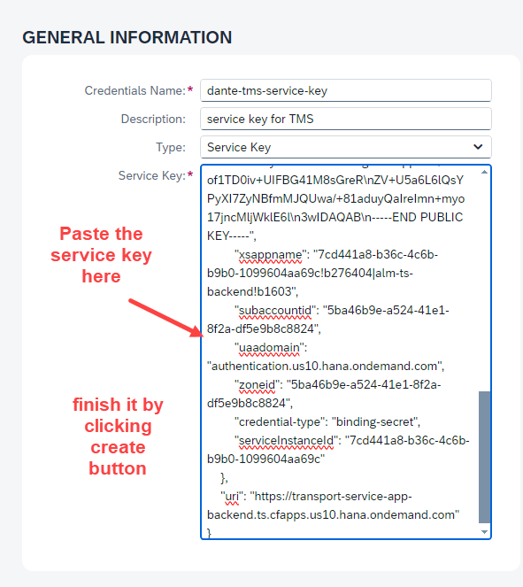
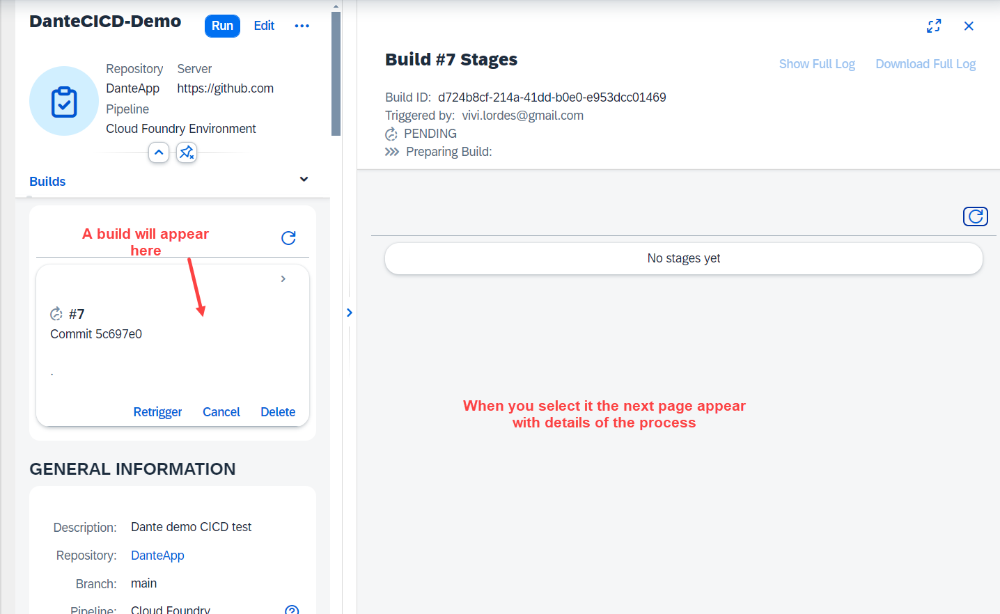

## CAPM - Day 12 - Extension CI/CD

### CI - CD Pipeline in SAP BTP cloud 

</br>
</br>
</br>

### Prerequisite your BAS account should have an active git repository to perfrom CI and CD 
</br> if github integration is not done earlier kindly perform this 
</br> [BAS Github integration](https://github.com/Octavius-Dante/Tetra_Proxima/tree/main/BAS_GIT_integration)
</br>
</br>
</br>

An overview of the process
</br>
</br>

</br>
</br>

<details>
<summary> <b> 1. Subscribing CI and CD services in BTP </b> </summary>
</br>
</br>

Create a subscription on Continuos Integration & Delivery in BTP account - Service 1
</br> 
</br>


Create a subscription on Cloud Transport Mangement - Service 2 
</br> 
</br>

</br>
</br>


</br>
</br>
</details>

<details>
<summary> <b> 2. Granting Roles for CI / CD service</b> </summary>
</br>
</br>

4 roles are needed for this service 
</br>

1. CICD Service Administrator
2. CICD Service Developer
3. TMS_LandscapeOperator_RC
4. TMS_Viewer_RC
</br>
</br>

Go to user sub-section in Security section on BTP account 
</br>
</br>

</br>
</br>

</br>
</br>

</br>
</br>

</br>
</br>

</br>
</br>
</details>


<details>
<summary> <b> 3. Create another landscape </b> </summary>
</br>
</br>

Create another sub account and space to simulate Quality and Production Landscape
</br>
</br>

</br>
</br>

Create spaces qlt and prd 
</br>
</br>

</br>
</br>

</br>
</br>

</br>
</br>

</br>
</br>

</br>
</br>

</br>
</br>
</details>


<details>
<summary> <b> 4. Create Destinations for this System Landscapes </b> </summary>
</br>
</br>

**Default Destination setting for this CICD**
</br>
</br> Type : HTTP
</br> Proxy Type : Internet
</br> Authentication : BasicAuthentication
</br>
</br>

We need to create destination in this section 
</br> 
</br>

</br>
</br>

we have to refer SAP's official documents for creating destination for (CICD ) and Cloud transport 
</br> refer the link for official document found through google search : 
</br>
</br> [Cloud transport mgmt Oauth2 password authentication](https://help.sap.com/docs/cloud-transport-management/sap-cloud-transport-management/creating-destinations-using-sap-cloud-deployment-service-with-oauth2password-authentication)
</br>
</br> [Cloud transport mgmt Basic authentication](https://help.sap.com/docs/cloud-transport-management/sap-cloud-transport-management/creating-destinations-using-sap-cloud-deployment-service-with-basic-authentication) -- this is what we used 
</br>
</br>

</br>
</br>

Click create destination 
</br>
</br>

</br>
</br>

Enter the destination details 
</br>
</br>

</br>
</br>

Paste the link from the sap document page and modify it 

</br> the link value should be repalced as shown below 
</br> 
</br> domain : This is the domain of your second sub account 
</br> myorg : This is the org name of your second sub account 
</br> myspace : This is the space name in your second sub account 
</br> 
</br> 

```html

// Original Link
https://deploy-service.cf.<domain>/slprot/<myorg>/<myspace>/slp

API Endpoint: https://api.cf.us10-001.hana.ondemand.com
Org Name: 31dfa10dtrial_quality-prod-6cvvjzsk
Space Name : QLT or PRD

// Grab only this part : us10-001.hana.ondemand.com

domain : us10-001.hana.ondemand.com
myorg : 31dfa10dtrial_quality-prod-6cvvjzsk
myspace : QLT

// Final Link should look like this -- this should go in URL part of destination
https://deploy-service.cf.us10-001.hana.ondemand.com/slprot/31dfa10dtrial_quality-prod-6cvvjzsk/QLT/slp

```

</br>
</br>

</br>
</br>

</br>
</br>

</br>
</br>

Test the connection for confirmation
</br>
</br>

</br>
</br>

</br>
</br>

Clone the connection and create it for PRD 
</br>
</br>

</br>
</br>

</br>
</br>
</details>


<details>
<summary> <b> 5. Start Github Integration for CI and CD - PART 1 - Account setup</b> </summary>
</br>
</br>

Launch the Continuous integration from instance and subscription section
</br>
</br>

</br>
</br>

</br>
</br>

</br>
</br>

</br>
</br>

</br>
</br>

Now will register our BTP repository
</br>
</br>

</br>
</br>

</br>
</br>

</br>
</br>

Change the Github repository visibility to PUBLIC so the credentials is not required
</br> now the github repository is private in my case so i mantianed a credential for (github account and password)
</br>
</br>

</br>
</br>

We need to add webhook to github account so creating webhook first
</br>
</br>

</br>
</br>

</br>
</br>

</br>
</br>

</br>
</br>

</br>
</br>

</br>
</br>

</br>
</br>
</details>

<details>
<summary> <b> 6. Start Github Integration for CI and CD - PART 2 - Github Webhook link</b> </summary>
</br>
</br> Goto Seting of your github repository and paste the generated webhook secret as shown below 
</br>
</br>

</br>
</br>

</br>
</br>

</br>
</br>

</br>
</br>

</br>
</br>

</br>
</br>

</br>
</br>

</br>
</br>
</details>

<details>
<summary> <b> 7. Start Github Integration for CI and CD - PART 3 - Job definition</b> </summary>
</br>
</br>

Let's define a Job in CICD as shown below
</br>
</br>

</br>
</br>

</br>
</br>

There is no Code check or sysntax check or unit testing so leave it untouched.
</br>
</br>

</br>
</br>

</br>
</br>

</br>
</br>

</br>
</br>

</br>
</br>

</br>
</br>

</br>
</br>

We need to create an instance (Cloud transport management) -
</br>
</br>

</br>
</br>

</br>
</br>

</br>
</br>

</br>
</br>

</br>
</br>

</br>
</br>

</br>
</br>

</br>
</br>

</br>
</br>

</br>
</br>

GO back to CICD - Jobs section and create a credentials for service key
</br>
</br>

</br>
</br>

</br>
</br>

Now go back to the Job and link the service key credential we creataed earlier
</br>
</br>

</br>
</br>

</br>
</br>

</br>
</br>
</details>


<details>
<summary> <b> 8. Defining Node for Continuous delivery - Cloud transport management system</b> </summary>
</br>
</br>

Goto Subscription and launch Cloud transport management
</br>
</br>

</br>
</br>

</br>
</br>

</br>
</br>


Defining node 
</br>allow upload to node option means somebody can pull the changes from dev branch and push it to quality branch 
</br>
</br>

</br>
</br>

low code no code approach so only node connection (Defining Prod Node)
</br>
</br>

</br>
</br>

</br>
</br>

</br>
</br>

</br>
</br>

</br>
</br>
So this concludes the landscape definition for continuous delivery  
</br>
</br>
</details>

<details>
<summary> <b> 9. Testing CI / CD flow with code changes </b> </summary>
</br>
</br>

</br>
</br>

</br>
</br>

Watch the job section in CI/CD when git push happens there will be build details listed in this section 
</br>
</br>

</br>
</br>

</br>
</br>

</br>
</br>

</br>
</br>

</br>
</br>

## Build failure error analysis 

<details>
<summary> Build log (error) for reference </summary>

</br>
</br>

```bat

Stage Logs (DanteCICD-Demo #18 - Build)
[2024-04-29T20:17:50.278Z] [INFO] No runFirst command defined for current stage (Build). Will not execute additional commands step
[2024-04-29T20:17:50.709Z] Trying to acquire lock on [DanteCICD-Demo]
[2024-04-29T20:17:50.712Z] Resource [DanteCICD-Demo] did not exist. Created.
[2024-04-29T20:17:50.715Z] Lock acquired on [DanteCICD-Demo]
[2024-04-29T20:17:50.746Z] Running on Jenkins in /jenkins_home/workspace/DanteCICD-Demo@2
[2024-04-29T20:17:50.793Z] Unstash content: pipelineConfigAndTests
[2024-04-29T20:17:50.827Z] Unstash content: source
[2024-04-29T20:17:51.618Z] Unstash content: cloudcitransfer
[2024-04-29T20:17:52.068Z] --- Begin library step of: buildExecute ---
[2024-04-29T20:17:52.642Z] --- Begin library step of: mtaBuild ---
[2024-04-29T20:17:52.919Z] + '[' -x ./piper ]
[2024-04-29T20:17:52.931Z] Found piper binary in the workspace - skipping unstash
[2024-04-29T20:17:52.949Z] Unstash content: pipelineConfigAndTests
[2024-04-29T20:17:53.014Z] Step params [:]
[2024-04-29T20:17:53.055Z] PIPER_parametersJSON: {}
[2024-04-29T20:17:53.326Z] + ./piper getConfig --contextConfig --stepMetadata .pipeline/tmp/metadata/mtaBuild.yaml --defaultConfig .pipeline/.pipeline/cicdCommonBaseDefaults.yml,.pipeline/.pipeline/cicdPipelineSpecificDefaults.yml --ignoreCustomDefaults
[2024-04-29T20:17:53.327Z] time="2024-04-29T20:17:53Z" level=info msg="Version 3ae51e266142877d03c7f4dda5fe21668ba590dd" library=SAP/jenkins-library
[2024-04-29T20:17:53.327Z] time="2024-04-29T20:17:53Z" level=info msg="Printing stepName " library=SAP/jenkins-library
[2024-04-29T20:17:53.355Z] Context Config: [dockerImage:devxci/mbtci-java19-node18@sha256:1b319254758c8ae18e03c5cba7d9aa019f0aa0798db44eca5116c7d7290bdcf9, dockerPullImage:false]
[2024-04-29T20:17:53.375Z] [INFO] executing pipeline step 'mtaBuild' with docker image 'devxci/mbtci-java19-node18@sha256:1b319254758c8ae18e03c5cba7d9aa019f0aa0798db44eca5116c7d7290bdcf9'
[2024-04-29T20:17:53.903Z] --- Begin library step of: dockerExecute ---
[2024-04-29T20:17:54.735Z] --- Begin library step of: dockerExecuteOnKubernetes ---
[2024-04-29T20:17:54.918Z] Stash content: workspace-45afb648-ee41-45e8-bc12-cfe65cd18d97 (includes: **/*, excludes: nohup.out, useDefaultExcludes: true, allowEmpty: true)
[2024-04-29T20:17:59.442Z] Stashed 74 file(s)
[2024-04-29T20:18:10.527Z] Created Pod: kubernetes steward-run-plwpn-main-tn4x7/dynamic-agent-45afb648-ee41-45e8-bc12-cfe65cd18d97-bl87b-zzrcb
[2024-04-29T20:18:14.541Z] Still waiting to schedule task
[2024-04-29T20:18:14.542Z] Waiting for next available executor on ‘dynamic-agent-45afb648-ee41-45e8-bc12-cfe65cd18d97-bl87b-zzrcb’
[2024-04-29T20:18:26.942Z] Agent dynamic-agent-45afb648-ee41-45e8-bc12-cfe65cd18d97-bl87b-zzrcb is provisioned from template dynamic-agent-45afb648-ee41-45e8-bc12-cfe65cd18d97-bl87b
[2024-04-29T20:18:27.160Z] Running on dynamic-agent-45afb648-ee41-45e8-bc12-cfe65cd18d97-bl87b-zzrcb in /home/jenkins/agent/workspace/DanteCICD-Demo
[2024-04-29T20:18:27.965Z] ContainerConfig: [name:container-exec]
[2024-04-29T20:18:29.020Z] Unstash content: workspace-45afb648-ee41-45e8-bc12-cfe65cd18d97
[2024-04-29T20:18:32.031Z] invalidate stash workspace-45afb648-ee41-45e8-bc12-cfe65cd18d97
[2024-04-29T20:18:32.776Z] Stash content: workspace-45afb648-ee41-45e8-bc12-cfe65cd18d97 (includes: **/*.*, excludes: **/*, useDefaultExcludes: true, allowEmpty: true)
[2024-04-29T20:18:33.389Z] Warning: overwriting stash ‘workspace-45afb648-ee41-45e8-bc12-cfe65cd18d97’
[2024-04-29T20:18:33.523Z] Stashed 0 file(s)
[2024-04-29T20:18:34.019Z] [INFO][dockerExecute] Executing inside a Kubernetes Pod. Docker image: devxci/mbtci-java19-node18@sha256:1b319254758c8ae18e03c5cba7d9aa019f0aa0798db44eca5116c7d7290bdcf9
[2024-04-29T20:18:36.110Z] + ./piper writePipelineEnv
[2024-04-29T20:18:36.111Z] time="2024-04-29T20:18:35Z" level=info msg="Version 3ae51e266142877d03c7f4dda5fe21668ba590dd" library=SAP/jenkins-library
[2024-04-29T20:18:36.182Z] Unstash content: pipelineStepReports
[2024-04-29T20:18:36.217Z] Unstash failed: pipelineStepReports (No such saved stash ‘pipelineStepReports’)
[2024-04-29T20:18:36.949Z] + ./piper mtaBuild --defaultConfig .pipeline/.pipeline/cicdCommonBaseDefaults.yml,.pipeline/.pipeline/cicdPipelineSpecificDefaults.yml --ignoreCustomDefaults
[2024-04-29T20:18:36.950Z] time="2024-04-29T20:18:36Z" level=info msg="Version 3ae51e266142877d03c7f4dda5fe21668ba590dd" library=SAP/jenkins-library
[2024-04-29T20:18:36.950Z] info  mtaBuild - running command: npm config get registry
[2024-04-29T20:18:37.207Z] info  mtaBuild - Discovered pre-configured npm registry registry with value https://registry.npmjs.org/
[2024-04-29T20:18:37.207Z] 
[2024-04-29T20:18:37.207Z] info  mtaBuild - "mta.yaml" file found in project sources
[2024-04-29T20:18:37.208Z] info  mtaBuild - No timestamp contained in "mta.yaml". File has not been modified.
[2024-04-29T20:18:37.208Z] info  mtaBuild - Executing mta build call: "mbt build --mtar dancap.mtar --platform CF --source ./ --target /home/jenkins/agent/workspace/DanteCICD-Demo"
[2024-04-29T20:18:37.208Z] info  mtaBuild - running command: mbt build --mtar dancap.mtar --platform CF --source ./ --target /home/jenkins/agent/workspace/DanteCICD-Demo
[2024-04-29T20:18:37.466Z] info  mtaBuild - [2024-04-29 20:18:37]  INFO Cloud MTA Build Tool version 1.2.25
[2024-04-29T20:18:37.466Z] info  mtaBuild - [2024-04-29 20:18:37]  INFO generating the "Makefile_20240429201837.mta" file...
[2024-04-29T20:18:37.466Z] info  mtaBuild - [2024-04-29 20:18:37]  INFO done
[2024-04-29T20:18:37.466Z] info  mtaBuild - [2024-04-29 20:18:37]  INFO executing the "make -f Makefile_20240429201837.mta p=CF mtar=dancap.mtar strict=true mode= t=\"/home/jenkins/agent/workspace/DanteCICD-Demo\"" command...
[2024-04-29T20:18:37.466Z] info  mtaBuild - [2024-04-29 20:18:37]  INFO validating the MTA project
[2024-04-29T20:18:37.467Z] info  mtaBuild - [2024-04-29 20:18:37]  INFO running the "before-all" build...
[2024-04-29T20:18:37.467Z] info  mtaBuild - [2024-04-29 20:18:37]  INFO executing the "npx -p @sap/cds-dk cds build --production" command...
[2024-04-29T20:18:38.398Z] warn  mtaBuild - npm WARN exec The following package was not found and will be installed: @sap/cds-dk@7.8.2
[2024-04-29T20:18:46.484Z] info  mtaBuild - ........building project [/home/jenkins/agent/workspace/DanteCICD-Demo], clean [true]
[2024-04-29T20:18:46.484Z] info  mtaBuild - cds-dk [7.8.2], cds [7.8.1], compiler [4.8.0], home [/home/mta/.npm/_npx/b993340195f82cd5/node_modules/@sap/cds-dk/node_modules/@sap/cds]
[2024-04-29T20:18:46.485Z] info  mtaBuild - 
[2024-04-29T20:18:46.485Z] info  mtaBuild - {
[2024-04-29T20:18:46.485Z] info  mtaBuild -   build: {
[2024-04-29T20:18:46.485Z] info  mtaBuild -     target: 'gen',
[2024-04-29T20:18:46.485Z] info  mtaBuild -     tasks: [
[2024-04-29T20:18:46.485Z] info  mtaBuild -       { for: 'nodejs', src: 'srv', options: { model: ['db', 'srv', 'app'] }}
[2024-04-29T20:18:46.485Z] info  mtaBuild -     ]
[2024-04-29T20:18:46.485Z] info  mtaBuild -   }
[2024-04-29T20:18:46.485Z] info  mtaBuild - }
[2024-04-29T20:18:46.485Z] info  mtaBuild - 
[2024-04-29T20:18:46.485Z] info  mtaBuild - done > wrote output to:
[2024-04-29T20:18:46.486Z] info  mtaBuild -    gen/srv/.cdsrc.json
[2024-04-29T20:18:46.486Z] info  mtaBuild -    gen/srv/package-lock.json
[2024-04-29T20:18:46.486Z] info  mtaBuild -    gen/srv/package.json
[2024-04-29T20:18:46.486Z] info  mtaBuild -    gen/srv/srv/CatalogService.js
[2024-04-29T20:18:46.486Z] info  mtaBuild -    gen/srv/srv/_i18n/i18n.json
[2024-04-29T20:18:46.486Z] info  mtaBuild -    gen/srv/srv/csn.json
[2024-04-29T20:18:46.486Z] info  mtaBuild -    gen/srv/srv/demoservice.js
[2024-04-29T20:18:46.486Z] info  mtaBuild -    gen/srv/srv/odata/v4/CatalogService.xml
[2024-04-29T20:18:46.486Z] info  mtaBuild -    gen/srv/srv/odata/v4/demoservice.xml
[2024-04-29T20:18:46.486Z] info  mtaBuild -    gen/srv/srv/server.js
[2024-04-29T20:18:46.486Z] info  mtaBuild -    gen/srv/srv/tester.http
[2024-04-29T20:18:46.487Z] info  mtaBuild - 
[2024-04-29T20:18:46.487Z] warn  mtaBuild - [WARNING] db/CDSViews.cds:1:11-21: “cds” now refers to “dancap.cds” - consider ‘using cds;’
[2024-04-29T20:18:46.487Z] warn  mtaBuild - [WARNING] srv/CatalogService.cds:14:12: “@Common.ValueList.entity” is ignored for “@Common.ValueList” as ‘viaAssociation’ is present (in entity:“CatalogService.PurchaseOrder”/element:“PARTNER_GUID_NODE_KEY”/“@Common.ValueList.entity”)
[2024-04-29T20:18:46.487Z] warn  mtaBuild - [WARNING] srv/CatalogService.cds:14:12: “@Common.ValueList.entity” is ignored for “@Common.ValueList” as ‘viaAssociation’ is present (in entity:“CatalogService.PurchaseOrder”/element:“PARTNER_GUID”/“@Common.ValueList.entity”)
[2024-04-29T20:18:46.487Z] warn  mtaBuild - [WARNING] srv/CatalogService.cds:46:12: “@Common.ValueList.entity” is ignored for “@Common.ValueList” as ‘viaAssociation’ is present (in entity:“CatalogService.PurchaseOrderItems”/element:“PRODUCT_GUID_NODE_KEY”/“@Common.ValueList.entity”)
[2024-04-29T20:18:46.487Z] warn  mtaBuild - [WARNING] srv/CatalogService.cds:46:12: “@Common.ValueList.entity” is ignored for “@Common.ValueList” as ‘viaAssociation’ is present (in entity:“CatalogService.PurchaseOrderItems”/element:“PRODUCT_GUID”/“@Common.ValueList.entity”)
[2024-04-29T20:18:46.488Z] info  mtaBuild - build completed in 596 ms
[2024-04-29T20:18:46.488Z] info  mtaBuild - 
[2024-04-29T20:18:46.488Z] info  mtaBuild - .[2024-04-29 20:18:46]  INFO validating the MTA project
[2024-04-29T20:18:46.488Z] error mtaBuild - [2024-04-29 20:18:46] ERROR the "mta.yaml" file is not valid: 
[2024-04-29T20:18:46.488Z] info  mtaBuild - line 49: the "gen/db" path of the "dancap-db-deployer" module does not exist
[2024-04-29T20:18:46.488Z] info  mtaBuild - make: *** [Makefile_20240429201837.mta:46: validate] Error 1
[2024-04-29T20:18:46.488Z] info  mtaBuild - Error: could not build the MTA project: could not execute the "make -f Makefile_20240429201837.mta p=CF mtar=dancap.mtar strict=true mode= t=\"/home/jenkins/agent/workspace/DanteCICD-Demo\"" command: exit status 2
[2024-04-29T20:18:46.488Z] info  mtaBuild - fatal error: errorDetails{"category":"build","correlationId":"n/a","error":"running command 'mbt' failed: cmd.Run() failed: exit status 1","library":"SAP/jenkins-library","message":"failed to execute mta build","result":"failure","stepName":"mtaBuild","time":"2024-04-29T20:18:46.256399596Z"}
[2024-04-29T20:18:46.488Z] fatal mtaBuild - failed to execute mta build - running command 'mbt' failed: cmd.Run() failed: exit status 1
[2024-04-29T20:18:46.488Z] info  mtaBuild - persisting reports to GCS is disabled, because gcsBucketId is empty
[2024-04-29T20:18:46.489Z] info  mtaBuild - Step telemetry data:{"StepStartTime":"2024-04-29 20:18:36.843610842 +0000 UTC","PipelineURLHash":"50f013532a9770a2c2cfdc38b7581dd01df69b70","BuildURLHash":"50f013532a9770a2c2cfdc38b7581dd01df69b70","StageName":"Build","StepName":"mtaBuild","ErrorCode":"1","StepDuration":"9413","ErrorCategory":"build","CorrelationID":"n/a","PiperCommitHash":"3ae51e266142877d03c7f4dda5fe21668ba590dd","ErrorDetail":{"category":"build","correlationId":"n/a","error":"running command 'mbt' failed: cmd.Run() failed: exit status 1","library":"SAP/jenkins-library","message":"failed to execute mta build","result":"failure","stepName":"mtaBuild","time":"2024-04-29T20:18:46.256399596Z"}}
[2024-04-29T20:18:47.259Z] + ./piper readPipelineEnv
[2024-04-29T20:18:47.260Z] time="2024-04-29T20:18:47Z" level=info msg="Version 3ae51e266142877d03c7f4dda5fe21668ba590dd" library=SAP/jenkins-library
[2024-04-29T20:18:47.300Z] Transfer Influx data
[2024-04-29T20:18:47.345Z] Stash content: pipelineStepReports (includes: .pipeline/stepReports/**, excludes: , useDefaultExcludes: true, allowEmpty: true)
[2024-04-29T20:18:47.385Z] Stashed 0 file(s)
[2024-04-29T20:18:48.142Z] Stash content: container-45afb648-ee41-45e8-bc12-cfe65cd18d97 (includes: **/*, excludes: **/node_modules/**,nohup.out,.git/**, useDefaultExcludes: true, allowEmpty: true)
[2024-04-29T20:18:52.969Z] Stashed 90 file(s)
[2024-04-29T20:18:53.123Z] Unstash content: container-45afb648-ee41-45e8-bc12-cfe65cd18d97
[2024-04-29T20:18:54.852Z] invalidate stash container-45afb648-ee41-45e8-bc12-cfe65cd18d97
[2024-04-29T20:18:54.872Z] Stash content: container-45afb648-ee41-45e8-bc12-cfe65cd18d97 (includes: **/*.*, excludes: **/*, useDefaultExcludes: true, allowEmpty: true)
[2024-04-29T20:18:54.891Z] Warning: overwriting stash ‘container-45afb648-ee41-45e8-bc12-cfe65cd18d97’
[2024-04-29T20:18:54.898Z] Stashed 0 file(s)
[2024-04-29T20:18:55.012Z] ----------------------------------------------------------
[2024-04-29T20:18:55.013Z] --- An error occurred in the library step: dockerExecuteOnKubernetes
[2024-04-29T20:18:55.013Z] ----------------------------------------------------------
[2024-04-29T20:18:55.013Z] 
[2024-04-29T20:18:55.013Z] The following parameters were available to the step:
[2024-04-29T20:18:55.013Z] ***
[2024-04-29T20:18:55.013Z] *** to show step parameters, set verbose:true in general pipeline configuration
[2024-04-29T20:18:55.013Z] *** WARNING: this may reveal sensitive information. ***
[2024-04-29T20:18:55.013Z] ***
[2024-04-29T20:18:55.013Z] 
[2024-04-29T20:18:55.013Z] The error was:
[2024-04-29T20:18:55.013Z] ***
[2024-04-29T20:18:55.013Z] hudson.AbortException: [mtaBuild] Step execution failed (category: build). Error: running command 'mbt' failed: cmd.Run() failed: exit status 1
[2024-04-29T20:18:55.013Z] ***
[2024-04-29T20:18:55.013Z] 
[2024-04-29T20:18:55.013Z] Further information:
[2024-04-29T20:18:55.013Z] * Documentation of library step dockerExecuteOnKubernetes: https://sap.github.io/jenkins-library/steps/dockerExecuteOnKubernetes/
[2024-04-29T20:18:55.014Z] * Source code of library step dockerExecuteOnKubernetes: https://github.com/SAP/jenkins-library/blob/master/vars/dockerExecuteOnKubernetes.groovy
[2024-04-29T20:18:55.014Z] * Library documentation: https://sap.github.io/jenkins-library/
[2024-04-29T20:18:55.014Z] * Library repository: https://github.com/SAP/jenkins-library/
[2024-04-29T20:18:55.014Z] 
[2024-04-29T20:18:55.014Z] ----------------------------------------------------------
[2024-04-29T20:18:55.014Z] --- End library step of: dockerExecuteOnKubernetes ---
[2024-04-29T20:18:55.059Z] ----------------------------------------------------------
[2024-04-29T20:18:55.059Z] --- An error occurred in the library step: dockerExecute
[2024-04-29T20:18:55.060Z] ----------------------------------------------------------
[2024-04-29T20:18:55.060Z] 
[2024-04-29T20:18:55.060Z] The following parameters were available to the step:
[2024-04-29T20:18:55.060Z] ***
[2024-04-29T20:18:55.060Z] *** to show step parameters, set verbose:true in general pipeline configuration
[2024-04-29T20:18:55.060Z] *** WARNING: this may reveal sensitive information. ***
[2024-04-29T20:18:55.060Z] ***
[2024-04-29T20:18:55.060Z] 
[2024-04-29T20:18:55.060Z] The error was:
[2024-04-29T20:18:55.060Z] ***
[2024-04-29T20:18:55.060Z] hudson.AbortException: [mtaBuild] Step execution failed (category: build). Error: running command 'mbt' failed: cmd.Run() failed: exit status 1
[2024-04-29T20:18:55.060Z] ***
[2024-04-29T20:18:55.061Z] 
[2024-04-29T20:18:55.061Z] Further information:
[2024-04-29T20:18:55.061Z] * Documentation of library step dockerExecute: https://sap.github.io/jenkins-library/steps/dockerExecute/
[2024-04-29T20:18:55.061Z] * Source code of library step dockerExecute: https://github.com/SAP/jenkins-library/blob/master/vars/dockerExecute.groovy
[2024-04-29T20:18:55.061Z] * Library documentation: https://sap.github.io/jenkins-library/
[2024-04-29T20:18:55.061Z] * Library repository: https://github.com/SAP/jenkins-library/
[2024-04-29T20:18:55.061Z] 
[2024-04-29T20:18:55.061Z] ----------------------------------------------------------
[2024-04-29T20:18:55.061Z] --- End library step of: dockerExecute ---
[2024-04-29T20:18:55.136Z] ----------------------------------------------------------
[2024-04-29T20:18:55.136Z] --- An error occurred in the library step: mtaBuild
[2024-04-29T20:18:55.136Z] ----------------------------------------------------------
[2024-04-29T20:18:55.136Z] 
[2024-04-29T20:18:55.136Z] The following parameters were available to the step:
[2024-04-29T20:18:55.137Z] ***
[2024-04-29T20:18:55.137Z] *** to show step parameters, set verbose:true in general pipeline configuration
[2024-04-29T20:18:55.137Z] *** WARNING: this may reveal sensitive information. ***
[2024-04-29T20:18:55.137Z] ***
[2024-04-29T20:18:55.137Z] 
[2024-04-29T20:18:55.137Z] The error was:
[2024-04-29T20:18:55.137Z] ***
[2024-04-29T20:18:55.137Z] hudson.AbortException: [mtaBuild] Step execution failed (category: build). Error: running command 'mbt' failed: cmd.Run() failed: exit status 1
[2024-04-29T20:18:55.137Z] ***
[2024-04-29T20:18:55.137Z] 
[2024-04-29T20:18:55.138Z] Further information:
[2024-04-29T20:18:55.138Z] * Documentation of library step mtaBuild: https://sap.github.io/jenkins-library/steps/mtaBuild/
[2024-04-29T20:18:55.138Z] * Source code of library step mtaBuild: https://github.com/SAP/jenkins-library/blob/master/vars/mtaBuild.groovy
[2024-04-29T20:18:55.138Z] * Library documentation: https://sap.github.io/jenkins-library/
[2024-04-29T20:18:55.138Z] * Library repository: https://github.com/SAP/jenkins-library/
[2024-04-29T20:18:55.138Z] 
[2024-04-29T20:18:55.138Z] ----------------------------------------------------------
[2024-04-29T20:18:55.138Z] --- End library step of: mtaBuild ---
[2024-04-29T20:18:55.180Z] ----------------------------------------------------------
[2024-04-29T20:18:55.180Z] --- An error occurred in the library step: buildExecute
[2024-04-29T20:18:55.180Z] ----------------------------------------------------------
[2024-04-29T20:18:55.180Z] 
[2024-04-29T20:18:55.180Z] The following parameters were available to the step:
[2024-04-29T20:18:55.181Z] ***
[2024-04-29T20:18:55.181Z] *** to show step parameters, set verbose:true in general pipeline configuration
[2024-04-29T20:18:55.181Z] *** WARNING: this may reveal sensitive information. ***
[2024-04-29T20:18:55.181Z] ***
[2024-04-29T20:18:55.181Z] 
[2024-04-29T20:18:55.181Z] The error was:
[2024-04-29T20:18:55.181Z] ***
[2024-04-29T20:18:55.181Z] hudson.AbortException: [mtaBuild] Step execution failed (category: build). Error: running command 'mbt' failed: cmd.Run() failed: exit status 1
[2024-04-29T20:18:55.181Z] ***
[2024-04-29T20:18:55.181Z] 
[2024-04-29T20:18:55.181Z] Further information:
[2024-04-29T20:18:55.181Z] * Documentation of library step buildExecute: https://sap.github.io/jenkins-library/steps/buildExecute/
[2024-04-29T20:18:55.181Z] * Source code of library step buildExecute: https://github.com/SAP/jenkins-library/blob/master/vars/buildExecute.groovy
[2024-04-29T20:18:55.181Z] * Library documentation: https://sap.github.io/jenkins-library/
[2024-04-29T20:18:55.182Z] * Library repository: https://github.com/SAP/jenkins-library/
[2024-04-29T20:18:55.182Z] 
[2024-04-29T20:18:55.182Z] ----------------------------------------------------------
[2024-04-29T20:18:55.182Z] --- End library step of: buildExecute ---
[2024-04-29T20:18:55.201Z] Stash content: cloudcitransfer (includes: cloudcitransfer/**/*, excludes: cloudcitransfer/**/node_modules/**)
[2024-04-29T20:18:55.220Z] Warning: overwriting stash ‘cloudcitransfer’
[2024-04-29T20:18:55.221Z] Stashed 2 file(s)
[2024-04-29T20:18:55.298Z] Lock released on resource [DanteCICD-Demo]

```
</details>
</br>
</br>

</details>

<!--

<details>
<summary> <b> ALL CODE CHANGES - TODAY SESSION </b> </summary>
</br>
</br>

</br>
</br>

</br>
</br>
</details>

-->


</br>
</br>
</br>
</br>
</br>
</br>
</br>
</br>

# --------- End of CAPM Development ---------

<p align="center"> 
	
</br>
</br>

#### Previous Sessions
</br>
<!--
- [x] <a href="https://github.com/Octavius-Dante/Tetra_Proxima/tree/main/CAPM-DAY-12"> CAPM Day 12 - Extension CI CD</a>
-->

- [x] <a href="https://github.com/Octavius-Dante/Tetra_Proxima/tree/main/CAPM-DAY-11"> CAPM Day 11 - S4HANA Side by Side</a>
- [x] <a href="https://github.com/Octavius-Dante/Tetra_Proxima/tree/main/CAPM-DAY-10"> CAPM Day 10 - Side by Side extension</a>
- [x] <a href="https://github.com/Octavius-Dante/Tetra_Proxima/tree/main/CAPM-DAY-9"> CAPM Day 9 - Serverless Fiori App</a>
- [x] <a href="https://github.com/Octavius-Dante/Tetra_Proxima/tree/main/CAPM-DAY-8"> CAPM Day 8 - CAPM Security XSUAA</a>
- [x] <a href="https://github.com/Octavius-Dante/Tetra_Proxima/tree/main/CAPM-DAY-7"> CAPM Day 7 - HANA and Deployment</a>
- [x] <a href="https://github.com/Octavius-Dante/Tetra_Proxima/tree/main/CAPM-DAY-6"> CAPM Day 6 - Fiori App Draft</a>
- [x] <a href="https://github.com/Octavius-Dante/Tetra_Proxima/tree/main/CAPM-DAY-5"> CAPM Day 5 - Fiori Elements</a>
- [x] <a href="https://github.com/Octavius-Dante/Tetra_Proxima/tree/main/CAPM-DAY-4"> CAPM Day 4 - Generic Handlers</a>
- [x] <a href="https://github.com/Octavius-Dante/Tetra_Proxima/tree/main/CAPM-DAY-3"> CAPM Day 3 - EPM DB and CDS Views</a>
- [x] <a href="https://github.com/Octavius-Dante/Tetra_Proxima/tree/main/CAPM-DAY-2"> CAPM Day 2 - Aspects and Reuse Tables</a>
- [x] <a href="https://github.com/Octavius-Dante/Tetra_Proxima/tree/main/CAPM-DAY-1"> CAPM Day 1 - First CAP App </a>

</br>
</br>

</p>
