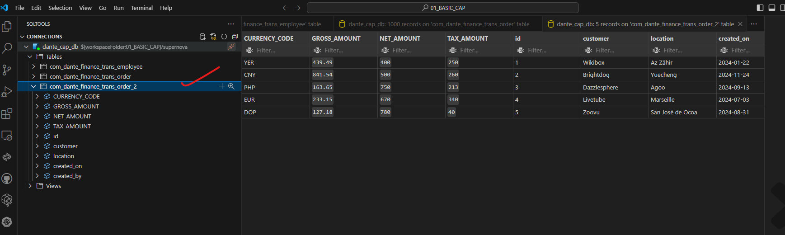

## CAPM - Day 2

#### Correction to yesterday's CAP program

</br>
</br>

The program was using <b>'req.body.name'</b> in return parameter statement it is corrected 
 
</br>
</br>

```JS
const Myservice = function(srv){
    // this code bloc is like DPC extension class in SAP ODATA services  
    srv.on('helloCAP', (req,res) => {
        return "Hello CAP cloud developers, Welcome " + req.data.name;
    });
}

// return Myservice;
module.exports = Myservice;
```
</br>
</br>

#### End result 
</br>
</br>
   
</br>
</br>
use the following url parameter value to see the passed value 
</br>
</br>

```url
http://localhost:4004/odata/v4/my/helloCAP(name='dante')
```
</br>
</br>
   
</br>
</br>

## Database Concepts 
</br>

### Reuse Types and aspects 
</br>
</br>

<p>
When we design database artifacts, at times we have many simialr objects and their datatypes.
</br> Instead of hardcoding the type as primitive type, it is recommended to create custom types.
</br> Using custom data type increase reusability and reduce maintenance.
</br> when we create a seperate CDS file for reuse purpose and consume it, this file contains enumerators and aspects. 
</br>
</br> There are common aspect provided by SAP, primary key generation, currency.
</br> Admin data : created by, created date, changed by, changed date - these are called temporal data
</br>
</br>
<b>Aspect means a variable defined in seperate file whcih can be accessed globally. </b>
</br> it is combination of many fields (Structures in ABAP).
</br>
</p>

</br>
</br>
create another table to the cds file employee as mentioned below 
</br>
</br>

```cds 

context trans {
    entity order {
        key id         : int16;
            customer   : String;
            location   : String;
            total      : Decimal(10, 2);
            currency   : String;
            created_on : Date;
            created_by : String;
    };

    entity employee {
        key id   : int16;
            name : String;
            city : String;
    }
}

```

</br>
</br>
define another cds file named commons.cds in db folder 
</br>
define a data type here this is like a global variable ready to be accessed by our table fields
this global definition is called aspect in SAP capm cds terminology 
</br>
</br>

</br>
</br>

</br>
</br>

```cds

namespace com.dante.commons;

// similar like data element in abap defining in common.cds will make it available for global access
type Guid: String(32);

```

</br>
</br>
create sample data for our employee table by copying and editing our old csv data file as shown below
</br>
</br>


</br>
</br>

alterations to the main cds file (sample.cds)  // id data type int 16 is replaced with global variable 

</br>
</br>

```cds

namespace com.dante.finance;

// internal definition of namesapce  from './file name'

// accessing the global aspect for consumption 
using { com.dante.commons } from './commons';


context trans {
    entity order {
        key id         : commons.Guid;
            customer   : String;
            location   : String;
            total      : Decimal(10, 2);
            currency   : String;
            created_on : Date;
            created_by : String;
    };

    entity employee {
        key id   : commons.Guid;
            name : String;
            city : String;
    }
}

```

</br>
</br>

alterations to the main cds file (sample.cds)  // id data type int 16 is replaced with global variable 

</br>
</br>

defined new data types in common.cds file as mentioned below for reusability example 

</br>
</br>

```cds

namespace com.dante.commons;

// similar like data element in abap defining in common.cds will make it available for global access
type Guid   : String(32);

// Enumerator data type like predefined values for a variable 
type Gender : String(1) enum {

    male   = 'M';
    female = 'f';
    undisclosed = 'u';
};

// Amount data type with currency property 
type AmountX : Decimal(10,2)@(
     semantics.Amount.currencyCode : 'CURRENCY_CODE',
     sap.unit:'CURRENCY_CODE'
);

// Structure data type with resuable property of amount 
aspect Amount :{
    CURRENCY_CODE : String(4);
    GROSS_AMOUNT: AmountX;
    NET_AMOUNT: AmountX;
    TAX_AMOUNT :AmountX;
}


```

</br>
</br>

using of the Amount global varaible from common.cds into sample.cds file 

</br>
</br>

```cds
namespace com.dante.finance;

// internal definition of namesapce  from './file name' 
using { com.dante.commons } from './commons';


context trans {
    entity order {
        key id         : commons.Guid;
            customer   : String;
            location   : String;
            total      : Decimal(10, 2);
            currency   : String;
            created_on : Date;
            created_by : String;
    };

    entity order_2 : commons.Amount { 
        key id         : commons.Guid;
            customer   : String;
            location   : String;
            created_on : Date;
            created_by : String;
    };

    entity employee {
        key id   : commons.Guid;
            name : String;
            city : String;
            Gender : commons.Gender;
    }
}
```

</br>
</br>

order_2 table data *.csv file 
</br>

```csv

id,customer,location,created_on,created_by,GROSS_AMOUNT,NET_AMOUNT,TAX_AMOUNT,CURRENCY_CODE
1,Wikibox,Az Zāhir,2024-01-22,Aime,439.49,400,250,YER
2,Brightdog,Yuecheng,2024-11-24,Adelice,841.54,500,260,CNY
3,Dazzlesphere,Agoo,2024-09-13,Lucky,163.65,750,213,PHP
4,Livetube,Marseille,2024-07-03,Hasty,233.15,670,340,EUR
5,Zoovu,San José de Ocoa,2024-08-31,Thor,127.18,780,40,DOP

```

</br>
</br>

employeee table data *.csv file 
</br>

```csv

id,name,city,gender
1,Wikibox,Az Zāhir,m
2,Brightdog,Yuecheng,f
3,Dazzlesphere,Agoo,m
4,Livetube,Marseille,f
5,Zoovu,San José de Ocoa,m
6,Zoomcast,Bulnes,f
7,Gabtune,Daja Lorong,u
8,Gabvine,La Caya,f
9,Tagpad,Ciputih,u
10,Browsedrive,Marteleira,f

```

</br>
</br>

deploy database with different name with 3 tables 

</br>
</br>

</br>
</br>

</br>
</br>

change the DB connection to new name (supernova) and check the data of the order_2 table and employee table

</br>
</br>

</br>
</br>

</br>
</br>

### Custom aspect usage in table has been tested now will focus on standard aspect provided by sap for database

</br>
</br>

To learn detail about available aspects : https://cap.cloud.sap/docs/cds/common

</br>
</br>

> [!IMPORTANT]
> add the following block of code to your sample cds as shown below 

</br>
</br>

```cds

// SAP standard common aspects 
using { cuid, temporal, Currency, managed } from '@sap/cds/common';

```

</br>
</br>


</br>
</br>

Press ctrl + click the link on <b>'@sap/cds/common'</b> it navigates to sap standard common.cds block as shown below 

</br>
</br>


</br>
</br>


> [!NOTE]
> Following code block is for reference of sap standard - no need to create a *.cds file with this sample

</br>
</br>

```cds
/**
 * Type for an association to Languages
 *
 * See https://cap.cloud.sap/docs/cds/common#type-language
 */
type Language : Association to sap.common.Languages;

/**
 * Type for an association to Currencies
 *
 * See https://cap.cloud.sap/docs/cds/common#type-currency
 */
type Currency : Association to sap.common.Currencies;

/**
 * Type for an association to Countries
 *
 * See https://cap.cloud.sap/docs/cds/common#type-country
 */
type Country : Association to sap.common.Countries;

/**
 * Type for an association to Timezones
 *
 * See https://cap.cloud.sap/docs/cds/common#type-timezone
 */
type Timezone : Association to sap.common.Timezones;

/**
 * Entities to serve the reuse types with extensible code lists
 * including built-in support for value lists in Fiori.
 */
context sap.common {
  /**
   * Type for a language code
   */
  type Locale : String(14) @(title : '{i18n>LanguageCode}');
    //> length=14 is to accommodate values like these:
    // en_US_x_saptrc - (1Q) used as a technical SAP language code
    // en_US_x_sappsd - (2Q) used as a technical SAP language code

  /**
   * Code list for languages
   *
   * See https://cap.cloud.sap/docs/cds/common#entity-languages
   */
  entity Languages : CodeList {
    key code : Locale;
  }

  /**
   * Code list for countries
   *
   * See https://cap.cloud.sap/docs/cds/common#entity-countries
   */
  entity Countries : CodeList {
    key code : String(3) @(title : '{i18n>CountryCode}');
  }

  /**
   * Code list for currencies
   *
   * See https://cap.cloud.sap/docs/cds/common#entity-currencies
   */
  entity Currencies : CodeList {
    key code      : String(3) @(title : '{i18n>CurrencyCode}');
        symbol    : String(5) @(title : '{i18n>CurrencySymbol}');
        minorUnit : Int16     @(title : '{i18n>CurrencyMinorUnit}');
  }

  /**
   * Code list for time zones
   *
   * See https://cap.cloud.sap/docs/cds/common#entity-timezones
   */
  entity Timezones : CodeList {
    key code : String(100) @(title: '{i18n>TimeZoneCode}');
  }

  /**
   * Aspect for a code list with name and description
   *
   * See https://cap.cloud.sap/docs/cds/common#aspect-codelist
   */
  aspect CodeList @(
    cds.autoexpose,
    cds.persistence.skip : 'if-unused'
  ) {
    name  : localized String(255)  @title : '{i18n>Name}';
    descr : localized String(1000) @title : '{i18n>Description}';
  }

  /*
   * Aspect that is included by generated `.texts` entities for localized entities.
   */
  aspect TextsAspect {
    key locale: Locale;
  }
}


/**
 * Aspect for entities with canonical universal IDs
 *
 * See https://cap.cloud.sap/docs/cds/common#aspect-cuid
 */
aspect cuid {
  key ID : UUID; //> automatically filled in
}

/**
 * Aspect to capture changes by user and name
 *
 * See https://cap.cloud.sap/docs/cds/common#aspect-managed
 */
aspect managed {
  createdAt  : Timestamp @cds.on.insert : $now;
  createdBy  : User      @cds.on.insert : $user;
  modifiedAt : Timestamp @cds.on.insert : $now  @cds.on.update : $now;
  modifiedBy : User      @cds.on.insert : $user @cds.on.update : $user;
}

/**
 * Aspect for entities with temporal data
 *
 * See https://cap.cloud.sap/docs/cds/common#aspect-temporal
 */
aspect temporal {
  validFrom : Timestamp @cds.valid.from;
  validTo   : Timestamp @cds.valid.to;
}


/**
 * Canonical user ID
 */
type User : String(255);


/**
 * Aspects for extensible entities.
 */
aspect extensible {
    @cds.api.ignore extensions__ : String
};

//---------------------------------------------------------------------------
// Annotations for Fiori UIs...

annotate sap.common.CodeList with @UI.Identification : [{Value:name}];
annotate sap.common.CodeList with @cds.odata.valuelist;

annotate managed with {
  createdAt  @UI.HiddenFilter;
  createdBy  @UI.HiddenFilter;
  modifiedAt @UI.HiddenFilter;
  modifiedBy @UI.HiddenFilter;
}

annotate managed with {
  createdAt  @Core.Immutable;
  createdBy  @Core.Immutable;
}

annotate sap.common.Countries  with { code @Common.Text:name; }
annotate sap.common.Currencies with { code @Common.Text:name; }
annotate sap.common.Languages  with { code @Common.Text:name; }


//---------------------------------------------------------------------------
// Common Annotations...

annotate Language with @(
  title       : '{i18n>Language}',
  description : '{i18n>LanguageCode.Description}'
);

annotate Currency with @(
  title       : '{i18n>Currency}',
  description : '{i18n>CurrencyCode.Description}'
);

annotate Country with @(
  title       : '{i18n>Country}',
  description : '{i18n>CountryCode.Description}'
);

annotate User with @(
  title       : '{i18n>UserID}',
  description : '{i18n>UserID.Description}'
);

annotate managed with {
  createdAt  @title : '{i18n>CreatedAt}';
  createdBy  @title : '{i18n>CreatedBy}';
  modifiedAt @title : '{i18n>ChangedAt}';
  modifiedBy @title : '{i18n>ChangedBy}';
}


//---------------------------------------------------------------------------
// Temporary Workarounds...
// REVISIT: @cds.on... should automatically result in @readonly @Core.Computed

annotate managed with {
  modifiedAt @readonly;
  createdAt  @readonly;
  createdBy  @readonly;
  modifiedBy @readonly;
}

//---------------------------------------------------------------------------

```

</br>
</br>
</br>

Now the above some of the above shown standard functionalities from '@sap/cds/common' will be used in our code as shown below 

</br>
</br>

```cds

namespace com.dante.finance;

// internal definition of namesapce  from './file name' 
using { com.dante.commons } from './commons';

// SAP standard common aspects 
using { cuid, temporal, Currency, managed } from '@sap/cds/common';

context trans {
    entity order {
        key id         : commons.Guid;
            customer   : String;
            location   : String;
            total      : Decimal(10, 2);
            currency   : String;
            created_on : Date;
            created_by : String;
    };

// cuid aspect will generate automatic id key 

   entity order_2 : commons.Amount, cuid { 
        // key id         : commons.Guid;
            customer   : String;
            location   : String;
            created_on : Date;
            created_by : String;
    };

// will add managed admin aspect to the table 

    entity employee : managed{
        key id   : commons.Guid;
            name : String;
            city : String;
            Gender : commons.Gender;
    }
}

```

</br>
</br>

remove the id values from the *.csv file  as shown below 

</br>
</br>

before
</br>


after
</br>


</br>
</br>

deployed the tables to db as shwon below 
</br>
</br>


</br>
</br>
