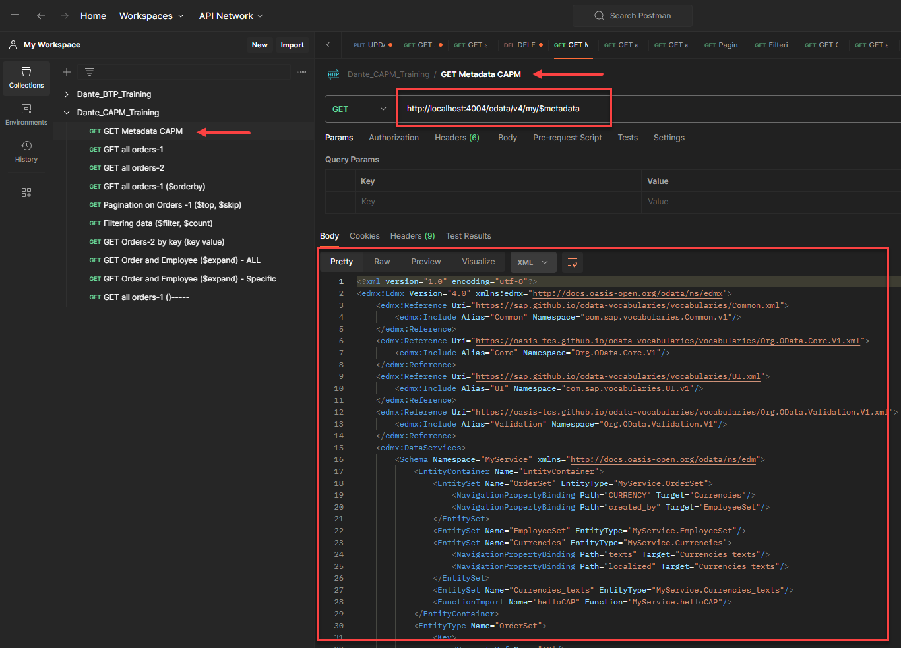
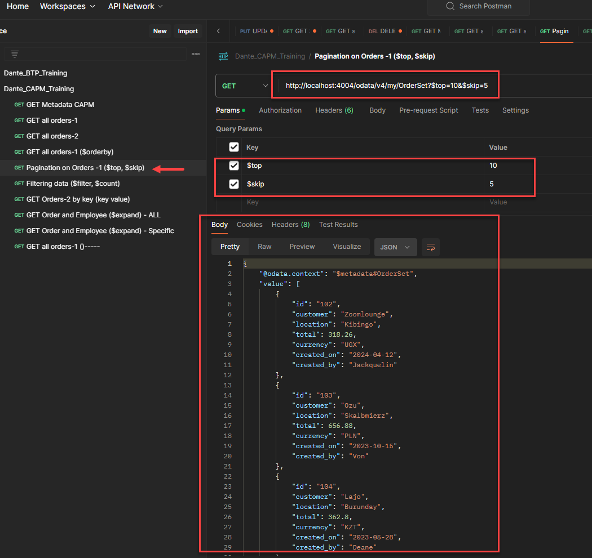

## CAPM - Day 2

#### Correction to yesterday's CAP program

</br>
</br>

The program was using <b>'req.body.name'</b> in return parameter statement it is corrected 
 
</br>
</br>

```JS
const Myservice = function(srv){
    // this code bloc is like DPC extension class in SAP ODATA services  
    srv.on('helloCAP', (req,res) => {
        return "Hello CAP cloud developers, Welcome " + req.data.name;
    });
}

// return Myservice;
module.exports = Myservice;
```
</br>
</br>

#### End result 
</br>
</br>
   
</br>
</br>
use the following url parameter value to see the passed value 
</br>
</br>

```url
http://localhost:4004/odata/v4/my/helloCAP(name='dante')
```
</br>
</br>
   
</br>
</br>

## Database Concepts 
</br>

### Reuse Types and aspects 
</br>
</br>

<p>
When we design database artifacts, at times we have many simialr objects and their datatypes.
</br> Instead of hardcoding the type as primitive type, it is recommended to create custom types.
</br> Using custom data type increase reusability and reduce maintenance.
</br> when we create a seperate CDS file for reuse purpose and consume it, this file contains enumerators and aspects. 
</br>
</br> There are common aspect provided by SAP, primary key generation, currency.
</br> Admin data : created by, created date, changed by, changed date - these are called temporal data
</br>
</br>
<b>Aspect means a variable defined in seperate file whcih can be accessed globally. </b>
</br> it is combination of many fields (Structures in ABAP).
</br>
</p>

</br>
</br>
create another table to the cds file employee as mentioned below 
</br>
</br>

```cds 

context trans {
    entity order {
        key id         : int16;
            customer   : String;
            location   : String;
            total      : Decimal(10, 2);
            currency   : String;
            created_on : Date;
            created_by : String;
    };

    entity employee {
        key id   : int16;
            name : String;
            city : String;
    }
}

```

</br>
</br>
define another cds file named commons.cds in db folder 
</br>
define a data type here this is like a global variable ready to be accessed by our table fields
this global definition is called aspect in SAP capm cds terminology 
</br>
</br>

</br>
</br>

</br>
</br>

```cds

namespace com.dante.commons;

// similar like data element in abap defining in common.cds will make it available for global access
type Guid: String(32);

```

</br>
</br>
create sample data for our employee table by copying and editing our old csv data file as shown below
</br>
</br>


</br>
</br>

alterations to the main cds file (sample.cds)  // id data type int 16 is replaced with global variable 

</br>
</br>

```cds

namespace com.dante.finance;

// internal definition of namesapce  from './file name'

// accessing the global aspect for consumption 
using { com.dante.commons } from './commons';


context trans {
    entity order {
        key id         : commons.Guid;
            customer   : String;
            location   : String;
            total      : Decimal(10, 2);
            currency   : String;
            created_on : Date;
            created_by : String;
    };

    entity employee {
        key id   : commons.Guid;
            name : String;
            city : String;
    }
}

```

</br>
</br>

alterations to the main cds file (sample.cds)  // id data type int 16 is replaced with global variable 

</br>
</br>

defined new data types in common.cds file as mentioned below for reusability example 

</br>
</br>

```cds

namespace com.dante.commons;

// similar like data element in abap defining in common.cds will make it available for global access
type Guid   : String(32);

// Enumerator data type like predefined values for a variable 
type Gender : String(1) enum {

    male   = 'M';
    female = 'f';
    undisclosed = 'u';
};

// Amount data type with currency property 
type AmountX : Decimal(10,2)@(
     semantics.Amount.currencyCode : 'CURRENCY_CODE',
     sap.unit:'CURRENCY_CODE'
);

// Structure data type with resuable property of amount 
aspect Amount :{
    CURRENCY_CODE : String(4);
    GROSS_AMOUNT: AmountX;
    NET_AMOUNT: AmountX;
    TAX_AMOUNT :AmountX;
}


```

</br>
</br>

using of the Amount global varaible from common.cds into sample.cds file 

</br>
</br>

```cds
namespace com.dante.finance;

// internal definition of namesapce  from './file name' 
using { com.dante.commons } from './commons';


context trans {
    entity order {
        key id         : commons.Guid;
            customer   : String;
            location   : String;
            total      : Decimal(10, 2);
            currency   : String;
            created_on : Date;
            created_by : String;
    };

    entity order_2 : commons.Amount { 
        key id         : commons.Guid;
            customer   : String;
            location   : String;
            created_on : Date;
            created_by : String;
    };

    entity employee {
        key id   : commons.Guid;
            name : String;
            city : String;
            Gender : commons.Gender;
    }
}
```

</br>
</br>

order_2 table data *.csv file 
</br>

```csv

id,customer,location,created_on,created_by,GROSS_AMOUNT,NET_AMOUNT,TAX_AMOUNT,CURRENCY_CODE
1,Wikibox,Az Zāhir,2024-01-22,Aime,439.49,400,250,YER
2,Brightdog,Yuecheng,2024-11-24,Adelice,841.54,500,260,CNY
3,Dazzlesphere,Agoo,2024-09-13,Lucky,163.65,750,213,PHP
4,Livetube,Marseille,2024-07-03,Hasty,233.15,670,340,EUR
5,Zoovu,San José de Ocoa,2024-08-31,Thor,127.18,780,40,DOP

```

</br>
</br>

employeee table data *.csv file 
</br>

```csv

id,name,city,gender
1,Wikibox,Az Zāhir,m
2,Brightdog,Yuecheng,f
3,Dazzlesphere,Agoo,m
4,Livetube,Marseille,f
5,Zoovu,San José de Ocoa,m
6,Zoomcast,Bulnes,f
7,Gabtune,Daja Lorong,u
8,Gabvine,La Caya,f
9,Tagpad,Ciputih,u
10,Browsedrive,Marteleira,f

```

</br>
</br>

deploy database with different name with 3 tables 

</br>
</br>

</br>
</br>

</br>
</br>

change the DB connection to new name (supernova) and check the data of the order_2 table and employee table

</br>
</br>

</br>
</br>

</br>
</br>

### Custom aspect usage in table has been tested now will focus on standard aspect provided by sap for database

</br>
</br>

To learn detail about available aspects : https://cap.cloud.sap/docs/cds/common

</br>
</br>

> [!IMPORTANT]
> add the following block of code to your sample cds as shown below 

</br>
</br>

```cds

// SAP standard common aspects 
using { cuid, temporal, Currency, managed } from '@sap/cds/common';

```

</br>
</br>


</br>
</br>

Press ctrl + click the link on <b>'@sap/cds/common'</b> it navigates to sap standard common.cds block as shown below 

</br>
</br>


</br>
</br>

> [!NOTE]
> Following code block is for reference of sap standard - no need to create a *.cds file with this sample


</br>
</br>

<details>
  <summary> SAP common standard - Code block for reference </summary>
  
 ### @sap/cds/common
</br>
</br>

```cds
/**
 * Type for an association to Languages
 *
 * See https://cap.cloud.sap/docs/cds/common#type-language
 */
type Language : Association to sap.common.Languages;

/**
 * Type for an association to Currencies
 *
 * See https://cap.cloud.sap/docs/cds/common#type-currency
 */
type Currency : Association to sap.common.Currencies;

/**
 * Type for an association to Countries
 *
 * See https://cap.cloud.sap/docs/cds/common#type-country
 */
type Country : Association to sap.common.Countries;

/**
 * Type for an association to Timezones
 *
 * See https://cap.cloud.sap/docs/cds/common#type-timezone
 */
type Timezone : Association to sap.common.Timezones;

/**
 * Entities to serve the reuse types with extensible code lists
 * including built-in support for value lists in Fiori.
 */
context sap.common {
  /**
   * Type for a language code
   */
  type Locale : String(14) @(title : '{i18n>LanguageCode}');
    //> length=14 is to accommodate values like these:
    // en_US_x_saptrc - (1Q) used as a technical SAP language code
    // en_US_x_sappsd - (2Q) used as a technical SAP language code

  /**
   * Code list for languages
   *
   * See https://cap.cloud.sap/docs/cds/common#entity-languages
   */
  entity Languages : CodeList {
    key code : Locale;
  }

  /**
   * Code list for countries
   *
   * See https://cap.cloud.sap/docs/cds/common#entity-countries
   */
  entity Countries : CodeList {
    key code : String(3) @(title : '{i18n>CountryCode}');
  }

  /**
   * Code list for currencies
   *
   * See https://cap.cloud.sap/docs/cds/common#entity-currencies
   */
  entity Currencies : CodeList {
    key code      : String(3) @(title : '{i18n>CurrencyCode}');
        symbol    : String(5) @(title : '{i18n>CurrencySymbol}');
        minorUnit : Int16     @(title : '{i18n>CurrencyMinorUnit}');
  }

  /**
   * Code list for time zones
   *
   * See https://cap.cloud.sap/docs/cds/common#entity-timezones
   */
  entity Timezones : CodeList {
    key code : String(100) @(title: '{i18n>TimeZoneCode}');
  }

  /**
   * Aspect for a code list with name and description
   *
   * See https://cap.cloud.sap/docs/cds/common#aspect-codelist
   */
  aspect CodeList @(
    cds.autoexpose,
    cds.persistence.skip : 'if-unused'
  ) {
    name  : localized String(255)  @title : '{i18n>Name}';
    descr : localized String(1000) @title : '{i18n>Description}';
  }

  /*
   * Aspect that is included by generated `.texts` entities for localized entities.
   */
  aspect TextsAspect {
    key locale: Locale;
  }
}


/**
 * Aspect for entities with canonical universal IDs
 *
 * See https://cap.cloud.sap/docs/cds/common#aspect-cuid
 */
aspect cuid {
  key ID : UUID; //> automatically filled in
}

/**
 * Aspect to capture changes by user and name
 *
 * See https://cap.cloud.sap/docs/cds/common#aspect-managed
 */
aspect managed {
  createdAt  : Timestamp @cds.on.insert : $now;
  createdBy  : User      @cds.on.insert : $user;
  modifiedAt : Timestamp @cds.on.insert : $now  @cds.on.update : $now;
  modifiedBy : User      @cds.on.insert : $user @cds.on.update : $user;
}

/**
 * Aspect for entities with temporal data
 *
 * See https://cap.cloud.sap/docs/cds/common#aspect-temporal
 */
aspect temporal {
  validFrom : Timestamp @cds.valid.from;
  validTo   : Timestamp @cds.valid.to;
}


/**
 * Canonical user ID
 */
type User : String(255);


/**
 * Aspects for extensible entities.
 */
aspect extensible {
    @cds.api.ignore extensions__ : String
};

//---------------------------------------------------------------------------
// Annotations for Fiori UIs...

annotate sap.common.CodeList with @UI.Identification : [{Value:name}];
annotate sap.common.CodeList with @cds.odata.valuelist;

annotate managed with {
  createdAt  @UI.HiddenFilter;
  createdBy  @UI.HiddenFilter;
  modifiedAt @UI.HiddenFilter;
  modifiedBy @UI.HiddenFilter;
}

annotate managed with {
  createdAt  @Core.Immutable;
  createdBy  @Core.Immutable;
}

annotate sap.common.Countries  with { code @Common.Text:name; }
annotate sap.common.Currencies with { code @Common.Text:name; }
annotate sap.common.Languages  with { code @Common.Text:name; }


//---------------------------------------------------------------------------
// Common Annotations...

annotate Language with @(
  title       : '{i18n>Language}',
  description : '{i18n>LanguageCode.Description}'
);

annotate Currency with @(
  title       : '{i18n>Currency}',
  description : '{i18n>CurrencyCode.Description}'
);

annotate Country with @(
  title       : '{i18n>Country}',
  description : '{i18n>CountryCode.Description}'
);

annotate User with @(
  title       : '{i18n>UserID}',
  description : '{i18n>UserID.Description}'
);

annotate managed with {
  createdAt  @title : '{i18n>CreatedAt}';
  createdBy  @title : '{i18n>CreatedBy}';
  modifiedAt @title : '{i18n>ChangedAt}';
  modifiedBy @title : '{i18n>ChangedBy}';
}


//---------------------------------------------------------------------------
// Temporary Workarounds...
// REVISIT: @cds.on... should automatically result in @readonly @Core.Computed

annotate managed with {
  modifiedAt @readonly;
  createdAt  @readonly;
  createdBy  @readonly;
  modifiedBy @readonly;
}

//---------------------------------------------------------------------------

```

</br>
</br>
</details>

</br>
</br>

Some of the above shown standard functionalities from '@sap/cds/common' will be used in our code as shown below 
</br>
</br>

</br> 1. Primary key auto generation aspect by using <b>cuid </b> in order_2 table 
</br> 2. Managed aspect by using <b>managed </b> in employee table to fill (created by, changed by)

</br>
</br>

```cds

namespace com.dante.finance;

// internal definition of namesapce  from './file name' 
using { com.dante.commons } from './commons';

// SAP standard common aspects 
using { cuid, temporal, Currency, managed } from '@sap/cds/common';

context trans {
    entity order {
        key id         : commons.Guid;
            customer   : String;
            location   : String;
            total      : Decimal(10, 2);
            currency   : String;
            created_on : Date;
            created_by : String;
    };

// cuid aspect will generate automatic id key 

   entity order_2 : commons.Amount, cuid { 
        // key id         : commons.Guid;
            customer   : String;
            location   : String;
            created_on : Date;
            created_by : String;
    };

// will add managed admin aspect to the table 

    entity employee : managed{
        key id   : commons.Guid;
            name : String;
            city : String;
            Gender : commons.Gender;
    }
}

```

</br>
</br>

remove the id values from the *.csv file  as shown below 

</br>
</br>

before
</br>


after
</br>


</br>
</br>

deployed the tables to db as shown below 
</br>
</br>


</br>
</br>

The id is auto generated for order_2 table in DB as shown below 
</br>
</br>


</br>
</br>

> [!TIP]
> Documentation details : to implement the standard functionalities like above please refer : https://cap.cloud.sap/docs/cds/common
</br>
navigate the website by searching a specifc topic as shown below 
</br>
</br>


</br>
</br>

The managed details is auto generated for employee table in DB as shown below 
</br>
</br>


</br>
</br>

> [!NOTE]
> Earlier in ABAP these sy-datum and sy-uname and sy-uzit details of SAP standard is used to fill chanegd by, changed date, created by
> all these functionalities are automatically taken care by aspect defined from this <b>'@sap/cds/common'</b>
> it is stil evolving and these things are developed by SAP to focus less on technical and more on business need and requirement

</br>
</br>

</br> 3. Now will focus on currency aspect in the table, (common.cds) is altered with new currency changes as shown below 

</br>
</br> 

```cds
namespace com.dante.commons;

using { Currency } from '@sap/cds/common';

// similar like data element in abap defining in common.cds will make it available for global access
type Guid   : String(32);

// Enumerator data type like predefined values for a variable 
type Gender : String(1) enum {

    male   = 'M';
    female = 'f';
    undisclosed = 'u';
};

// Amount data type with currency property 
type AmountX : Decimal(10,2)@(
     semantics.Amount.currencyCode : 'CURRENCY_CODE',
     sap.unit:'CURRENCY_CODE'
);

// Structure data type with resuable property of amount 
aspect Amount :{
    CURRENCY_CODE : Currency;
    GROSS_AMOUNT: AmountX;
    NET_AMOUNT: AmountX;
    TAX_AMOUNT :AmountX;
}

```

</br>

The chanegs are compiles as shown below 
</br> <b>(we added the code chanegs in common.cds but compiling is done for sample.cds file which uses it)</b>

</br>
</br>

```bat
cds compile db/sample.cds --to sql
```

</br>
</br>

<details>
  <summary> compiled text from terminal for reference  </summary> 

</br>
</br>

```bat
D:\TETRA_PROXIMA\CAPM\01_BASIC_CAP>cds compile db/sample.cds --to sql

CREATE TABLE com_dante_finance_trans_order (
  id NVARCHAR(32) NOT NULL,
  customer NVARCHAR(255),
  location NVARCHAR(255),
  total DECIMAL(10, 2),
  currency NVARCHAR(255),
  created_on DATE_TEXT,
  created_by NVARCHAR(255),
  PRIMARY KEY(id)
);

CREATE TABLE com_dante_finance_trans_order_2 (
  CURRENCY_CODE_code NVARCHAR(3),
  GROSS_AMOUNT DECIMAL(10, 2),
  NET_AMOUNT DECIMAL(10, 2),
  TAX_AMOUNT DECIMAL(10, 2),
  ID NVARCHAR(36) NOT NULL,
  customer NVARCHAR(255),
  location NVARCHAR(255),
  created_on DATE_TEXT,
  created_by NVARCHAR(255),
  PRIMARY KEY(ID)
);

CREATE TABLE com_dante_finance_trans_employee (
  createdAt TIMESTAMP_TEXT,
  createdBy NVARCHAR(255),
  modifiedAt TIMESTAMP_TEXT,
  modifiedBy NVARCHAR(255),
  id NVARCHAR(32) NOT NULL,
  name NVARCHAR(255),
  city NVARCHAR(255),
  Gender NVARCHAR(1),
  PRIMARY KEY(id)
);

CREATE TABLE sap_common_Currencies (
  name NVARCHAR(255),
  descr NVARCHAR(1000),
  code NVARCHAR(3) NOT NULL,
  symbol NVARCHAR(5),
  minorUnit SMALLINT,
  PRIMARY KEY(code)
);

CREATE TABLE sap_common_Currencies_texts (
  locale NVARCHAR(14) NOT NULL,
  name NVARCHAR(255),
  descr NVARCHAR(1000),
  code NVARCHAR(3) NOT NULL,
  PRIMARY KEY(locale, code)
);

CREATE VIEW localized_sap_common_Currencies AS SELECT
  coalesce(localized_1.name, L_0.name) AS name,
  coalesce(localized_1.descr, L_0.descr) AS descr,
  L_0.code,
  L_0.symbol,
  L_0.minorUnit
FROM (sap_common_Currencies AS L_0 LEFT JOIN sap_common_Currencies_texts AS localized_1 ON localized_1.code = L_0.code AND localized_1.locale = 'en');

CREATE VIEW localized_com_dante_finance_trans_order_2 AS SELECT
  L.CURRENCY_CODE_code,
  L.GROSS_AMOUNT,
  L.NET_AMOUNT,
  L.TAX_AMOUNT,
  L.ID,
  L.customer,
  L.location,
  L.created_on,
  L.created_by
FROM com_dante_finance_trans_order_2 AS L;

CREATE VIEW localized_de_sap_common_Currencies AS SELECT
  coalesce(localized_de_1.name, L_0.name) AS name,
  coalesce(localized_de_1.descr, L_0.descr) AS descr,
  L_0.code,
  L_0.symbol,
  L_0.minorUnit
FROM (sap_common_Currencies AS L_0 LEFT JOIN sap_common_Currencies_texts AS localized_de_1 ON localized_de_1.code = L_0.code AND localized_de_1.locale = 'de');

CREATE VIEW localized_fr_sap_common_Currencies AS SELECT
  coalesce(localized_fr_1.name, L_0.name) AS name,
  coalesce(localized_fr_1.descr, L_0.descr) AS descr,
  L_0.code,
  L_0.symbol,
  L_0.minorUnit
FROM (sap_common_Currencies AS L_0 LEFT JOIN sap_common_Currencies_texts AS localized_fr_1 ON localized_fr_1.code = L_0.code AND localized_fr_1.locale = 'fr');

CREATE VIEW localized_de_com_dante_finance_trans_order_2 AS SELECT
  L.CURRENCY_CODE_code,
  L.GROSS_AMOUNT,
  L.NET_AMOUNT,
  L.TAX_AMOUNT,
  L.ID,
  L.customer,
  L.location,
  L.created_on,
  L.created_by
FROM com_dante_finance_trans_order_2 AS L;

CREATE VIEW localized_fr_com_dante_finance_trans_order_2 AS SELECT
  L.CURRENCY_CODE_code,
  L.GROSS_AMOUNT,
  L.NET_AMOUNT,
  L.TAX_AMOUNT,
  L.ID,
  L.customer,
  L.location,
  L.created_on,
  L.created_by
FROM com_dante_finance_trans_order_2 AS L;


D:\TETRA_PROXIMA\CAPM\01_BASIC_CAP>

```

</details>
   
</br>
</br>

Now when this table get deployed it will give error due to a reason of currency_code field name 
</br> there is already a currency property in sap-commons which will change the name to currency_code 
</br> our file contains same name so now it will be currency_code_code (check the above termional refernce code for understanding)
</br> so appropriate name change to the (csv) file and (cds) file is needed.

</br>
</br>

```cds
namespace com.dante.commons;

using { Currency } from '@sap/cds/common';

// similar like data element in abap defining in common.cds will make it available for global access
type Guid   : String(32);

// Enumerator data type like predefined values for a variable 
type Gender : String(1) enum {

    male   = 'M';
    female = 'f';
    undisclosed = 'u';
};

// Amount data type with currency property 
type AmountX : Decimal(10,2)@(
     semantics.Amount.currencyCode : 'CURRENCY_CODE',
     sap.unit:'CURRENCY_CODE'
);

// Structure data type with resuable property of amount 
aspect Amount :{
    CURRENCY_CODE : Currency;
    GROSS_AMOUNT: AmountX;
    NET_AMOUNT: AmountX;
    TAX_AMOUNT :AmountX;
}

```

</br>
</br>

make the following code changes to common.cds (CURRENCY_CODE to CURRENCY) - cds file changed 
</br>

``` cds 
// Structure data type with resuable property of amount 
aspect Amount :{
    CURRENCY : Currency;
    GROSS_AMOUNT: AmountX;
    NET_AMOUNT: AmountX;
    TAX_AMOUNT :AmountX;
}
```

</br>
</br>

make the following change to the .csv file as shown below (CURRENCY_CODE to CURRENCY_code) small chane to the currency field 
</br>

``` csv
customer,location,created_on,created_by,GROSS_AMOUNT,NET_AMOUNT,TAX_AMOUNT,CURRENCY_code
}
```

</br>
</br>

now deploy the table to the DB again and you can see 2 extra table for currency and currency text can be found 

</br>
</br>
   
</br>
</br>

Currency table and Currency text table dont have any data this text table is for transaltion texts
</br> <b> the purpose of these table is to act like check table in (SAP ABAP) if currency values are added to these tables </b>
</br>
</br>
     
</br>
</br>
Add data to the currency tables using followign csv 
</br>
</br>

Currency - File name : <a href="./files/sap.common-Currencies.csv"> sap.common-Currencies.csv  </a>
```csv
CODE,SYMBOL,NAME,DESCR
EUR,€,Euro,European Euro
USD,$,US Dollar,United States Dollar
CAD,$,Canadian Dollar,Canadian Dollar
AUD,$,Australian Dollar,Canadian Dollar
GBP,£,British Pound,Great Britain Pound
ILS,₪,Shekel,Israeli New Shekel
INR,₹,Rupee,Indian Rupee
QAR,﷼,Riyal,Katar Riyal
SAR,﷼,Riyal,Saudi Riyal
JPY,¥,Yen,Japanese Yen
CNY,¥,Yuan,Chinese Yuan Renminbi
```
</br>
</br>

Currency text - File name : <a href="./files/sap.common-Currencies_texts.csv"> sap.common-Currencies_texts.csv  </a>
```csv
CODE,LOCALE,NAME,DESCR
EUR,de,Euro,European Euro
USD,de,US-Dollar,United States Dollar
CAD,de,Kanadischer Dollar,Kanadischer Dollar
AUD,de,Australischer Dollar,Australischer Dollar
GBP,de,Pfund,Britische Pfund
ILS,de,Schekel,Israelische Schekel
EUR,fr,euro,de la Zone euro
USD,fr,dollar,dollar des États-Unis
CAD,fr,dollar canadien,dollar canadien
AUD,fr,dollar australien,dollar australien
GBP,fr,livre sterling,pound sterling
ILS,fr,Shekel,shekel israelien
```
</br>
</br>

Now we focus on the assocaition concept of establishing foreign key relation to tables
</br> make the following code change to order_2 table 
</br>
</br>

```cds
// cuid aspect will generate automatic id key 

    entity order_2 : commons.Amount, cuid { 
        // key id         : commons.Guid;
            customer   : String;
            location   : String;
            created_on : Date;
            created_by : Association to employee;
    };
```
</br>
</br>

make the field header change in csv file <b>(from created_by to created_by_id)</b>
</br> and also change the respective data for hte field from names to numbers matching the id from employee table 
</br>
</br>

```csv
customer,location,created_on,created_by_id,GROSS_AMOUNT,NET_AMOUNT,TAX_AMOUNT,CURRENCY_CODE
Wikibox,Az Zāhir,2024-01-22,2,439.49,400,250,YER
Brightdog,Yuecheng,2024-11-24,4,841.54,500,260,CNY
Dazzlesphere,Agoo,2024-09-13,6,163.65,750,213,PHP
Livetube,Marseille,2024-07-03,8,233.15,670,340,EUR
Zoovu,San José de Ocoa,2024-08-31,9,127.18,780,40,DOP

```

</br>
</br>

Deploy the tables to DB and check the data as shown below

</br>
</br>

   

</br>
</br>
execute a SQL query in db level with join to test the foreign key relation 

</br>
</br>

```sql
SELECT * FROM com_dante_finance_trans_employee as emp 
INNER JOIN com_dante_finance_trans_order_2 AS ord 
ON emp.id = ord.created_by_id
```
</br>
</br>

## Service Creation 
</br>
</br>

whenever we expose an entity in the service, SAP CDS engine will create a VIEW corresponding to that entity in the database table.
</br> After defiing the entity to expose odata, we must deploy our changes again to database. Before performing cds/run watch 

</br>
</br>

Now lets focus on publishing this table data using odata in web.
</br>
make change to the mydemoservice.cds file as shown below 
</br>

```cds
using { com.dante.finance } from '../db/sample';
using { sap.common.Currencies } from '@sap/cds/common';

service MyService {
    
    entity OrderSet as projection on finance.trans.order;
    entity OrderSet2 as projection on finance.trans.order_2;
    entity EmployeeSet as projection on finance.trans.employee;
    entity CurrencySet as projection on Currencies;
    function helloCAP(name: String) returns String;

}

```

</br>
</br>

> [!NOTE]
> It is essential to deploy the tables to DB, so the applciation will run successfull else it will display the odata page but not the data set properly it goes to dump
> Everytime when there is changes to (service.cds) file please deploy the tables to DB it is best practices

</br>
</br>

Add Watch command to package.json file as shown below 
</br>
</br>

```json
{
  "name": "01_BASIC_CAP",
  "version": "1.0.0",
  "description": "A simple CAP project.",
  "repository": "<Add your repository here>",
  "license": "UNLICENSED",
  "private": true,
  "dependencies": {
    "@sap/cds": "^7",
    "express": "^4"
  },
  "devDependencies": {
    "@cap-js/sqlite": "^1"
  },
  "scripts": {
    "start": "cds run",
    "watch": "cds watch"
  }
}
```
</br>
</br>

Script to run watch command for the run parameter added to package.json file  or select the run script from package.json
</br>
</br>

```bat
npm run watch
```


</br>
</br>

Now will test the odata services by publishing it to web and test it via postman using odata '$' dollar operations 
</br>
</br>

<details>
 <summary> GET $metadata </summary> 
 
#### calling GET operations to see the metadata of the app in postman using following url code 
</br>
 
 ```bat
 http://localhost:4004/odata/v4/my/$metadata
 ```
</br>

</br>
</details>

<details>
 <summary> GET all orders 1 (many records) </summary>  
 
 #### calling GET operations OrderSet 1 from postman using following url code (many records)
</br>
 
 ```bat
 http://localhost:4004/odata/v4/my/OrderSet
 ```
</br>

</br>
</details>

<details>
 <summary> GET all orders 2 (few records) </summary>   
 
 #### calling GET operations OrderSet 2 from postman using following url code (few records)
</br>
 
  ```bat
 http://localhost:4004/odata/v4/my/OrderSet2
 ```
</br>

</br>
</details>

<details>
 <summary> $orderby for orders 1 </summary>   
 
 #### calling GET operations on OrderSet from postman using following url code to apply $orderby operations
</br>
 
```bat
Ascending - customer
http://localhost:4004/odata/v4/my/OrderSet?$orderby=customer asc

Descending -Customer 
http://localhost:4004/odata/v4/my/OrderSet?$orderby=customer desc

Ascending - created_by
http://localhost:4004/odata/v4/my/OrderSet?$orderby=created_by asc
 
 ```
</br>

</br>

</br>

</br>
</details>

<details>
 <summary> $top, $skip orders 1 </summary>   
 
 #### calling GET operations on OrderSet 1 from postman for $top and $skip operations
</br>
 
```bat
http://localhost:4004/odata/v4/my/OrderSet?$top=10&$skip=5
 ```
</br>

</br>
</details>

<details>
<summary> $filter, $count orders 1 </summary>   
 
 #### calling GET operations on OrderSet 1 from postman for $filter and $count operations
</br>
 
```bat
http://localhost:4004/odata/v4/my/OrderSet?$filter=customer eq 'Zooveo'&$count=true
 ```
</br>

</br>
</details>

<details>
<summary> Get record filtered by key on orders 2 </summary>   
 
 #### calling GET operations on OrderSet 2 from postman filtering record by key field
</br>
 
```bat
http://localhost:4004/odata/v4/my/OrderSet2/6f95ff68-02db-4bfe-a9b7-0e070565ee23
 ```
</br>

</br>
</details>

<details>
<summary> $expand on orders 2 and employee table </summary>   
 
 #### calling GET operations on OrderSet 2 and EmployeeSet from postman to retrieve all records related with key field
</br>
 
```bat
http://localhost:4004/odata/v4/my/OrderSet2?$expand=created_by
 ```
</br>

</br>
</details>

<details>
<summary> $expand filtering by key field on orders 2 and employee table </summary>   
 
 #### calling GET operations on OrderSet 2 and EmployeeSet from postman to retrieve single record based on key
</br>
 
```bat
http://localhost:4004/odata/v4/my/OrderSet2/6f95ff68-02db-4bfe-a9b7-0e070565ee23?$expand=created_by
 ```
</br>

</br>
</details>

<details>
<summary> POST operation creating an order for orders 2 </summary>   
 
 #### calling POST operations on OrderSet 2 in postman to create an entry - json data used is given below
</br>
 
```json
{
    "CURRENCY_code": "USD",
    "GROSS_AMOUNT": 19990.15,
    "NET_AMOUNT": 5789,
    "TAX_AMOUNT": 500,
    "customer": "Nguyen",
    "location": "Winniepeg",
    "created_on": "2024-07-03",
    "created_by_id": "8"
}
 ```
</br>

</br>
</details>

<details>
<summary> PATCH operation to update a record in orders 2 </summary>   
 
 #### calling PATCH operations in postman 
</br>
 
</br>
</details>

</br>
</br>
</br>

in output screen look for Fiori preview option and click that and perform search filter in the output page

</br>
</br>

</br>
</br>

</br>
</br>

</br>
</br>
