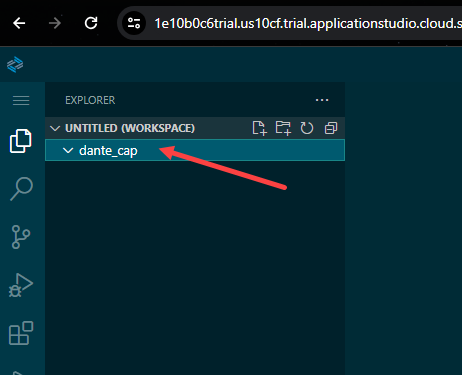
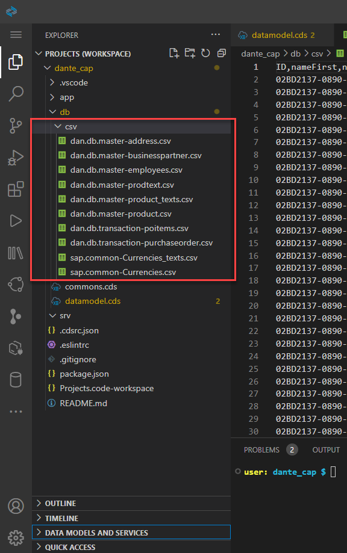

## CAPM - Day 3 - EPM - Data model building

#### Login to BTP to access BAS (Business Applciation Studio)

</br>
</br>

BAS is a SAP proprietary web environment used for developing SAP applications 
</br>it is managed by user space architecture every developer who access 
</br>it will get an allocated own space for designing application
</br>in trial BTP account of 90 days 
</br>
</br>

> [!NOTE]
> (BAS) as 30 days expiry if it is not accessed in 30 days dev space will be deleted by SAP for trial account 
 
</br>
</br>

### Access the BAS account as shown in below steps 

if account is not created 

follow the developer blogs mentioned below to get it completed 

(1) https://developers.sap.com/tutorials/appstudio-onboarding.html

(2) https://developers.sap.com/tutorials/set-up-bas.html  

</br>
</br>


BTP Cockpit 
</br>
   
</br>

Login to BAS account 
</br>
   
</br>

Create the DEV space  
</br>
      
</br>

 Select full stack cloud application in DEV space creation 
</br>
   
</br>

select the created dev space
</br>
   
</br>

Booting screen of BAS 
</br>
      
</br>

BAS welcome screen 
</br>
     
</br>

Check the OS version which is running this BAS for cloud 
</br>
open terminal 
</br>
     
     
</br>

It is a debian GNU linux version which is running in backend for this BAS application 

</br>

```bat
cat /etc/os-release
```

</br>
</br>

all the CDS, NODE, nvm, npm all are pre installed in BAS that's the advantage in BAS 

</br>
</br>

Change the theme for BAS as shown below in case White is not comfortable for the eyes 

</br>


</br>
</br>
create a project folder like shown below to start your development 
</br>

```bat
mkdir <folder name>
```
</br>
</br>

</br>

</br>
</br>
initialize the project skeleton by using cds init command 
</br>

```bat
cds init
```
</br>

</br>
</br>

Create a file demo.cds under (DB) folder as shown below
</br>

</br>
</br>

Type down the following script in that CDS file 
</br>
</br>

```cds
namespace dante_cap;
using { cuid } from '@sap/cds/common';

entity orders : cuid {

}
```
</br>
After creating the file you can notice that in (Data models and services) section in left pane
</br>
This gets created when CDS file in DB gets generated.
</br>
This Data models and services is only available in BAS not in VScode and this helps to see the overview of DB objects available in the project.
</br>

</br>

After creating the file right click the demo.cds file and you will get the CDS Graphic modeler option in command as shown below
</br>
</br>


</br>
</br>

When CDS Graphic modeler is selected it is opens a new graphical editor which looks like SQVI in ABAP 
</br>
use it and create table like shown below 
</br>


</br>
</br>

when you create multiple entity and you can define foreign key relation, association, composition as shown below 

but will discuss this later.
</br>
</br>

Will use the commons.cds file from previous day to begin our development
</br>

```cds
namespace com.dante.commons;

using { Currency } from '@sap/cds/common';

// similar like data element in abap defining in common.cds will make it available for global access
type Guid   : String(32);

// Enumerator data type like predefined values for a variable 
type Gender : String(1) enum {

    male   = 'M';
    female = 'f';
    undisclosed = 'u';
};

// Amount data type with currency property 
type AmountX : Decimal(10,2)@(
     semantics.Amount.currencyCode : 'CURRENCY_CODE',
     sap.unit:'CURRENCY_CODE'
);

// Structure data type with resuable property of amount 
aspect Amount :{
    CURRENCY : Currency;
    GROSS_AMOUNT: AmountX @(title : '{i18n>GROSS-Amount}');
    NET_AMOUNT: AmountX @(title : '{i18n>NET-Amount}');
    TAX_AMOUNT :AmountX @(title : '{i18n>TAX-Amount}');
}
```

</br>
</br>

Now we will add validation of data type in JS for example phone number and email using REGEX concept 

</br>
A Regular Expression (or Regex) is a pattern (or filter) that describes a set of strings that matches the pattern. 
</br> In other words, a regex accepts a certain set of strings and rejects the rest.
</br>
</br>

Telephone REGEX is grabbed from 
</br> https://stackoverflow.com/questions/16699007/regular-expression-to-match-standard-10-digit-phone-number

Email REGEX is grabbed from 
</br> 
https://www.w3resource.com/javascript/form/email-validation.php#:~:text=To%20get%20a%20valid%20email,%5D%2B)*%24%2F.

</br>
</br>

### commons.cds

```cds
namespace dan.commons;

using { Currency } from '@sap/cds/common';

// similar like data element in abap defining in common.cds will make it available for global access
type Guid   : String(32);

// Enumerator data type like predefined values for a variable 
type Gender : String(1) enum {

    male   = 'M';
    female = 'f';
    undisclosed = 'u';
};

// Amount data type with currency property 
type AmountX : Decimal(10,2)@(
     semantics.Amount.currencyCode : 'CURRENCY_CODE',
     sap.unit:'CURRENCY_CODE'
);

// Structure data type with resuable property of amount 
aspect Amount :{
    CURRENCY : Currency;
    GROSS_AMOUNT: AmountX @(title : '{i18n>GROSS-Amount}');
    NET_AMOUNT: AmountX @(title : '{i18n>NET-Amount}');
    TAX_AMOUNT :AmountX @(title : '{i18n>TAX-Amount}');
}

// validating phone number using REGEX
//alternative// type PhoneNumber: String(30)@assert.format : '^(\+\d{1,2}\s?)?1?\-?\.?\s?\(?\d{3}\)?[\s.-]?\d{3}[\s.-]?\d{4}$';

type PhoneNumber: String(30)@assert.format : '^\s*(?:\+?(\d{1,3}))?[-. (]*(\d{3})[-. )]*(\d{3})[-. ]*(\d{4})(?: *x(\d+))?\s*$';

// validating email using REGEX
type Email: String(255)@assert.format : '/^\w+([\.-]?\w+)*@\w+([\.-]?\w+)*(\.\w{2,3})+$/';
```
</br>
</br>
</br>

### datamodels.cds

```cds
namespace dan.db;

using { cuid, managed, temporal, Currency } from '@sap/cds/common'; // standard 
using { dan.commons } from './commons'; // custom 

// master table
context master {

// Business partner TABLE 
entity businesspartner {
    key NODE_KEY: commons.Guid; // Commons is my cutoms cds -- Common is Standard 
    BP_ROLE: String(2);
    EMAIL_ADDRESS: String(105);
    PHONE_NUMBER: String(32);
    FAX_NUMBER: String(34);
    WEB_ADDRESS: String(44);
    ADDRESS_GUID: Association to address; // table liknk to address
    BP_ID: String(32);
    COMPANY_NAME: String(250);
}

// Business partner ADDRESS TABLE 
entity address {
    key NODE_KEY: commons.Guid;
    CITY: String(44);
    POSTAL_CODE: String(8);
    STREET:String(44);
    BUILDING: String(128);
    COUNTRY: String(44);
    ADDRESS_TYPE: String(44);
    VAL_START_DATE: Date;
    VAL_END_DATE: Date;
    LATITUDE: Decimal;
    LONGITUDE: Decimal;
    businesspartner: Association to one businesspartner on
    businesspartner.ADDRESS_GUID = $self; // table link to business partner
}

// Product TABLE 
entity product {
    key NODE_KEY: String(28);
    PRODUCT_ID: String(28);
    TYPE_CODE: String(2);
    CATEGORY: String(32);
    DESCRIPTION: localized String(255); // localized will generate multiple transaltion text table at runtime 
    SUPPLIER_GUID: Association to master.businesspartner;  // SUPPLIER_GUID is assocaited to teh primary key of business partner 
    TAX_TARIF_CODE: Integer;
    MEASURE_UNIT: String(2);
    WEIGHT_MEASURE: Decimal(5,2);
    WEIGHT_UNIT: String(2);
    CURRENCY_CODE:String(4);
    PRICE: Decimal(15,2);
    WIDTH:Decimal(5,2);	
    DEPTH:Decimal(5,2);	
    HEIGHT:	Decimal(5,2);
    DIM_UNIT:String(2);

}

entity employees: cuid {
    nameFirst: String(40);
    nameMiddle: String(40);
    nameLast: String(40);
    nameInitials: String(40);
    sex: commons.Gender;
    language: String(1);
    phoneNumber: commons.PhoneNumber;
    email: commons.Email;
    loginName: String(12);
    Currency: Currency;
    salaryAmount: commons.AmountX;
    accountNumber: String(16);
    bankId: String(8);
    bankName: String(40);
}

}

// transaction table 
context transaction {
    entity purchaseorder: commons.Amount{
        key NODE_KEY: commons.Guid;
        PO_ID: String(40);
        PARTNER_GUID: Association to master.businesspartner;
        LIFECYCLE_STATUS: String(1);
        OVERALL_STATUS: String(1);
        Items: Association to many poitems on Items.PARENT_KEY = $self;
    }

    entity poitems: commons.Amount{
        key NODE_KEY: commons.Guid;
        PARENT_KEY: Association to purchaseorder;
        PO_ITEM_POS: Integer;
        PRODUCT_GUID: Association to master.product;
}


}


```
</br>
</br>

The above DB design datamodel.cds file is based on following chart image
</br>
</br>

</br>
</br>

### Aspect : (like ABAP - Include structure but can be used only on top in entity definition)
</br> it is like a structure with collection of different fields defined in commons.cds reuse library and used in our DB cds file.
</br>
### Type : (like data element in abap) 
</br>it is a single field property with data type specific like quantity and currency or any other which user define in commons reuse library
</br>
</br>
</br>

Create CSV folder and load the files provided here as shown below 

</br><b>(on top of the page you can see csv folder in Github use those csv files)</b>
</br>
</br>

</br>
</br>

Go to (package.json) file and look for any dependencies error you can right click the highlighted error and click (fix all dependencies) 
</br> if that option is not found then install the fix manually using (npm install) command in terminal
</br>

</br>
</br>

Deploy the DB 
</br>
```bat
cds depoly --to sqlite:dante.db
```
</br>

</br>
</br>

Connect the DB to SQL tools as shown below (go to terminal and get the local directory details) copy it and paste it 
</br> add the DB details along with the directory <b> (/home/user/dante_cap/dante.db) </b>
</br>
```bat
pwd
```
</br>

</br>
</br>


Post DB connection the tables should display as shown below.
</br>
</br>

</br>
</br>


Check the DB tables and records as shown below 
</br>
</br>

</br>
</br>

## CDS Views 
</br>
</br>

### Why we need CDS views ? 
</br>
</br>

- [X] usually we have all our data distributed across multiple tables and if we need to get this data out, we need to write complex queries with joins.

- [X] it becomes very complex to handle the maintenance of these large queries views will simplify the consumption and make it easy to maintain

- [X] We can perform the operations like aggregations on the view

- [X] security , CDS views are also the contracts for data consumption

- [X] They include annotations which drives functionality (read only) write protected

- [X] View provide also loose coupling to load data (association - join on demand), where as when we use queries and joins they are always tight coupling. which  brings all the data all the time.
</br>
</br>
</br>

Create (CDSViews.cds) file under DB folder as shown below 
</br>
</br>

```cds
namespace dante.cds;

using { dan.db.master, dan.db.transaction } from './datamodel';

context CDSViews {
    define view![POWorklist] as // to make it case sensitive even in output and runtime 
     select from transaction.purchaseorder{
        key PO_ID as![PurchaseOrderID],
        key Items.PO_ITEM_POS as![ItemPosition],
        PARTNER_GUID as![PartnerID],
        PARTNER_GUID.COMPANY_NAME as ![CompanyName],
        GROSS_AMOUNT as![GrossAmount],
        NET_AMOUNT as![NEtAmount],
        TAX_AMOUNT as![TAxAmount],
        CURRENCY as![CurrencyCode],
        OVERALL_STATUS as![Status],
        Items.PRODUCT_GUID.PRODUCT_ID as![ProductId],
        Items.PRODUCT_GUID.DESCRIPTION as![ProductName],      
        PARTNER_GUID.ADDRESS_GUID.CITY as![City],
        PARTNER_GUID.ADDRESS_GUID.COUNTRY as![Country],
     }
}
```
</br>
</br>

</br>
</br>

deploy it to db (cds deploy --to sqlite:dante.db) and check the views as shown below
</br>
</br>

</br>
</br>

Lets create additional CDS view as value help (similar like F4 help in ABAP)
</br>
</br>

```CDS
namespace dante.cds;

using { dan.db.master, dan.db.transaction } from './datamodel';

context CDSViews {
    define view![POWorklist] as // to make it case sensitive even in output and runtime 
     select from transaction.purchaseorder{
        key PO_ID as![PurchaseOrderID],
        key Items.PO_ITEM_POS as![ItemPosition],
        PARTNER_GUID as![PartnerID],
        PARTNER_GUID.COMPANY_NAME as ![CompanyName],
        GROSS_AMOUNT as![GrossAmount],
        NET_AMOUNT as![NEtAmount],
        TAX_AMOUNT as![TAxAmount],
        CURRENCY as![CurrencyCode],
        OVERALL_STATUS as![Status],
        Items.PRODUCT_GUID.PRODUCT_ID as![ProductId],
        Items.PRODUCT_GUID.DESCRIPTION as![ProductName],      
        PARTNER_GUID.ADDRESS_GUID.CITY as![City],
        PARTNER_GUID.ADDRESS_GUID.COUNTRY as![Country],
     };


     define view![ProductValueHelp] as
     select from master.product{
      @EndUserText.label:[
         {
            language: 'EN',
            text: 'Product id'
         },
         {
            language: 'DE',
            text: 'Prodekt id'            
         }
      ]
      PRODUCT_ID as![ProductId],
            @EndUserText.label:[
         {
            language: 'EN',
            text: 'Product Description'
         },
         {
            language: 'DE',
            text: 'Prodekt Beschreibung'            
         }
      ]
      DESCRIPTION as![Description]
     }

}
```
</br>
</br>


We can collapse the statement as shown below for better readability when there is more code
</br>
</br>


</br>
</br>

Lets create additional CDS view an Item CDS view
</br>
</br>

```cds
namespace dante.cds;

using { dan.db.master, dan.db.transaction } from './datamodel';

context CDSViews {
    define view![POWorklist] as // to make it case sensitive even in output and runtime 
     select from transaction.purchaseorder{
        key PO_ID as![PurchaseOrderID],
        key Items.PO_ITEM_POS as![ItemPosition],
        PARTNER_GUID as![PartnerID],
        PARTNER_GUID.COMPANY_NAME as ![CompanyName],
        GROSS_AMOUNT as![GrossAmount],
        NET_AMOUNT as![NEtAmount],
        TAX_AMOUNT as![TAxAmount],
        CURRENCY as![CurrencyCode],
        OVERALL_STATUS as![Status],
        Items.PRODUCT_GUID.PRODUCT_ID as![ProductId],
        Items.PRODUCT_GUID.DESCRIPTION as![ProductName],      
        PARTNER_GUID.ADDRESS_GUID.CITY as![City],
        PARTNER_GUID.ADDRESS_GUID.COUNTRY as![Country],
     };


     define view![ProductValueHelp] as
     select from master.product{
      @EndUserText.label:[
         {
            language: 'EN',
            text: 'Product id'
         },
         {
            language: 'DE',
            text: 'Prodekt id'            
         }
      ]
      PRODUCT_ID as![ProductId],
            @EndUserText.label:[
         {
            language: 'EN',
            text: 'Product Description'
         },
         {
            language: 'DE',
            text: 'Prodekt Beschreibung'            
         }
      ]
      DESCRIPTION as![Description]
     };


   define view![ItemView] as 
   select from transaction.poitems{
      PARENT_KEY.PARTNER_GUID.NODE_KEY as![CustomerID],
      PRODUCT_GUID.NODE_KEY as![ProductId],
      CURRENCY as![CurrencyCode],
      GROSS_AMOUNT as![GrossAmount],
      NET_AMOUNT as![NetAmount],
      TAX_AMOUNT as![TaxAmount],
      PARENT_KEY.OVERALL_STATUS as![Status]     
   };


   define view ![ProductView] as 
   // Mixin is a keyword to define lose coupling 
   // which will never load items data for product rather load on demand 
   // another name (assocaition - join on demand)
   select from master.product 
   mixin{
      // View on view
      PO_ORDER: Association[*] to ItemView on PO_ORDER.ProductId = $projection.ProductId
   } into {
      NODE_KEY as![ProductId],
      DESCRIPTION as![Description],
      CATEGORY as![Category],
      PRICE as![Price],
      SUPPLIER_GUID.BP_ID as![SupplierId],
      SUPPLIER_GUID.COMPANY_NAME as![CompanyName],
      SUPPLIER_GUID.ADDRESS_GUID.CITY as![City],
      SUPPLIER_GUID.ADDRESS_GUID.COUNTRY as![Country],
      // Exposed Association, at runtime in odata we will see a link to laod 
      // dependent data
      PO_ORDER as![To_Items]
   } ; //;


// Consumption View
   define view CProductValuesView as
   select from ProductView{
      ProductId,
      Country,
      sum(To_Items.GrossAmount) as![TotalPurchaseAmount],
      To_Items.CurrencyCode as![CurrencyCode],

// when aggregation like sum, min, max, avg - group by clause should be used       
   } group by ProductId, Country, To_Items.CurrencyCode


}

```
</br>
</br>

Deploy the tables and CDS to DB and you can see the list of CDS views created in DB
</br>
</br>


</br>
</br>


Now we want to eliminate this long decimal values in the view, do the following correction in CDSViews.cds and re-deploy to DB and check 
</br>
</br>

</br>
</br>

```cds
// Consumption View
   define view CProductValuesView as
   select from ProductView{
      ProductId,
      Country,
      
// used Round function and type cast it to Decimal
      round(sum(To_Items.GrossAmount),2) as![TotalPurchaseAmount] : Decimal(10,2) , 
      To_Items.CurrencyCode as![CurrencyCode],

// when aggregation like sum, min, max, avg - group by clause should be used       
   } group by ProductId, Country, To_Items.CurrencyCode

```
</br>
</br>


</br>
</br>
</br>
</br>

### How to download the code locally from BAS ? 
</br> (before download delete the node_modules folder) 
</br> it can be installed use terminal and use command (npm install) to get it back.
</br>

</br>
</br>

The downloaded file is in *.tar file format same can be used to upload into bas (use winrar to open the file)
</br>

</br>
</br>
</br>
</br>

## Final Code (CDSViews.cds)

</br>
</br>

```cds

namespace dante.cds;

using { dan.db.master, dan.db.transaction } from './datamodel';

context CDSViews {
    define view![POWorklist] as // to make it case sensitive even in output and runtime 
     select from transaction.purchaseorder{
        key PO_ID as![PurchaseOrderID],
        key Items.PO_ITEM_POS as![ItemPosition],
        PARTNER_GUID as![PartnerID],
        PARTNER_GUID.COMPANY_NAME as ![CompanyName],
        GROSS_AMOUNT as![GrossAmount],
        NET_AMOUNT as![NEtAmount],
        TAX_AMOUNT as![TAxAmount],
        CURRENCY as![CurrencyCode],
        OVERALL_STATUS as![Status],
        Items.PRODUCT_GUID.PRODUCT_ID as![ProductId],
        Items.PRODUCT_GUID.DESCRIPTION as![ProductName],      
        PARTNER_GUID.ADDRESS_GUID.CITY as![City],
        PARTNER_GUID.ADDRESS_GUID.COUNTRY as![Country],
     };


     define view![ProductValueHelp] as
     select from master.product{
      @EndUserText.label:[
         {
            language: 'EN',
            text: 'Product id'
         },
         {
            language: 'DE',
            text: 'Prodekt id'            
         }
      ]
      PRODUCT_ID as![ProductId],
            @EndUserText.label:[
         {
            language: 'EN',
            text: 'Product Description'
         },
         {
            language: 'DE',
            text: 'Prodekt Beschreibung'            
         }
      ]
      DESCRIPTION as![Description]
     };


   define view![ItemView] as 
   select from transaction.poitems{
      PARENT_KEY.PARTNER_GUID.NODE_KEY as![CustomerID],
      PRODUCT_GUID.NODE_KEY as![ProductId],
      CURRENCY as![CurrencyCode],
      GROSS_AMOUNT as![GrossAmount],
      NET_AMOUNT as![NetAmount],
      TAX_AMOUNT as![TaxAmount],
      PARENT_KEY.OVERALL_STATUS as![Status]     
   };


   define view ![ProductView] as 
   // Mixin is a keyword to define lose coupling 
   // which will never load items data for product rather load on demand 
   // another name (assocaition - join on demand)
   select from master.product 
   mixin{
      // View on view
      PO_ORDER: Association[*] to ItemView on PO_ORDER.ProductId = $projection.ProductId
   } into {
      NODE_KEY as![ProductId],
      DESCRIPTION as![Description],
      CATEGORY as![Category],
      PRICE as![Price],
      SUPPLIER_GUID.BP_ID as![SupplierId],
      SUPPLIER_GUID.COMPANY_NAME as![CompanyName],
      SUPPLIER_GUID.ADDRESS_GUID.CITY as![City],
      SUPPLIER_GUID.ADDRESS_GUID.COUNTRY as![Country],
      // Exposed Association, at runtime in odata we will see a link to laod 
      // dependent data
      PO_ORDER as![To_Items]
   } ; //;


// Consumption View
   define view CProductValuesView as
   select from ProductView{
      ProductId,
      Country,
      
// used Round function and type cast it to Decimal
      round(sum(To_Items.GrossAmount),2) as![TotalPurchaseAmount] : Decimal(10,2) , 
      To_Items.CurrencyCode as![CurrencyCode],

// when aggregation like sum, min, max, avg - group by clause should be used       
   } group by ProductId, Country, To_Items.CurrencyCode


}

```
</br>
</br>

</br>
</br>
</br>
</br>

# NEXT ------ CAPM - DAY 4 - Generic Handlers

<p align="center"> 
<a href="https://github.com/Octavius-Dante/Tetra_Proxima/tree/main/CAPM-DAY-4"> CAPM DAY 4 - Generic Handlers</a> 

#### Previous Sessions
</br>

<!--
- [x] <a href="https://github.com/Octavius-Dante/Tetra_Proxima/tree/main/CAPM-DAY-12"> CAPM Day 12 - Extension CI CD</a>
- [x] <a href="https://github.com/Octavius-Dante/Tetra_Proxima/tree/main/CAPM-DAY-11"> CAPM Day 11 - S4HANA Side by Side</a>
- [x] <a href="https://github.com/Octavius-Dante/Tetra_Proxima/tree/main/CAPM-DAY-10"> CAPM Day 10 - Side by Side extension</a>
- [x] <a href="https://github.com/Octavius-Dante/Tetra_Proxima/tree/main/CAPM-DAY-9"> CAPM Day 9 - Serverless Fiori App</a>
- [x] <a href="https://github.com/Octavius-Dante/Tetra_Proxima/tree/main/CAPM-DAY-8"> CAPM Day 8 - CAPM Security XSUAA</a>
- [x] <a href="https://github.com/Octavius-Dante/Tetra_Proxima/tree/main/CAPM-DAY-7"> CAPM Day 7 - HANA and Deployment</a>
- [x] <a href="https://github.com/Octavius-Dante/Tetra_Proxima/tree/main/CAPM-DAY-6"> CAPM Day 6 - Fiori App Draft</a>
- [x] <a href="https://github.com/Octavius-Dante/Tetra_Proxima/tree/main/CAPM-DAY-5"> CAPM Day 5 - Fiori Elements</a>
- [x] <a href="https://github.com/Octavius-Dante/Tetra_Proxima/tree/main/CAPM-DAY-4"> CAPM Day 4 - Generic Handlers</a>
- [x] <a href="https://github.com/Octavius-Dante/Tetra_Proxima/tree/main/CAPM-DAY-3"> CAPM Day 3 - EPM DB and CDS Views</a>
-->
- [x] <a href="https://github.com/Octavius-Dante/Tetra_Proxima/tree/main/CAPM-DAY-2"> CAPM Day 2 - Aspects and Reuse Tables</a>
- [x] <a href="https://github.com/Octavius-Dante/Tetra_Proxima/tree/main/CAPM-DAY-1"> CAPM Day 1 - First CAP App </a>

</br>
</br>
 
</p>

</br>
</br>
</br>
</br>
