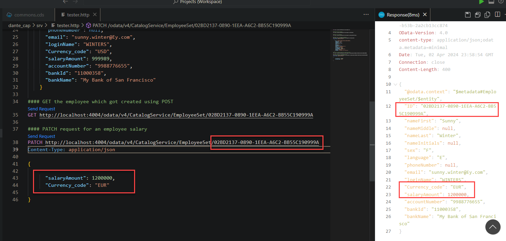

## CAPM - Day 4 - Generic Handlers

### Creating odata services to our app 

</br>
</br>

Will continue today from yesterdays application 
</br> - will focus on creating services on top of data model we created on previous day 
</br> - odata services 
 
</br>

Go to our application SRV folder and create a file (CatalogService.cds) as shown below 
</br>
```cds
// importing data models and views to our service
using {dan.db} from '../db/datamodel';
using {dante.cds} from '../db/CDSViews';

// so in cap services odata will trim tha name when there is upper case in the word
// example MyName will be dispalyed as My the part (Name) will be removed
// to avoid this we use @(path:<service-name>) annotation

service CatalogService @(path: 'CatalogService') {

    entity BusinessPartnerSet as projection on db.master.businesspartner;
    entity AddressSet         as projection on db.master.address;
    entity EmployeeSet        as projection on db.master.employees;
    entity PurchseOrderItems  as projection on db.transaction.poitems;

    entity POs                as
        projection on db.transaction.purchaseorder {
            *,
            Items : redirected to PurchseOrderItems
        };

    entity CProductValuesView as projection on cds.CDSViews.CProductValuesView;

}

}

```
</br>

</br>
</br>

After creationg the file deploy it and run (best practise) 

#### if you find cds-serve in package.json - it takes care automatically this is new feature from 2024
#### (service creation - no need to deploy, DB and View creation need to deploy) - if you find cds-serve in package.json
#### (instead if you find cds watch) then it takes care automatically


</br>
</br>

Now run the applicaiton through terminal and test it as shown below (i didnt deploy) i just run it works 
</br>

</br>

</br>
</br>
</br>
</br>

Now we can check developer tools in browser for identifying odata vesion as shown below 
</br>
</br>

</br>
</br>
</br>

older version example go to this web page https://services.odata.org/ and select any link 
</br>
</br>

</br>
</br>
</br>

use <b>(?$format=json) </b> to the link and you will see the following page press f12 and check the version 
</br>
</br>

</br>
</br>

### Backward compatibility - Odata V2
</br>
</br>

- default sap fiori which comes out of on-prem is odata v2 
- defualt sap fiori which comes out of cloud is odata v4
- SAP applicaitons developed in odata v2 cannot be used for odata v4 - requries (redesign or code changes)
- To avoid this we have an <b>adapter</b> which will use v4 version as v2
- SAP provided this adpters as node module (goto npm site : https://www.npmjs.com/search?q=odata-v2-adapter)
- Search for odata-v2-adapter (pick the proxy one)
- install the adapter using command
- create JS file is (srv) directory (./srv/server.js:) and copy the contents
- run and test the application
  - OData V2 service will be available at http://localhost:4004/v2/
  - OData V4 service will be available at http://localhost:4004/
</br>

```bat
npm install @sap/cds-odata-v2-adapter-proxy -s
```
</br>

### server.js
</br>

```js
const cds = require("@sap/cds");
const cov2ap = require("@sap/cds-odata-v2-adapter-proxy");
cds.on("bootstrap", (app) => app.use(cov2ap()));
module.exports = cds.server;
```

</br>

</br>

</br>

</br>


</br>
</br>

### OData v2 
</br>
it can be identified by represneration d in front of result set 
</br>
</br>

</br>
</br>
cloud BAS main page
</br>

</br>

local VSCode main page
</br>

</br>

</br> Add v2/ after the cloud link an then navigate from thae page 
</br> https://port4004-workspaces-ws-n8568.us10.trial.applicationstudio.cloud.sap/v2/
</br>
</br> SAP cloud BAS
</br> https://port4004-workspaces-ws-n8568.us10.trial.applicationstudio.cloud.sap/v2/odata/v4/CatalogService/BusinessPartnerSet
</br>
</br>
</br>  Add v2/ after the local host link an then navigate from thae page
</br> http://localhost:4004/v2/
</br>
</br> VSCode
</br> http://localhost:4004/v2/odata/v4/CatalogService/BusinessPartnerSet

</br>
cloud BAS

</br>
</br>
VSCode

</br>
</br>

</br>

### CURDQ Testing for cloud 
</br>
 We cannot test CURD operation through postman on this cloud application it is not supported only local VS code works with postman
</br>
</br>

### A way to test CURDQ in cloud 
</br>
create tester.http (any name of your choice *.http) file under (srv) folder like shown below 
</br>
</br>

determine the correct link before you add it to tester.http file 
</br>

</br>

</br>
</br>

click the link (send request) to test
</br>

</br>
</br>

if the link is correct following output window will appear with right data 
</br>

</br>
</br>
</br>
</br>


### Contents of tester.http
</br>

```http

GET http://localhost:4004/odata/v4/CatalogService


##### Read Service metadata
GET http://localhost:4004/odata/v4/CatalogService/$metadata


##### GET top 2 employees
GET http://localhost:4004/odata/v4/CatalogService/EmployeeSet?$top=2


##### POST call - creating new employee 
POST http://localhost:4004/odata/v4/CatalogService/EmployeeSet
Content-Type: application/json    
    
    {
      "ID": "02BD2137-0890-1EEA-A6C2-BB55C190999A",
      "nameFirst": "Sunny",
      "nameMiddle": null,
      "nameLast": "Winter",
      "nameInitials": null,
      "sex": "F",
      "language": "E",
      "phoneNumber": null,
      "email": "sunny.winter@Ey.com",
      "loginName": "WINTERS",
      "Currency_code": "USD",
      "salaryAmount": 999989,
      "accountNumber": "9988776655",
      "bankId": "11000358",
      "bankName": "My Bank of San Francisco"
    }

#### GET the employee which got created using POST    
GET http://localhost:4004/odata/v4/CatalogService/EmployeeSet/02BD2137-0890-1EEA-A6C2-BB55C190999A

#### PATCH request for an employee salary 
PATCH http://localhost:4004/odata/v4/CatalogService/EmployeeSet/02BD2137-0890-1EEA-A6C2-BB55C190999A
Content-Type: application/json

{

      "salaryAmount": 1200000,
      "Currency_code": "EUR"

}

```
</br>
</br>

### Testing POST call testing challenges - and troubleshoot 
</br>

When copied the data of some random GET and modified it for posting following corrections carried out 
 - serialization error for bank id error <b>FIX -(change the length) of BANKID</b>
 - Email format error <b>FIX -(we have to modify the REGEX expression in our program)</b>
 </br> (https://www.tutorialspoint.com/checking-for-valid-email-address-using-regular-expressions-in-java)

</br>
</br>

```json

"message": "Deserialization Error: Invalid value 121000358 (string) for property \"bankId\".
The length of the Edm.String value must not be greater than the MaxLength facet value (8)."

```

```json
{
  "error": {
    "code": "400",
    "message": "Value \"sunny.winter@Ey.com\" is not in specified format \"/^\\w+([\\.-]?\\w+)*@\\w+([\\.-]?\\w+)*(\\.\\w{2,3})+$/\"",
    "target": "email",
    "@Common.numericSeverity": 4
  }
```

</br>
</br>

changed the code for email REGEX as mentioned below and tested (commons.cds)
</br>

```cds 
// validating email using REGEX
type Email: String(255)@assert.format : '^[a-zA-Z0-9+_.-]+@[a-zA-Z0-9.-]+$';

// type Email: String(255)@assert.format : '/^\w+([\.-]?\w+)*@\w+([\.-]?\w+)*(\.\w{2,3})+$/';
```
</br>
</br>
When POST system is successfully triggered as shown below 
</br>
</br>

</br>
</br>

</br>
</br>

Patch request is tested for the app as shown below (same post request key is used)
</br>
</br>

</br>

</br>
</br>
</br>

## Generic handlers in CAP

</br>
The CAPM framework generates most of the code to perform CURDQ operations on the entity.
</br> it does not know what validations to perform on our business data.
</br>
</br> As a developer when we want to attach a pre-check (validations) / post-check (post-processing code) 
</br> on an entity operation, we can use generic handlers. 
</br>
</br> All these operations are performed <b>SYNCHONOUSLY</b>
</br>
</br>

At times we want to 
- Take full control of our implementation <b>(WHEN? -- On, Before, After)</b>
- We want to add some validation before data is inserted or updated <b>(FOR WHOM? - Entity)</b>
- We want to change data before insert/update <b>(WHICH OPERATION? - CREATE, UPDATE, (POST, PATCH) )</b>
- Read some extra information while GET calls <b>(WHAT? Business Logic )</b>

</br>
</br>
</br>

As per above handlers appropriate usage questioning 
</br> lets consider it for a sceanrio (validate salary greater than 1 million) before updating or creating entry in table 
</br> following question suits as shown below 
</br>

- WHEN? -- <b>validate Before</b> 
- FOR WHOM? - <b>Entity - Employees</b>
- WHICH OPERATION? - CREATE, UPDATE, (POST, PATCH) 
- WHAT Business Logic ? - Check if salary is < (condition value)

</br>
</br>

</br>
</br>

### Generic handlers validaiton for our app 
</br>
</br>
create a file called <b>(CatalogService.js)</b> in (SRV) folder
</br>
</br>

### CatalogService.js
</br>

```js
// This module block will never change its liek a template 
// -- whats inside this block will cahnge according to business Req

// async - here means run in synchronised manner

module.exports = cds.service.impl(async function () {

    // step 1: get the object of our odata entities
    const { EmployeeSet, POs } = this.entities;

    // step 2:define generic handler for validaiton
    this.before('UPDATE', EmployeeSet, (req, res) => {
        console.log("It came here " + req.data.salaryAmount);
    });

}
);
````
</br>
</br>

now will test the code as shown below using <b>(tester.http)</b>
</br>
</br>

</br>
</br>

Now will add validation to teh block to handle teh scenario
</br>
</br>
### CatalogService.js (with validation)
</br>

```js
// This module block will never change its liek a template 
// -- whats inside this block will cahnge according to business Req

// async - here means run in synchronised manner

module.exports = cds.service.impl(async function () {

    // step 1: get the object of our odata entities
    const { EmployeeSet, POs } = this.entities;

    // step 2:define generic handler for validation
    this.before('UPDATE', EmployeeSet, (req, res) => {
        console.log("It came here " + req.data.salaryAmount);
        if(parseFloat(req.data.salaryAmount) >= 1000000){
            req.error(500, "Salary must be less than a million for employee");
        }
                
    });

}
);
````
</br>
The testing of validation is shown below 
</br>
</br>

</br>
</br>


</br>
</br>

## Action 
</br>
This doesnt have return value and it is used to perform a calculation or some action some process in a Buisness Logic

</br>
## Function
</br>
This has return value and it is used to perform an action and returns the value in a business logic

</br>
</br>
</br>
</br>
</br>
</br>
</br>
</br>
</br>
</br>
</br>
</br>
</br>
</br>
</br>
</br>
</br>
</br>
</br>
</br>
</br>
</br>
</br>
</br>
</br>
</br>
</br>
</br>
</br>
</br>
</br>
</br>
</br>
</br>
</br>
</br>
</br>
</br>
