## CAPM - Day 5 - Fiori Elements

#### Continuing Custom service development (CURD)

</br>
</br>

Will continue today from yesterdays application 
</br> - will focus on creating Custom service (Insert, Update and delete) <b>MyServices.cds , Myservice.js</b>

## MyService.js  - (CURD)
</br>
</br>

```js
const cds = require("@sap/cds");
const { employees } = cds.entities("dan.db.master");
const mysrvdemo = function (srv) {

// CAPM DAY -4     
    // Generic handler 
// READ DATA     
    srv.on("READ", "ReadEmployeeSrv", async (req, res) => {

        var results = [];

        // Example 1 : hardcoded data
        // results.push({
        //         "ID":"56AD5671-9034567-12340-ER89GH-6789",
        //         "nameFirst": "Leonardo",
        //         "nameLast": "davinci"
        // });

        // Example 2 : use Select on DB table 
        // results = await cds.tx(req).run(SELECT.from(employees).limit(10));

        // Example 3 : use Select on DB table 
        // results = await cds.tx(req).run(SELECT.from(employees).limit(10).where({"nameFirst":"Susan"} ) );


        // use /entity/key/

        // Example 4 : Caller will pass the condition like ID
        var whereCondition = req.data;
        console.log(whereCondition);
        if (whereCondition.hasOwnProperty("ID")) {
            results = await cds.tx(req).run(SELECT.from(employees).limit(10).where({ "nameFirst": "Susan" }));
        } else {
            results = await cds.tx(req).run(SELECT.from(employees).limit(1));
        }

        // https://cap.cloud.sap/docs/node.js/cds-ql#where

        return results;

    });

// CAPM DAY -5
// CREATE DATA 
    srv.on("CREATE", "InsertEmployeeSrv", async (req, res) => {
        var dataSet = [];
        let returnData = await cds.transaction(req).run([

// INSERT operation             
            INSERT.into(employees).entries(dataSet)
        ]).then((resolve, reject) => {
            if (typeof(resolve) !== undefined){
                return req.data;
            } else{
                req.error(500,"Create Failed");
            }
        }).catch( err => {
            req.error(500," There was an error "+ err.toString());
        });
        return returnData;
    });

// UPDATE DATA 
    srv.on("UPDATE", "UpdateEmployeeSrv", async (req, res) => {
        var dataSet = [];
        let returnData = await cds.transaction(req).run([

// Update Operation
            UPDATE.into(employees).set ({
                nameFirst: req.data.nameFirst
            }).where({ID: req.data.ID}),

// Multiple operations can be perfromed liek above 
            UPDATE.into(employees).set ({
                nameLast: req.data.nameLast
            }).where({ID: req.data.ID}),

        ]).then((resolve, reject) => {
            if (typeof(resolve) !== undefined){
                return req.data;
            } else{
                req.error(500,"Update Failed");
            }
        }).catch( err => {
            req.error(500," There was an error "+ err.toString());
        });
        return returnData;
    });

// DELETE DATA     
    srv.on("DELETE", "DeleteEmployeeSrv", async (req, res) => {

        var dataSet = [];
        let returnData = await cds.transaction(req).run([

// DELETE Operation
            DELETE.from(employees).where({ID: req.data.ID})

        ]).then((resolve, reject) => {
            if (typeof(resolve) !== undefined){
                return req.data;
            } else{
                req.error(500,"Delete Failed");
            }
        }).catch( err => {
            req.error(500," There was an error "+ err.toString());
        });
        return returnData;
    });
};


module.exports = mysrvdemo;

```

</br>
</br>
After making the code changes deploy it and run
</br>

## tester.http (add these lines) 
</br>

```http
#### POST to insert data
POST http://localhost:4004/odata/v4/mysrvdemo/InsertEmployeeSrv
Content-Type: application/json    
    
    {
      "ID": "02BD2137-0890-1EEA-A6C2-BB55C190999A",
      "nameFirst": "John",
      "nameMiddle": null,
      "nameLast": "RAMBO",
      "nameInitials": null,
      "sex": "Max-Forwards: ",
      "language": "E",
      "phoneNumber": null,
      "email": "J.Rambo@Ey.com",
      "loginName": "RAMBOJ",
      "Currency_code": "USD",
      "salaryAmount": 999989,
      "accountNumber": "9988776655",
      "bankId": "77052358",
      "bankName": "Bank of NY"
    }
```
</br>
will test the application now 
</br>
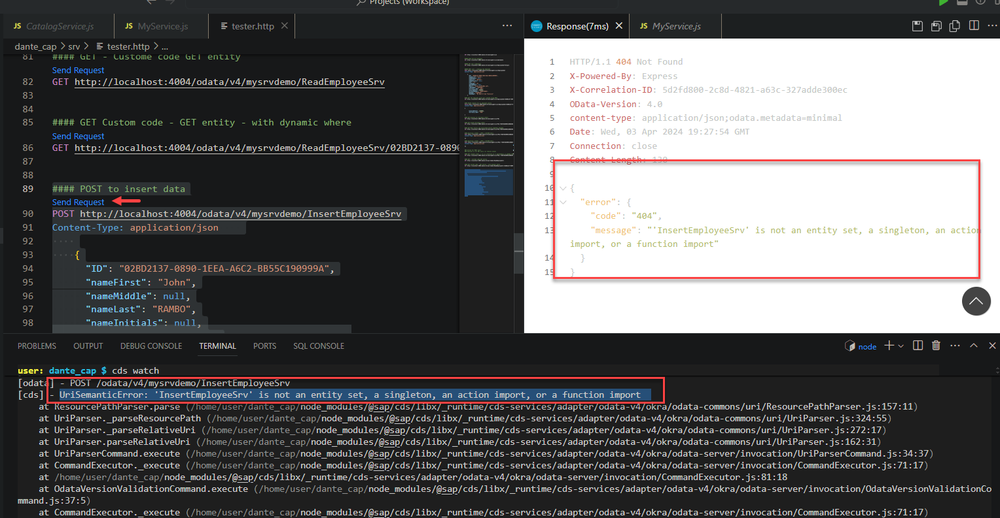
</br>
</br>

Will troubleshoot it by debugging now.
</br>
To Debug we need to create config - (launch.json) file needs to be configures as shown below
</br>
</br>
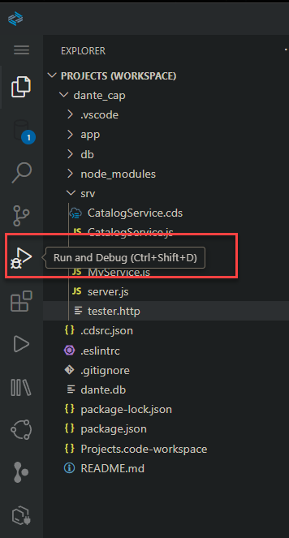
</br>
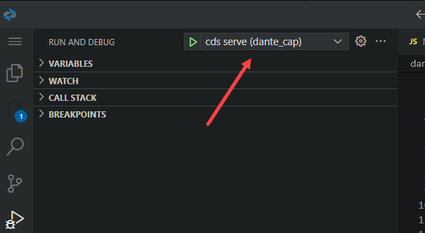
</br>
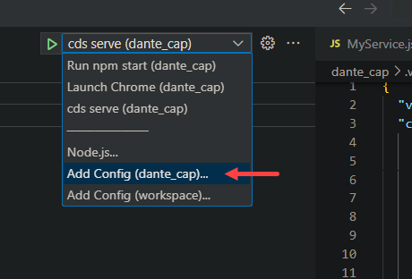
<!-- </br>
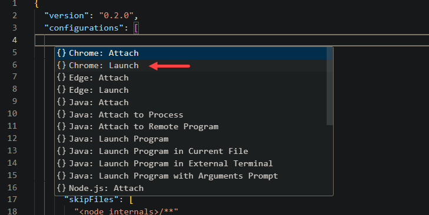 -->
</br> 
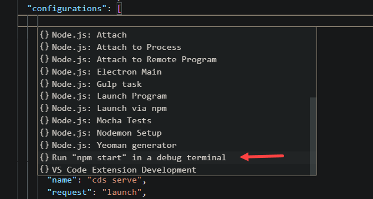
</br>
</br>


### launch.json

</br> change few more parameters to the config details added as shown below (project directory, and cds watch command, name description)
</br> After confguring the launch.json, the file should look like below json sample code 


```json
{
  "version": "0.2.0",
  "configurations": [


    {
      "command": "cds watch",
      "name": "Debug My CAP Application",
      "request": "launch",
      "type": "node-terminal",
      "cwd": "${workspaceFolder}/dante_cap"
    } ,

    {
      "name": "cds serve",
      "request": "launch",
      "type": "node",
      "cwd": "${workspaceFolder}/dante_cap",
      "runtimeExecutable": "npx",
      "args": [
      "cds",
      "serve",
      "--with-mocks",
      "--in-memory?"
      ],
      "skipFiles": [
      "<node_internals>/**"
      ]
      }
  ]
}
```
</br>
</br>

Set a breakpoint to our <b>MyService.js</b> code as shown below
</br>
</br>
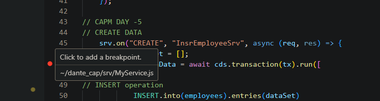
</br>

</br>

</br>
</br>
To launch the Debugging 
</br>
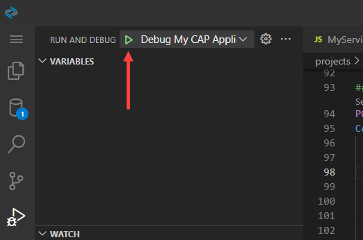
</br>
</br>

When Debuggin is successfully launched following screen changes can be identified
</br>
</br>

Colour of the BAS will be changed
</br>
</br>
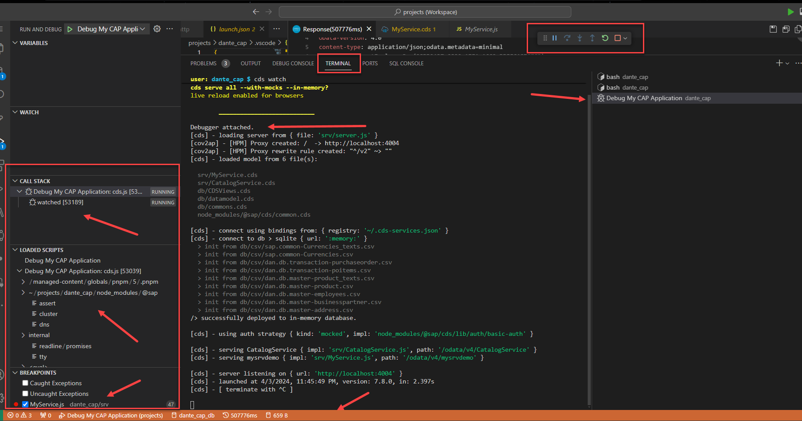
</br>
</br>

A small debug navigation window will appear - this prooves that debuggin mode is active 
</br>
</br>
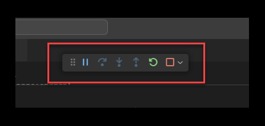
</br>
</br>

Go to tester.http and trigger the POST call for our MyService.js (Insert Employee service) 
</br>
</br>

</br>
</br>

The trigger from tester.http file should stop at breakpoint as shown in the screen
</br>
</br>
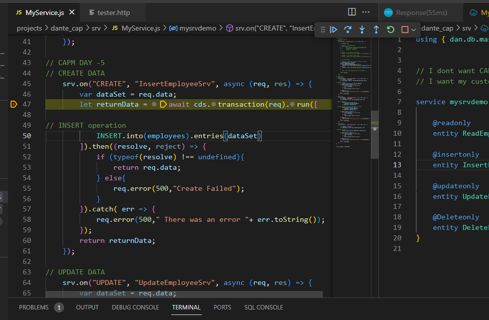
</br>
</br>

A debug navigation window will have all the navigation buttons enabled for usage
</br>
</br>

</br>
</br>

Navigation window options 
</br>
</br>
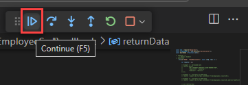
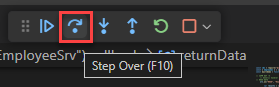
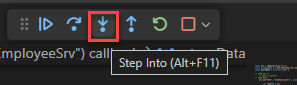
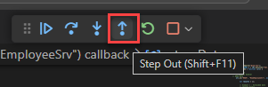
</br>
</br>

you can check the data of the variable in debug console as shown below 
</br>
</br>
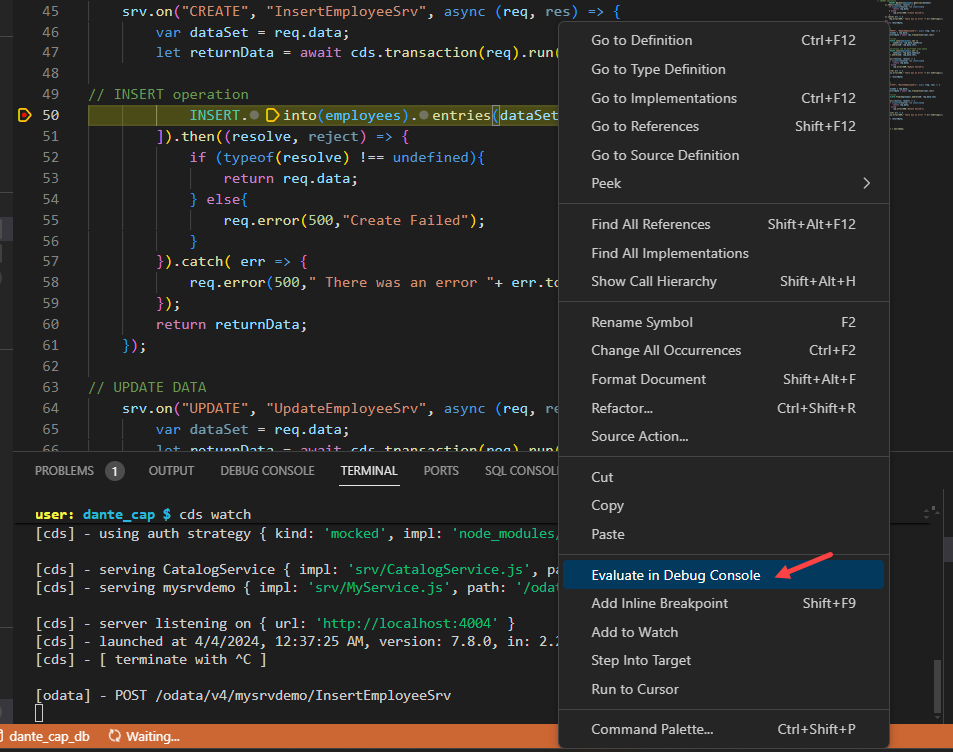
</br>
</br>

The successful post of the data is refelected in response window
</br>
</br>
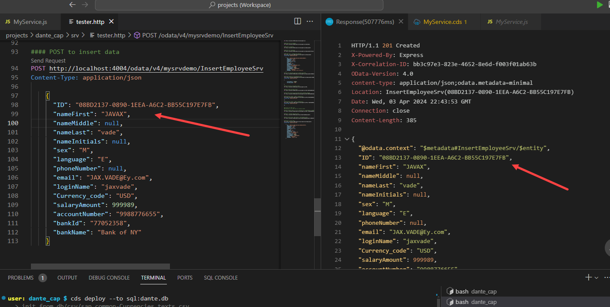
</br>
</br>

</br>
</br>

Colour of the BAS / VScode layout will be changed
</br>

```cds

```

</br>
</br>
</br>
</br>
</br>
</br>
</br>
</br>
</br>
</br>
</br>
</br>
</br>
</br>
</br>
</br>
</br>
</br>
</br>
</br>
</br>
</br>
</br>
</br>
</br>
</br>
</br>
</br>
</br>
</br>
</br>
</br>
