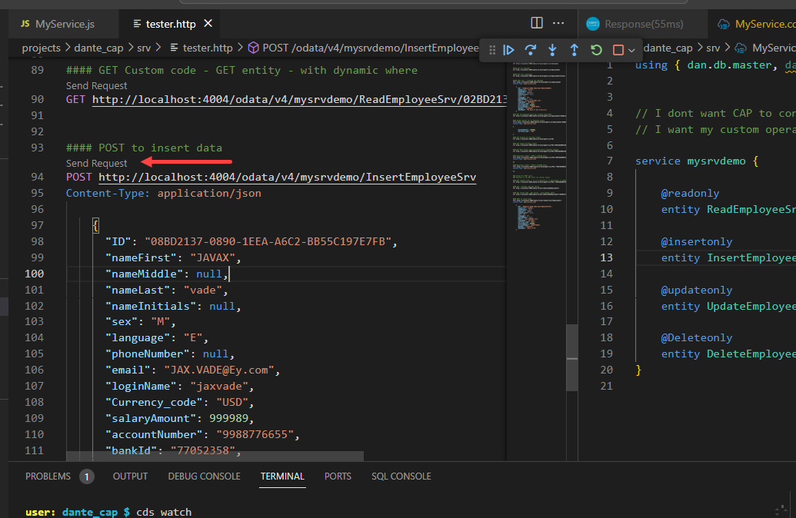
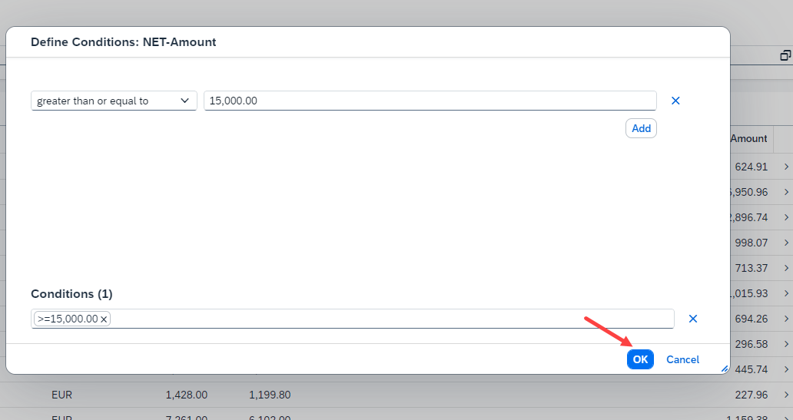

## CAPM - Day 5 - Fiori Elements

#### Continuing Custom service development (CURD)

</br>
</br>

Will continue today from yesterdays application 
</br> - will focus on creating Custom service (Insert, Update and delete) <b>MyServices.cds , Myservice.js</b>

## MyService.js  - (CURD)
</br>
</br>

```js
const cds = require("@sap/cds");
const { employees } = cds.entities("dan.db.master");
const mysrvdemo = function (srv) {

// CAPM DAY -4     
    // Generic handler 
// READ DATA     
    srv.on("READ", "ReadEmployeeSrv", async (req, res) => {

        var results = [];

        // Example 1 : hardcoded data
        // results.push({
        //         "ID":"56AD5671-9034567-12340-ER89GH-6789",
        //         "nameFirst": "Leonardo",
        //         "nameLast": "davinci"
        // });

        // Example 2 : use Select on DB table 
        // results = await cds.tx(req).run(SELECT.from(employees).limit(10));

        // Example 3 : use Select on DB table 
        // results = await cds.tx(req).run(SELECT.from(employees).limit(10).where({"nameFirst":"Susan"} ) );


        // use /entity/key/

        // Example 4 : Caller will pass the condition like ID
        var whereCondition = req.data;
        console.log(whereCondition);
        if (whereCondition.hasOwnProperty("ID")) {
            results = await cds.tx(req).run(SELECT.from(employees).limit(10).where({ "nameFirst": "Susan" }));
        } else {
            results = await cds.tx(req).run(SELECT.from(employees).limit(1));
        }

        // https://cap.cloud.sap/docs/node.js/cds-ql#where

        return results;

    });

// CAPM DAY -5
// CREATE DATA 
    srv.on("CREATE", "InsertEmployeeSrv", async (req, res) => {
        var dataSet = req.data;
        let returnData = await cds.transaction(req).run([

// INSERT operation             
            INSERT.into(employees).entries(dataSet)
        ]).then((resolve, reject) => {
            if (typeof(resolve) !== undefined){
                return req.data;
            } else{
                req.error(500,"Create Failed");
            }
        }).catch( err => {
            req.error(500," There was an error "+ err.toString());
        });
        return returnData;
    });

// UPDATE DATA 
    srv.on("UPDATE", "UpdateEmployeeSrv", async (req, res) => {
        var dataSet = req.data;
        let returnData = await cds.transaction(req).run([

// Update Operation
            UPDATE(employees).set ({
                nameFirst: req.data.nameFirst
            }).where({ID: req.data.ID}),

// Multiple operations can be performed like above 
            UPDATE(employees).set ({
                nameLast: req.data.nameLast
            }).where({ID: req.data.ID}),

            UPDATE(employees).set ({
                nameMiddle: req.data.nameMiddle
            }).where({ID: req.data.ID}),

            UPDATE(employees).set ({
                nameInitials: req.data.nameInitials
            }).where({ID: req.data.ID})            

        ]).then((resolve, reject) => {
            if (typeof(resolve) !== undefined){
                return req.data;
            } else{
                req.error(500,"Update Failed");
            }
        }).catch( err => {
            req.error(500," There was an error "+ err.toString());
        });
        return returnData;
    });

// DELETE DATA     
    srv.on("DELETE", "DeleteEmployeeSrv", async (req, res) => {

        var dataSet = req.data;
        console.log(req.data.ID)
        let returnData = await cds.transaction(req).run([

// DELETE Operation
            DELETE.from(employees).where({ID: req.data.ID})

        ]).then((resolve, reject) => {
            if (typeof(resolve) !== undefined){
                return req.data;
            } else{
                req.error(500,"Delete Failed");
            }
        }).catch( err => {
            req.error(500," There was an error "+ err.toString());
        });
        return returnData;
    });
};


module.exports = mysrvdemo;

```

</br>
</br>
After making the code changes deploy it and run
</br>

## tester.http (add these lines) 
</br>

```http
#### POST to insert data
POST http://localhost:4004/odata/v4/mysrvdemo/InsertEmployeeSrv
Content-Type: application/json    
    
    {
      "ID": "18BD2137-0890-1EEA-A6C2-BB55C197E7FB",
      "nameFirst": "JAVAX",
      "nameMiddle": null,
      "nameLast": "vade",
      "nameInitials": null,
      "sex": "M",
      "language": "E",
      "phoneNumber": null,
      "email": "JAX.VADE@Ey.com",
      "loginName": "jaxvade",
      "Currency_code": "USD",
      "salaryAmount": 999989,
      "accountNumber": "9988776655",
      "bankId": "77052358",
      "bankName": "Bank of NY"
    }

#### PATCH to Update data 
PATCH http://localhost:4004/odata/v4/mysrvdemo/UpdateEmployeeSrv/16BD2137-0890-1EEA-A6C2-BB55C197E7FB
Content-Type: application/json

{

      "nameFirst": "Genghis Khan",
      "nameMiddle": "Altan Tseren delger",
      "nameLast": "mongols",
      "nameInitials": "GK"

}

#### DELETE data 
DELETE http://localhost:4004/odata/v4/mysrvdemo/DeleteEmployeeSrv/18BD2137-0890-1EEA-A6C2-BB55C197E7FB

```
</br>
will test the application now 
</br>

</br>
</br>

Will troubleshoot it by debugging now.
</br>
To Debug we need to create config - (launch.json) file needs to be configures as shown below
</br>
</br>

</br>

</br>

<!-- </br>
 -->
</br> 

</br>
</br>


### launch.json

</br> change few more parameters to the config details added as shown below (project directory, and cds watch command, name description)
</br> After confguring the launch.json, the file should look like below json sample code 


```json
{
  "version": "0.2.0",
  "configurations": [


    {
      "command": "cds watch",
      "name": "Debug My CAP Application",
      "request": "launch",
      "type": "node-terminal",
      "cwd": "${workspaceFolder}/dante_cap"
    } ,

    {
      "name": "cds serve",
      "request": "launch",
      "type": "node",
      "cwd": "${workspaceFolder}/dante_cap",
      "runtimeExecutable": "npx",
      "args": [
      "cds",
      "serve",
      "--with-mocks",
      "--in-memory?"
      ],
      "skipFiles": [
      "<node_internals>/**"
      ]
      }
  ]
}
```
</br>
</br>

Set a breakpoint to our <b>MyService.js</b> code as shown below
</br>
</br>

</br>

</br>

</br>
</br>
To launch the Debugging 
</br>

</br>
</br>

When Debuggin is successfully launched following screen changes can be identified
</br>
</br>

Colour of the BAS will be changed
</br>
</br>

</br>
</br>

A small debug navigation window will appear - this prooves that debuggin mode is active 
</br>
</br>

</br>
</br>

Go to tester.http and trigger the POST call for our MyService.js (Insert Employee service) 
</br>
</br>

</br>
</br>

The trigger from tester.http file should stop at breakpoint as shown in the screen
</br>
</br>

</br>
</br>

A debug navigation window will have all the navigation buttons enabled for usage
</br>
</br>

</br>
</br>

### Navigation window options 
</br>

</br>
This is like F8 in ABAP full execution of the code 
</br>

</br>
This is like F5 in ABAP line by line execution
</br>

</br>
This is New - there is JS code and CDS standard framework code 
</br> (all sql instruction is written inside a cds.transaction) if you want to step inside that specific block this button will help 
</br> when step-by-step execution wont access places like this, then <b>"step into"</b> is used.
</br>

</br>
This is like F7 in ABAP full execution of the current code block - current function 
</br>

</br>
</br>

you can check the data of the variable in debug console as shown below 
</br>
</br>

</br>

Have to navigate in the stacks to get the entry to edit 
</br>

</br>

</br>

</br>

</br>
</br>

The successful post of the data is refelected in response window
</br>

</br>

</br>
PATCH before posting 
</br>

</br>
PATCH after posting  
</br>

</br>

Delete call tested 
</br>

</br>
</br>

</br>
</br>

## How to Initialize GITHUB for BAS 
</br>
</br>

- [x] Create a Private repository in GITHUB and copy the link of that git hub.
- [x] Initiate git in bas using command (git init)
- [x] Add all the files to git staging area using command (git add)
- [x] Commit the changes using command (git commit -m "description" )
- [x] No we do GIT push

```md
git init
git add README.md
git commit -m "first commit"
git branch -M main
git remote add origin https://github.com/Octavius-Dante/CAP_TEST.git
git push -u origin main
```
</br>
</br>

For me Git was already logged in to the browser so the authentication was different 
</br> but step is same, git connection step remains same. only user authentication differs.


</br>
</br>

</br>

</br>

</br>

</br>

when code changes were moade it appears like this 
</br>

</br>

Code comparison 
</br>

</br>

Reverting the changes 
</br>

</br>

</br>

</br>
</br>
</br>

Commiting to Git hub using auto sync option 
</br>

</br>

</br>

</br>
</br>
</br>

Commiting to git hub using graphical editor to - give version details 
</br>

</br>
</br>
</br>
</br>


## HANA DB instance creation 
</br>
It is covered in following link please check 
</br>
https://github.com/Octavius-Dante/Tetra_Proxima/tree/main/SAP_HANA_DB_CREATION
</br>
</br>

Followed by HDI Schema 
</br>
https://github.com/Octavius-Dante/Tetra_Proxima/tree/main/SAP_HANA_HDI_SCHEMA_CREATION
</br>
</br>
</br>


## Fiori Application development

<details>
  <summary> Fiori Elements implementation </summary>
    
</br>
</br>

Further reading on fiori elements : https://ui5.sap.com//#/topic/03265b0408e2432c9571d6b3feb6b1fd
</br>
</br>

Fiori elements is designed to quckly deploy apps to front end with less effort - it uses temepates provided by SAP 
</br>
FREE style UI5 has option to develop extensive UI/UX pages but Fiori elements provide options to deploy the page quickly on top of it , thsi can be enhanced for further user needs.
</br>
Will focus on using FIori elements list view report for quick deployment.
</br>
</br>

First need to install this exptension in VS code / BAS (usually in BAS it is installed automatically) if not follow the steps shown below 
</br>

</br>
</br>

After installing go to view menu and select (command and pallette)
</br>

</br>
</br>

it opens an active searc bar on top like shown below
</br>

</br>
</br>

Search Fiori - it lists lot of option - (Fiori : Open application generator)
</br>

</br>
</br>

Select the App generator and this tempalte wizord opens
</br>

</br>
</br>

Follow the steps shown below to generate the APP - using our CAP
</br>


</br>

</br>

</br>

</br>


</br>

</br>

</br>

</br>

</br>
</br>


Thats it , you have created Fiori app successfully when you run this application via (cds run)
</br>
Following option can be noticed in endpoint screen as shown below
</br> 

</br>

</br>

</br>

</br>

</br>

</br>

</br>

</br>

</br>

</br>
</br>
</br>


How to distinquish between template based fiori app and freestyle one check the folllowing section 
</br>

</br>
</br>
</br>


This Fiori elements is annnotations driven applicaiton using cds annotation fiori screen elements can be defined.
</br>
</br>
Now will delete all the existing Fiori screen code and write our own code, follow the steps shown below
</br>
Take backup of the origian annotation.cds file and delete the contents of annotaion.cds file as shown below
</br>

</br>
</br>

Then add the following contents to annotaiton.cds file 
</br>

</br>
</br>


## annotation.cds listed for different testing below

<details>
  <summary> TEST 1  </summary>
</br>
(every change in annotaion.cds) re-run the application 
</br>

```cds

// using CatalogService as service from '../../srv/CatalogService';

using CatalogService as service from '../../srv/CatalogService';

annotate CatalogService.POs with @(

    UI :{
        SelectionFields  : [
            PO_ID,
            GROSS_AMOUNT,
            LIFECYCLE_STATUS,
            CURRENCY_code,
            PARTNER_GUID.COMPANY_NAME
        ],

        LineItem : [
        {
            $Type : 'UI.DataField',
//            Label : 'PO_ID',
            Value : PO_ID,
        },
        {
            $Type : 'UI.DataField',
           Label : 'Gross Amount',
            Value : GROSS_AMOUNT,
        },

        {
            $Type : 'UI.DataField',
            Value : OVERALL_STATUS,
        },

        {
            $Type : 'UI.DataField',
            Value : CURRENCY_code,
        },

        {
            $Type : 'UI.DataField',
            Value : PARTNER_GUID.COMPANY_NAME,
        },
        {
            $Type : 'UI.DataField',
            Label : 'Country',            
            Value : PARTNER_GUID.ADDRESS_GUID.COUNTRY,
        },
        {
            $Type : 'UI.DataField',
            Value : TAX_AMOUNT,
        },
    ]

    }

);


```
</br>
</br>

</br>
</br>

</details>


<details>
  <summary> TEST 2  </summary>
</br>
Adding i18n proerpties file for label and transaltion text for internationalization
</br>

</br>
</br>


All the items needed are pointed out 
</br>
</br>

</br>
</br>

English label (i18n.properties)    
</br>
</br>

```txt
po_node_key=Purchase Order key
po_node_key_i=Items key
product_key=product_key
bp_key=Bp key
bp_id=Supplier Id 
po_id=Purchase order id 
partner_guid=Supplier Id
company_name=Supplier Name 
overall_status=Status 
gross_amount=Gross amount
net_amount=Net Amount 
tax_amount=Tax Amount 
currency_code=Currency currency_code
lifecycle_status=Lifecycle Status
po_items=Purchase Order items
product_guid=Product Id
name=Product Name
price=Price
po_iem_pos= Item Position
```
</br>
</br>

German label (i18n_de.properties)    
</br>
</br>
```txt
node_key=Bestellschlüssel
po_id=Bestell-ID
partner_guid=Lieferanten-ID
company_name=Name des Lieferanten
overall_status=Status
gross_amount=Bruttobetrag
net_amount=Nettobetrag
tax_amount=Steuerbetrag
currency_code=Währung Währungscode
lifecycle_status=Lebenszyklusstatus
po_items=Bestellartikel
product_guid=Produkt-ID
name=Produktname
price=Preis
```
</br>
</br>

</br>
To link all the labels created in i18n with annotation.cds file we need to create another file index.cds as shown below 
</br>
create index.cds file in SRV folder 
</br>
</br>

## index.cds
</br>
</br>

```cds
using { dan.db.master, dan.db.transaction } from '../db/datamodel';

annotate master.businesspartner with {

        NODE_KEY @title: '{i18n>bp_key}';
        BP_ID @title: '{i18n>bp_id}';
        COMPANY_NAME @title: '{i18n>company_name}';

};


annotate master.product with {

        NODE_KEY @title: '{i18n>product_key}';
        PRODUCT_ID @title: '{i18n>product_guid}';
        DESCRIPTION @title: '{i18n>name}';

};


annotate transaction.purchaseorder with {

        NODE_KEY @title: '{i18n>po_node_key}';
        PO_ID @title: '{i18n>po_id}';
        PARTNER_GUID @title: '{i18n>partner_guid}';
        LIFECYCLE_STATUS @title: '{i18n>lifecycle_status}';
        OVERALL_STATUS @title: '{i18n>overall_status}';
        NOTE @title: 'Notes';
        GROSS_AMOUNT @title: '{i18n>gross_amount}';
        TAX_AMOUNT @title: '{i18n>tax_amount}';
        NET_AMOUNT @title: '{i18n>net_amount}';
        CURRENCY @title: '{i18n>currency_code}';
        Items @title: '{i18n>po_items}';

};


annotate transaction.poitems with {

        NODE_KEY @title: '{i18n>po_node_key_i}';
        PARENT_KEY @title: '{i18n>po_node_key}';
        PO_ITEM_POS @title: '{i18n>}';
        PRODUCT_GUID @title: '{i18n>product_guid}';
        OVERALL_STATUS @title: '{i18n>overall_status}';
        GROSS_AMOUNT @title: '{i18n>gross_amount}';
        TAX_AMOUNT @title: '{i18n>tax_amount}';
        NET_AMOUNT @title: '{i18n>net_amount}';
        CURRENCY @title: '{i18n>currency_code}';

};


```

</br>

</br>
</br>

</details>

<details>
  <summary> TEST 3  </summary>
</br>
    Now lets add special status to the Current line iteme display
</br>
test 3
file contents
</br>
</br>

```cds

```

</br>
</details>


<details>
  <summary> TEST 4  </summary>
</br>
</br>
test 4
file contents
</br>
</br>

```cds

```

</br>
</details>

</br>
</br>
</br>
</br>
</details>
