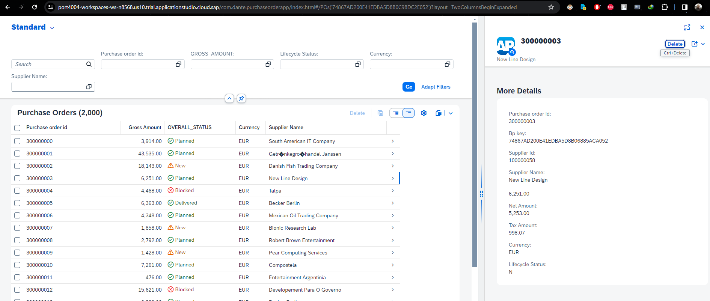

## CAPM - Day 6 - Fiori App Draft

</br>
</br>
</br>

#### Continuing Fiori elements with additional changes to the app 

</br>
</br>
</br>

<details>
  <summary> <b> Add records count on top of the line item display </b> </summary>
</br>
</br>
Make the following changes to <b>(annotations.cds)</b> as shown below 
</br>
</br>

``` cds 
],
    HeaderInfo  : {
        $Type : 'UI.HeaderInfoType',
        TypeName : 'Purchase Order',
        TypeNamePlural : 'Purchase Orders',
    },

    }

``` 

</br>
dont forget to add the comma it is the completion of previous block and adding the new block below
</br>

</br>
</br>
</br>
</details>


<details>
  <summary> Fiori Open Guided Development  </summary>
</br>
</br>
    
There is another way to develop Fiori apps <b>(Fiori Open Guided Development)</b>
</br>
</br>
This approach uses firoi development based on XML annotations not CDS annotations 
</br>
you can access it by following steps <b> (Menu--> View--> Command and pallete) </b>
</br>
</br>

</br>

</br>

</br>

</br>

</br>
</br>

when insert snippet is selcted the folowing code gets generated and the file is opened in Fiori application modeler
</br>

</br>

</br>
</br>
</br>
</details>


<details>
  <summary> Details page (Second level drill down)  </summary>
</br>
Now will add page map (detaild page pop in from side) next to existing report - follow the steps 
</br>
Right click purchaseorder app folder and select - show page map - option 
</br>

</br>
</br>

select the setting and go back to the purchase order page and refresh (use cds run / watch) if it is not running 
</br>

</br>

</br>
</br>
</details>


<details>
      <summary> Add contents header to Details page  </summary>
Now will add the details to the details page as shown below
</br>
</br>

make the fcollwing changes to annotations.cds 
</br>
</br>

``` cds 

    HeaderInfo  : {
        $Type : 'UI.HeaderInfoType',
        TypeName : 'Purchase Order',
        TypeNamePlural : 'Purchase Orders',
        Title:{
            Label : 'Purchase Order Id',
            Value : PO_ID
        },
        Description:{
            Label : 'Supplier',
            Value : PARTNER_GUID.COMPANY_NAME
        },
        ImageUrl: 'https://upload.wikimedia.org/wikipedia/commons/thumb/5/59/SAP_2011_logo.svg/2560px-SAP_2011_logo.svg.png' 
    },
``` 

</br>
</br>

</br>

</br>
</br>
</details>


<details>
      <summary> Adding facets to the details page  </summary>
</br>
</br>
make the following changes to annotations.cds 
</br>
</br>

```cds

    HeaderInfo  : {
        $Type : 'UI.HeaderInfoType',
        TypeName : 'Purchase Order',
        TypeNamePlural : 'Purchase Orders',
        Title:{
            Label : 'Purchase Order Id',
            Value : PO_ID
        },
        Description:{
            Label : 'Supplier',
            Value : PARTNER_GUID.COMPANY_NAME
        },
        ImageUrl: 'https://upload.wikimedia.org/wikipedia/commons/thumb/5/59/SAP_2011_logo.svg/2560px-SAP_2011_logo.svg.png' 
    },
Facets  : [{
    $Type: 'UI.ReferenceFacet',
    Label: 'More Details',
    Target: ![@UI.FieldGroup#DanteFields]
}
    
],

FieldGroup#DanteFields  : {
    $Type : 'UI.FieldGroupType',
    Data:[
        {
            $Type: 'UI.DataField',
            Value:PO_ID
        },
        {
            $Type: 'UI.DataField',
            Value:PARTNER_GUID.NODE_KEY
        },
        {
            $Type: 'UI.DataField',
            Value:PARTNER_GUID.BP_ID
        },        
        {
            $Type: 'UI.DataField',
            Value:PARTNER_GUID.COMPANY_NAME 
        },
        {
            $Type: 'UI.DataField',
            Value:GROSS_AMOUNT
        },
        {
            $Type: 'UI.DataField',
            Value:NET_AMOUNT
        },
                {
            $Type: 'UI.DataField',
            Value:TAX_AMOUNT
        },
        {
            $Type: 'UI.DataField',
            Value:CURRENCY_code
        },
        {
            $Type: 'UI.DataField',
            Value:LIFECYCLE_STATUS
        }
                                
    ]
}

    }

);


```

</br>
</br>

</br>

</br>
</br>
</details>


<details>
      <summary> Adding field group address to facets page  </summary>
</br>
</br>
Now will add additional data to the details page as shown below (add the facet details address) 
</br>
</br>

``` cds 
Facets  : [{
    $Type: 'UI.ReferenceFacet',
    Label: 'More Details',
    Target: ![@UI.FieldGroup#DanteFields]
},
{
    $Type: 'UI.ReferenceFacet',
    Label: 'Address Details',
    Target: ![@UI.FieldGroup#AddressFields]
}
    
],


FieldGroup#AddressFields  : {
    $Type : 'UI.FieldGroupType',
    Data:[
        {
            $Type: 'UI.DataField',
            Value:PARTNER_GUID.ADDRESS_GUID.COUNTRY
        },
        {
            $Type: 'UI.DataField',
            Value:PARTNER_GUID.ADDRESS_GUID.STREET
        },
        {
            $Type: 'UI.DataField',
            Value:PARTNER_GUID.ADDRESS_GUID.CITY
        }

    ]
                          
},

FieldGroup#DanteFields  : {
    $Type : 'UI.FieldGroupType',
    Data:[
        {
            $Type: 'UI.DataField',
            Value:PO_ID
        },
        {
            $Type: 'UI.DataField',
            Value:PARTNER_GUID.NODE_KEY
        },
        {
            $Type: 'UI.DataField',
            Value:PARTNER_GUID.BP_ID
        },        
        {
            $Type: 'UI.DataField',
            Value:PARTNER_GUID.COMPANY_NAME 
        },
        {
            $Type: 'UI.DataField',
            Value:GROSS_AMOUNT
        },
        {
            $Type: 'UI.DataField',
            Value:NET_AMOUNT
        },
                {
            $Type: 'UI.DataField',
            Value:TAX_AMOUNT
        },
        {
            $Type: 'UI.DataField',
            Value:CURRENCY_code
        },
        {
            $Type: 'UI.DataField',
            Value:LIFECYCLE_STATUS
        }
                                
    ]
}
    }

);


```

</br>

</br>

</br>
</br>
</details>

<details>
      <summary> Adding facets collection  </summary>
</br>
</br>
Now if i want to combine two different blocks in same section need to define (Collection facets) as shown below
</br>
</br>

```cds 
Facets                   : [{
        $Type : 'UI.CollectionFacet',
        Facets: [
            {
                $Type : 'UI.ReferenceFacet',
                Label : 'More Details',
                Target: ![@UI.FieldGroup#DanteFields]
            },
            {
                $Type : 'UI.ReferenceFacet',
                Label : 'Address Details',
                Target: ![@UI.FieldGroup#AddressFields]
            },
        ],
    },
    
],
```

</br>
</br>

</br>
</br>
</details>


<details>
      <summary> Correcting the facet collection   </summary>
</br>
</br>
    
Now more details group look not fitting aesthetics so correcting the facet section breaking it to 3 groups as shown below 
</br>
</br>

```cds

Facets                   : [{
        $Type : 'UI.CollectionFacet',
        Facets: [
            {
                $Type : 'UI.ReferenceFacet',
                Label : 'More Details',
                Target: ![@UI.FieldGroup#DanteFields]
            },
            {
                $Type : 'UI.ReferenceFacet',
                Label : 'Address Details',
                Target: ![@UI.FieldGroup#AddressFields]
            },
                        {
                $Type : 'UI.ReferenceFacet',
                Label : 'Amount Details',
                Target: ![@UI.FieldGroup#AmountFields]
            },
        ],
    },
    
],


FieldGroup#AddressFields  : {
    $Type : 'UI.FieldGroupType',
    Data:[
        {
            $Type: 'UI.DataField',
            Value:PARTNER_GUID.ADDRESS_GUID.COUNTRY
        },
        {
            $Type: 'UI.DataField',
            Value:PARTNER_GUID.ADDRESS_GUID.STREET
        },
        {
            $Type: 'UI.DataField',
            Value:PARTNER_GUID.ADDRESS_GUID.CITY
        }

    ]
                          
},


FieldGroup#AmountFields  : {
    $Type : 'UI.FieldGroupType',
    Data:[
        {
            $Type: 'UI.DataField',
            Value:GROSS_AMOUNT
        },
        {
            $Type: 'UI.DataField',
            Value:NET_AMOUNT
        },
                {
            $Type: 'UI.DataField',
            Value:TAX_AMOUNT
        },
        {
            $Type: 'UI.DataField',
            Value:CURRENCY_code
        },

    ]
                          
},

FieldGroup#DanteFields  : {
    $Type : 'UI.FieldGroupType',
    Data:[
        {
            $Type: 'UI.DataField',
            Value:PO_ID
        },
        {
            $Type: 'UI.DataField',
            Value:PARTNER_GUID.NODE_KEY
        },
        {
            $Type: 'UI.DataField',
            Value:PARTNER_GUID.BP_ID
        },        
        {
            $Type: 'UI.DataField',
            Value:PARTNER_GUID.COMPANY_NAME 
        },
        {
            $Type: 'UI.DataField',
            Value:LIFECYCLE_STATUS
        }
                                
    ]
}

```

</br>
</br>

</br>
</br>
</details>


<details>
  <summary> <b> Adding line item to the details page below facet </b> </summary>
</br>
</br>

We added UI proerpties so far to purchase order section we should add seperate bloc kfor purchase order line items as shown below
</br>
</br>

add the following block of code below at the end of the file - a new section for purchase order line items
</br>
</br>

```cds
annotate CatalogService.PurchseOrderItems with @(

UI: {LineItem: [
    {
        $Type: 'UI.DataField',
        Value: PO_ITEM_POS
    },
    {
        $Type: 'UI.DataField',
        Value: PRODUCT_GUID_NODE_KEY,
    },
    // {
    //     $Type: 'UI.DataField',
    //     Value: PRODUCT_GUID.ProductId,
    // },

    {
        $Type: 'UI.DataField',
        Value: GROSS_AMOUNT,
    },
    {
        $Type: 'UI.DataField',
        Value: NET_AMOUNT,
    },
    {
        $Type: 'UI.DataField',
        Value: TAX_AMOUNT,
    },
    {
        $Type: 'UI.DataField',
        Value: CURRENCY_code,
    },

], }

);


```

</br>
</br>

add the following block of code below facet section as instructed in the image
</br>
</br>

``` cds
        {
            $Type : 'UI.ReferenceFacet',
            Label : 'Line Items',
            Target: Items.![@UI.LineItem]
        },
```

</br>

</br>
</br>

</br>
</br>
</br>


also a small change in CatalogService.cds file as mentioned below 
</br>
- comment the line (entity CProductValuesView)
- add the line entity ProductSet
</br>
</br>

```cds

 entity ProductSet as projection on db.master.product; 
    //entity CProductValuesView as projection on cds.CDSViews.CProductValuesView;

```
</br>
</br>
</details>

<details>
  <summary> Details page adding (Third level drill down)  </summary>
</br>
</br>

```cds

// Purchase order item entity

annotate CatalogService.PurchseOrderItems with @(

UI: {
        LineItem: [
            {
                $Type: 'UI.DataField',
                Value: PO_ITEM_POS
            },
            {
                $Type: 'UI.DataField',
                Value: PRODUCT_GUID_NODE_KEY,
            },
            // {
            //     $Type: 'UI.DataField',
            //     Value: PRODUCT_GUID.ProductId,
            // },

            {
                $Type: 'UI.DataField',
                Value: GROSS_AMOUNT,
            },
            {
                $Type: 'UI.DataField',
                Value: NET_AMOUNT,
            },
            {
                $Type: 'UI.DataField',
                Value: TAX_AMOUNT,
            },
            {
                $Type: 'UI.DataField',
                Value: CURRENCY_code,
            },
        ], 
        HeaderInfo  : {
            $Type : 'UI.HeaderInfoType',
            TypeName : 'Item',
            TypeNamePlural : 'Items',
            Title:{
                $Type : 'UI.DataField',
                Value : NODE_KEY,               
            },
            Description:{
                $Type : 'UI.DataField',
                Value : PO_ITEM_POS,               
            },            
        },
        Facets : [
                {
                  $Type : 'UI.ReferenceFacet',
                  Target: '@UI.FieldGroup#LineItemHeader',
                  Label : 'More Info'
                },
                {
                  $Type : 'UI.ReferenceFacet',
                  Target: '@UI.FieldGroup#ProductDetails',
                  Label : 'Product details'
                },                
        ],

FieldGroup #LineItemHeader : {
        $Type: 'UI.FieldGroupType',
        Data : [
            {
                $Type: 'UI.DataField',
                Value: PO_ITEM_POS
            },
            {
                $Type: 'UI.DataField',
                Value: PRODUCT_GUID_NODE_KEY
            },
            {
                $Type: 'UI.DataField',
                Value: GROSS_AMOUNT
            },
            {
                $Type: 'UI.DataField',
                Value: NET_AMOUNT
            },
            {
                $Type: 'UI.DataField',
                Value: TAX_AMOUNT
            },
            {
                $Type: 'UI.DataField',
                Value: CURRENCY_code
            }                                                            
            
        ],
    },

FieldGroup #ProductDetails: {
        $Type: 'UI.FieldGroupType',
        Data : [
            {
                $Type: 'UI.DataField',
                Value: PRODUCT_GUID.PRODUCT_ID
            },
            {
                $Type: 'UI.DataField',
                Value: PRODUCT_GUID.Description
            },
            {
                $Type: 'UI.DataField',
                Value: PRODUCT_GUID.TYPE_CODE
            },
            {
                $Type: 'UI.DataField',
                Value: PRODUCT_GUID.CATEGORY
            },
            {
                $Type: 'UI.DataField',
                Value: PRODUCT_GUID.SUPPLIER_GUID.COMPANY_NAME
            },
            {
                $Type: 'UI.DataField',
                Value: PRODUCT_GUID.TAX_TARIF_CODE
            }    
        ],
    },    

    }

);


```

</br>
</br>

</br>
</br>
</br>
</details>


<details>
<summary> Performing delete operation </summary>
</br>
</br>
delete operation is available by default on the page app allows us to delete the records as shown below 
</br>
</br>


</br>
</br>
</br>
</details>

</br>
</br>
</br>
</br>


## Fiori App Draft

</br>
</br>

So far our Fiori app performed retreiving line items in multiple level and deleted record 
</br>  but not performed anuy CREATE or UPDATE operation yet.
</br>  SAP as provided an option to Create and Ppdate and that can be done using Fiori App draft.

</br>
</br>

### What is draft ? 
</br>
</br>
A draft is a temporary version of a business entity that has not yet been explicitly saved as an active version.
</br>
</br>

### Why drafts are used:
- To keep unsaved changes if an editing activity is interrupted, allowing users to resume editing later.
- To prevent data loss if an app terminates unexpectedly.
</br>
</br>

### Association vs Composition 
</br>
</br>

Association - a relationship betweene entitits which is a lose coupling. 
- Both objects should exist together. However, they can work independently. Example Airplane and passenger
- A passenger can travel alone without depending on Airpalne 
- An Airpalne can fly alone without depending on a passenger 
- In Similar way an Entity can be accessed seperately but it can be assocaited and accessed (header and line item) 

</br>
</br>

Composition - a relationship betweene entitits which is a tight coupling. 
- Both objects must exist together. However, they cannot function independently. Example Airplane and wings
- An Airpalne cannot fly without wings a dependency
- A purchase order line items cannot exist without header simialr way items cannot be created depending on Purchase order header info

</br>
</br>
</br>

## Changing to composition
</br>

## datamodel.cds
</br>

```cds
    entity purchaseorder: commons.Amount{
        key NODE_KEY: commons.Guid;
        PO_ID: String(40);
        PARTNER_GUID: Association to master.businesspartner;
        LIFECYCLE_STATUS: String(1);
        OVERALL_STATUS: String(1);
        NOTE: String(45) default 'null';
        Items: Composition of many poitems on Items.PARENT_KEY = $self;
//        Items: Association to many poitems on Items.PARENT_KEY = $self;
    }
```


</br>
</br>
</br>

## Draft enabling using annotation
</br>

## CatalogService.cds
</br>
</br>

Make the following small changes to the purchase order table and deploy 
</br> <b>(only draft staging table will be created when deployed)</b>
</br>

```cds
    entity POs @(
        title : 'Purchase Order',
        odata.draft.enabled : true,    
    ) as projection on db.transaction.purchaseorder {
```

</br>
</br>

</br>
</br>

Draft staging table for PO and Po items can be seen in DB as shwon below 
</br> (because it is defined as composition) 2 draft tables got created 
</br>
</br>

</br>
</br>


<details>
  <summary> <b> Items available in app after draft enabled </b> </summary>
</br>
</br>
  
</br>
  
</br>
  
</br>
</details>


<details>
  <summary> <b> Testing Draft - Creating PO </b> </summary>
</br>
</br>
  
</br>
  
</br>
</br>

Anything which is entered and not saved can be found in own draft
</br>

</br>
</br>

Now ill enter the values for header and items 
</br>

</br>

</br>
</br>

A draft saved for header and items 
</br>

</br>
</br>

save the values and you can see object created notification 
</br>

</br>
</br>
</br>

After saving you can see draft and saved version option on top 
</br>

</br>
</br>
</details>


<details>
  <summary> <b> Automating the Node key creation for Create process </b> </summary>
</br>
</br>

Make the code changes in <b> datamodels.cds </b>  under transaction section 
</br>
</br>

```cds

// transaction table 
context transaction {
    entity purchaseorder: cuid, commons.Amount{
        // key NODE_KEY: commons.Guid;
        PO_ID: String(40);
        PARTNER_GUID: Association to master.businesspartner;
        LIFECYCLE_STATUS: String(1);
        OVERALL_STATUS: String(1);
        NOTE: String(45) default 'null';
        Items: Composition of many poitems on Items.PARENT_KEY = $self;
//        Items: Association to many poitems on Items.PARENT_KEY = $self;
    }

    entity poitems: cuid, commons.Amount{
        // key NODE_KEY: commons.Guid;
        PARENT_KEY: Association to purchaseorder;
        PO_ITEM_POS: Integer;
        PRODUCT_GUID: Association to master.product;
}


```

</br>
</br>

### also remove the respective node key field in both po and po item *.csv files and load and deploy
</br>
- downlaod the .csv file (dan.db.transaction-purchaseorder.csv) , (dan.db.transaction-poitems.csv) from CSV folder
- remove the node key fields
- upload the csv file to the CSV folder 
</br>
</br>


Testing the automated key creation 
</br>
</br>
</details>

</br>
</br>
</br>
</br>
</br>


</br>
</br>
</br>
</br>
</br>
</br>
</br>
</br>
</br>
</br>
</br>
</br>
</br>
</br>
</br>
</br>
</br>

<!--
<details>
  <summary> <b> REFERENCE sample for drill down </b> </summary>
</br>
</br>

</br>
</br>
</details>
-->


