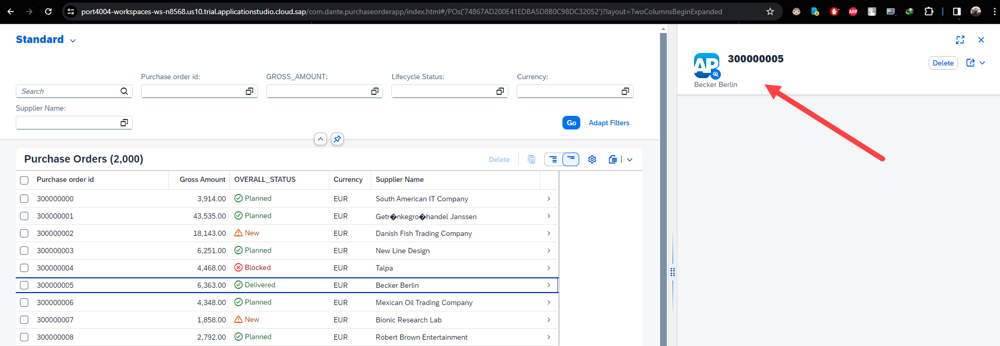
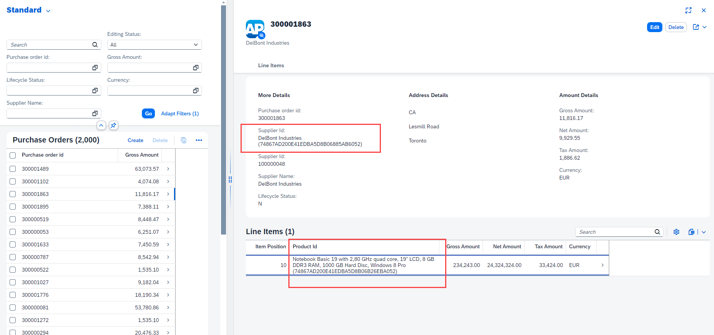

## CAPM - Day 6 - Fiori App Draft

</br>
</br>
</br>

#### Continuing Fiori elements with additional changes to the app 

</br>
</br>
</br>

<details>
  <summary> <b> Add records count on top of the line item display </b> </summary>
</br>
</br>
Make the following changes to <b>(annotations.cds)</b> as shown below 
</br>
</br>

``` cds 
],
    HeaderInfo  : {
        $Type : 'UI.HeaderInfoType',
        TypeName : 'Purchase Order',
        TypeNamePlural : 'Purchase Orders',
    },

    }

``` 

</br>
don't forget to add the comma it is the completion of previous block and adding the new block below
</br>

</br>
</br>
</br>
</details>


<details>
  <summary> Fiori Open Guided Development  </summary>
</br>
</br>
    
There is another way to develop Fiori apps <b>(Fiori Open Guided Development)</b>
</br>
</br>
This approach uses Fiori development based on XML annotations not CDS annotations 
</br>
you can access it by following steps <b> (Menu--> View--> Command and palette) </b>
</br>
</br>

</br>

</br>

</br>

</br>

</br>
</br>

when insert snippet is selected the following code gets generated and the file is opened in Fiori application modeler
</br>

</br>

</br>
</br>
</br>
</details>


<details>
  <summary> Details page (Second level drill down)  </summary>
</br>
Now will add page map (detailed page pop in from side) next to existing report - follow the steps 
</br>
Right click purchaseorder app folder and select - show page map - option 
</br>

</br>
</br>

select the setting and go back to the purchase order page and refresh (use cds run / watch) if it is not running 
</br>

</br>

</br>
</br>
</details>


<details>
      <summary> Add contents header to Details page  </summary>
Now will add the details to the details page as shown below
</br>
</br>

make the following changes to annotations.cds 
</br>
</br>

``` cds 

    HeaderInfo  : {
        $Type : 'UI.HeaderInfoType',
        TypeName : 'Purchase Order',
        TypeNamePlural : 'Purchase Orders',
        Title:{
            Label : 'Purchase Order Id',
            Value : PO_ID
        },
        Description:{
            Label : 'Supplier',
            Value : PARTNER_GUID.COMPANY_NAME
        },
        ImageUrl: 'https://upload.wikimedia.org/wikipedia/commons/thumb/5/59/SAP_2011_logo.svg/2560px-SAP_2011_logo.svg.png' 
    },
``` 

</br>
</br>

</br>

</br>
</br>
</details>


<details>
      <summary> Adding facets to the details page  </summary>
</br>
</br>
make the following changes to annotations.cds 
</br>
</br>

```cds

    HeaderInfo  : {
        $Type : 'UI.HeaderInfoType',
        TypeName : 'Purchase Order',
        TypeNamePlural : 'Purchase Orders',
        Title:{
            Label : 'Purchase Order Id',
            Value : PO_ID
        },
        Description:{
            Label : 'Supplier',
            Value : PARTNER_GUID.COMPANY_NAME
        },
        ImageUrl: 'https://upload.wikimedia.org/wikipedia/commons/thumb/5/59/SAP_2011_logo.svg/2560px-SAP_2011_logo.svg.png' 
    },
Facets  : [{
    $Type: 'UI.ReferenceFacet',
    Label: 'More Details',
    Target: ![@UI.FieldGroup#DanteFields]
}
    
],

FieldGroup#DanteFields  : {
    $Type : 'UI.FieldGroupType',
    Data:[
        {
            $Type: 'UI.DataField',
            Value:PO_ID
        },
        {
            $Type: 'UI.DataField',
            Value:PARTNER_GUID.NODE_KEY
        },
        {
            $Type: 'UI.DataField',
            Value:PARTNER_GUID.BP_ID
        },        
        {
            $Type: 'UI.DataField',
            Value:PARTNER_GUID.COMPANY_NAME 
        },
        {
            $Type: 'UI.DataField',
            Value:GROSS_AMOUNT
        },
        {
            $Type: 'UI.DataField',
            Value:NET_AMOUNT
        },
                {
            $Type: 'UI.DataField',
            Value:TAX_AMOUNT
        },
        {
            $Type: 'UI.DataField',
            Value:CURRENCY_code
        },
        {
            $Type: 'UI.DataField',
            Value:LIFECYCLE_STATUS
        }
                                
    ]
}

    }

);


```

</br>
</br>

</br>

</br>
</br>
</details>


<details>
      <summary> Adding field group address to facets page  </summary>
</br>
</br>
Now will add additional data to the details page as shown below (add the facet details address) 
</br>
</br>

``` cds 
Facets  : [{
    $Type: 'UI.ReferenceFacet',
    Label: 'More Details',
    Target: ![@UI.FieldGroup#DanteFields]
},
{
    $Type: 'UI.ReferenceFacet',
    Label: 'Address Details',
    Target: ![@UI.FieldGroup#AddressFields]
}
    
],


FieldGroup#AddressFields  : {
    $Type : 'UI.FieldGroupType',
    Data:[
        {
            $Type: 'UI.DataField',
            Value:PARTNER_GUID.ADDRESS_GUID.COUNTRY
        },
        {
            $Type: 'UI.DataField',
            Value:PARTNER_GUID.ADDRESS_GUID.STREET
        },
        {
            $Type: 'UI.DataField',
            Value:PARTNER_GUID.ADDRESS_GUID.CITY
        }

    ]
                          
},

FieldGroup#DanteFields  : {
    $Type : 'UI.FieldGroupType',
    Data:[
        {
            $Type: 'UI.DataField',
            Value:PO_ID
        },
        {
            $Type: 'UI.DataField',
            Value:PARTNER_GUID.NODE_KEY
        },
        {
            $Type: 'UI.DataField',
            Value:PARTNER_GUID.BP_ID
        },        
        {
            $Type: 'UI.DataField',
            Value:PARTNER_GUID.COMPANY_NAME 
        },
        {
            $Type: 'UI.DataField',
            Value:GROSS_AMOUNT
        },
        {
            $Type: 'UI.DataField',
            Value:NET_AMOUNT
        },
                {
            $Type: 'UI.DataField',
            Value:TAX_AMOUNT
        },
        {
            $Type: 'UI.DataField',
            Value:CURRENCY_code
        },
        {
            $Type: 'UI.DataField',
            Value:LIFECYCLE_STATUS
        }
                                
    ]
}
    }

);


```

</br>

</br>

</br>
</br>
</details>

<details>
      <summary> Adding facets collection  </summary>
</br>
</br>
Now if i want to combine two different blocks in same section need to define (Collection facets) as shown below
</br>
</br>

```cds 
Facets                   : [{
        $Type : 'UI.CollectionFacet',
        Facets: [
            {
                $Type : 'UI.ReferenceFacet',
                Label : 'More Details',
                Target: ![@UI.FieldGroup#DanteFields]
            },
            {
                $Type : 'UI.ReferenceFacet',
                Label : 'Address Details',
                Target: ![@UI.FieldGroup#AddressFields]
            },
        ],
    },
    
],
```

</br>
</br>

</br>
</br>
</details>


<details>
      <summary> Correcting the facet collection   </summary>
</br>
</br>
    
Now more details group look not fitting aesthetics so correcting the facet section breaking it to 3 groups as shown below 
</br>
</br>

```cds

Facets                   : [{
        $Type : 'UI.CollectionFacet',
        Facets: [
            {
                $Type : 'UI.ReferenceFacet',
                Label : 'More Details',
                Target: ![@UI.FieldGroup#DanteFields]
            },
            {
                $Type : 'UI.ReferenceFacet',
                Label : 'Address Details',
                Target: ![@UI.FieldGroup#AddressFields]
            },
                        {
                $Type : 'UI.ReferenceFacet',
                Label : 'Amount Details',
                Target: ![@UI.FieldGroup#AmountFields]
            },
        ],
    },
    
],


FieldGroup#AddressFields  : {
    $Type : 'UI.FieldGroupType',
    Data:[
        {
            $Type: 'UI.DataField',
            Value:PARTNER_GUID.ADDRESS_GUID.COUNTRY
        },
        {
            $Type: 'UI.DataField',
            Value:PARTNER_GUID.ADDRESS_GUID.STREET
        },
        {
            $Type: 'UI.DataField',
            Value:PARTNER_GUID.ADDRESS_GUID.CITY
        }

    ]
                          
},


FieldGroup#AmountFields  : {
    $Type : 'UI.FieldGroupType',
    Data:[
        {
            $Type: 'UI.DataField',
            Value:GROSS_AMOUNT
        },
        {
            $Type: 'UI.DataField',
            Value:NET_AMOUNT
        },
                {
            $Type: 'UI.DataField',
            Value:TAX_AMOUNT
        },
        {
            $Type: 'UI.DataField',
            Value:CURRENCY_code
        },

    ]
                          
},

FieldGroup#DanteFields  : {
    $Type : 'UI.FieldGroupType',
    Data:[
        {
            $Type: 'UI.DataField',
            Value:PO_ID
        },
        {
            $Type: 'UI.DataField',
            Value:PARTNER_GUID.NODE_KEY
        },
        {
            $Type: 'UI.DataField',
            Value:PARTNER_GUID.BP_ID
        },        
        {
            $Type: 'UI.DataField',
            Value:PARTNER_GUID.COMPANY_NAME 
        },
        {
            $Type: 'UI.DataField',
            Value:LIFECYCLE_STATUS
        }
                                
    ]
}

```

</br>
</br>

</br>
</br>
</details>


<details>
  <summary> <b> Adding line item to the details page below facet </b> </summary>
</br>
</br>

We added UI properties so far to purchase order section we should add separate block for purchase order line items as shown below
</br>
</br>

add the following block of code below at the end of the file - a new section for purchase order line items
</br>
</br>

```cds
annotate CatalogService.PurchseOrderItems with @(

UI: {LineItem: [
    {
        $Type: 'UI.DataField',
        Value: PO_ITEM_POS
    },
    {
        $Type: 'UI.DataField',
        Value: PRODUCT_GUID_NODE_KEY,
    },
    // {
    //     $Type: 'UI.DataField',
    //     Value: PRODUCT_GUID.ProductId,
    // },

    {
        $Type: 'UI.DataField',
        Value: GROSS_AMOUNT,
    },
    {
        $Type: 'UI.DataField',
        Value: NET_AMOUNT,
    },
    {
        $Type: 'UI.DataField',
        Value: TAX_AMOUNT,
    },
    {
        $Type: 'UI.DataField',
        Value: CURRENCY_code,
    },

], }

);


```

</br>
</br>

add the following block of code below facet section as instructed in the image
</br>
</br>

``` cds
        {
            $Type : 'UI.ReferenceFacet',
            Label : 'Line Items',
            Target: Items.![@UI.LineItem]
        },
```

</br>

</br>
</br>

</br>
</br>
</br>


also a small change in CatalogService.cds file as mentioned below 
</br>
- comment the line (entity CProductValuesView)
- add the line entity ProductSet
</br>
</br>

```cds

 entity ProductSet as projection on db.master.product; 
    //entity CProductValuesView as projection on cds.CDSViews.CProductValuesView;

```
</br>
</br>
</details>

<details>
  <summary> Details page adding (Third level drill down)  </summary>
</br>
</br>

```cds

// Purchase order item entity

annotate CatalogService.PurchseOrderItems with @(

UI: {
        LineItem: [
            {
                $Type: 'UI.DataField',
                Value: PO_ITEM_POS
            },
            {
                $Type: 'UI.DataField',
                Value: PRODUCT_GUID_NODE_KEY,
            },
            // {
            //     $Type: 'UI.DataField',
            //     Value: PRODUCT_GUID.ProductId,
            // },

            {
                $Type: 'UI.DataField',
                Value: GROSS_AMOUNT,
            },
            {
                $Type: 'UI.DataField',
                Value: NET_AMOUNT,
            },
            {
                $Type: 'UI.DataField',
                Value: TAX_AMOUNT,
            },
            {
                $Type: 'UI.DataField',
                Value: CURRENCY_code,
            },
        ], 
        HeaderInfo  : {
            $Type : 'UI.HeaderInfoType',
            TypeName : 'Item',
            TypeNamePlural : 'Items',
            Title:{
                $Type : 'UI.DataField',
                Value : NODE_KEY,               
            },
            Description:{
                $Type : 'UI.DataField',
                Value : PO_ITEM_POS,               
            },            
        },
        Facets : [
                {
                  $Type : 'UI.ReferenceFacet',
                  Target: '@UI.FieldGroup#LineItemHeader',
                  Label : 'More Info'
                },
                {
                  $Type : 'UI.ReferenceFacet',
                  Target: '@UI.FieldGroup#ProductDetails',
                  Label : 'Product details'
                },                
        ],

FieldGroup #LineItemHeader : {
        $Type: 'UI.FieldGroupType',
        Data : [
            {
                $Type: 'UI.DataField',
                Value: PO_ITEM_POS
            },
            {
                $Type: 'UI.DataField',
                Value: PRODUCT_GUID_NODE_KEY
            },
            {
                $Type: 'UI.DataField',
                Value: GROSS_AMOUNT
            },
            {
                $Type: 'UI.DataField',
                Value: NET_AMOUNT
            },
            {
                $Type: 'UI.DataField',
                Value: TAX_AMOUNT
            },
            {
                $Type: 'UI.DataField',
                Value: CURRENCY_code
            }                                                            
            
        ],
    },

FieldGroup #ProductDetails: {
        $Type: 'UI.FieldGroupType',
        Data : [
            {
                $Type: 'UI.DataField',
                Value: PRODUCT_GUID.PRODUCT_ID
            },
            {
                $Type: 'UI.DataField',
                Value: PRODUCT_GUID.Description
            },
            {
                $Type: 'UI.DataField',
                Value: PRODUCT_GUID.TYPE_CODE
            },
            {
                $Type: 'UI.DataField',
                Value: PRODUCT_GUID.CATEGORY
            },
            {
                $Type: 'UI.DataField',
                Value: PRODUCT_GUID.SUPPLIER_GUID.COMPANY_NAME
            },
            {
                $Type: 'UI.DataField',
                Value: PRODUCT_GUID.TAX_TARIF_CODE
            }    
        ],
    },    

    }

);


```

</br>
</br>

</br>
</br>
</br>
</details>


<details>
<summary> Performing delete operation </summary>
</br>
</br>
delete operation is available by default on the page app allows us to delete the records as shown below 
</br>
</br>


</br>
</br>
</br>
</details>

</br>
</br>
</br>
</br>


## Fiori App Draft

</br>
</br>

So far our Fiori app performed retrieving line items in multiple level and deleted record 
</br>  but not performed any CREATE or UPDATE operation yet.
</br>  SAP as provided an option to Create and Update and that can be done using Fiori App draft.

</br>
</br>

### What is draft ? 
</br>
</br>
A draft is a temporary version of a business entity that has not yet been explicitly saved as an active version.
</br>
</br>

### Why drafts are used:
- To keep unsaved changes if an editing activity is interrupted, allowing users to resume editing later.
- To prevent data loss if an app terminates unexpectedly.
</br>
</br>

### Association vs Composition 
</br>
</br>

Association - a relationship between entities which is a lose coupling. 
- Both objects should exist together. However, they can work independently. Example Airplane and passenger
- A passenger can travel alone without depending on Airplane 
- An Airplane can fly alone without depending on a passenger 
- In Similar way an Entity can be accessed separately but it can be associated and accessed (header and line item) 

</br>
</br>

Composition - a relationship between entities which is a tight coupling. 
- Both objects must exist together. However, they cannot function independently. Example Airplane and wings
- An Airplane cannot fly without wings a dependency
- A purchase order line items cannot exist without header similar way items cannot be created depending on Purchase order header info

</br>
</br>
</br>

## Changing to composition
</br>

## datamodel.cds
</br>

```cds
    entity purchaseorder: commons.Amount{
        key NODE_KEY: commons.Guid;
        PO_ID: String(40);
        PARTNER_GUID: Association to master.businesspartner;
        LIFECYCLE_STATUS: String(1);
        OVERALL_STATUS: String(1);
        NOTE: String(45) default 'null';
        Items: Composition of many poitems on Items.PARENT_KEY = $self;
//        Items: Association to many poitems on Items.PARENT_KEY = $self;
    }
```


</br>
</br>
</br>

## Draft enabling using annotation
</br>

## CatalogService.cds
</br>
</br>

Make the following small changes to the purchase order table and deploy 
</br> <b>(only draft staging table will be created when deployed)</b>
</br>

```cds
    entity POs @(
        title : 'Purchase Order',
        odata.draft.enabled : true,    
    ) as projection on db.transaction.purchaseorder {
```

</br>
</br>

</br>
</br>

Draft staging table for PO and Po items can be seen in DB as shown below 
</br> (because it is defined as composition) 2 draft tables got created 
</br>
</br>

</br>
</br>


<details>
  <summary> <b> Items available in app after draft enabled </b> </summary>
</br>
</br>
  
</br>
  
</br>
  
</br>
</details>


<details>
  <summary> <b> Testing Draft - Creating PO </b> </summary>
</br>
</br>
  
</br>
  
</br>
</br>

Anything which is entered and not saved can be found in own draft
</br>

</br>
</br>

Now ill enter the values for header and items 
</br>

</br>

</br>
</br>

A draft saved for header and items 
</br>

</br>
</br>

save the values and you can see object created notification 
</br>

</br>
</br>
</br>

After saving you can see draft and saved version option on top 
</br>

</br>
</br>
</details>


<details>
  <summary> <b> Automating the Node key creation for Create process </b> </summary>
</br>
</br>

Make the code changes in <b> datamodels.cds </b>  under transaction section 
</br>
</br>

```cds

// transaction table 
context transaction {
    entity purchaseorder: cuid, commons.Amount{
        // key NODE_KEY: commons.Guid;
        PO_ID: String(40);
        PARTNER_GUID: Association to master.businesspartner;
        LIFECYCLE_STATUS: String(1);
        OVERALL_STATUS: String(1);
        NOTE: String(45) default 'null';
        Items: Composition of many poitems on Items.PARENT_KEY = $self;
//        Items: Association to many poitems on Items.PARENT_KEY = $self;
    }

    entity poitems: cuid, commons.Amount{
        // key NODE_KEY: commons.Guid;
        PARENT_KEY: Association to purchaseorder;
        PO_ITEM_POS: Integer;
        PRODUCT_GUID: Association to master.product;
}


```

</br>
</br>

### also remove the respective node key field in both po and po item *.csv files and load and deploy
</br>
- download the .csv file (dan.db.transaction-purchaseorder.csv) , (dan.db.transaction-poitems.csv) from CSV folder
- remove the node key fields
- upload the csv file to the CSV folder 
</br>
</br>


(po items file can be deleted as Shown below)
</br>
 
</br>
</br>
</details>


<details>
  <summary> Creating F4 help for screen field Also Known As <b> Value help list </b> </summary>
</br>
</br>

``` cds

// Adding value list help for Business partner 
@cds.odata.valuelist
annotate CatalogService.BusinessPartnerSet with @(
    UI.Identification:[{
        $Type:'UI.DataField',
        Value: COMPANY_NAME
    }]
) ;

// Adding value list help for Produc
@cds.odata.valuelist
annotate CatalogService.ProductSet with @(
    UI.Identification:[{
        $Type:'UI.DataField',
        Value: DESCRIPTION
    }]
) ;

```
</br>
</br>

Before triggering F4
</br>
</br>
 
</br>
</br>

F4 Pop-up window
</br>
</br>
 
</br>
</br>

After selecting values from F4 help
</br>
</br>
 
</br>
</br>

After F4 selection the values are meaningless (the description should hlep the end user to understand what he selected 
</br> so making a description attached to the ID looks understandable to the end user 
</br>
</br>

``` cds

// Adding the COMPANY name to the GUID-KEY values value 
annotate CatalogService.POs with {
    PARTNER_GUID @(
        Common : {
            Text : PARTNER_GUID.COMPANY_NAME,
        },
        valuelist.entity : CatalogService.BusinessPartnerSet
    )
} ;

// Adding the Product description to GUID-KEY values 
annotate CatalogService.PurchseOrderItems with {
    PRODUCT_GUID @(
        Common : {
            Text : PRODUCT_GUID.DESCRIPTION,
        },
        valuelist.entity : CatalogService.ProductSet
    )
} ;

```
</br>
</br>
 
</br>
</br>
 
</br>
</br>
</details>


<details>
<summary> <b> Boost Action - integration to Fiori Ui </b> </summary>
</br>
</br>

In previous exercise we created Boost Action, now we are going to use the BOOST action in our FIori report page 
</br> 
</br>

### annotation.cds
</br>
Add this code changes below overall status field.
</br>
</br>

```cds

            {
                $Type :'UI.DataFieldForAction',
                Action : 'CatalogService.boost',
                Label: 'Boost',
                Inline: True,
            },

```

</br>
</br>
 
</br>
</br>
 
</br>
</br>
</details>

</br>
</br>
</br>
</br>
</br>

<details>
<summary> <b> ALL CODE CHANGES - TODAY SESSION </b> </summary>
</br>
</br>

## Annotation.cds 
</br>
</br>

```cds
// using CatalogService as service from '../../srv/CatalogService';

using CatalogService as service from '../../srv/CatalogService';
using mysrvdemo as service_2 from '../../srv/MyService';

// Purchase order entity
annotate CatalogService.POs with @(

UI: {
        SelectionFields          : [
            PO_ID,
            GROSS_AMOUNT,
            LIFECYCLE_STATUS,
            CURRENCY_code,
            PARTNER_GUID.COMPANY_NAME
        ],

        LineItem                 : [
            {
                $Type: 'UI.DataField',
                // Label : 'PO_ID',
                Value: PO_ID,
            },
            {
                $Type: 'UI.DataField',
                Label: 'Gross Amount',
                Value: GROSS_AMOUNT,
            },

            {
                $Type      : 'UI.DataField',
                Value      : OVERALL_STATUS,
                Criticality: Critical_report,
                CriticalityRepresentation : #WithIcon

            // Criticality is a keyword for UI icons
            // Critical report field from datamodel.cds is used to display icons

            },

            {
                $Type :'UI.DataFieldForAction',
                Action : 'CatalogService.boost',
                Label: 'Boost',
                Inline: True,
            },

            {
                $Type: 'UI.DataField',
                Value: CURRENCY_code,
            },

            {
                $Type: 'UI.DataField',
                Value: PARTNER_GUID.COMPANY_NAME,
            },
            {
                $Type: 'UI.DataField',
                Label: 'Country',
                Value: PARTNER_GUID.ADDRESS_GUID.COUNTRY,
            },
            {
                $Type: 'UI.DataField',
                Value: TAX_AMOUNT,
            },
        ],

        HeaderInfo               : {
            $Type         : 'UI.HeaderInfoType',
            TypeName      : 'Purchase Order',
            TypeNamePlural: 'Purchase Orders',
            Title         : {
                Label: 'Purchase Order Id',
                Value: PO_ID
            },
            Description   : {
                Label: 'Supplier',
                Value: PARTNER_GUID.COMPANY_NAME
            },
            ImageUrl      : 'https://upload.wikimedia.org/wikipedia/commons/thumb/5/59/SAP_2011_logo.svg/2560px-SAP_2011_logo.svg.png'
        },

        Facets                   : [
            {
                $Type : 'UI.CollectionFacet',
                Facets: [
                    {
                        $Type : 'UI.ReferenceFacet',
                        Label : 'More Details',
                        Target: ![@UI.FieldGroup#DanteFields]
                    },
                    {
                        $Type : 'UI.ReferenceFacet',
                        Label : 'Address Details',
                        Target: ![@UI.FieldGroup#AddressFields]
                    },
                    {
                        $Type : 'UI.ReferenceFacet',
                        Label : 'Amount Details',
                        Target: ![@UI.FieldGroup#AmountFields]
                    },
                ],
            },

            {
                $Type : 'UI.ReferenceFacet',
                Label : 'Line Items',
                Target: Items.![@UI.LineItem]
            },

        ],


        FieldGroup #AddressFields: {
            $Type: 'UI.FieldGroupType',
            Data : [
                {
                    $Type: 'UI.DataField',
                    Value: PARTNER_GUID.ADDRESS_GUID.COUNTRY
                },
                {
                    $Type: 'UI.DataField',
                    Value: PARTNER_GUID.ADDRESS_GUID.STREET
                },
                {
                    $Type: 'UI.DataField',
                    Value: PARTNER_GUID.ADDRESS_GUID.CITY
                }

            ]

        },


        FieldGroup #AmountFields : {
            $Type: 'UI.FieldGroupType',
            Data : [
                {
                    $Type: 'UI.DataField',
                    Value: GROSS_AMOUNT
                },
                {
                    $Type: 'UI.DataField',
                    Value: NET_AMOUNT
                },
                {
                    $Type: 'UI.DataField',
                    Value: TAX_AMOUNT
                },
                {
                    $Type: 'UI.DataField',
                    Value: CURRENCY_code
                },

            ]

        },

        FieldGroup #DanteFields  : {
            $Type: 'UI.FieldGroupType',
            Data : [
                {
                    $Type: 'UI.DataField',
                    Value: PO_ID
                },
                {
                    $Type: 'UI.DataField',
                    // Value: PARTNER_GUID.NODE_KEY
                    Value: PARTNER_GUID_NODE_KEY
                },
                {
                    $Type: 'UI.DataField',
                    Value: PARTNER_GUID.BP_ID
                },
                {
                    $Type: 'UI.DataField',
                    Value: PARTNER_GUID.COMPANY_NAME
                },
                {
                    $Type: 'UI.DataField',
                    Value: LIFECYCLE_STATUS
                }

            ]
        }

    }

);

// Adding the COMPANY name to the GUID-KEY values value 
annotate CatalogService.POs with {
    PARTNER_GUID @(
        Common : {
            Text : PARTNER_GUID.COMPANY_NAME,
        },
        valuelist.entity : CatalogService.BusinessPartnerSet
    )
} ;

// Adding the Product description to GUID-KEY values 
annotate CatalogService.PurchseOrderItems with {
    PRODUCT_GUID @(
        Common : {
            Text : PRODUCT_GUID.DESCRIPTION,
        },
        valuelist.entity : CatalogService.ProductSet
    )
} ;

// Adding value list help for Business partner 
@cds.odata.valuelist
annotate CatalogService.BusinessPartnerSet with @(
    UI.Identification:[{
        $Type:'UI.DataField',
        Value: COMPANY_NAME
    }]
) ;


// Adding value list help for Produc
@cds.odata.valuelist
annotate CatalogService.ProductSet with @(
    UI.Identification:[{
        $Type:'UI.DataField',
        Value: DESCRIPTION
    }]
) ;


// Purchase order item entity

annotate CatalogService.PurchseOrderItems with @(

UI: {
        LineItem: [
            {
                $Type: 'UI.DataField',
                Value: PO_ITEM_POS
            },
            {
                $Type: 'UI.DataField',
                Value: PRODUCT_GUID_NODE_KEY,
            },
            // {
            //     $Type: 'UI.DataField',
            //     Value: PRODUCT_GUID.ProductId,
            // },

            {
                $Type: 'UI.DataField',
                Value: GROSS_AMOUNT,
            },
            {
                $Type: 'UI.DataField',
                Value: NET_AMOUNT,
            },
            {
                $Type: 'UI.DataField',
                Value: TAX_AMOUNT,
            },
            {
                $Type: 'UI.DataField',
                Value: CURRENCY_code,
            },
        ], 
        HeaderInfo  : {
            $Type : 'UI.HeaderInfoType',
            TypeName : 'Item',
            TypeNamePlural : 'Items',
            Title:{
                $Type : 'UI.DataField',
                Value : PRODUCT_GUID_NODE_KEY,               
            },
            Description:{
                $Type : 'UI.DataField',
                Value : PO_ITEM_POS,               
            },            
        },
        Facets : [
                {
                  $Type : 'UI.ReferenceFacet',
                  Target: '@UI.FieldGroup#LineItemHeader',
                  Label : 'More Info'
                },
                {
                  $Type : 'UI.ReferenceFacet',
                  Target: '@UI.FieldGroup#ProductDetails',
                  Label : 'Product details'
                },                
        ],

FieldGroup #LineItemHeader : {
        $Type: 'UI.FieldGroupType',
        Data : [
            {
                $Type: 'UI.DataField',
                Value: PO_ITEM_POS
            },
            {
                $Type: 'UI.DataField',
                Value: PRODUCT_GUID_NODE_KEY
            },
            {
                $Type: 'UI.DataField',
                Value: GROSS_AMOUNT
            },
            {
                $Type: 'UI.DataField',
                Value: NET_AMOUNT
            },
            {
                $Type: 'UI.DataField',
                Value: TAX_AMOUNT
            },
            {
                $Type: 'UI.DataField',
                Value: CURRENCY_code
            }                                                            
            
        ],
    },

FieldGroup #ProductDetails: {
        $Type: 'UI.FieldGroupType',
        Data : [
            {
                $Type: 'UI.DataField',
                Value: PRODUCT_GUID.PRODUCT_ID
            },
            {
                $Type: 'UI.DataField',
                Value: PRODUCT_GUID.DESCRIPTION
            },
            {
                $Type: 'UI.DataField',
                Value: PRODUCT_GUID.TYPE_CODE
            },
            {
                $Type: 'UI.DataField',
                Value: PRODUCT_GUID.CATEGORY
            },
            {
                $Type: 'UI.DataField',
                Value: PRODUCT_GUID.SUPPLIER_GUID.COMPANY_NAME
            },
            {
                $Type: 'UI.DataField',
                Value: PRODUCT_GUID.TAX_TARIF_CODE
            }    
        ],
    },    

    }

);

```

</br>
</br>


## CatalogService.cds
</br>
</br>

```cds
// importing data models and views to our service
using {dan.db} from '../db/datamodel';
using {dante.cds} from '../db/CDSViews';

// so in cap services odata will trim tha name when there is upper case in the word
// example MyName will be dispalyed as My the part (Name) will be removed
// to avoid this we use @(path:<service-name>) annotation

service CatalogService @(path: 'CatalogService') {
// I want to insert but dont want to delete
    @Capabilities : { Insertable, Deletable: false }
    entity BusinessPartnerSet as projection on db.master.businesspartner;
    entity AddressSet         as projection on db.master.address;

// I want to restrict CAP from doing post on employee use @readonly 
    // @readonly   
    entity EmployeeSet        as projection on db.master.employees;
    entity PurchseOrderItems  as projection on db.transaction.poitems;

//    entity POs as projection on db.transaction.purchaseorder {
    entity POs @(
        title : 'Purchase Order',
        odata.draft.enabled : true,  
        //odata.draft.enabled : true,    
    ) as projection on db.transaction.purchaseorder {
            *,
// Case statement for - displaying status text 
            case OVERALL_STATUS
                when 'N' then 'New'
                when 'P' then 'Planned'
                when 'B' then 'Blocked'
                when 'D' then 'Delivered'
                else 'Unknown'
                end as OVERALL_STATUS: String(20),

// This is colour coding - Criticality icons 
                case OVERALL_STATUS
                when 'N' then 2
                when 'P' then 3
                when 'B' then 1
                when 'D' then 3
                else 1
                end as Critical_report: Integer,

// in case if gross amount is showing with extreme decimal value             
            // round(GROSS_AMOUNT) as GROSS_AMOUNT: Decimal(10,2),
            Items : redirected to PurchseOrderItems
        } actions {
// Definition Part - need to do implementation part - in JS file             
            action boost();
            function largestOrder() returns array of  POs;
        };
 entity ProductSet as projection on db.master.product; 
    //entity CProductValuesView as projection on cds.CDSViews.CProductValuesView;

}

```

</br>
</br>

## CatalogService.js
</br>
</br>

```cds
// This module block will never change its liek a template 
// -- whats inside this block will cahnge according to business Req

// async - here means run in synchronised manner

module.exports = cds.service.impl(async function () {

    // step 1: get the object of our odata entities
    const { EmployeeSet, POs } = this.entities;

    // step 2:define generic handler for validaiton
    this.before('UPDATE', EmployeeSet, (req, res) => {
        console.log("It came here " + req.data.salaryAmount);
        if(parseFloat(req.data.salaryAmount) >= 1000000){
            req.error(500, "Salary must be less than a million for employee");
        }                
    });

// ACTION
    this.on('boost', async (req,res) => {
        try {
            // const ID = req.params[0];
            const ID = req.params[0].ID;            
            // console.log("Hey Amigo you purcahse order with id " + JSON.stringify(req.params[0]) + " will be boosted");
            console.log("Hey Amigo you purcahse order with id " + JSON.stringify(req.params[0].ID) + " will be boosted");
// CDS querly language converted from JS to cds 
            const tx = cds.tx(req);
            await tx.update(POs).with({
                GROSS_AMOUNT: { '+=' : 20000 },
                NOTE: 'Boosted!!'
            // }).where(ID);
        }).where({ID: ID});            
        } catch (error) {
            return "Error" + error.toString();
        }        
    });

// FUNCTION 
    this.on( 'largestOrder', async (req,res) => {
        try {
            const ID = req.params[0];
            const tx = cds.tx(req);
            
// SELECT * UPTO 1 Row from dbtab ORDERBY GROSS_AMOUNT desc
            const reply = await tx.read(POs).orderBy({
                GROSS_AMOUNT: 'desc'
            }).limit(1);

            return reply;
        } catch (error) {
            
        }

    });

}
);


// cds.tx is called CDS Transaction management
// ACID 
// Atomicity - Either completely fail or completley success 
// Consistency - Transction should leave DB in a consistent state
// Isolation - Each transaction is isoalted from each other 
// Durability - data base should be durable enought to perform the transaction else transaction will be rejected 

// it is an api provided by sap for cds transaction - can check the deailed info here https://cap.cloud.sap/docs/node.js/cds-tx
```

</br>
</br>

## datamodel.cds
</br>
</br>

```cds
namespace dan.db;

using { cuid, managed, temporal, Currency } from '@sap/cds/common'; // standard 
using { dan.commons } from './commons'; // custom 

// master table
context master {

// Business partner TABLE 
entity businesspartner {
    key NODE_KEY: commons.Guid; // Commons is my cutoms cds -- Common is Standard 
    BP_ROLE: String(2);
    EMAIL_ADDRESS: String(105);
    PHONE_NUMBER: String(32);
    FAX_NUMBER: String(34);
    WEB_ADDRESS: String(44);
    ADDRESS_GUID: Association to address; // table liknk to address
    BP_ID: String(32);
    COMPANY_NAME: String(250);
}

// Business partner ADDRESS TABLE 
entity address {
    key NODE_KEY: commons.Guid;
    CITY: String(44);
    POSTAL_CODE: String(8);
    STREET:String(44);
    BUILDING: String(128);
    COUNTRY: String(44);
    ADDRESS_TYPE: String(44);
    VAL_START_DATE: Date;
    VAL_END_DATE: Date;
    LATITUDE: Decimal;
    LONGITUDE: Decimal;
    businesspartner: Association to one businesspartner on
    businesspartner.ADDRESS_GUID = $self; // table link to business partner
}

// Product TABLE 
entity product {
    key NODE_KEY: String(40);
    PRODUCT_ID: String(28);
    TYPE_CODE: String(2);
    CATEGORY: String(32);
    DESCRIPTION: localized String(255); // localized will generate multiple transaltion text table at runtime 
    SUPPLIER_GUID: Association to master.businesspartner;  // SUPPLIER_GUID is assocaited to teh primary key of business partner 
    TAX_TARIF_CODE: Integer;
    MEASURE_UNIT: String(2);
    WEIGHT_MEASURE: Decimal(5,2);
    WEIGHT_UNIT: String(2);
    CURRENCY_CODE:String(4);
    PRICE: Decimal(15,2);
    WIDTH:Decimal(5,2);	
    DEPTH:Decimal(5,2);	
    HEIGHT:	Decimal(5,2);
    DIM_UNIT:String(2);

}

entity employees: cuid {
    nameFirst: String(40);
    nameMiddle: String(40);
    nameLast: String(40);
    nameInitials: String(40);
    sex: commons.Gender;
    language: String(1);
    phoneNumber: commons.PhoneNumber;
    email: commons.Email;
    loginName: String(12);
    Currency: Currency;
    salaryAmount: commons.AmountX;
    accountNumber: String(16);
    bankId: String(8);
    bankName: String(40);
}

}

// transaction table 
context transaction {
    entity purchaseorder: cuid, commons.Amount{
        // key NODE_KEY: commons.Guid;
        PO_ID: String(40);
        PARTNER_GUID: Association to master.businesspartner;
        LIFECYCLE_STATUS: String(1);
        OVERALL_STATUS: String(1);
        NOTE: String(45) default 'null';
        Items: Composition of many poitems on Items.PARENT_KEY = $self;
//        Items: Association to many poitems on Items.PARENT_KEY = $self;
    }

    entity poitems: cuid, commons.Amount{
        // key NODE_KEY: commons.Guid;
        PARENT_KEY: Association to purchaseorder;
        PO_ITEM_POS: Integer;
        PRODUCT_GUID: Association to master.product;
}


}

```

</br>
</br>

</details>


</br>
</br>
</br>
</br>
</br>
</br>
</br>
</br>

# NEXT ------ CAPM - DAY 7 - HANA and Deployment

<p align="center"> 
<a href="https://github.com/Octavius-Dante/Tetra_Proxima/tree/main/CAPM-DAY-7"> CAPM DAY 7 - HANA and Deployment</a> 

#### Previous Sessions
</br>

<!--
- [x] <a href="https://github.com/Octavius-Dante/Tetra_Proxima/tree/main/CAPM-DAY-12"> CAPM Day 12 - Extension CI CD</a>
- [x] <a href="https://github.com/Octavius-Dante/Tetra_Proxima/tree/main/CAPM-DAY-11"> CAPM Day 11 - S4HANA Side by Side</a>
- [x] <a href="https://github.com/Octavius-Dante/Tetra_Proxima/tree/main/CAPM-DAY-10"> CAPM Day 10 - Side by Side extension</a>
- [x] <a href="https://github.com/Octavius-Dante/Tetra_Proxima/tree/main/CAPM-DAY-9"> CAPM Day 9 - Serverless Fiori App</a>
- [x] <a href="https://github.com/Octavius-Dante/Tetra_Proxima/tree/main/CAPM-DAY-8"> CAPM Day 8 - CAPM Security XSUAA</a>
- [x] <a href="https://github.com/Octavius-Dante/Tetra_Proxima/tree/main/CAPM-DAY-7"> CAPM Day 7 - HANA and Deployment</a>
- [x] <a href="https://github.com/Octavius-Dante/Tetra_Proxima/tree/main/CAPM-DAY-6"> CAPM Day 6 - Fiori App Draft</a>
-->
- [x] <a href="https://github.com/Octavius-Dante/Tetra_Proxima/tree/main/CAPM-DAY-5"> CAPM Day 5 - Fiori Elements</a>
- [x] <a href="https://github.com/Octavius-Dante/Tetra_Proxima/tree/main/CAPM-DAY-4"> CAPM Day 4 - Generic Handlers</a>
- [x] <a href="https://github.com/Octavius-Dante/Tetra_Proxima/tree/main/CAPM-DAY-3"> CAPM Day 3 - EPM DB and CDS Views</a>
- [x] <a href="https://github.com/Octavius-Dante/Tetra_Proxima/tree/main/CAPM-DAY-2"> CAPM Day 2 - Aspects and Reuse Tables</a>
- [x] <a href="https://github.com/Octavius-Dante/Tetra_Proxima/tree/main/CAPM-DAY-1"> CAPM Day 1 - First CAP App </a>

</br>
</br>
  
</p>

</br>
</br>
</br>
</br>


