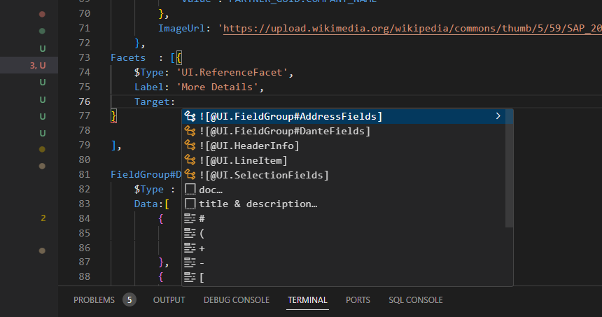

## CAPM - Day 6 - Fiori App Draft

#### Continuing Fiori elements with additional changes to the app 

</br>
</br>

Will add records coun on top of the line item display 
</br> - Make the following changes to <b>(annotations.cds)</b> as shown below 
</br>
</br>

``` cds 
],
    HeaderInfo  : {
        $Type : 'UI.HeaderInfoType',
        TypeName : 'Purchase Order',
        TypeNamePlural : 'Purchase Orders',
    },

    }

``` 

</br>
dont forget to add the comma it is the completion of previous block and adding the new block below
</br>

</br>
</br>
</br>

There is another way to develop Fiori apps <b>(Fiori Open Guided Development)</b>
</br>
</br>
This approach uses firoi development based on XML annotations not CDS annotations 
</br>
you can access it by following steps <b> (Menu--> View--> Command and pallete) </b>
</br>
</br>

</br>

</br>

</br>

</br>

</br>
</br>

when insert snippet is selcted the folowing code gets generated and the file is opened in Fiori application modeler
</br>

</br>

</br>
</br>
</br>

Now will add page map (detaild page pop in from side) next to existing report - follow the steps 
</br>
Right click purchaseorder app folder and select - show page map - option 
</br>

</br>
</br>

select the setting and go back to the purchase order page and refresh (use cds run / watch) if it is not running 
</br>

</br>

</br>
</br>

Now will add the details to the details page as shown below
</br>
</br>

make the fcollwing changes to annotations.cds 
</br>
</br>

``` cds 

    HeaderInfo  : {
        $Type : 'UI.HeaderInfoType',
        TypeName : 'Purchase Order',
        TypeNamePlural : 'Purchase Orders',
        Title:{
            Label : 'Purchase Order Id',
            Value : PO_ID
        },
        Description:{
            Label : 'Supplier',
            Value : PARTNER_GUID.COMPANY_NAME
        },
        ImageUrl: 'https://upload.wikimedia.org/wikipedia/commons/thumb/5/59/SAP_2011_logo.svg/2560px-SAP_2011_logo.svg.png' 
    },
``` 

</br>
</br>

</br>

</br>
</br>


Now will add facets to the details page 
</br>
make the fcollwing changes to annotations.cds 
</br>
</br>

```cds

// using CatalogService as service from '../../srv/CatalogService';

using CatalogService as service from '../../srv/CatalogService';
using mysrvdemo as service_2 from '../../srv/MyService';

annotate CatalogService.POs with @(

    UI :{
        SelectionFields  : [
            PO_ID,
            GROSS_AMOUNT,
            LIFECYCLE_STATUS,
            CURRENCY_code,
            PARTNER_GUID.COMPANY_NAME
        ],

        LineItem : [
        {
            $Type : 'UI.DataField',
//            Label : 'PO_ID',
            Value : PO_ID,
        },
        {
            $Type : 'UI.DataField',
           Label : 'Gross Amount',
            Value : GROSS_AMOUNT,
        },

        {
            $Type : 'UI.DataField',
            Value : OVERALL_STATUS,
            Criticality:Critical_report,

// Criticality is a keyword for UI icons 
// Critical report field from datamodel.cds is used to display icons 

        },

        {
            $Type : 'UI.DataField',
            Value : CURRENCY_code,
        },

        {
            $Type : 'UI.DataField',
            Value : PARTNER_GUID.COMPANY_NAME,
        },
        {
            $Type : 'UI.DataField',
            Label : 'Country',            
            Value : PARTNER_GUID.ADDRESS_GUID.COUNTRY,
        },
        {
            $Type : 'UI.DataField',
            Value : TAX_AMOUNT,
        },
    ],

    HeaderInfo  : {
        $Type : 'UI.HeaderInfoType',
        TypeName : 'Purchase Order',
        TypeNamePlural : 'Purchase Orders',
        Title:{
            Label : 'Purchase Order Id',
            Value : PO_ID
        },
        Description:{
            Label : 'Supplier',
            Value : PARTNER_GUID.COMPANY_NAME
        },
        ImageUrl: 'https://upload.wikimedia.org/wikipedia/commons/thumb/5/59/SAP_2011_logo.svg/2560px-SAP_2011_logo.svg.png' 
    },
Facets  : [{
    $Type: 'UI.ReferenceFacet',
    Label: 'More Details',
    Target: ![@UI.FieldGroup#DanteFields]
}
    
],

FieldGroup#DanteFields  : {
    $Type : 'UI.FieldGroupType',
    Data:[
        {
            $Type: 'UI.DataField',
            Value:PO_ID
        },
        {
            $Type: 'UI.DataField',
            Value:PARTNER_GUID.NODE_KEY
        },
        {
            $Type: 'UI.DataField',
            Value:PARTNER_GUID.BP_ID
        },        
        {
            $Type: 'UI.DataField',
            Value:PARTNER_GUID.COMPANY_NAME 
        },
        {
            $Type: 'UI.DataField',
            Value:GROSS_AMOUNT
        },
        {
            $Type: 'UI.DataField',
            Value:NET_AMOUNT
        },
                {
            $Type: 'UI.DataField',
            Value:TAX_AMOUNT
        },
        {
            $Type: 'UI.DataField',
            Value:CURRENCY_code
        },
        {
            $Type: 'UI.DataField',
            Value:LIFECYCLE_STATUS
        }
                                
    ]
}

    }

);


```

</br>
</br>

</br>

</br>
</br>

Now will add additional data to the details page as shown below (add the face detaisl address) 
</br>
</br>

``` cds 
Facets  : [{
    $Type: 'UI.ReferenceFacet',
    Label: 'More Details',
    Target: ![@UI.FieldGroup#DanteFields]
},
{
    $Type: 'UI.ReferenceFacet',
    Label: 'Address Details',
    Target: ![@UI.FieldGroup#AddressFields]
}
    
],


FieldGroup#AddressFields  : {
    $Type : 'UI.FieldGroupType',
    Data:[
        {
            $Type: 'UI.DataField',
            Value:PARTNER_GUID.ADDRESS_GUID.COUNTRY
        },
        {
            $Type: 'UI.DataField',
            Value:PARTNER_GUID.ADDRESS_GUID.STREET
        },
        {
            $Type: 'UI.DataField',
            Value:PARTNER_GUID.ADDRESS_GUID.CITY
        }

    ]
                          
},

FieldGroup#DanteFields  : {
    $Type : 'UI.FieldGroupType',
    Data:[
        {
            $Type: 'UI.DataField',
            Value:PO_ID
        },
        {
            $Type: 'UI.DataField',
            Value:PARTNER_GUID.NODE_KEY
        },
        {
            $Type: 'UI.DataField',
            Value:PARTNER_GUID.BP_ID
        },        
        {
            $Type: 'UI.DataField',
            Value:PARTNER_GUID.COMPANY_NAME 
        },
        {
            $Type: 'UI.DataField',
            Value:GROSS_AMOUNT
        },
        {
            $Type: 'UI.DataField',
            Value:NET_AMOUNT
        },
                {
            $Type: 'UI.DataField',
            Value:TAX_AMOUNT
        },
        {
            $Type: 'UI.DataField',
            Value:CURRENCY_code
        },
        {
            $Type: 'UI.DataField',
            Value:LIFECYCLE_STATUS
        }
                                
    ]
}
    }

);


```

</br>

</br>

</br>
</br>


Now if i want to combine two different blocks in same section need to define (Collection facets) as shown below
</br>
</br>

```cds 
Facets                   : [{
        $Type : 'UI.CollectionFacet',
        Facets: [
            {
                $Type : 'UI.ReferenceFacet',
                Label : 'More Details',
                Target: ![@UI.FieldGroup#DanteFields]
            },
            {
                $Type : 'UI.ReferenceFacet',
                Label : 'Address Details',
                Target: ![@UI.FieldGroup#AddressFields]
            },
        ],
    },
    
],
```

</br>
</br>

</br>
</br>


</br>
</br>
</br>
</br>
</br>
</br>
</br>
</br>
</br>
</br>
</br>
</br>
</br>
</br>
</br>
</br>
</br>
</br>
</br>
</br>
</br>

</br>
</br>
</br>
</br>
</br>
</br>
</br>
</br>
</br>
</br>
</br>
</br>
</br>
</br>
</br>
</br>
</br>
</br>
</br>
</br>
</br>
</br>
</br>
</br>
</br>
</br>
</br>
</br>
</br>
</br>
</br>
