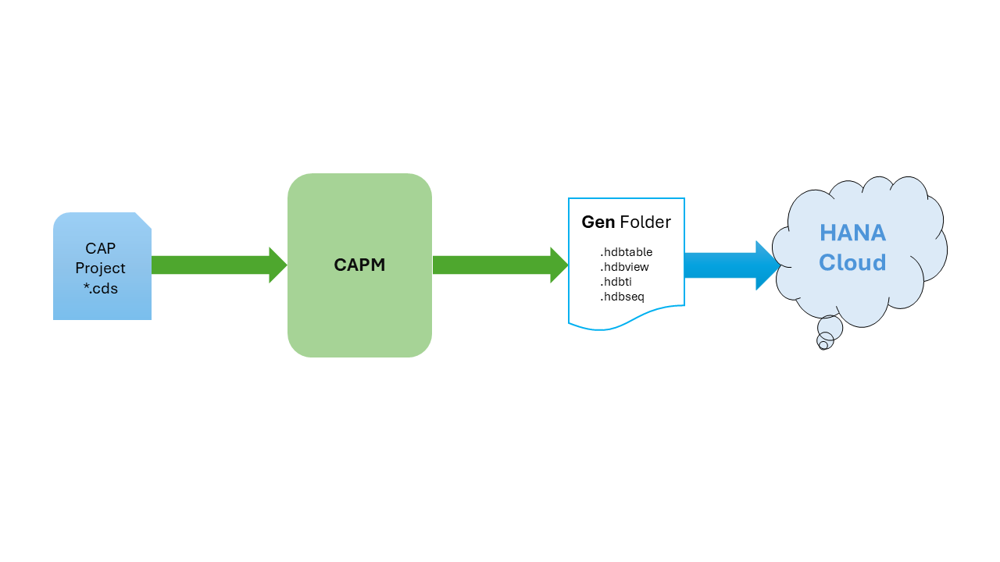
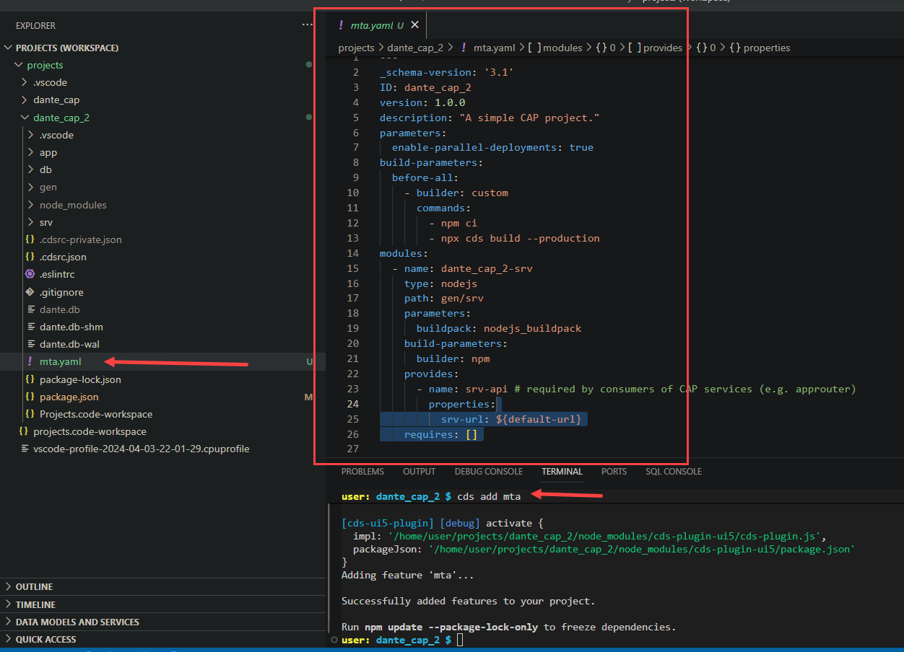

## CAPM - Day 7 - HANA Deployment

#### App running in Local DB should be shifted to Remote DB

</br>
</br>

So far we have our app running using SQLite and Postgres Sql in our system now we are going to use HANA DB 
</br> - Make the following changes to our app and connect to HANA DB 
</br>
</br>
our applciaiton contains following files which are type CDS in DB, in SRV HANA DB dosent understand these *.cds type 
</br>
So what CAPM framework does when we connect our CAP with HDB it build files necessary for HDB in a folder called GEN
</br> the CAP application converts .cds table from current local db to HANA DB's needed version of files
</br>
</br>

### What HANA understands :
</br>
HANA understand its own database object format example : hdbtable, hdbsequence, hdbview, hdbprocedure, hdbi, hdbfunction...
</br>
</br>
 
</br>
</br>
</br>

## Steps for integrating CAP to HANA DB
</br>
</br>

### Pre-Requisite 
</br>

<details>
<summary> 1. Check the version of CDS (which must be >2.0) <b> cds -v </b> </summary>
</br>
</br>
 
</br>
</br>
</details>

<details>
<summary> 2. Start a HANA cloud instance in SAP BTP </summary>
</br>
 
</br>

</br>
</br>
</details>

</br></br>

### Main steps for HANA Cloud integration
</br>

<details>
<summary> 1. Add HANA configuration to our app, which tells CAP framwork that default DB is now HANA <b> -cds add hana </b> </summary>

</br>
</br>

```bat
-cds add hana 
```

</br>
</br>

</br>
</details>

<details>
<summary> 2. The above cds add hana command made following changes check package.json  </summary>
</br>
</br>

</br>

</br>
</br>
</details>

<details>
<summary> 3. Add the following lines to the package.json below cds section  </summary>
</br>
</br>

</br>

```json
  "hana":{
    "deploy-format":"hdbtable"
  }
```
</br>
</br>
</details>

<details>
<summary> 4. do NPM install for installing the essentail packages - related to hana db (by scanning package.json) </summary>
</br>
</br>

</br>
</br>
</details>

<details>
<summary> 5. We need to perform CDS build </summary>
</br>

This build creation will create GEN folder in our app directory for integrating to HANA DB 
</br> and create all the hana specific files which will be deployed to HANA cloud
</br>
</br>

```bat
cds build --production
```

</br>
</br>

Cds build command execution 
</br>
</br>

</br>

</br>
</br>

After creating build - Gen folder in APP directory (GEN - Generated) 
</br>
</br>

</br>
</br>
</details>

<details>
<summary> 6. Need to login to CLoud foundry from BAS - cf login </summary>
</br>
</br>

</br>

</br>

</br>
</br>
</details>

<details>
<summary> 7. Need to deploy the DB and everything to HANA </summary>
</br>
</br>
all generated files will be deployed to HANA using the command  <b>  cds deploy --to hana:dante </b>
</br>
</br>

There are 2 version for deploying to DB 
- one with package.json file with credential changes 
- Two with no changes to package.json file but have to deploy it with profile command 

</br>
</br>

## pacakge.json (with changes)
</br>
</br>

```json

{
  "name": "dante_cap_2",
  "version": "1.0.0",
  "description": "A simple CAP project.",
  "repository": "<Add your repository here>",
  "license": "UNLICENSED",
  "private": true,
  "dependencies": {
    "@sap/cds": "^7",
    "@sap/cds-odata-v2-adapter-proxy": "^1.9.21",
    "express": "^4",
    "@sap/cds-hana": "^2"
  },
  "devDependencies": {
    "@cap-js/sqlite": "^1",
    "cds-plugin-ui5": "^0.6.13"
  },
  "scripts": {
    "start": "cds-serve",
    "watch-purchaseorderapp": "cds watch --open com.dante.purchaseorderapp/index.html?sap-ui-xx-viewCache=false --livereload false"
  },
  "workspaces": [
    "app/*"
  ],
  "sapux": [
    "app/purchaseorderapp"
  ],
  "cds": {
    "requires": {
.      "db": {
.        "kind": "hana-Cloud",
.        "credentials": {
.          "database": "dan-key"
        }
      }
    }
  },
  "hana": {
    "deploy-format": "hdbtable"
  }
}


```

</br>
</br>

### "dan-key" is the key file which is going to get created for db in BTP instance  
</br> and get accessed when CAPM app is executed it connects with credentials to access HDB
</br> the name should be as same as database name which you are going to give in command
</br> (example if DB name is "dante" - this should be "dante-key")

</br>
</br>

## TO deploy DB to HANA (package.json file changes required)
</br>
</br>

```bat
cds deploy --to hana:<DB name>
```

</br>
</br>

## Alternative command to perfrom both - build and deploy (package.json file changes required)
</br>
</br>

```bat
cds build --production && cds deploy --to hana:<DB name>
```

</br>
</br>

## This command also works (package.json file changes NOT-required) 
</br>
</br>

```bat
cds build --production && cds deploy --to hana:<DB name> --profile hybrid
```

</br>
</br>

sample how my code looked like 
</br>
</br>

```bat
cds build --production && cds deploy --to hana:dante --profile hybrid
```
</br>
</br>

> This command execution will take some time to complete


</br>
</br>
Why to use profile Hybrid ? 
</br>
</br>
Because it is what expected from SAP BTP cloud end this configuration is expected during our build process
</br> this can be found after deploying in <b>.cdsrc-private.json</b>
</br>
</br>
</br>
<a href="https://github.com/Octavius-Dante/Tetra_Proxima/blob/main/CAPM-DAY-7/error-log-HDB.txt"> CDS Deploy - Error Log Sample </a>
</br>
</br>
<a href="https://github.com/Octavius-Dante/Tetra_Proxima/blob/main/CAPM-DAY-7/success-log-HDB.txt"> CDS Deploy - Success Log Sample </a>
</br>
</br>

Error log and success log are shared for your reference in case of any error - there will be manys errors listed 
</br> - you can check the file and search for error and understand why error occured - mostly errros will be descriptive and understandable 

</br>
</br>

## delete all csv files in the project and add the files shared here and deploy 
## these are HANA specifc files which will work properly when deploying  

</br>
</br>
<a href="https://github.com/Octavius-Dante/Tetra_Proxima/tree/main/CAPM-DAY-7/hanacsv"> HANA CSV Folder </a>
</br>
</br>
<a href="https://github.com/Octavius-Dante/Tetra_Proxima/tree/main/CAPM-DAY-7/hanacsv.zip"> HANA CSV.zip file  </a>
</br>
</br>

</br>
</br>


</br>
</br>
</details>


<details>
<summary> 8. When deployment is successful </summary>
</br>

IF deployment worked well a new file calle <b>cdsrc-private.json</b> gets created automatically.
</br> this file contain the information about which container in SAP BTP HANA Cloud to connect to.
</br> and private key is stored in this file.

</br>
</br>

</br>
</br>

</br>

</br>

</br>

</br>
</details>


</br></br>

### Post HANA deployment
</br>


 
<details>
<summary> 1. What is HDI container </summary>
</br>
</br>

HDI container is a databsae inside a database (HDB), 
</br> this is designed to avoid problems and conflict between data operations in database objects 
</br> when multiple developers are working with same object. 

</br>
</br>

HDI container is application managed, Schema is user managed. 
</br> There can be only one schema for one hdi container ( one Schema = one HDI container )
</br>
</br>
</details>

<details>
<summary> 2. HDI container Access in HANA Database explorer </summary>
</br>
</br>

</br>

</br>

</br>
	
</br>
	
</br>	
</details>


<details>
<summary> 3. Data preview and checking analytics tool in HDB </summary>
</br>
</br>
Accessing hana db table and checking the analytics tool available in the system with variety of options for the table data.
</br>
</br>	

</br>

</br>

</br>
	
</br>	

</br>

</br>

</br>
	
</br>
	
</br>	
</details>


<details>
<summary> 4. New Watch command for CDS to run with HANA DB </summary>
</br>
</br>
Use this new CDS watch command tp run the application with HANA DB support it is suggested in hana deployment log post successful deployment
</br> our hana DB is deployed with profile hybrid command so it is needed to run the watch fucntion using that profile. 
</br>
</br>
## Hybrid profile is the only profile which has CAP and DB connection communciating properly.
</br>
</br>

```bat
cds watch --profile hybrid
```
 
</br>
</br>

</br>
</br>	
</details>


<details>
<summary> 5. Testing CAPM app with HANA DB </summary>
</br>	
</br>

</br>
	
</br>

</br>
	
</br>
	
</br>
	
</br>
	
</br>

</br>
</br>	
</details>


</br>
</br>
</br>

## Steps for Deploying CAPM app to Cloud Foundry
</br>
</br>


</br>
</br>
</br>

</br>
</br>
</br>


<!--

</br>
</br>

``` cds 
	


``` 

</br>
</br>

</br>
</br>

## MyService.js 
</br>
</br>

```js


```
</br>

</br>
</br>


<details>
<summary> <b> ALL CODE CHANGES - TODAY SESSION </b> </summary>
</br>
</br>

</br>
</br>

</br>
</br>
</details>


-->

</br>
</br>
</br>
</br>
</br>
</br>
</br>
</br>
</br>
</br>
</br>
</br>
</br>
</br>
</br>
</br>
</br>
</br>
</br>
</br>
</br>
</br>
</br>
</br>
</br>
</br>
</br>
</br>
</br>
</br>
</br>
</br>


</br>
</br>
</br>
</br>
</br>
</br>
</br>
</br>

# NEXT ------ CAPM - DAY 8 - CAPM Security XSUAA

<p align="center"> 
<a href="https://github.com/Octavius-Dante/Tetra_Proxima/tree/main/CAPM-DAY-8"> CAPM DAY 8 - CAPM Security XSUAA</a> 
</p>
