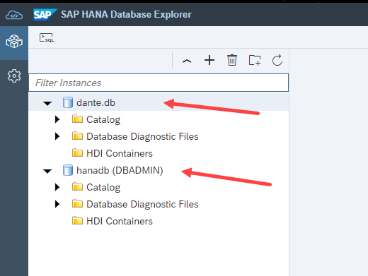
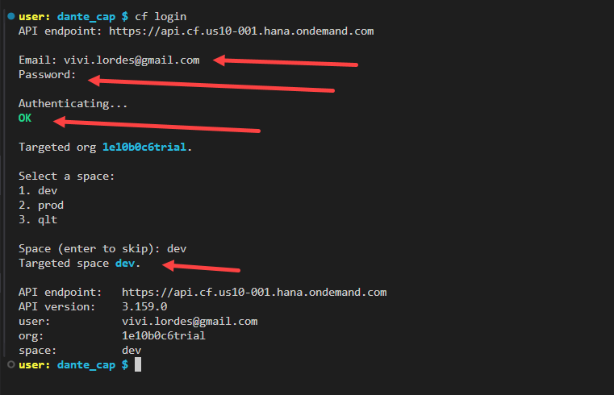

## CAPM - Day 7 - HANA Deployment

#### App running in Local DB should be shifted to Remote DB

</br>
</br>

So far we have our app running using SQLite and Postgres Sql in our system now we are going to use HANA DB 
</br> - Make the following changes to our app and connect to HANA DB 
</br>
</br>
our applciaiton contains following files which are type CDS in DB, in SRV HANA DB dosent understand these *.cds type 
</br>
So what CAPM framework does when we connect our CAP with HDB it build files necessary for HDB in a folder called GEN
</br> the CAP application converts .cds table from current local db to HANA DB's needed version of files
</br>
</br>

### What HANA understands :
</br>
HANA understand its own database object format example : hdbtable, hdbsequence, hdbview, hdbprocedure, hdbi, hdbfunction...
</br>
</br>
 
</br>
</br>
</br>

## Steps for integrating CAP to HANA DB
</br>
</br>

### Pre-Requisite 
</br>

<details>
<summary> 1. Check the version of CDS (which must be >2.0) <b> cds -v </b> </summary>
</br>
</br>
 
</br>
</br>
</details>

<details>
<summary> 2. Start a HANA cloud instance in SAP BTP </summary>
</br>
 
</br>

</br>
</br>
</details>

</br></br>

### Main steps for HANA Cloud integration
</br>

<details>
<summary> 1. Add HANA configuration to our app, which tells CAP framwork that default DB is now HANA <b> -cds add hana </b> </summary>

</br>
</br>

```bat
-cds add hana 
```

</br>
</br>

</br>
</details>

<details>
<summary> 2. The above cds add hana command made following changes check package.json  </summary>
</br>
</br>

</br>

</br>
</br>
</details>

<details>
<summary> 3. Add the following lines to the package.json below cds section  </summary>
</br>
</br>

</br>

```json
  "hana":{
    "deploy-format":"hdbtable"
  }
```
</br>
</br>
</details>

<details>
<summary> 4. do NPM install for installing the essentail packages - related to hana db (by scanning package.json) </summary>
</br>
</br>

</br>
</br>
</details>

<details>
<summary> 5. We need to perform CDS build </summary>
</br>

This build creation will create GEN folder in our app directory for integrating to HANA DB 
</br> and create all the hana specific files which will be deployed to HANA cloud
</br>
</br>

```bat
cds build --production
```

</br>
</br>

Cds build command execution 
</br>
</br>

</br>

</br>
</br>

After creating build - Gen folder in APP directory (GEN - Generated) 
</br>
</br>

</br>
</br>
</details>

<details>
<summary> 6. Need to login to CLoud foundry from BAS - cf login </summary>
</br>
</br>

</br>

</br>

</br>
</br>
</details>

<details>
<summary> 7. Need to deploy the DB and everything to HANA </summary>
</br>
</br>
all generated files will be deployed to HANA using the command  <b>  cds deploy --to hana:dante </b>
</br>
</br>

There are 2 version for deploying to DB 
- one with package.json file with credential changes 
- Two with no changes to package.json file but have to deploy it with profile command 

</br>
</br>

## pacakge.json (with changes)
</br>
</br>

```json

{
  "name": "dante_cap_2",
  "version": "1.0.0",
  "description": "A simple CAP project.",
  "repository": "<Add your repository here>",
  "license": "UNLICENSED",
  "private": true,
  "dependencies": {
    "@sap/cds": "^7",
    "@sap/cds-odata-v2-adapter-proxy": "^1.9.21",
    "express": "^4",
    "@sap/cds-hana": "^2"
  },
  "devDependencies": {
    "@cap-js/sqlite": "^1",
    "cds-plugin-ui5": "^0.6.13"
  },
  "scripts": {
    "start": "cds-serve",
    "watch-purchaseorderapp": "cds watch --open com.dante.purchaseorderapp/index.html?sap-ui-xx-viewCache=false --livereload false"
  },
  "workspaces": [
    "app/*"
  ],
  "sapux": [
    "app/purchaseorderapp"
  ],
  "cds": {
    "requires": {
.      "db": {
.        "kind": "hana-Cloud",
.        "credentials": {
.          "database": "dan-key"
        }
      }
    }
  },
  "hana": {
    "deploy-format": "hdbtable"
  }
}


```

</br>
</br>

### "dan-key" is the key file which is going to get created for db in BTP instance  
</br> and get accessed when CAPM app is executed it connects with credentials to access HDB
</br> the name should be as same as database name which you are going to give in command
</br> (example if DB name is "dante" - this should be "dante-key")

</br>
</br>

## TO deploy DB to HANA (package.json file changes required)
</br>
</br>

```bat
cds deploy --to hana:<DB name>
```

</br>
</br>

## Alternative command to perfrom both - build and deploy (package.json file changes required)
</br>
</br>

```bat
cds build --production && cds deploy --to hana:<DB name>
```

</br>
</br>

## This command also works (package.json file changes NOT-required) 
</br>
</br>

```bat
cds build --production && cds deploy --to hana:<DB name> --profile hybrid
```

</br>
</br>

sample how my code looked like 
</br>
</br>

```bat
cds build --production && cds deploy --to hana:dante --profile hybrid
```
</br>
</br>

> This command execution will take some time to complete


</br>
</br>
Why to use profile Hybrid ? 
</br>
</br>
Because it is what expected from SAP BTP cloud end this configuration is expected during our build process
</br> this can be found after deploying in <b>.cdsrc-private.json</b>
</br>
</br>
</br>
<a href="https://github.com/Octavius-Dante/Tetra_Proxima/blob/main/CAPM-DAY-7/error-log-HDB.txt"> CDS Deploy - Error Log Sample </a>
</br>
</br>
<a href="https://github.com/Octavius-Dante/Tetra_Proxima/blob/main/CAPM-DAY-7/success-log-HDB.txt"> CDS Deploy - Success Log Sample </a>
</br>
</br>

Error log and success log are shared for your reference in case of any error - there will be manys errors listed 
</br> - you can check the file and search for error and understand why error occured - mostly errros will be descriptive and understandable 

</br>
</br>

## delete all csv files in the project and add the files shared here and deploy 
## these are HANA specifc files which will work properly when deploying  

</br>
</br>
<a href="https://github.com/Octavius-Dante/Tetra_Proxima/tree/main/CAPM-DAY-7/hanacsv"> HANA CSV Folder </a>
</br>
</br>
<a href="https://github.com/Octavius-Dante/Tetra_Proxima/tree/main/CAPM-DAY-7/hanacsv.zip"> HANA CSV.zip file  </a>
</br>
</br>

</br>
</br>


</br>
</br>
</details>


<details>
<summary> 8. When deployment is successful </summary>
</br>

IF deployment worked well a new file calle <b>cdsrc-private.json</b> gets created automatically.
</br> this file contain the information about which container in SAP BTP HANA Cloud to connect to.
</br> and private key is stored in this file.

</br>
</br>

</br>
</br>

</br>

</br>

</br>

</br>
</details>


</br></br>

### Post HANA deployment
</br>


 
<details>
<summary> 1. What is HDI container </summary>
</br>
</br>

HDI container is a databsae inside a database (HDB), 
</br> this is designed to avoid problems and conflict between data operations in database objects 
</br> when multiple developers are working with same object. 

</br>
</br>

HDI container is application managed, Schema is user managed. 
</br> There can be only one schema for one hdi container ( one Schema = one HDI container )
</br>
</br>
</details>

<details>
<summary> 2. HDI container Access in HANA Database explorer </summary>
</br>
</br>

</br>

</br>

</br>
	
</br>
	
</br>	
</details>


<details>
<summary> 3. Data preview and checking analytics tool in HDB </summary>
</br>
</br>
Accessing hana db table and checking the analytics tool available in the system with variety of options for the table data.
</br>
</br>	

</br>

</br>

</br>
	
</br>	

</br>

</br>

</br>
	
</br>
	
</br>	
</details>


<details>
<summary> 4. New Watch command for CDS to run with HANA DB </summary>
</br>
</br>
Use this new CDS watch command tp run the application with HANA DB support it is suggested in hana deployment log post successful deployment
</br> our hana DB is deployed with profile hybrid command so it is needed to run the watch fucntion using that profile. 
</br>
</br>
## Hybrid profile is the only profile which has CAP and DB connection communciating properly.
</br>
</br>

```bat
cds watch --profile hybrid
```
 
</br>
</br>

</br>
</br>	
</details>


<details>
<summary> 5. Testing CAPM app with HANA DB </summary>
</br>	
</br>

</br>

</br>

</br>

</br>

</br>
</br>
</br>	
</details>


</br>
</br>
</br>

## Steps for Deploying CAPM app to Cloud Foundry
</br>
</br>

1. Add mta.yml file - MTA - multi target application which is an advance version of manifest.yml file which we used in the past
2. We use SAP provided CLI for MTA, this is pre-installed in BAs, the tool is called <b>mbt</b>


<details>
<summary> 3. First we run command cds add mta  </summary>
</br>
</br>

```bat
cds add mta	
```
</br>
</br>

</br>
</br>
</details>


<details>
<summary> 4. Now we need to add (Missing) modules </summary>
</br>
</br>
  

## Default mta.yaml (which gets created) sample
</br>
</br>

```yml
_schema-version: '3.1'
ID: dante_cap
version: 1.0.0
description: "A simple CAP project."
parameters:
  enable-parallel-deployments: true
build-parameters:
  before-all:
    - builder: custom
      commands:
        - npm ci
        - npx cds build --production
modules:
  - name: dante_cap-srv
    type: nodejs
    path: gen/srv
    parameters:
      buildpack: nodejs_buildpack
    build-parameters:
      builder: npm
    provides:
      - name: srv-api # required by consumers of CAP services (e.g. approuter)
        properties:
          srv-url: ${default-url}
    requires:
      - name: dante_cap-auth
      - name: dante_cap-db

  - name: dante_cap
    type: approuter.nodejs
    path: app/router
    parameters:
      keep-existing-routes: true
      disk-quota: 256M
      memory: 256M
    requires:
      - name: srv-api
        group: destinations
        properties:
          name: srv-api # must be used in xs-app.json as well
          url: ~{srv-url}
          forwardAuthToken: true
      - name: dante_cap-auth

  - name: dante_cap-db-deployer
    type: hdb
    path: gen/db
    parameters:
      buildpack: nodejs_buildpack
    requires:
      - name: dante_cap-db

resources:
  - name: dante_cap-auth
    type: org.cloudfoundry.managed-service
    parameters:
      service: xsuaa
      service-plan: application
      path: ./xs-security.json
      config:
        xsappname: dante_cap-${org}-${space}
        tenant-mode: dedicated
  - name: dante_cap-db
    type: com.sap.xs.hdi-container
    parameters:
      service: hana
      service-plan: hdi-shared


```

</br>
</br>

## Default yaml has only SRV-module (Ui-module, DB-module, DB-deployer - #missing)
</br>
</br>

We need to add 3 modules to the mta.yaml file manually - when its get created these 3 needed modules are missing as on (2024-April-07)
- Ui-module
- Db-module
- Db-deployer

</br> please compare default and other mta.yaml file sample which has all the needed modules for reference for understanding
</br>
</br>
please change the app name and db name accordingly for your need
</br>
</br>

## mta.yaml (needed for our app with all services added)
</br>
</br>

app name : dante_cap_2
Db name : dan-db

</br>
</br>

```yml
_schema-version: '3.1'
ID: dante_cap
version: 1.0.0
description: "A simple CAP project."
parameters:
  enable-parallel-deployments: true
build-parameters:
  before-all:
    - builder: custom
      commands:
        - npm ci
        - npx cds build --production
modules:
  - name: dante_cap-srv
    type: nodejs
    path: gen/srv
    parameters:
      buildpack: nodejs_buildpack
    build-parameters:
      builder: npm
    provides:
      - name: srv-api # required by consumers of CAP services (e.g. approuter)
        properties:
          srv-url: ${default-url}
    requires:
      - name: dante_cap-db

  - name: dante_cap-ui
    type: nodejs
    path: app/router
    parameters:
      buildpack: nodejs_buildpack   
    build-parameters:
      builder: npm-ci
    requires:
      - name: srv-api
        group: destinations
        properties:
          name: srv-api # must be used in xs-app.json as well
          strictSSL: true
          forwardAuthToken: true
          url: ~{srv-url}

  - name: dante_cap-db-deployer
    type: hdb
    path: gen/db
    parameters:
      buildpack: nodejs_buildpack
    requires:
      - name: dante_cap-db

resources:
  - name: dante_cap-db
    type: com.sap.xs.hdi-container
    parameters:
      service: hana
      service-plan: hdi-shared

```

</br>
</br>
</br>
</details>


<details>
<summary> 5. Inside the app folder install app router </summary>
</br>
</br>
go to app directory via terminal and initiate npm init
</br>
</br>  

```bat
cd app
npm init
```

</br>
</br>  

</br>
</br>

Then perform npm install @sap/approuter which installs approuter specif packages to app folder 
</br>
</br>

```bat
npm install @sap/approuter
```
</br>
</br>

</br>
</br>
</br>
</details>


<details>
<summary> 6. Add Start script to package.json </summary>
</br>
</br>
  
after app router installation, we need to add start script to pacakge.json as shown below
</br>
</br>
the documentation for adding the script details are available in 
</br>
</br>

</br>
</br>
https://www.npmjs.com/package/@sap/approuter
</br>
</br>

</br>
</br>
the start script mentioned in the website is added to our package.json
</br>
</br>

```json
    "scripts": {
        "start": "node node_modules/@sap/approuter/approuter.js"
    }
```

</br>
</br>

## package.json (full file for reference) 
</br>
</br>

```json
{
  "name": "app",
  "version": "1.0.0",
  "description": "",
  "main": "index.js",
  "scripts": {
    "test": "echo \"Error: no test specified\" && exit 1",
.    "start": "node node_modules/@sap/approuter/approuter.js"
  },
  "author": "",
  "license": "ISC",
  "dependencies": {
    "@sap/approuter": "^16.3.0"
  }
}

```
</br>
</br>

This pacakge.json is created inside the app folder (dont mistake for the old package.json) 
</br>
</br>

</br>
</br>
</details>


<details>
<summary> 7. Add xs-app.json, provide the routes </summary>
</br>
</br>
in npm js link https://www.npmjs.com/package/@sap/approuter search for xs-app.json 
</br>
</br>

</br>
</br>
  
the exact code module will look like this 
</br>
</br>

</br>
</br>

## sample xs-app.json from [npmjs](https://www.npmjs.com/package/@sap/approuter) website 
</br>
</br>

```json
{
  "source": "^/get/home(.*)",
  "target": "$1",
  "localDir": "resources",
  "replace": {
    "pathSuffixes": ["index.html"],
    "vars": ["escaped_text", "NOT_ESCAPED"],
    "services": {
      "my-sapui5-service": {
        "tag": "ui5"
      }
    }
  }
}
```
</br>
</br>

you can also search in google and locate standard SAP doeumentation (recommended appraoch)

</br>
</br>
https://help.sap.com/docs/build-work-zone-standard-edition/sap-build-work-zone-standard-edition/configure-application-routing-xs-app-json
</br>
</br>

</br>
</br>

Create a new file xsa-app.json in app directory
</br>
</br>

</br>
</br>

https://help.sap.com/docs/build-work-zone-standard-edition/sap-build-work-zone-standard-edition/routing-configuration-properties-and-syntax
</br>
</br>
copy the contents from this sample code from the website and add it to our file and modify accordinly
</br>
</br>

## modified xs-app.json 
</br>
</br>

```json

{
    "welcomeFile": "purchaseorderapp/index.html",
    "authenticationMethod": "none",
    "sessionTimeout": 10,
    "pluginMetadataEndpoint": "/metadata",
    "routes": [				
      {
        "source": "^/purchaseorderapp/webapp/(.*)",
        "target": "$1",
        "localDir": "/purchaseorderapp/webapp",
        "csrfProtection": false
      },
      {
        "source": "^/(.*)$",
        "destination": "srv-api"
      }
    
    ],
    "logout": {
       "logoutEndpoint": "/my/logout",
       "logoutPage": "https://github.com/Octavius-Dante/Tetra_Proxima"
    },
    "errorPage": [
      {"status": [400,401,402], "file": "/custom-err-4xx.html"},
      {"status": 501, "file": "/custom-err-501.html"}
    ] 
  }

```
</br>
</br>

## Default Xs-app.json from sap official document [official_page](https://help.sap.com/docs/build-work-zone-standard-edition/sap-build-work-zone-standard-edition/routing-configuration-properties-and-syntax)
</br>
</br>

## Standard sample xs-app.json 
</br>
</br>

```json
{
  "welcomeFile": "index.html",
  "authenticationMethod": "route",
  "sessionTimeout": 10,
  "pluginMetadataEndpoint": "/metadata",
  "routes": [				
    {
      "source": "^/sap/ui5/1(.*)$",
      "target": "$1",
      "destination": "ui5",
      "csrfProtection": false
    },
    {
      "source": "/employeeData/(.*)",
	  "target": "/services/employeeService/$1",
	  "destination": "employeeServices",
	  "authenticationType": "xsuaa",
	  "scope": ["$XSAPPNAME.viewer", "$XSAPPNAME.writer"],
	  "csrfProtection": true
    },
    {
      "source": "^/(.*)$",
      "target": "/web/$1",
      "localDir": "static-content",
	  "replace": {
        "pathSuffixes": ["/abc/index.html"],
        "vars": ["NAME"]
     },
     {
       "source": "^/user-api/currentUser$",
       "target": "/currentUser",
       "service": "sap-approuter-userapi"
     }
  ],
  "login": {
     "callbackEndpoint": "/custom/login/callback"
  },
  "logout": {
     "logoutEndpoint": "/my/logout",
     "logoutPage": "/logout-page.html"
  },
  "destinations": {
     "employeeServices": {
       "logoutPath": "/services/employeeService/logout",
       "logoutMethod": "GET"
     }
  }, 
  "responseHeaders" : [
    {"name": "Content-Security-Policy", "value": "default-src 'self'"}
  ],
  "compression": { 
     "minSize": 2048
  },
  "whitelistService": {
     "endpoint": "/whitelist/service"
  },
  "websockets": {
    "enabled": true
  },
  "errorPage": [
    {"status": [400,401,402], "file": "/custom-err-4xx.html"},
    {"status": 501, "file": "/custom-err-501.html"}
  ] 
}
```

</br>
</br>
</br>
</details>

<details>
<summary> 8. Configure srv-api in mta.yaml file </summary>
</br>
</br>

open the mta.yaml file using MTA editor as swhow below 
</br>
</br>

</br>
</br>

</br>
</br>

select the section app-ui
</br>
</br>

</br>
</br>
Scroll down and enter the destination in GROUP section 
</br>
</br>

</br>
</br>
Now we need to provide destiantion proeprty 
</br>


### 4 values need to be added 
</br>
</br> name : srv-api
</br> strict : true
</br> forwardAuthToken : true
</br> url : ~{srv-url}
</br>
</br>

</br>
</br>

now open the mta.yaml in text editor and see the changes as shown below
</br>
</br>

</br>
</br>

## Final mta.yaml file after changes
</br>
</br>

```yml
_schema-version: '3.1'
ID: dante_cap_2
version: 1.0.0
description: A simple CAP project.
parameters:
  enable-parallel-deployments: true
build-parameters:
  before-all:
    - builder: custom
      commands:
        - npm ci
        - npx cds build --production
modules:
  - name: dante_cap_2-srv
    type: nodejs
    path: gen/srv
    parameters:
      buildpack: nodejs_buildpack
    build-parameters:
      builder: npm ci
    provides:
      - name: srv-api
        properties:
          srv-url: '${default-url}'
    requires:
      - name: dan-db
  - name: dante_cap_2-ui
    type: nodejs
    path: app
    parameters:
      buildpack: nodejs_buildpack
    build-parameters:
      builder: npm ci
    requires:
      - name: srv-api
        group: destination
        properties:
          name: srv-api
          strict: true
          forwardAuthToken: true
          url: '~{srv-url}'
  - name: dan-db-deployer
    type: hdb
    path: gen/db
    parameters:
      buildpack: nodejs_buildpack
    requires:
      - name: dan-db
resources:
  - name: dan-db
    type: com.sap.xs.hdi-container
    parameters:
      service: hana
      service-plan: hdi-shared

```
</br>
</br>
</br>
</details>


<details>
<summary> 9. Create *.mtar file using mta.yaml for deployment </b> </summary>
</br>
</br>
Right click MTA.yamal file and choose (build mta project) this will create mtar file 
</br>
</br>

</br>
</br>

if there is any error encountered in the *mtar file building process then mta.yaml file needs to be fixed with appropriate changes
</br>
</br>
MTA build success will look like below 
</br>
 
</br>
</br>
After building *.mtar file in the directory (right click and deploy)
</br>
</br>

</br>
</br>
 
</br>
</br>
</details>

</br>
</br>
</br>
</br>


<!--


<details>
<summary> <b> ALL CODE CHANGES - TODAY SESSION </b> </summary>
</br>
</br>

</br>
</br>

```js

```

</br>
</br>
</br>
</br>
</br>
</br>

</details>


-->

</br>
</br>
</br>
</br>
</br>
</br>
</br>
</br>

# NEXT ------ CAPM - DAY 8 - CAPM Security XSUAA

<p align="center"> 
<a href="https://github.com/Octavius-Dante/Tetra_Proxima/tree/main/CAPM-DAY-8"> CAPM DAY 8 - CAPM Security XSUAA</a> 
</p>
