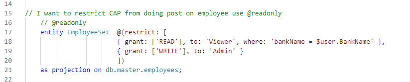

## CAPM - Day 8 - CAPM Security XSUAA 

#### How to add XSUAA services to our app and deploy 

</br>
</br>

So from previosu session we saw how to deploy our app to cloud 
</br> Now we are going to add XSUAA service to our app using MTA editor to MTA yaml file
</br>
</br>

## Steps to implement XSUAA in cap 
</br>
</br>

<details>
<summary> 1. Create a new resource in MTA.yaml file for xs-uaa backing service with following proerties  </summary>
</br>
</br>
	- name == capp-xsuaa
	- service == xsuaa
	- service-plan == application
	- path == ./xs-security.json
</br>
</br>
	
```yaml
  - name: capp-xsuaa
    type: org.cloudfoundry.managed-service
    parameters:
      service: xsuaa
      service-plan: application
      path: ./xs-security.json
      config:
        xsappname: capp-${org}-${space}
        tenant-mode: dedicated
```
</br>
</br>

Using MTA yaml editor from the BAS open the MTA.yaml file and make the following changes
</br>
</br>

</br>
</br>
Define XSUAA section in MTA yaml file  
</br>
</br>

</br>
</br>
Add managed services type for XSUAA 
</br>
</br>

</br>
</br>
define the essential properties as shown below 
</br>
</br>

</br>
</br>
</details>

  

<details>
<summary> 2. Add the dependency of this newly created xs-uaa service to our microservice in require section </summary>
</br>
</br>
Add xsuaa aunthentication to SRV module and UI module in MTA yaml file as shown below

</br>
</br>

</br>
</br>

</br>
</br>
The finla file should look like this 
</br>
</br>

</br>
</br>

## mta.yaml (final) 
</br>
</br>

```yaml
_schema-version: '3.1'
ID: capp
version: 1.0.0
description: "A simple CAP project."
parameters:
  enable-parallel-deployments: true
build-parameters:
  before-all:
    - builder: custom
      commands:
        - npx cds build --production
modules:
# start of UI Module code
  - name: capp-ui
    type: nodejs
    path: app
    parameters:
      buildpack: nodejs_buildpack
    build-parameters:
      builder: npm-ci
    requires:
      - name: srv-api
        group: destinations
        properties:
          name: srv-api
          strictSSL: true
          forwardAuthToken: true
          url: '~{srv-url}'
      - name: capp-xsuaa 
# end of UI Module code
# -----------------------------------
# start of SRV Module code
  - name: capp-srv
    type: nodejs
    path: gen/srv
    parameters:
      buildpack: nodejs_buildpack
    build-parameters:
      builder: npm
    provides:
      - name: srv-api # required by consumers of CAP services (e.g. approuter)
        properties:
          srv-url: ${default-url}
    requires:
      - name: capp-db
      - name: capp-xsuaa 

# end of SRV Module code
# -----------------------------------
# start of DB - deployer Module code
  - name: capp-db-deployer
    type: hdb
    path: gen/db
    parameters:
      buildpack: nodejs_buildpack
    requires:
      - name: capp-db

# end of DB - deployer Module code
# -----------------------------------
# start of DB Module code
resources:
  - name: capp-db
    type: com.sap.xs.hdi-container
    parameters:
      service: hana
      service-plan: hdi-shared
# end of DB Module code
# -----------------------------------
# start of XSUAA Module code
  - name: capp-xsuaa
    type: org.cloudfoundry.managed-service
    parameters:
      service: xsuaa
      service-plan: application
      path: ./xs-security.json
      config:
        xsappname: capp-${org}-${space}
        tenant-mode: dedicated
# -----------------------------------
# end of XSUAA Module code
```

</br>
</br> 
</details>


<details>
<summary> 3. Create the xs-security.json file using SAP Documentation </summary>
</br>
</br>
Create a new file named xs-security.json as shown below 
</br>
</br>

 
</br>
</br>

- SAP BTP documentation : [xs-security.json document SAP](https://help.sap.com/docs/btp/sap-business-technology-platform/application-security-descriptor-configuration-syntax)
- Add 2 roles - viewer and the Admin role.
- Viewer role and Admin roles are defined to demonstrate example of row level security for the app.

</br>
</br>

## xs-security.json
</br>
</br>

```json
{
  "xsappname": "mycapapp",
  "tenant-mode": "dedicated",
  "scopes": [
    {
      "name": "$XSAPPNAME.Viewer",
      "description": "someone can view data using this scope"
    },
    {
      "name": "$XSAPPNAME.Admin",
      "description": "someone can perform CURD on data using this scope"
    }
  ],
  "attributes": [
    {
      "name": "BankName",
      "description": "Bank Name property",
      "valueType": "string"
    }
  ],
  "role-templates": [
    {
      "name": "Viewer",
      "description": "View all data from our Catalog service",
      "default-role-name": "Viewer: Authorized to Read All Data",
      "scope-references": [
        "$XSAPPNAME.Viewer"
      ],
      "attribute-references": [
        {
          "name": "BankName"
        }
      ]
    },
    {
      "name": "Admin",
      "description": "Edit, delete all data from service",
      "scope-references": [
        "$XSAPPNAME.Admin"
      ]
    }
  ],
  "authorities": [
    "$ACCEPT_GRANTED_AUTHORITIES"
  ],
  "oauth2-configuration": {
    "token-validity": 9000,
    "redirect-uris": [
      "https://*.cfapps.us10-001.hana.ondemand.com/login/callback"
    ]
  },
  "xsenableasyncservice": "true"
}
```
</br>
</br>
</details>
 

<details>
<summary>4. add 3 node module which will help in security configuration for our app </summary>
</br>

- npm install passport 
- npm install @sap/xssec 
- npm install @sap/xsenv
</br>
</br> 
</details>

<details>
<summary> 5. App router changes <b>xs-app.json</b> </summary>
</br>
</br>
We need to inform app router to contact Xsuaa to mandate the use of JWT token in <b> xs-app.json </b> file
</br> Change authenticationMethod : route and add ( "auhenticationType" : "xsuaa"" )
</br>
</br>   

</br>
</br>

</br>
</br>

## xs-app.json
</br>
</br>

```json
{
    "welcomeFile": "purchaseorderapp/webapp/",
    "authenticationMethod": "route",
    "sessionTimeout": 100,
    "pluginMetadataEndpoint": "/metadata",
    "routes": [
      {
        "source": "^/purchaseorderapp/webapp/(.*)",
        "target": "$1",
        "localDir": "purchaseorderapp/webapp/",
        "authenticationType": "xsuaa"
      },
      {
        "source": "^/(.*)$",
        "destination": "srv-api",
        "authenticationType": "xsuaa"
      }
    ]
  }
```

</br>
</br> 
</details>

<details>
<summary> 6. Code changes in catalog services for XSUAA </summary>
</br>
We need to secure our resource to only use authenticated user, hence we need to add an annotation in catalog services
   </br> ( requires : 'authenticated-user')
</br>
</br>

</br>
</br>

adding restriction to read employee set 
</br>
</br>
 
</br>
</br>
</details>


<details>
<summary> 7. Define XSUAA security strategy for local testing also for cloud </summary>
</br>
We need to tell system  that if we run app locally (development environemnt) in BAS tool,
</br> use mock strategy for testing security. After deployment to CF (production environemnt) we use JWT strategy.
</br>
	
by defining following block of code in package.json
</br>
</br>

```json

 "cds": {
    "requires": {
      "db": {
        "kind": "hana",
        "credentials": {
          "database": "dan-key"
        }
      },
.      "auth":{
.        "[production]":{
.          "strategy": "JWT"
.        }
      }
    }
  },

```

</br>
</br>
</details>

<details>
<summary> 8. Additionally we configure demo local users for testing purpose </summary>
</br>
</br>
authentication strategies section in following CAPIRE document section 
</br>

[Capire Authentication document ](https://cap.cloud.sap/docs/node.js/authentication#enforcement)     
</br>
</br>
 
</br>
</br>
</br>
Add following block of code under cds section in <b> package.json </b> and test it locally,
Production deployment of app will check JWT token local test will check for mentioned users
</br>
</br>

```json

  "cds": {
    "requires": {
      "db": {
        "kind": "hana",
        "credentials": {
          "database": "dan-key"
        }
      },
.      "auth":{
.        "[production]":{
.          "strategy": "JWT"
.        },
.        "[development]":{
.         "strategy": "mock",
.         "users":{           
.          }
        }
      }
    }
  },

```

</br>
Testing 
</br>
 
 
 
</br>

Add the user section with user name and assign : Viewer role and test 
</br>
</br>
</br>

```json

"users":{
            "dante":{
              "roles":["Viewer"],
              "userAttributes":{}
            },
            "dan":{
              "roles":[],
              "userAttributes":{}              
            }
          }

```

 
 
 
 

</br>
</details>

<!--

</br>
</br>

``` cds 
	


``` 

</br>
</br>

</br>
</br>

## MyService.js 
</br>
</br>

```js


```
</br>

</br>
</br>


<details>
<summary> <b> ALL CODE CHANGES - TODAY SESSION </b> </summary>
</br>
</br>

</br>
</br>

</br>
</br>
</details>


-->

</br>
</br>
</br>
command to check the logs of failed deployment 
</br>

actual command 
```bat 
cf logs <appname>-ui --recent
```

with app name 
```bat 
cf logs dante-ui --recent
```

</br>
</br>
</br>

Roles and scopes 

[BTP XSUAA - SAP developers blog](https://developers.sap.com/tutorials/btp-app-prepare-xsuaa.html)

[MTA deployment - SAP developers blog](https://developers.sap.com/tutorials/btp-app-cap-mta-deployment.html)

</br>
</br>
</br>
</br>
</br>
</br>
</br>
</br>
</br>
</br>
</br>
</br>
</br>
</br>
</br>
</br>
</br>
</br>
</br>
</br>
</br>
</br>
</br>
</br>
</br>


</br>
</br>
</br>
</br>
</br>
</br>
</br>
</br>

# NEXT ------ CAPM - DAY 8 - CAPM Security XSUAA

<p align="center"> 
<a href="https://github.com/Octavius-Dante/Tetra_Proxima/tree/main/CAPM-DAY-8"> CAPM DAY 8 - CAPM Security XSUAA</a> 
</p>
