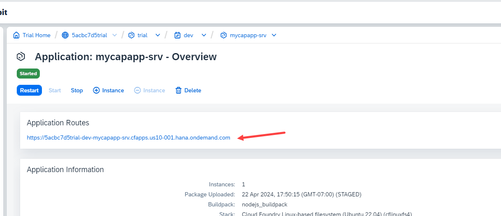
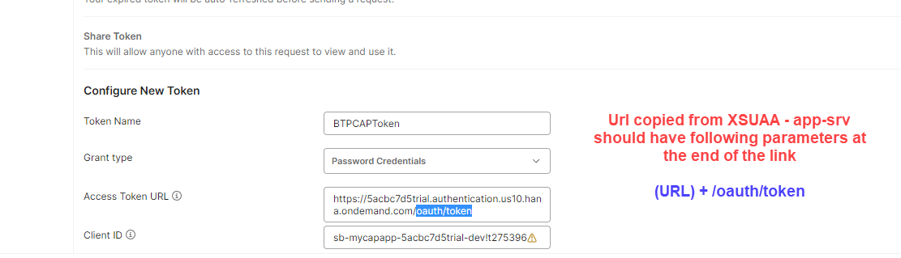
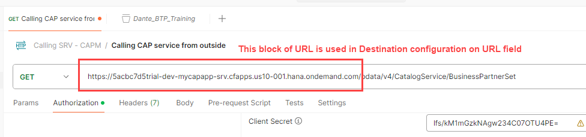
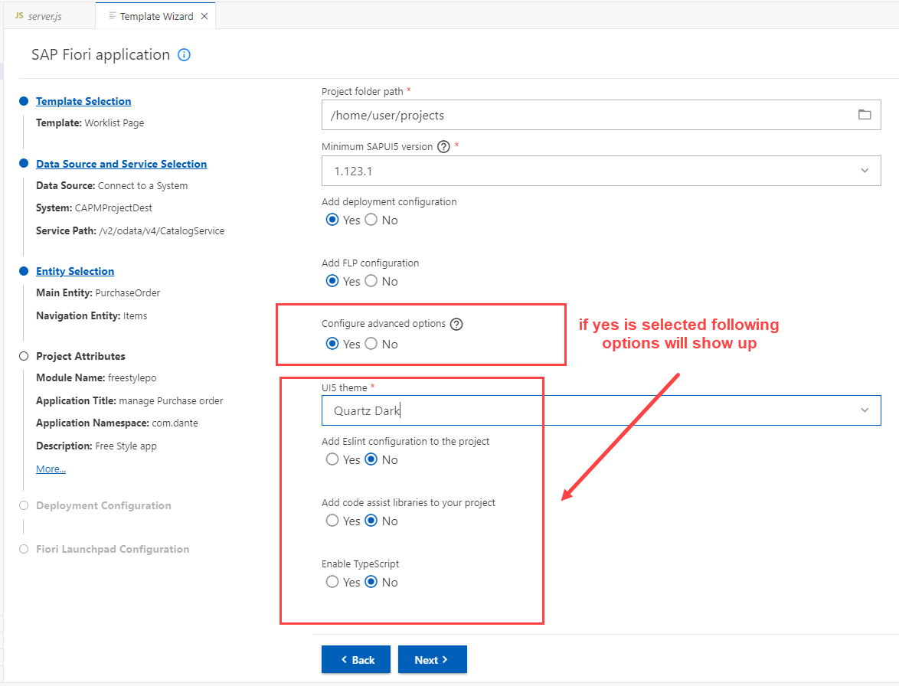
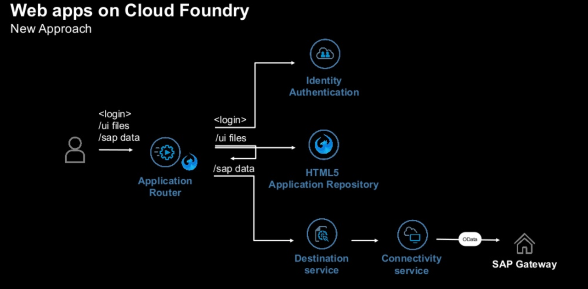

## CAPM - Day 9 - Serverless Fiori App 

#### How to add Freestyle Fiori app (ui) to an available SRV

</br>
</br>

**Central Fiori Launchpad  (AKA) SAP Build Work Zone**

So from previous session we saw how to deploy our app to cloud with XSUAA
</br> Now we are going to create a freestyle fiori app just Ui by only using existing Srv -
</br>
</br>

### The development in this session is going to answer following Questions
</br>
</br>

1. Can we build Free style Fiori application and deploy them on BTP ?
2. Is it possible to show an example of freestlye app using CAPM odata ?
3. If i want to build freestyle Fiori app as a separate microservice, what is the option for me ?
4. I have heard about central Fioir launchpad in SAP BTP, waht is it and how to use ?
5. My company is building html5 apps in BTP which they call as Fiori apps, how it is different ?
6. If I want to build multiple FIori apps on single odata offered by CAPM, what is the best practise ?
7. When Fiori app is deployed Fiori, it was deployed as Node JS application, how can we deploy it as an independent Fiori app ?
8. What is managed app router, I have heard about it but never used it?

</br>
</br>


</br>
</br>

[SAP Blog on SAP Build work zone](https://community.sap.com/t5/technology-blogs-by-members/access-fiori-apps-via-sap-build-work-zone-site-with-federated-sap-s-4hana/ba-p/13558780)

Configuration Steps for BTP content Federation: -
</br>
</br>
</br>Step 1: - Subscribe to the SAP Build Work Zone, standard edition.
</br>Step 2: - Cloud connector Setup
</br>Step 3: - Setup the Runtime and Design-Time destinations in SAP BTP
</br>Step 4: - Expose content from SAP S/4HANA
</br>Step 5: - Import the content in SAP Build Work Zone, standard edition.
</br>Step 6: - Assign the imported roles to the Site.
</br>Step 7: - Add the roles to the user.
</br>Step 8: - Access the federated content


</br>
</br>

### Advantages of HTML5 apps over NodeJs Fiori app

</br>

1. It provides a good isolation from oru CAP project, hence if there is a change in Ui, 
   we dont need to touch or re-deploy the cap application 

2. In a global team, each team is responsilbe for one Fiori app, they can work independently
   in their apps with separate git repositories and different lifecycle and transport

3. If we add all fiori apps inside cap project the project becomes bulkier,
   also Ui developer has to go through lot of files when developing UI so separated from CAP gives less clutter. 
   
4. We can use managed app router with html5 apps, app router itself is a separate node application which requires memory and downtime when we deploy our app.
   The managed app router is manged by Cloud Foundry environment in BTP.

5. Integration with SAP Fiori Launchpad <b> (Central Fiori launchpad aka SAP Build work zone) </b> in SAP BTP. Because our app is available as a HTML5 app inside html5 repository.   

</br>
</br>


### Building Fiori App using exisitng SRV services 
</br>

<details>
<summary> 1. Accessing OData service (SRV) module of our previous app from Postman Tool </summary>
</br>
</br>

[some reading on postman on JWT](https://sap.github.io/cloud-sdk/docs/js/guides/retrieve-jwt)
</br>

[Reading on JWT and OAuth 2.0](https://frontegg.com/blog/oauth-vs-jwt#OAuth_vs_JWT_Key_Differences)
</br>


</br>
</br>


When SRV module is accessed from cloud deployed app it appears like this
</br>
</br>

</br>
</br>

</br>
</br>

</br>
</br>

</br>
</br>

Creating a call service in postman tool for our SRV module
</br>
</br>

</br>
</br>

Select Authorization tab
</br>
</br>

</br>
</br>

Select Oauth 2.0 in this section
</br>
</br>

</br>
</br>

Fill the necessary values here 
</br>
</br>

</br>
</br>

Get the required values from BTP cloud account and add it to Postman
</br>
</br>

</br>
</br>

</br>
</br>

</br>
</br>

Before pasting the url need to add the following at the last of the url 
</br> ( <b>/url/oauth/token</b> )
</br>
</br>

</br>
</br>

Client ID & CLient Secret 
</br>
</br>

</br>
</br>

</br>
</br>
</br>

BTP Account userid and the password should be <b> BAS account password </b> dont confuse it with (BTP GLobal account password)
</br>
</br>

</br>
</br>

</br>
</br>

</br>
</br>

Token added acknowledgement will be shown in right bottom of screen
</br>
</br>

</br>
</br>

Now fire the call service and it should bring the data
</br>
</br>

</br>
</br>

</br>
</br>
</br>

Now we need to decrypt the JWT Token go to the website : https://www.base64decode.org
</br>
</br>

</br>
</br>

</br>
</br>
</br>

</details>


<details>
<summary> 2. Create Destination in BTP account and establish connection </summary>
</br>
</br>

We will use the available information from postman and this scope details from token to create Destination in BTP account as shown below
</br>
</br>
</br>

Go to the connectivity section in the sub account and click destination
</br>
</br>

</br>
</br>

select create new destiantion
</br>
</br>

</br>
</br>

Change the authentication type to - <b> OAuth2 User Token Exchange </b>
</br>
</br>

</br>
</br>

### Now fill the necesssary details from available data source as shown below
</br>
</br>

Copy this link from postman or our OData SRV or from our deployed SRV application
</br>
</br>

</br>
</br>

</br>
</br>

</br>
</br>

</br>
</br>

</br>
</br>

</br>
</br>

A success message showing that connection is established 
</br>
</br>

</br>
</br>

</br>
</br>
</details>


<details>
<summary> 3. Create Freestyle Fiori app using BAS </summary>
</br>
</br>
Go to BAS and press F1 and Search for 'Fiori Open Application generator'
</br>
</br>

</br>
</br>

Choose the template as shown below 
</br>
</br>

</br>
</br>

</br>
</br>

<details>
<summary> How to get the V2 odata path </summary>
</br>
</br>

</br>
</br>

</br>
</br>

</br>
</br>

</br>
</br>
</details>


</br>
</br>

</br>
</br>

</br>
</br>

</br>
</br>

</br>
</br>

</br>
</br>

</br>
</br>

</br>
</br>

</br>
</br>

</br>
</br>

</br>
</br>

</br>
</br>
</details>
</br>
</br>
</br>

### Backing service used for HTML 5 apps 
</br>
</br>

- [x] Destiantion service - to read the destiantion from SAP BTP at runtime for the purpose of connection
- [x] Connectivity service - once the destination is read, it will use connectivity service to connect to our OData service 
- [x] HTML5 Deployer - this will be used to deploy our app to HTML5 repository
- [x] HTML5 Repo Runtime - Will load the Fiori app when requested at runtime 
- [x] Fiori launchpad service - which displays Fiori apps as a tile (a central place for all fiori apps to appear as a tile)
</br> (we cant provide end user with a link af every fiori app developed in business thats why this launchpad service is there)
</br>
</br>

**Best place to learn fiori and access samples** : [sapui5.hana.ondemand.com](https://sapui5.hana.ondemand.com/#/)

- [x] To make our Fiori app to interact with central fiori launchpad service we need to check few settings in manifest.json file 
         1. sap.cloud - this allows the app to be exposed to public access 
         2. Cross Navigation : 'crossNavigation' - this allows the app to be navigated between launchpad service and repository 

- [x] we have to deploy the generated app to BTP cloud via Central Fiori launchpad 
</br>
</br>

Web Application - HTML5 Repo
</br>
</br>

</br>
</br>


- [x] **Build MTA archive using MTA.yaml file (righclick-> Build mta project)**
- [x] **After The build is complete select the archive *.mtar (righclick-> Deploy MTA archive)**

</br>
</br>

**Now this deployment wont got BTP cloud it goes to SAP HTML5 repository**
</br> because if you take a look at the MTA.yaml file it as the clear explanation
</br> earlier we deployed node js applciation with db deployer, Db and XSUAA 
</br> now it has Fiori-Ui related artifacts and XSUAA services and it is deployed as HTML5 application 

</br>
</br>

<details>
<summary> <b> MTA.yaml sample </b> </summary>
</br>

## MTA.yaml file (for reference)
</br>
</br>

```yaml

_schema-version: "3.2"
ID: comdantefreestylepo
description: Generated by Fiori Tools
version: 0.0.1
modules:
- name: comdantefreestylepo-destination-content
  type: com.sap.application.content
  requires:
  - name: comdantefreestylepo-destination-service
    parameters:
      content-target: true
  - name: comdantefreestylepo-repo-host
    parameters:
      service-key:
        name: comdantefreestylepo-repo-host-key
  - name: comdantefreestylepo-uaa
    parameters:
      service-key:
        name: comdantefreestylepo-uaa-key
  parameters:
    content:
      instance:
        destinations:
        - Name: comdantefreestylepo_html_repo_host
          ServiceInstanceName: comdantefreestylepo-html5-srv
          ServiceKeyName: comdantefreestylepo-repo-host-key
          sap.cloud.service: comdantefreestylepo
        - Authentication: OAuth2UserTokenExchange
          Name: comdantefreestylepo_uaa
          ServiceInstanceName: comdantefreestylepo-xsuaa-srv
          ServiceKeyName: comdantefreestylepo-uaa-key
          sap.cloud.service: comdantefreestylepo
        existing_destinations_policy: ignore
  build-parameters:
    no-source: true
- name: comdantefreestylepo-app-content
  type: com.sap.application.content
  path: .
  requires:
  - name: comdantefreestylepo-repo-host
    parameters:
      content-target: true
  build-parameters:
    build-result: resources
    requires:
    - artifacts:
      - comdantefreestylepo.zip
      name: comdantefreestylepo
      target-path: resources/
- name: comdantefreestylepo
  type: html5
  path: .
  build-parameters:
    build-result: dist
    builder: custom
    commands:
    - npm install
    - npm run build:cf
    supported-platforms: []
resources:
- name: comdantefreestylepo-destination-service
  type: org.cloudfoundry.managed-service
  parameters:
    config:
      HTML5Runtime_enabled: true
      init_data:
        instance:
          destinations:
          - Authentication: NoAuthentication
            Name: ui5
            ProxyType: Internet
            Type: HTTP
            URL: https://ui5.sap.com
          existing_destinations_policy: update
      version: 1.0.0
    service: destination
    service-name: comdantefreestylepo-destination-service
    service-plan: lite
- name: comdantefreestylepo-uaa
  type: org.cloudfoundry.managed-service
  parameters:
    path: ./xs-security.json
    service: xsuaa
    service-name: comdantefreestylepo-xsuaa-srv
    service-plan: application
- name: comdantefreestylepo-repo-host
  type: org.cloudfoundry.managed-service
  parameters:
    service: html5-apps-repo
    service-name: comdantefreestylepo-html5-srv
    service-plan: app-host
parameters:
  deploy_mode: html5-repo
  enable-parallel-deployments: true


```

</br>
</details>

<details>
<summary> <b> Deploy log </b> </summary>
</br>

## Deploy log for reference 
</br>
</br>

```bat

cf deploy /home/user/projects/freestylepo/mta_archives/comdantefreestylepo_0.0.1.mtar -f
Deploying multi-target app archive /home/user/projects/freestylepo/mta_archives/comdantefreestylepo_0.0.1.mtar in org 5acbc7d5trial / space dev as lordes.cloud9@gmail.com...

Uploading 1 files...
  /home/user/projects/freestylepo/mta_archives/comdantefreestylepo_0.0.1.mtar

 0s  0 B / 7.72 KiB    0.00%
 0s  7.72 KiB / 7.72 KiB  100.00%
 0s  7.72 KiB / 7.72 KiB  100.00% 0s
OK
Operation ID: af8db2d6-02b5-11ef-a437-eeee0a83c17b
Deploying in org "5acbc7d5trial" and space "dev"
Detected MTA schema version: "3"
No deployed MTA detected - this is initial deployment of MTA with ID "comdantefreestylepo"
Detected new MTA version: "0.0.1"
Processing service "comdantefreestylepo-xsuaa-srv"...
Setting service "comdantefreestylepo-xsuaa-srv" parameters from "xs-security.json"
Creating service "comdantefreestylepo-xsuaa-srv" from MTA resource "comdantefreestylepo-uaa"...
Processing service "comdantefreestylepo-destination-service"...
Creating service "comdantefreestylepo-destination-service" from MTA resource "comdantefreestylepo-destination-service"...
Processing service "comdantefreestylepo-html5-srv"...
Creating service "comdantefreestylepo-html5-srv" from MTA resource "comdantefreestylepo-repo-host"...
1 of 1 done
1 of 1 done
1 of 1 done
Creating service key "comdantefreestylepo-repo-host-key" for service instance "comdantefreestylepo-html5-srv"...
Creating service key "comdantefreestylepo-destination-content-comdantefreestylepo-destination-service-credentials" for service instance "comdantefreestylepo-destination-service"...
Creating service key "comdantefreestylepo-uaa-key" for service instance "comdantefreestylepo-xsuaa-srv"...
Creating service key "comdantefreestylepo-app-content-comdantefreestylepo-repo-host-credentials" for service instance "comdantefreestylepo-html5-srv"...
Uploading content module "comdantefreestylepo-app-content" in target service "comdantefreestylepo-repo-host"...
Deploying content module "comdantefreestylepo-destination-content" in target service "comdantefreestylepo-destination-service"...
Deploying content module "comdantefreestylepo-app-content" in target service "comdantefreestylepo-repo-host"...
Skipping deletion of services, because the command line option "--delete-services" is not specified.
Process finished.
Use "cf dmol -i af8db2d6-02b5-11ef-a437-eeee0a83c17b" to download the logs of the process.

 *  Terminal will be reused by tasks, press any key to close it.

```
</br>
</details>

</br>
</br>

Check the deployed app in repository using following command 
</br>
</br>

```bat

cf html5-list
```
</br>
</br>

</br>
</br>

</br>
</br>


<details>
<summary> <b> Now we access Fiori launchpad service </b> </summary>
</br>
</br>
</br>
To get it we need to create an instance for SAP Build workzone, standard Edition
</br>
</br>

</br>
</br>

</br>
</br>

Dont launch the app yet, need to assign the role permission for this app first
</br>
</br>

</br>
</br>

</br>
</br>

</br>
</br>

</br>
</br>

**Post assignment of role need to logout and login to get the role to be reflected on my account**
</br>
</br>

</br>
</br>
</details>

<details>
<summary> <b> Access the repository for publishing Fiori tile </b> </summary>
</br>
</br>

</br>
</br>

</br>
</br>
</details>

       

<!--

</br>
</br>

``` cds 
	


``` 

</br>
</br>

</br>
</br>

## MyService.js 
</br>
</br>

```js


```
</br>

</br>
</br>


<details>
<summary> <b> ALL CODE CHANGES - TODAY SESSION </b> </summary>
</br>
</br>

</br>
</br>

</br>
</br>
</details>


-->

</br>
</br>
</br>
</br>
</br>
</br>
</br>
</br>
</br>
</br>


</br>
</br>
</br>
</br>
</br>
</br>
</br>
</br>

# NEXT ------ CAPM - DAY 10 - Side by Side extension

<p align="center"> 
<a href="https://github.com/Octavius-Dante/Tetra_Proxima/tree/main/CAPM-DAY-10"> CAPM DAY 10 - Side by Side extension</a> 
	
</br>
</br>

#### Previous Sessions
</br>
<!--
- [x] <a href="https://github.com/Octavius-Dante/Tetra_Proxima/tree/main/CAPM-DAY-12"> CAPM Day 12 - Extension CI CD</a>
- [x] <a href="https://github.com/Octavius-Dante/Tetra_Proxima/tree/main/CAPM-DAY-11"> CAPM Day 11 - S4HANA Side by Side</a>
- [x] <a href="https://github.com/Octavius-Dante/Tetra_Proxima/tree/main/CAPM-DAY-10"> CAPM Day 10 - Side by Side extension</a>
- [x] <a href="https://github.com/Octavius-Dante/Tetra_Proxima/tree/main/CAPM-DAY-9"> CAPM Day 9 - Serverless Fiori App</a>
-->

- [x] <a href="https://github.com/Octavius-Dante/Tetra_Proxima/tree/main/CAPM-DAY-8"> CAPM Day 8 - CAPM Security XSUAA</a>
- [x] <a href="https://github.com/Octavius-Dante/Tetra_Proxima/tree/main/CAPM-DAY-7"> CAPM Day 7 - HANA and Deployment</a>
- [x] <a href="https://github.com/Octavius-Dante/Tetra_Proxima/tree/main/CAPM-DAY-6"> CAPM Day 6 - Fiori App Draft</a>
- [x] <a href="https://github.com/Octavius-Dante/Tetra_Proxima/tree/main/CAPM-DAY-5"> CAPM Day 5 - Fiori Elements</a>
- [x] <a href="https://github.com/Octavius-Dante/Tetra_Proxima/tree/main/CAPM-DAY-4"> CAPM Day 4 - Generic Handlers</a>
- [x] <a href="https://github.com/Octavius-Dante/Tetra_Proxima/tree/main/CAPM-DAY-3"> CAPM Day 3 - EPM DB and CDS Views</a>
- [x] <a href="https://github.com/Octavius-Dante/Tetra_Proxima/tree/main/CAPM-DAY-2"> CAPM Day 2 - Aspects and Reuse Tables</a>
- [x] <a href="https://github.com/Octavius-Dante/Tetra_Proxima/tree/main/CAPM-DAY-1"> CAPM Day 1 - First CAP App </a>

</br>
</br>

</p>
