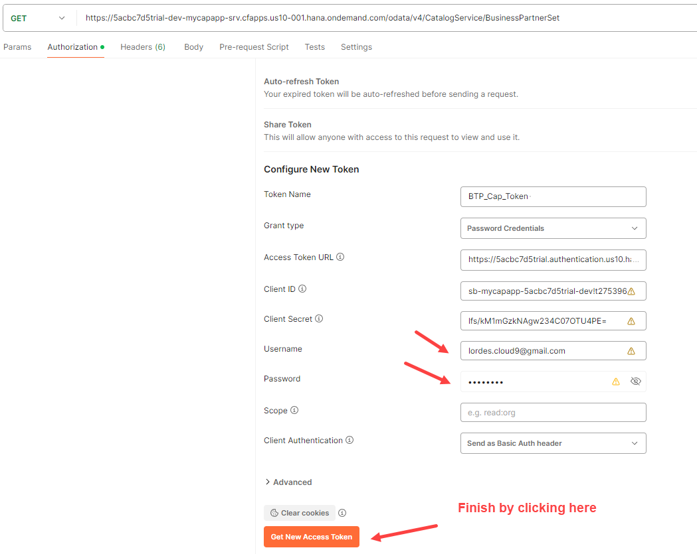
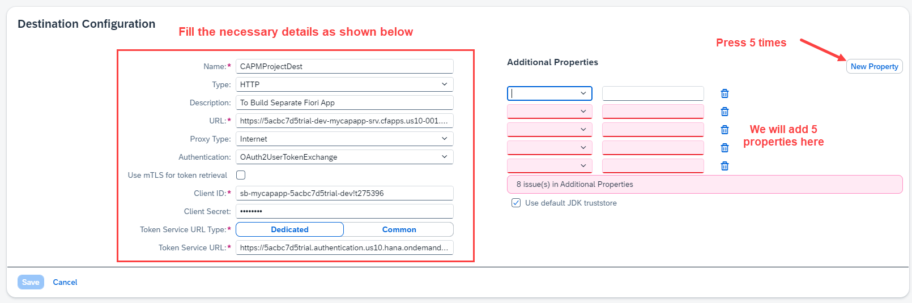
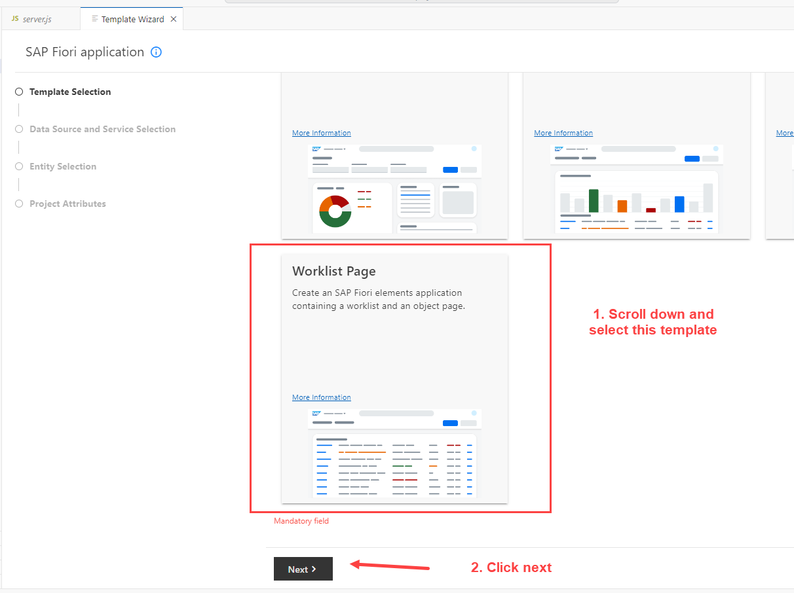
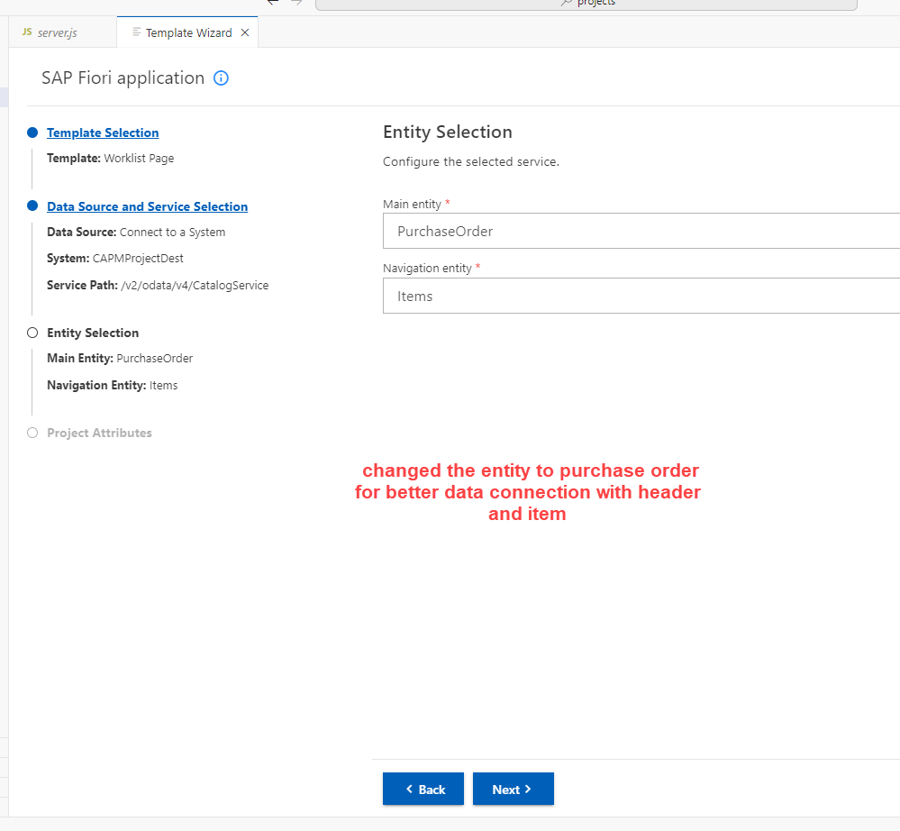

## CAPM - Day 9 - Serverless Fiori App 

#### How to add Freestyle Fiori app (ui) to an available SRV

</br>
</br>

**Central Fiori Launchpad  (AKA) SAP Build Work Zone**

So from previous session we saw how to deploy our app to cloud with XSUAA
</br> Now we are going to create a freestyle fiori app just Ui by only using existing Srv -
</br>
</br>

### The development in this session is going to answer following Questions
</br>
</br>

1. Can we build Free style Fiori application and deploy them on BTP ?
2. Is it possible to show an example of freestlye app using CAPM odata ?
3. If i want to build freestyle Fiori app as a separate microservice, what is the option for me ?
4. I have heard about central Fioir launchpad in SAP BTP, waht is it and how to use ?
5. My company is building html5 apps in BTP which they call as Fiori apps, how it is different ?
6. If I want to build multiple FIori apps on single odata offered by CAPM, what is the best practise ?
7. When Fiori app is deployed Fiori, it was deployed as Node JS application, how can we deploy it as an independent Fiori app ?
8. What is managed app router, I have heard about it but never used it?

</br>
</br>


</br>
</br>

[SAP Blog on SAP Build work zone](https://community.sap.com/t5/technology-blogs-by-members/access-fiori-apps-via-sap-build-work-zone-site-with-federated-sap-s-4hana/ba-p/13558780)

Configuration Steps for BTP content Federation: -
</br>
</br>
</br>Step 1: - Subscribe to the SAP Build Work Zone, standard edition.
</br>Step 2: - Cloud connector Setup
</br>Step 3: - Setup the Runtime and Design-Time destinations in SAP BTP
</br>Step 4: - Expose content from SAP S/4HANA
</br>Step 5: - Import the content in SAP Build Work Zone, standard edition.
</br>Step 6: - Assign the imported roles to the Site.
</br>Step 7: - Add the roles to the user.
</br>Step 8: - Access the federated content


</br>
</br>

### Advantages of HTML5 apps over NodeJs Fiori app

</br>

1. It provides a good isolation from oru CAP project, hence if there is a change in Ui, 
   we dont need to touch or re-deploy the cap application 

2. In a global team, each team is responsilbe for one Fiori app, they can work independently
   in their apps with separate git repositories and different lifecycle and transport

3. If we add all fiori apps inside cap project the project becomes bulkier,
   also Ui developer has to go through lot of files when developing UI so separated from CAP gives less clutter. 
   
4. We can use managed app router with html5 apps, app router itself is a separate node application which requires memory and downtime when we deploy our app.
   The managed app router is manged by Cloud Foundry environment in BTP.

5. Integration with SAP Fiori Launchpad <b> (Central Fiori launchpad aka SAP Build work zone) </b> in SAP BTP. Because our app is available as a HTML5 app inside html5 repository.   

</br>
</br>


### Building Fiori App using exisitng SRV services 
</br>

<details>
<summary> 1. Accessing OData service (SRV) module of our previous app from Postman Tool </summary>
</br>
</br>
	
When SRV module is accessed from cloud deployed app it appears like this
</br>
</br>

</br>
</br>

</br>
</br>

</br>
</br>

</br>
</br>

Creating a call service in postman tool for our SRV module
</br>
</br>

</br>
</br>

Select Authorization tab
</br>
</br>

</br>
</br>

Select Oauth 2.0 in this section
</br>
</br>

</br>
</br>

Fill the necessary values here 
</br>
</br>

</br>
</br>

Get the required values from BTP cloud accoutn and add it to Postman
</br>
</br>

</br>
</br>

</br>
</br>

</br>
</br>

Before pasting the url need to add the following at the last of the url 
</br> ( <b>/url/oauth/token</b> )
</br>
</br>

</br>
</br>

Client ID & CLient Secret 
</br>
</br>

</br>
</br>

</br>
</br>
</br>

BTP Account userid and the password should be <b> BAS account password </b> dont confuse it with (BTP GLobal account password)
</br>
</br>

</br>
</br>

</br>
</br>

</br>
</br>

Token added acknowledgement will be shown in right bottom of screen
</br>
</br>

</br>
</br>

Now fire the call service and it should bring the data
</br>
</br>

</br>
</br>

</br>
</br>
</br>

Now we need to decrypt the JWT Token go to the website : https://www.base64decode.org
</br>
</br>

</br>
</br>

</br>
</br>
</br>

</details>


<details>
<summary> 2. Create Destination in BTP account and establish connection </summary>
</br>
</br>

We will use the available information from postman and this scope details from token to create Destination in BTP account as shown below
</br>
</br>
</br>

Go to the connectivity section in the sub account and click destination
</br>
</br>

</br>
</br>

select create new destiantion
</br>
</br>

</br>
</br>

Change the authentication type to - <b> OAuth2 User Token Exchange </b>
</br>
</br>

</br>
</br>

### Now fill the necesssary details from available data source as shown below
</br>
</br>

Copy this link from postman or our OData SRV or from our deployed SRV application
</br>
</br>

</br>
</br>

</br>
</br>

</br>
</br>

</br>
</br>

</br>
</br>

</br>
</br>

A success message showing that connection is established 
</br>
</br>

</br>
</br>

</br>
</br>
</details>


<details>
<summary> 3. Create Freestyle Fiori app using BAS </summary>
</br>
</br>
Go to BAS and press F1 and Search for 'Fiori Open Application generator'
</br>
</br>

</br>
</br>

Choose the template as shown below 
</br>
</br>

</br>
</br>

</br>
</br>

<details>
<summary> How to get the V2 odata path </summary>
</br>
</br>

</br>
</br>

</br>
</br>

</br>
</br>

</br>
</br>
</details>


</br>
</br>

</br>
</br>

</br>
</br>

</br>
</br>

</br>
</br>

</br>
</br>

</br>
</br>

</br>
</br>

</br>
</br>

</br>
</br>

</br>
</br>

</br>
</br>
</details>
</br>
</br>
</br>

### Backing service used for HTML 5 apps 
</br>
</br>

- [x] Destiantion service - to read the destiantion from SAP BTP at runtime for the purpose of connection
- [x] Connectivity service - once the destination is read, it will use connectivity service to connect to our OData service 
- [x] HTML5 Deployer - this will be used to deploy our app to HTML5 repository
- [x] HTML5 Repo Runtime - Will load the Fiori app when requested at runtime 
- [x] Fiori launchpad service - which displays Fiori apps as a tile (a central place for all fiori apps to appear as a tile)
</br> (we cant provide end user with a link af every fiori app developed in business thats why this launchpad service is there)
</br>
</br>

**Best place to learn fiori and access samples** : [sapui5.hana.ondemand.com](https://sapui5.hana.ondemand.com/#/)

- [x] To make our Fiori app to interact with central fiori launchpad service we need to check few settings in manifest.json file 
         1. sap.cloud - this allows the ap pto be exposed to public access 
         2. Cross Navigation : 'crossNavigation' - this allows the app to be navigated between launchpad service and repository 

- [x] we have to deploy the generated app to BTP cloud via Central Fiori launchpad 


<!-- <details>
<summary> <b> Detailed steps to add the settings </b> </summary>
</br>
</br>
1. go to website [sapui5.hana.ondemand.com](https://sapui5.hana.ondemand.com/#/)
</br>
</br>

</br>
</br>
2. Search for manifest
</br>
</br>

</br>
</br>

</br>
</br>

</br>
</br>

</br>
</br>

</br>
</br>
</details> -->

       


</br>
</br>


</br>
</br>

</br>
</br>

</br>
</br>


<!--

</br>
</br>

``` cds 
	


``` 

</br>
</br>

</br>
</br>

## MyService.js 
</br>
</br>

```js


```
</br>

</br>
</br>


<details>
<summary> <b> ALL CODE CHANGES - TODAY SESSION </b> </summary>
</br>
</br>

</br>
</br>

</br>
</br>
</details>


-->

</br>
</br>
</br>
</br>
</br>
</br>
</br>
</br>
</br>
</br>


</br>
</br>
</br>
</br>
</br>
</br>
</br>
</br>

# NEXT ------ CAPM - DAY 10 - Side by Side extension

<p align="center"> 
<a href="https://github.com/Octavius-Dante/Tetra_Proxima/tree/main/CAPM-DAY-10"> CAPM DAY 10 - Side by Side extension</a> 
	
</br>
</br>

#### Previous Sessions
</br>
<!--
- [x] <a href="https://github.com/Octavius-Dante/Tetra_Proxima/tree/main/CAPM-DAY-12"> CAPM Day 12 - Extension CI CD</a>
- [x] <a href="https://github.com/Octavius-Dante/Tetra_Proxima/tree/main/CAPM-DAY-11"> CAPM Day 11 - S4HANA Side by Side</a>
- [x] <a href="https://github.com/Octavius-Dante/Tetra_Proxima/tree/main/CAPM-DAY-10"> CAPM Day 10 - Side by Side extension</a>
- [x] <a href="https://github.com/Octavius-Dante/Tetra_Proxima/tree/main/CAPM-DAY-9"> CAPM Day 9 - Serverless Fiori App</a>
-->

- [x] <a href="https://github.com/Octavius-Dante/Tetra_Proxima/tree/main/CAPM-DAY-8"> CAPM Day 8 - CAPM Security XSUAA</a>
- [x] <a href="https://github.com/Octavius-Dante/Tetra_Proxima/tree/main/CAPM-DAY-7"> CAPM Day 7 - HANA and Deployment</a>
- [x] <a href="https://github.com/Octavius-Dante/Tetra_Proxima/tree/main/CAPM-DAY-6"> CAPM Day 6 - Fiori App Draft</a>
- [x] <a href="https://github.com/Octavius-Dante/Tetra_Proxima/tree/main/CAPM-DAY-5"> CAPM Day 5 - Fiori Elements</a>
- [x] <a href="https://github.com/Octavius-Dante/Tetra_Proxima/tree/main/CAPM-DAY-4"> CAPM Day 4 - Generic Handlers</a>
- [x] <a href="https://github.com/Octavius-Dante/Tetra_Proxima/tree/main/CAPM-DAY-3"> CAPM Day 3 - EPM DB and CDS Views</a>
- [x] <a href="https://github.com/Octavius-Dante/Tetra_Proxima/tree/main/CAPM-DAY-2"> CAPM Day 2 - Aspects and Reuse Tables</a>
- [x] <a href="https://github.com/Octavius-Dante/Tetra_Proxima/tree/main/CAPM-DAY-1"> CAPM Day 1 - First CAP App </a>

</br>
</br>

</p>
