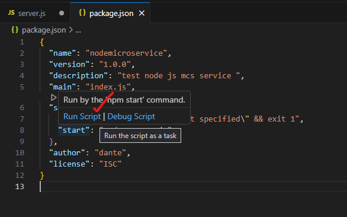

# Node Microservice 

#### adding external module to js code 

</br>
</br>

- [X] Create New folder in VS code 
- [X] perform npm init in terminal (pre-req node js to be installed)
- [X] add start script to launch the .js file in pacakge.json
- [X] file name : server.js

</br>
</br>

### package.json

</br>
</br>

``` json

// Before 

{
  "name": "nodemicroservice",
  "version": "1.0.0",
  "description": "test node js mcs service ",
  "main": "index.js",
  "scripts": {
    "test": "echo \"Error: no test specified\" && exit 1"
  },
  "author": "dante",
  "license": "ISC"
}


// After 

{
  "name": "nodemicroservice",
  "version": "1.0.0",
  "description": "test node js mcs service ",
  "main": "index.js",
  "scripts": {
    "test": "echo \"Error: no test specified\" && exit 1",
    "start": "node server.js"  
  },
  "author": "dante",
  "license": "ISC"
}

```

</br>
</br>

This option to run script will be avialable after adding the script command in package.json file 
</br>
</br>

</br>
</br>

- [X] node eco system npmjs.com site offers millions of modules available at disposal for resue 
     we choose express module from this link to create a web server (using the code) https://www.npmjs.com/package/express

</br>
</br>

### script.js 

</br>
</br>

```js

console.log("Hello server!");
console.log('Hello server!');

const express = require('express')
const app = express()

app.get('/', function (req, res) {
  res.send('Hello World')
})

app.listen(3000)

```
