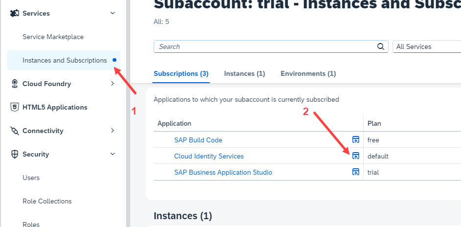
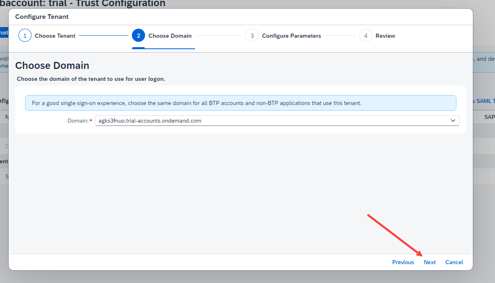

## SAP Build APP - LOW code NO Code

 
 
 

### when SAP build app subscription is created 
 
 
it will fail saying an error (link an identity authentication tenant to sub account - with establish trust option)
 
 

 
 

 
 

 
 

### How to setup cloud identity provider and give access to BTP trial sub account 
  

This step is essential to get an authorization to create subscription for SAP build apps
 
 

 <b> Steps to create cloud IDP and provide access </b> 

 
 

 
 

 
 

 
 

 
 

 
 

 
 

 
 

 
 

 
 

 
 

 
 

 
 

 
 

 
 

 
 

 
 

 
 

 
 

 
 

 
 

 
 

 
 

 
 

 
 

 
 

 
 

 
 

 
 

 
 

 
 

 
 

 
 

 
 

 
 

 
 

### How to Develop basic app using SAP Build APP
  
 
 

 
 

 
 

[Check the SAP developer blog to build an app](https://developers.sap.com/mission.appgyver-low-code.html)

 
 
 
 
 

## ------------ END of SAP Build App ---------------

 
 
 
 
 

 
<a href="https://github.com/Octavius-Dante/Tetra_Proxima"> Main Page</a> 
	
 
 
