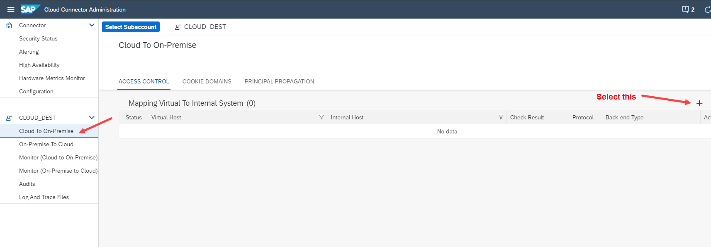
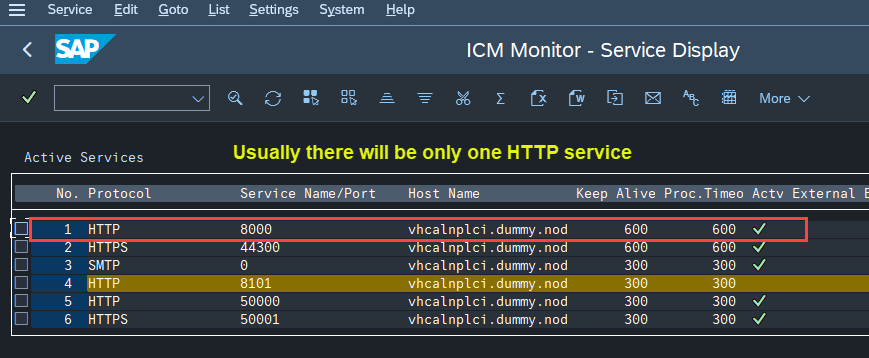
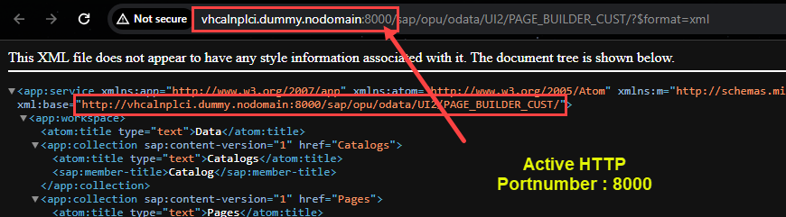
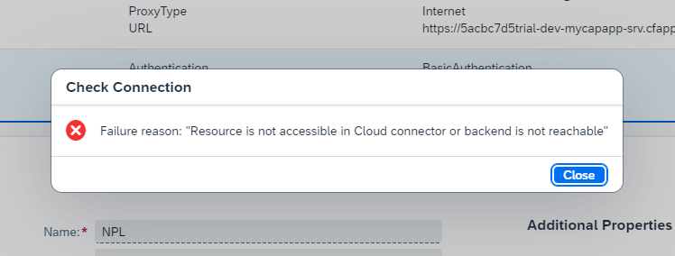

## CAPM - SAP Cloud Connector


### Establish cloud connection to our local system and develop a Fiori elements app
</br>
</br>

- [x] Go to sap tools.hana.ondemand website (https://tools.hana.ondemand.com/#cloud)
- [x] download JVM, download SAP cloud connector 

</br>
</br>

</br>
</br>

- [x] place the JVM extraction to (c:\Program Files\Java) directory
- [x] Start installation of sap cloud connector - (make note of port number)
</br> choose java JDK select jvm which we placed earlier (c:\Program Files\Java\jvmXXX) proceed installation

- [x] Post installation access the this link to launch cloud connector (https://localhost:8443/)
- [x] Default username : Administrator || Default password : manage
- [x] First login will request for password change 


</br>
</br>
</br>
</br>


<details>
<summary> <b> 1. Establish cloud connection </b> </summary>
</br>
</br>

Login page 
</br>
</br>

</br>
</br>

Get the BTP Sub account details 
</br>
</br>

</br>
</br>

Enter the cloud system details for connection
</br> BTP Account userid and the password should be <b> BAS account password </b> don't confuse it with (BTP GLobal account password)
</br>
</br>

</br>
</br>

 Subaccount is connected with cloud connector initial handshake is complete
</br>
</br>

</br>
</br>

In BTP account cloud connector section should show like this 
</br>
</br>

</br>
</br>

</br>
</br>
</details>

<details>
<summary> <b>2. Connect On premise system - Part 1 </b> </summary>
</br>
</br>
</br>

</br>
</br>

</br>
</br>

</br>
</br>

</br>
</br>
</details>


<details>
<summary> <b>3. Getting SAP system Ip-address and Port-number </b> </summary>
</br>
</br>

</br>
</br>

</br>
</br>

</br>
</br>

</br>
</br>

Another way to determine which is the right HTTP service 
</br> go to OData maintain service transaction <b> /IWFND/MAINT_SERVICE </b> it should be called using /n /IWFND/MAINT_SERVICE
</br> Click the call browser button 
</br>
</br>

</br>
</br>

</br>
</br>

</br>
</br>
</br>
</details>


<details>
<summary> <b>4. Connect On premise system - Part 2 </b> </summary>
</br>
</br>
</br>

</br>
</br>

</br>
</br>

</br>
</br>

</br>
</br>

</br>
</br>

</br>
</br>

</br>
</br>


Add the resources to your cloud connection 
</br>
</br>

</br>
</br>

</br>
</br>

</br>
</br>

</br>
</br>

If everything is done correctly in BTP account on cloud connectors section it will have the following detail 
</br> (Resource created in cloud connector section)
</br>
</br>

</br>
</br>
</br>
</br>

</br>
</br>
</details>

<details>
<summary> <b>5. Create destination and access On premise system through BAS</b> </summary>
</br>
</br>
Go to SAP BAS account and choose service center tab 
</br>
</br>

</br>
</br>

</br>
</br>

</br>
</br>

</br>
</br>

</br>
</br>

The destination section of SAP BTP account would have a destination automatically created as shown below based on 
</br> the details entered in BAS on previous step
</br>
</br>

</br>
</br>

Test the connection - usually the connection will work 
</br>(since my demo system is non-S4 HANA so connection failure is reported)
</br> but my BAS account is already connected to NPL demo system and displayed all available OData services - (Which means its working) 
</br> now we are good to go for development
</br>
</br>

</br>
</br>


</br>
</br>
</details>

</br>
</br>

### This is how Cloud connection can be established for On-premise S4hana System

<!--

</br>
</br>

``` cds 
	


``` 

</br>
</br>

</br>
</br>

## MyService.js 
</br>
</br>

```js


```
</br>

</br>
</br>


<details>
<summary> <b> ALL CODE CHANGES - TODAY SESSION </b> </summary>
</br>
</br>

</br>
</br>

</br>
</br>
</details>


-->


</br>
</br>
</br>
</br>
</br>

<p align="center"> 
<a href="https://github.com/Octavius-Dante/Tetra_Proxima"> Main Page</a> 
	
</br>
</br>

#### All Previous Sessions
</br>

- [x] <a href="https://github.com/Octavius-Dante/Tetra_Proxima/tree/main/CAPM-DAY-12"> CAPM Day 12 - CI/CD Pipeline</a>
- [x] <a href="https://github.com/Octavius-Dante/Tetra_Proxima/tree/main/CAPM-DAY-11"> CAPM Day 11 - S4HANA Side by Side</a>
- [x] <a href="https://github.com/Octavius-Dante/Tetra_Proxima/tree/main/CAPM-DAY-10"> CAPM Day 10 - Side by Side extension</a>
- [x] <a href="https://github.com/Octavius-Dante/Tetra_Proxima/tree/main/CAPM-DAY-9"> CAPM Day 9 - Serverless Fiori App</a>
- [x] <a href="https://github.com/Octavius-Dante/Tetra_Proxima/tree/main/CAPM-DAY-8"> CAPM Day 8 - CAPM Security XSUAA</a>
- [x] <a href="https://github.com/Octavius-Dante/Tetra_Proxima/tree/main/CAPM-DAY-7"> CAPM Day 7 - HANA and Deployment</a>
- [x] <a href="https://github.com/Octavius-Dante/Tetra_Proxima/tree/main/CAPM-DAY-6"> CAPM Day 6 - Fiori App Draft</a>
- [x] <a href="https://github.com/Octavius-Dante/Tetra_Proxima/tree/main/CAPM-DAY-5"> CAPM Day 5 - Fiori Elements</a>
- [x] <a href="https://github.com/Octavius-Dante/Tetra_Proxima/tree/main/CAPM-DAY-4"> CAPM Day 4 - Generic Handlers</a>
- [x] <a href="https://github.com/Octavius-Dante/Tetra_Proxima/tree/main/CAPM-DAY-3"> CAPM Day 3 - EPM DB and CDS Views</a>
- [x] <a href="https://github.com/Octavius-Dante/Tetra_Proxima/tree/main/CAPM-DAY-2"> CAPM Day 2 - Aspects and Reuse Tables</a>
- [x] <a href="https://github.com/Octavius-Dante/Tetra_Proxima/tree/main/CAPM-DAY-1"> CAPM Day 1 - First CAP App </a>
</br>
</br>

- [x] <a href="https://github.com/Octavius-Dante/Tetra_Proxima/tree/main/BTP_ACCOUNT_LAYOUT"> BTP Account layout overview for understanding </a>
- [x] <a href="https://github.com/Octavius-Dante/Tetra_Proxima/tree/main/BTP_DAY_00"> BTP Day 0 - Overview and account creation </a> 
- [x] <a href="https://github.com/Octavius-Dante/Tetra_Proxima/tree/main/BTP_DAY_01_v1.0"> BTP Day 1 v1 - Commands for application handling in BTP </a>
- [x] <a href="https://github.com/Octavius-Dante/Tetra_Proxima/tree/main/BTP_DAY_01_v2.0"> BTP Day 1 v2 - Commands for application handling in BTP </a>
- [x] <a href="https://github.com/Octavius-Dante/Tetra_Proxima/tree/main/BTP_DAY_02_v1.0"> BTP Day 2 - Maven and Spring STS (Only environment setup) </a>
</br>
</br>

- [x] <a href="https://github.com/Octavius-Dante/Tetra_Proxima/tree/main/SAP_HANA_DB_CREATION"> BTP SAP HANA DB creation </a>
- [x] <a href="https://github.com/Octavius-Dante/Tetra_Proxima/tree/main/SAP_HANA_HDI_SCHEMA_CREATION"> BTP SAP HDI schema establishment </a>
- [x] <a href="https://github.com/Octavius-Dante/Tetra_Proxima/tree/main/XSUAA_JSON_FILE"> BTP SAP Authorization and Trust Management Service - XSUAA (WIP) </a>
</br>
</br>

- [x] <a href="https://github.com/Octavius-Dante/Tetra_Proxima/tree/main/JS_CONCEPTS"> JS Concepts Promise / Callback </a>
- [x] <a href="https://github.com/Octavius-Dante/Tetra_Proxima/tree/main/NODE_Basic_1"> NODE JS BASIC 1- preparing node JS basic program </a>
- [x] <a href="https://github.com/Octavius-Dante/Tetra_Proxima/tree/main/NODE_Basic_2"> NODE JS BASIC 2- preparing node JS program with some essential concepts for CAPM app</a>
- [x] <a href="https://github.com/Octavius-Dante/Tetra_Proxima/tree/main/NODE_MicroService">NODE Micro services - deploying a small node JS app to BTP </a>
</br>

</br>
</br>

</p>
