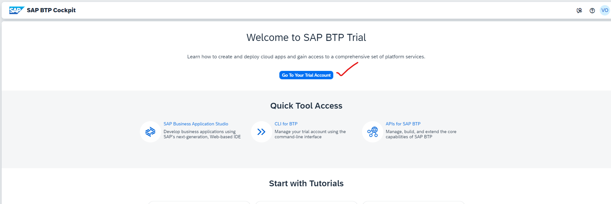

## [CAPM] Cloud application programming model

### How to create HANA DB in BTP account 

## steps involved in HDB creation as follows

step 1
    
      
    
    
    

step 2
    
      
    
    
    

step 3
    
      
    
    
    

step 4
    
      
    
    
    

step 5
    
      
    
    
    

step 6
    
      
    
    
       

step 7
    
      
    
    
    

step 8
    
      
    
    
    

step 9
    
      
    
    
    

step 10
    
      
    
    
    

step 11
    
      
    
    
    

step 12
    
      
    
    
          

step 13
    
      
    
    
    

step 14
    
      
    
    
       
   
step 15
    
      
    
    
     
   
step 16
    
      
    
    
        
      
step 17
    
      
    
    
     
