## [CAPM] Cloud application programming model

### How to create HDI schema container in BTP account 

## steps involved in creation of HDI container as follows

step 1
    
      
    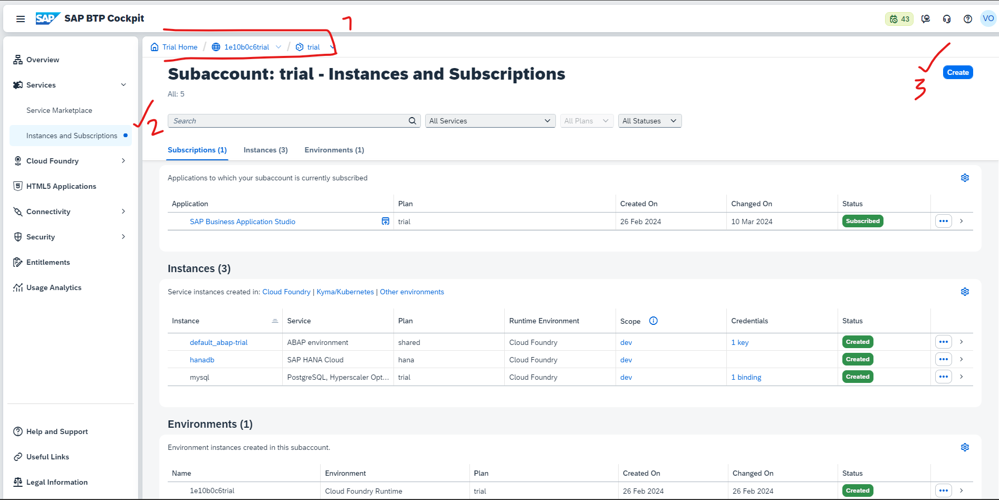
    
    

step 2
    
      
    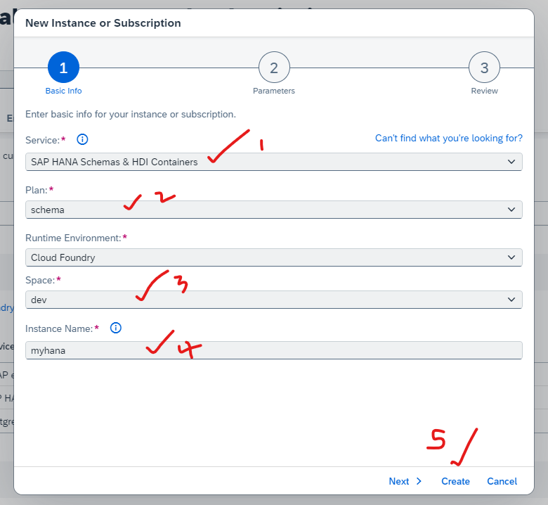
    
    

step 3
    
      
    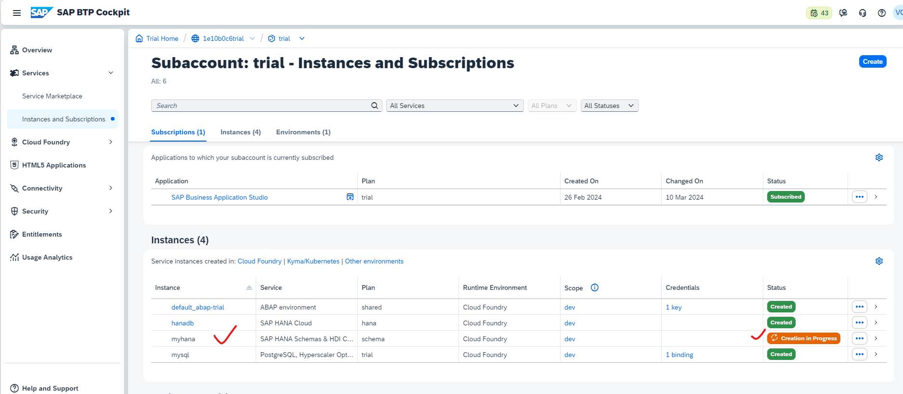
    
    

step 4
    
      
    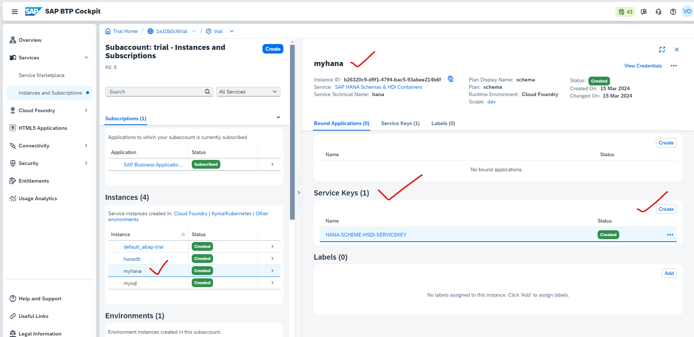
    
    

step 5
    
      
    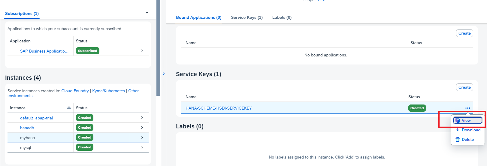
    
    

step 6
    
      
    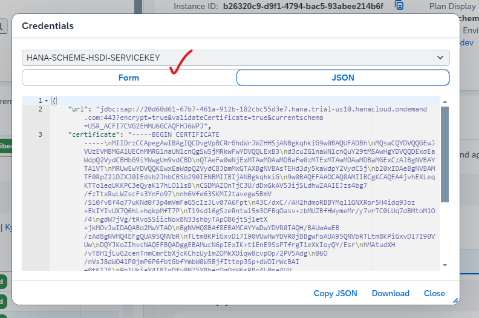
    
       

step 7
    
      
    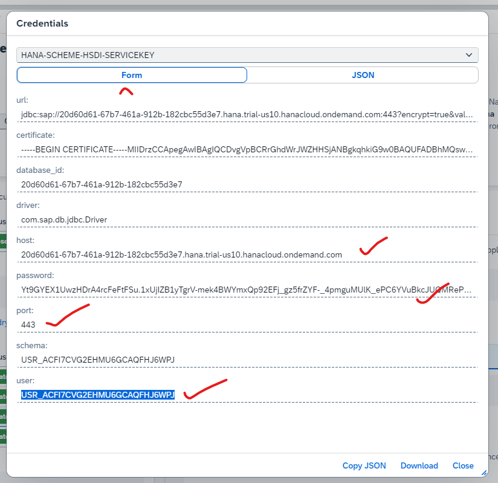
    
    

step 8
    
      
    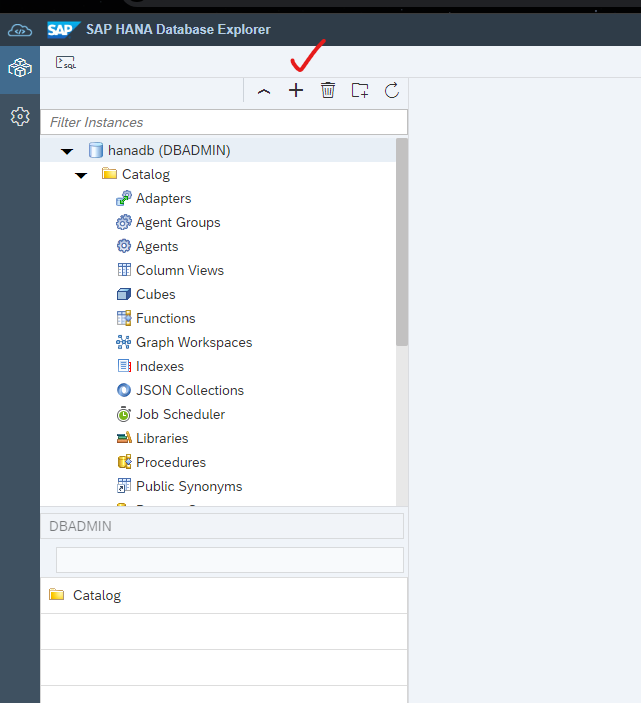
    
    

step 9
    
      
    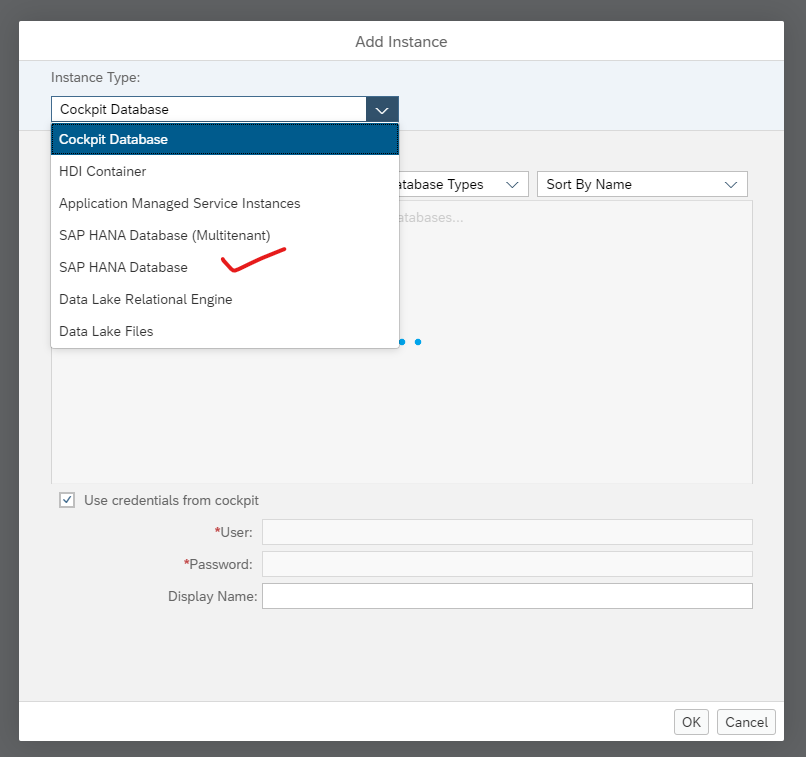
    
    

step 10
    
      
    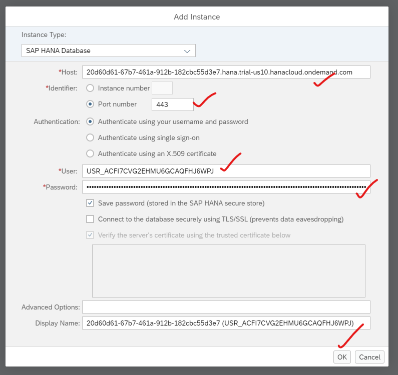
    
    

step 11
    
      
    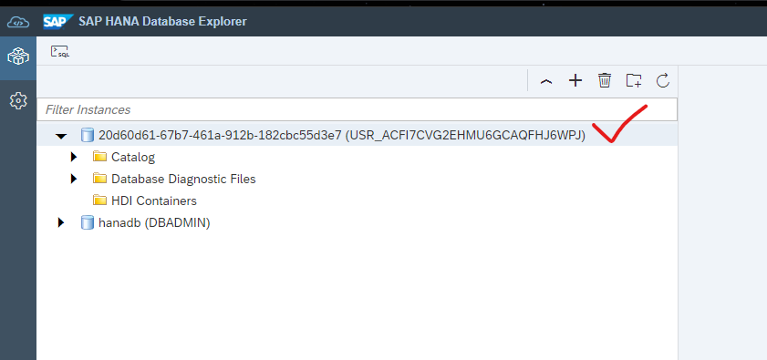
    
    

