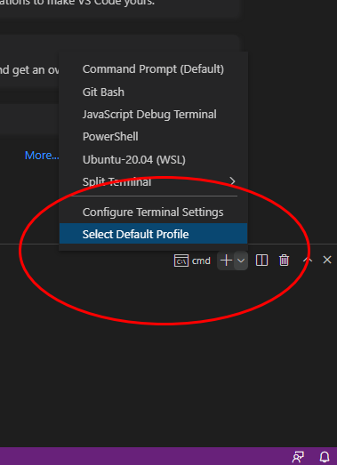
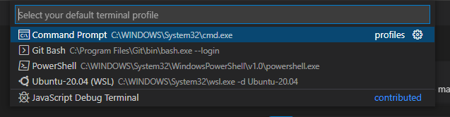

## Visual Studio Code Default Terminal
  
When using Visual Studio Code with Windows the easiest terminal to work with for this class is the CMD terminal
 instead of Powershell or Git Bash.   

You can set this terminal as the default with the following steps:
  

1. Open Visual Studio Code
2. Using the Visual Studio Code menu, select Terminal->New Terminal
3. Locate the terminal type on the right had side of the terminal panel (within the red circle). Terminal Selection Menu

   
   

4. Click the downward arrow near the + sign and click Select Default Profile from the menu that pops up.
5. At the top of the screen a menu will appear showing the list of default terminals that can be shown. Terminal Selection Menu

   
   

6. Select the option in the list that says Command Prompt
7. In the terminal panel you can click the trash can logo to close the current terminal
8. Next time you open a terminal panel it will be of the type Command Prompt